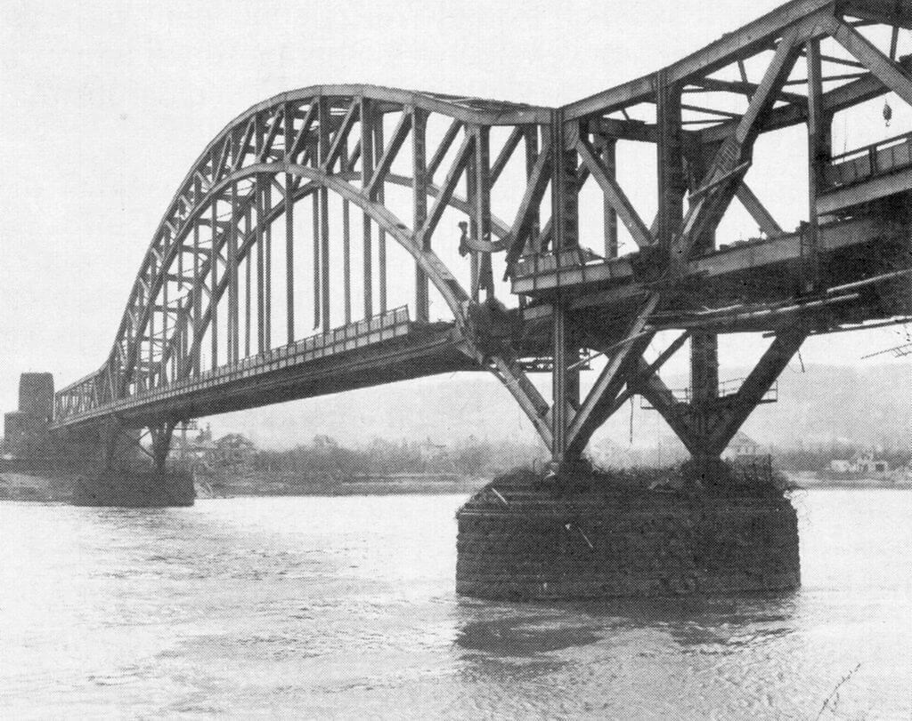

### Front zachodni

Zajęci dynamicznie rozwijającą się sytuacją w oblężonym i masakrowanym mieście utraciliśmy z pola widzenia zarówno kontekst wydarzeń na całym Dolnym Śląsku jak w wojnie w Europie. Tymczasem ma on znaczenie i dopisuje ważne wątki w narracji oblężonej twierdzy.

Co mamy na wschodzie? Sowietów za Odrą w Brandenburgii i jednocześnie Niemców w Raciborzu, a pośrodku oblężony Wrocław, który wciąż się broni. Obie strony zwarte w śmiertelnym boju i obie skrajnie wyczerpane. Koniew nie ma już rezerw strategicznych. Wojska są przemieszane, na Śląsku wciąż stacjonuje spora część Grupy Armii Środek. Pięść Armii Czerwonej zatrzymała się kilometry od Berlina na wciąż silnym pancerzu Wehrmachtu.

Tymczasem na froncie zachodnim sytuacja w niczym nie przypominała tej na wschodzie. Alianci byli w ogromnej odległości od Berlina i oddzielała ich od celu poważna przeszkoda geograficzna - Ren. Za Renem Niemcy rozlokowali 60 dywizji, z 750 km długości frontu, 600 km było wspartych o Linię Zygfryda (Westwall). Przeciwko nim alianci zachodni wystawili 86 dywizji. Ale żeby mieć pełen obraz sytuacji trzeba dodać dwie informacje:

- dywizje niemieckie były przerzedzone, niektóre miały zaledwie 1/3 składu osobowego, zarówno kadry jak i sprzęt w dużej części to była zbieraniną z tego co udało się wycofać i uratować z klęski we Francji
- ponadto po bombardowaniach fabryk Kruppa w Essen, zniszczeniu zagłębia Ruhry i utracie Górnego Śląska armia niemiecka była pozbawiona dostaw nowego sprzętu. To samo dotyczyło ludzi. Każdy zniszczony czołg to załoga i maszyna, których nie było już czym zastąpić.

Dowódcy frontowi byli przeciwni wzmacnianiu ich jednostek przez dzieci z Hitlerjugend i starców z Volkssturmu wiedząc, że wprowadzi to tylko chaos w jednostkach, które i tak cierpią na brak wyszkolenia. Dochodziły do tego braki w zaopatrzeniu, przede wszystkim ograniczenie w zakresie rzeczy niezbędnej do prowadzenia nowoczesnej wojny - paliwa. Luftwaffe już była tylko szkieletem nie będącym w stanie prowadzić wyrównanej walki z wrogiem, a ostatnia siła armii niemieckiej której obawiali się alianci, czyli czołgi bez paliwa były tylko kolumnami wraków.

Podsumowując: Niemcy mieli ponad dwukrotnie mniejsze siły, niemogące liczyć na posiłki, ani zaopatrzenie, mieli tylko około 100 żołnierzy na kilometr frontu. Ponadto Linia Zygfryda była słabo obsadzona i pozbawiona wyposażenia, które zostało zdemontowane i posłużyło do budowy Wału Atlantyckiego.

Ale to wszystko to był tylko pierwszy fakt zmieniający przedstawiony w pierwszym zdaniu obraz frontu zachodniego. Drugi był dla strony niemieckiej jeszcze gorszy: Ren i siły na Renie były ostatnią zachodnią rubieżą III Rzeszy. Była to poważna przeszkoda, ale za nią zaczynała się już autostrada do Berlina. Bardzo łatwa do przebycia autostrada, jeśli ktoś miał odpowiednią ilość dywizji i zaopatrzenia.

### Remagen 03-07

Całkiem przypadkiem - pierwszy etap wyścigu o pokonanie Renu rozegrał się dziś, rankiem 7 marca. Ze względu na strategiczne znaczenie Renu jako przeszkody geograficznej Naczelne Dowództwo wydało stanowczy rozkaz zaminowania, a później w miarę zbliżania się wroga wysadzenia każdego mostu. Wszystko co pomogłoby wrogowi przekroczyć rzekę musiało zostać zniszczone. Rozkaz skrupulatnie wykonano i alianci nie oczekiwali, że zobaczą jakikolwiek most. Byli przygotowani do morderczej walki o przekroczenie szerokiej, rwącej - szczególnie wiosną - rzeki, do tego zażarcie bronionej przez doskonale dowodzonych i zmotywowanych żołnierzy.

Oddziały Grupy Bojowej B amerykańskiej 9. Dywizji Pancernej zbliżały się do leżącego nad Renem małego 5-tysięcznego miasta Remagen leżącego pomiędzy Koblencją a Bonn.

Porucznik Harold Larsen ze zwiadu 9 Dywizji Artylerii leciał małym jednosilnikowym górnopłatem Piper J-3 Cub, który zyskał sobie opinię uniwersalnej maszyny nie do zdarcia i od 1941 był używany jako samolot zwiadu o oficjalnej nazwie L-4 i nieoficjalnej Grasshopper (pasikonik). Jego celem było zlokalizowanie potencjalnych obiektów ataku w okolicy miasta. Jakie było jego zdziwienie kiedy ujrzał nienaruszony, ponad 300-metrowej rozpiętości most kolejowy, tzw. Most Ludendorffa.

Natychmiast połączył się z dowódcą 9 Dywizji Pancernej Williamem Hodge, który słysząc o moście rozkazał zdobyć go za wszelką cenę. Z najbliżej znajdujących się jednostek, czyli z 27 Batalionu Piechoty Pancernej i 14 Batalionu Czołgów utworzył tzw. Grupę Engemana, nazwaną tak od dowódcy: podpułkownika Leonarda Engemana.

Wiadukt został zauważony z samolotu około godziny 10.30, żołnierze Engemana dotarli w jego pobliże jeszcze przed południem, na moście pracowali żołnierze niemieccy. Słysząc o tym generał William Hodge po dłuższym oczekiwaniu o godz. 16.00 zdecydował się zagrać va banque i jednak most zaatakować. Jego żołnierze nie byli z tego powodu zadowoleni, atakowanie zaminowanego mostu to nie jest wymarzone zadanie. Kiedy Niemcy zauważyli biegnących Amerykanów uciekli, most by coraz bliżej, napięcie rosło. Nagle potężna eksplozja wstrząsnęła mostem i zakryła go chmurą pyłu. Żołnierze padli na ziemię, jeden z nich krzyknął "*Dzięki Bogu teraz nie będziemy musieli przechodzić przez to cholerstwo!*".

Jednak kiedy pył opadł ujrzeli most prawie nienaruszony. Krzycząc wniebogłosy dla dodania sobie odwagi i wściekle zrywając wszystkie napotkane kable przebiegli ten cholerny most nie ponosząc żadnych strat.

Most miał poważnie naruszoną konstrukcję, nie można było przejechać po nim czołgiem, ale piechota mogła przejść po nim Ren bez przeszkód tym bardziej, że Remagen okazało się miastem praktycznie pozbawionym obrony. Amerykańska piechota napotkała przerażonych Volkssturmistów i kolejarzy.

Hitler kiedy dowiedział się o moście w Remagen wpadł we wściekłość, rozkazał zniszczyć go za wszelką cenę. Używali m. in. rakiet V2 i płetwonurków. Ostatecznie udało się to dopiero dziesięć dni później 17 marca. Ale wtedy Amerykanie mieli już 6 mostów pontonowych na Renie i 9 dywizji na wschodnim brzegu.

Po wojnie uznano most za nienadający się do naprawy i zdemontowano go. W 1980 na ocalałym zachodnim przyczółku mostu utworzono Muzeum Pokoju Most w Remagen. Pozostając jednak przy 10 marca 1945 trzeba dodać, że Amerykanie nie wyszli jeszcze na autostradę berlińską. Niemcy zaciekle walczyli usiłując zlikwidować przyczółek w Remagen, aż do przełamania linii Renu jednocześnie przez Pattona na południu i Eisenhowera na północy. Nastąpi to za niecałe dwa tygodnie, do tego czasu również obraz wojny na Śląsku zmieni się diametralnie.

Pierwszym żołnierzem alianckim na wschodnim brzegu Renu był sierżant Alex Drabik (z pochodzenia Polak, z Holland w stanie Ohio). Był pierwszym od czasów napoleońskich żołnierzem wroga, który wkroczył na ziemie niemieckie przekraczając Ren. Przeżył wojnę. Zginął w 1993 w wypadku samochodowym jadąc na spotkanie ze swoim oddziałem. Jego ojciec miał na imię Jan, a matka Franciszka z domu Lewandowska, oboje pochodzili z Szymborza, wówczas wioski pod Inowrocławiem obecnie jest to osiedle w jego granicach. Swoistym żartem historii jest fakt, że Inowrocław od pierwszego rozbioru w 1772 był częścią królestwa Prus, w okresie międzywojennym należał do Polski, ale sądząc z tego, że urodzony w 1910 Alex był najmłodszym synem z trzynaściorga rodzeństwa, można domniemywać że w momencie emigracji oboje jego rodzice byli obywatelami niemieckimi. Dla wielodzietnej, niezbyt bogatej rodziny emigracja do USA w latach 20-tych była prawie niemożliwa, więc można domniemywać, że była to emigracja XIX-wieczna.

- Mark Felton Productions ["Remagen 1945 - The Race for the Bridge" [YT 16:21]](https://www.youtube.com/watch?v=es3AbkfcUoQ) | ["The Ragtag Circus - The 83rd Division's Captured German Vehicles" [YT 2:36]](https://www.youtube.com/watch?v=e7tlZDsNBkY)

*Ludendorff-Brücke, Remagen, 1945. Zbudowany w latach 1916-19 przy użyciu rosyjskich jeńców wojennych 
Von Unbekannt (US-amerikanischer Armeeangehöriger) - Reproduktion aus Michler, Manfred: Die verflixte Brücke. Verlag Gerstmair, Würzburg 1981., Gemeinfrei, [Link](https://commons.wikimedia.org/w/index.php?curid=2739376)*

### Łaba 04-15

Amerykanie dotarli do Łaby, są 100 km od Berlina i nie robią żadnych postępów na wschód. Dlaczego?

Czasem epokę da się opisać życiem jednego człowieka, wojnę aliantów zachodnich w Niemczech opisuje ścieżka bojowa amerykańskiej 83 Dywizji Piechoty. Istniała krótko w latach 1917-18, sformowana na potrzeby Wielkiej Wojny, ale nie weszła do boju w całości i została rozformowana. Powołana na nowo w 1942, w tym samym celu, do Europy została wysłana 16 kwietnia 1944 i 18 czerwca wysadzona na plaży Omaha. Nosiła przydomek Ohio, a później znana była jako Piorun (Thunderbolt) i to nie bez powodu. W pierwszej połowie kwietnia w przeciągu zaledwie 13 dni pokonała odległość 450 km (co daje średnią 34 km dziennie) i była to właśnie ta wymarzona autostrada do Berlina. Co więcej zakończona szczęśliwym finałem, bo 13 kwietnia dotarli do miasteczka Barby rozłożonego na lewym brzegu Łaby, dokładnie 110 km w linii prostej od Berlina. Kiedy wdarli się do miasteczka (obecnie 9 tys mieszkańców) stwierdzili, że jedyny most został wysadzony. Na czym zatem polegał ów szczęśliwy finał? Amerykanie zbliżając się do linii Łaby liczyli na szczęśliwy traf, cud, taki sam jak w Remagen, gdzie w ich ręce wpadł zdatny do użytku most. Tym razem jednak szczęście oznaczało co innego. Po pierwsze zaczęli się przeprawiać przez Łabę natychmiast, nie czekając na rozkaz ze sztabu dywizji, po drugie Wehrmacht nie stawił na tym odcinku żadnego oporu. Nie tylko przeprawili kilka batalionów bez jednego strzału, ale wieczorem tego dnia udało im się zbudować most. Umieścili na nim tablicę "*Most Trumana. Brama wjazdowa do Berlina. Dzięki uprzejmości 83 Dywizji Piechoty*".

Napis ten wyrażał ducha bojowego Dywizji, samodzielność i korzystanie ze wszelkich sposobności. Słynęli z tego, że będąc jak najdalej od ducha regulaminowej ortodoksji przystosowywali wszystkie napotkane pojazdy i środki walki do własnych potrzeb. W czasach pokoju bywa to nazywane kradzieżą. Na wojnie ta kradzież pozwalała wozić żołnierzy pojazdami wroga z pospiesznie namalowanymi białymi gwiazdami, dzięki czemu uzyskali najwyższy wskaźnik mobilności oraz drugi bojowy przydomek "Zwariowany Cyrk" (ang. Rag-tag Circus). Posiadali nawet Messerschmitta Bf 109 i znaleźli szaleńca, który nim latał, oczywiście po przemalowaniu i umieszczeniu na spodzie napisu "83 Dyw. Piech.". Ich wygląd był tak mylący, że zdarzyło się iż wzięli do niewoli mijający ich kolumnę niemiecki samochód sztabowy pełen oficerów, którzy dopóki nie zostali ostrzelani sądzili że to niemieckie wojsko. Byli trochę jak startrekowy Borg, asymilujący każdą napotkaną technologię. Następnego dnia do przeprawy dotarła 2 Dywizja Pancerna, która przedtem usiłowała bez powodzenia pokonać Łabę w innym miejscu. Do tego czasu 83 DP zbudowała drugi most i nie tylko osiągnęła stabilny przyczółek ciągle nie napotykając oporu, ale nie czekając na rozkazy ruszyła w stronę Berlina. 15 kwietnia patrole dywizji dotarły do Zerbst, od Berlina dzieliło ich tylko 100 km.

Rankiem 15 kwietnia dowódca amerykańskiej 9 Armii, w skład której wchodziły obie powyższe dywizje otrzymał od dowódcy sił amerykańskich generała Bradleya rozkaz stawienia się w kwaterze głównej 12 Grupy Armii w Wiesbaden. Bradley czekał na niego na lotnisku, żeby nie przedłużać formalności przekazał mu od razu wiadomość, że mają się zatrzymać na Łabie. Zapadła cisza. "*Where in the hell did you get this?*" zapytał Simpson. "*From Ike*". Nie było odwołania.

Oznaczało to praktyczny koniec wojny na tym odcinku i poddanie walki o Berlin. Żeby zrozumieć dlaczego Eisenhower tak postąpił trzeba się cofnąć do 13 kwietnia, dzień po śmierci Roosevelta, kiedy to "Zwariowany Cyrk" zameldował o utworzeniu przyczółku na prawym brzegu Łaby. Generał Simpson zameldował o tym Bradleyowi, a Bradley natychmiast zadzwonił do Eisenhowera. Ten wysłuchał go uważnie i zapytał "*Brad, ile twoim zdaniem będzie nas kosztowało przełamanie przez Łabę i wzięcie Berlina?*", Bradley który z pewnością myślał o tym często odrzekł "*Oceniam, że mogłoby to nas kosztować sto tysięcy żołnierzy*" (chodziło o zabitych i rannych), Eisenhower powiedział "*Byłaby to zbyt wysoka cena do zapłacenia za prestiżowy cel, zwłaszcza że wiemy, iż i tak przyjdzie nam wycofać się i ustąpić miejsca komu innemu*". Obaj znali postanowienia koalicji antyhitlerowskiej - Berlin był w sowieckiej strefie okupacyjnej. Ale żaden z nich nie wiedział, że już za trzy dni sowieci uderzą, że atak amerykański na pewno nie zakończyłby się takimi stratami bo pełniłby tylko zadanie pomocnicze a rozpraszając siły obrony Berlina mógł znacznie skrócić wojnę. Generał Bradley czekał dwa dni zanim przekazał rozkaz Eisenhowera swoim ludziom. Zrobił to na dzień przed sowiecką ofensywą. Co by się stało gdyby czekał dzień dłużej?

- [Mark Felton Productions "Capture Berlin! The Secret 1945 US Mission" [YT 8:03]](https://www.youtube.com/watch?v=aONsLeFaaLk)