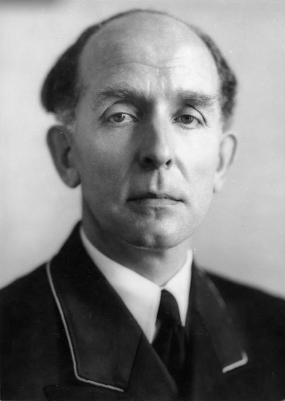

### Operacja wiślańsko-odrzańska

Na drodze do celu pozostały tylko dwie najważniejsze przeszkody: Poznań na północy i Wrocław na południu. Wiadomo, że są przygotowane do obrony, że zmierzają tam wycofujące się w pośpiechu wojska niemieckie. Następuje chwila oddechu na podciągnięcie zaplecza. Front Białoruski walczy już 10 dni, Ukraiński dwanaście. Jeszcze zanim opór niemiecki stężeje trzeba wywalczyć przyczółki po drugiej stronie Odry.

### 1. Front Białoruski

1 Front Białoruski dziś zdobywa Sieradz, Kalisz i Ostrów Wielkopolski, na południe od Poznania Śrem, a na północnym odcinku walk Solec Kujawski i Grajewo.

Dwa dni po zajęciu Gniezna w wyniku ostrzału sowieckich czołgów pociskami zapalajacymi płonie archkatedra gnieźnieńska.

- [Prawda o zniszczeniu katedry gnieźnieńskiej](https://wiadomosci.wp.pl/prawda-o-zniszczeniu-katedry-gnieznienskiej-6036886899909761a)

### 1. Front Ukraiński

Dla 1 Frontu Ukraińskiego jest to już koniec walk o Kraków. Oba Fronty oddaliły się od Wisły na podobną odległość. Jasne jest już, że wszystkie dotychczasowe linie obrony niemieckiej padły.

### Marsz śmierci

Grupa zwiadu Frontu Ukraińskiego wyzwoliła dziś filię obozu koncentracyjnego Groß-Rosen – KL Fünfteichen w dzisiejszych Miłoszycach w gminie Jelcz Laskowice. Wczoraj z tego obozu wypędzono niewolników na marsz śmierci.

Dzisiaj to samo ma miejsce w jednej z wrocławskich filii obozu koncentracyjnego Gross-Rosen. Więźniowie obozu w Leśnicy zebrani na apelu, sformowani w kolumnę pieszo ruszyli w kierunku obozu macierzystego w Rogoźnicy (niem. Gross-Rosen), skąd mieli być dalej przeniesieni do Buchenwaldu.

### Polska Armia Ludowa

Samorozwiązaniu uległa Polska Armia Ludowa, lewicowa konspiracyjna organizacja bojowa, niezależna zarówno od AK jak i od sowieckiej agentury.

Brała udział w Powstaniu Warszawskim. W wielu kwestiach politycznych zgodna z programem PKWN. Prawie w całości weszła w skład WP.

### Berlin

W berlińskiej dzielnicy Charlottenburg-Nord (na południe od Tegel) u zbiegu dwóch kanałów znajduje się zbudowane w czasach Bismarcka, w 1878 więzienie Plötzensee. W czasach hitlerowskich to tam trzymano przeciwników reżimu, zamordowano tam 677 Czechosłowaków, 253 Polaków, 245 Francuzów. Zamordowano również wielu ludzi z Czerwonej Orkiestry (niem. Rote Kapelle), spiskowców z zamachu 20 lipca.

Wyroki śmierci wydawał niesławny Trybunał Ludowy (niem. Volksgerichtshof) działający według zasad nazistowskich. Przewodniczył mu słynny hitlerowski kat w todze sędziego, Roland Freisler, 90% wyroków przez niego wydawanych to kara śmierci lub dożywocie. Ocenia się że osobiście w ciągu ostatnich trzech lat wojny wydał 5 tys wyroków śmierci. Za 11 dni zabije go amerykańska bomba.

*Roland Freisler hitlerowski kat w todze sędziego. Jako przewodniczący Trybunału Ludowego skazał na śmierć tysiące ludzi. 
Źródło: [By Bundesarchiv, Bild 183-J03238 / CC-BY-SA 3.0, CC BY-SA 3.0 de](https://commons.wikimedia.org/w/index.php?curid=5364250)*

Dzisiaj z wyroku Trybunału Ludowego w Plötzensee zabito siedmiu uczestników spisku z 20 lipca:

- **Helmuth James Graf von Moltke**, prawnik wojskowy, założyciel "kręgu z Krzyżowej" (niem. Kreisauer Kreis)
- **Reinhold Frank**, prawnik, polityk katolickiej Partii Centrum
- **Theodor Haubach** polityk, socjalista, dziennikarz, związany z Kręgiem z Krzyżowej.
- **Franz Sperr** prawnik oficer, związany z Kręgiem z Krzyżowej
- **Mikołaj Gross** działacz związkowy, polityk katolickiej Partii Centrum
- **Eugen Anton Bolz** prawnik, polityk katolickiej Partii Centrum
- **Erwin Planck** polityk, minister w rządzie Papena

Więzienie Plötzensee jeszcze wiele razy pojawi się na łamach tej kroniki.

### Śląsk

17 Brygada Zmechanizowana po zdobyciu Rawicza zajmuje Wąsosz. W nocy wyruszyła przez Barycz na południowy zachód i przed świtem dotarła do Odry naprzeciwko Chobieni. W nocy, za zgodą dowództwa, korzystając ze znalezionego na brzegu Odry sprzętu przeprawowego, sforsowali Odrę (tak to opisuje Majewski, wygląda na to, że rzeka nie była skuta lodem) i zdobyli kilkanaście schronów i północną część Chobieni.

Równocześnie 16 Brygada Zmechanizowana dociera do Odry na północ od Ścinawy.

27 Korpus zdobył Syców.

Oddziały 73 Korpusu wdarły się do Oleśnicy i utrzymały pozycję, zaczął się bezwzględny bój o miasto. Z powodu gęstej zabudowy walczono o każdy dom. Walki potrwają jeszcze cały dzień.

Odziały 52 Armii po wyeliminowaniu reszty obrony w rejonie Namysłowa i Bierutowa wyszły na Odrę w rejonie Gajkowa i Kamieńca Wrocławskiego. To 4 km w linii prostej od Bartoszowic czy Księża Wielkiego. Patrzą na Wrocław.

### Wrocław

Jakże zmieniło się to miasto w ciągu ostatnich kilku dni. Chaos nadal trwa, ale dziś jest to chaos gwałtownie opustoszałej Twierdzy.

Grozę następnych dwóch dni, najstraszliwszego weekendu w dziejach Wrocławia już została opisana w poprzednich trzech odcinkach. 20 stycznia ogłoszono ewakuację Kraju Warty, Wrocławia i okolic. W ciągu trzech dni, do poniedziałku Wrocław opuściło być może nawet 700 tysięcy ludzi. To więcej niż obecnie w nim mieszka. Dołączyli do nieprzeliczonej rzeszy uciekinierów podążających z Prus Wschodnich, ze Śląska, z Kraju Warty na zachód; z Nadrenii i Zagłębia Ruhry na wschód. Miliony ludzi na zaśnieżonych drogach, podążając nie wiadomo dokąd, w zupełnym zamieszaniu, bez pomocy. Każdego dnia tysiące z nich umierało w milczeniu z zimna, wycieńczenia, paniki i głodu. W tę sobotę i niedzielę ten tragiczny los spadł na wrocławian jak wyrok. Uciekający wrocławianie wciąż są w drodze. Część przerażona warunkami wraca.

Paul Peikert:
>Nieopisana była tragedia zmuszonych do ucieczki szosą. Nieprzejrzane szeregi kobiet i dzieci z wózkami dziecięcymi lub małymi wózkami ręcznymi przeciągały ulicą. Skutkiem ostrej zimy ulice przykrywa śnieg i lód. Małe wózki przystosowane do gładkich ulic wielkiego miasta rozpadają się, trafiwszy na zawiane i oblodzone ulice podmiejskie. Nędzne mienie trzeba wtedy wlec dalej ręcznie, tak że kolumny przesuwają się bardzo wolno naprzód. Wiele dzieci i dorosłych zmarzło w przejmującym zimnie i legło w rowach przydrożnych. Odziały usuwające te zwłoki (Suchkommandos) znalazły tak wiele tych trupów, że nie mogły pomieścić ich na ciężarówkach. Doniesiono mi wczoraj, że jeden z tych oddziałów zebrał ponad 400 zwłok dzieci i dorosłych na stosunkowo krótkim odcinku. Zapewne nigdy nie dowiemy się liczby tych, co życiem przypłacili ucieczkę podczas srogiej zimy

I kiedy topniejące z każdym dniem masy uciekinierów, głównie kobiet, dzieci i ludzi starych, zapełniały niekończącymi się kolumnami drogi Dolnego Śląska, miasto, które pozostawili za sobą, zmieniło się na zawsze. W tym powolnym marszu, koszmarnie przypominającym czar z Hameln, wytoczyła się z niego krew i dusza. Pękła na zawsze jego historia. Za nimi pozostała skazana na zagładę Twierdza.

Co pozostało z dawnego Wrocławia? Paul Peikert:
>Ludność Wrocławia po ewakuacji liczy dziś około 180-200 tys. osób. Głównie są to ludzie starzy i ich bliscy, którzy woleli się nie narażać na niebezpieczeństwo ucieczki. Mimo to organy partyjne stosują bezprzykładny terror, aby jeszcze i tych nielicznych usunąć z Wrocławia. Wrocław ma być utrzymywany przez wojsko do ostatka i zachodzi obawa kryzysu żywnościowego przy długotrwałym oblężeniu, jeśli tu pozostanie zbyt wielu ludzi. Wczoraj zawrócił pociąg z uciekinierami skierowanymi do Legnicy. Donoszą, że wywozi się uciekinierów za miasto do Kątów Wrocławskich lub Miękini, a potem muszą opuścić pociąg i dalej uciekać pieszo szosą.

Jak się okaże w oblężonej Twierdzy pozostało dobrowolnie 35 duchownych obu głównych na Śląsku konfesji. Dziwnym przypadkiem to właśnie księża i rzymsko-katoliccy i luterańscy stanowia większość znanych narratorów bitwy.

- przede wszystkim jest to **Paul Peikert** proboszcz katolickiej parafii św Maurycego, jego pamiętniki, które w zamieszaniu pozostały we Wrocławiu, częściowo zostały wydane pt "Kroniki dni oblężenia Wrocławia 22.I – 6.V.1945" i bardzo długo była to jedyna relacja tego typu znana polskim czytelnikom
- **Ernst Hornig** PO biskupa ewangelickiego na Dolnym Śląsku, autor wydanej w 1975 "Breslau 1945. Erlebnisse in der eingeschlossenen Stadt"; w Polsce wydana w 2009 jako "Breslau 1945. Wspomnienia z oblężonego miasta"
- **Walter Lassmann** ksiądz katolicki, w Polsce 2013 "Moje przeżycia w Festung Breslau. Z zapisków kapłana"

Ernst Hornig:
>Hiobowe wieści o tragicznej sytuacji na zaśnieżonych drogach szybko dotarły do miasta, a perspektywa ucieczki bez zakwaterowania i wyżywienia przeraziła pozostałych we Wrocławiu mieszkańców. Wielu z nich twierdziło, że w mieście mają jeszcze swoje mieszkania i łóżka, węgiel i kartofle, i jeśli już, to wolą umrzeć tutaj, niż zamarznąć czy też skonać z głodu podczas ucieczki. Tym samym we Wrocławiu pozostało około 200 tysięcy mieszkańców, łącznie z tymi, którzy pełnili różne służby. Do tego doszło jeszcze kilkadziesiąt tysięcy ludzi z powiatu wrocławskiego, którym nie udała się ucieczka na południe lub na zachód i którzy znaleźli schronienie w mieście. W ten sposób liczba osób zamkniętych we Wrocławiu wynosiła blisko 250 tysięcy. [* źródła partyjne szacowały liczbę pozostałych osób cywilnych dużo niżej, według nich było ich mniej niż 80 tysięcy]

Miasto zamarło, zniknęła policja, ulice w środku dnia prawie puste, urzędy w poniedziałek i już na zawsze nieczynne. Sądy, sklepy, muzea, szpitale wszystko zamknięte. Lekarze Kliniki i profesorowie w większości wyjechali. Ogromny dopiero co zbudowany gmach Nowej Rejencji (obecnie Urząd Wojewódzki) pusty i zamknięty. Trupy już uprzątnięto.

Zaczyna się fala samobójstw. Ludzie zabijają się we własnych domach, póki jeszcze mają odwagę.

Ksiądz Buhcholz:
>Cały kler parafialny był zdecydowany wytrwać na stanowiskach duszpasterskich w swoich kościołach i parafiach. Nieoczekiwanie wyszło zarządzenie nakazujące wszystkim księżom, z nielicznymi tylko wyjątkami, opuszczenie miasta. Co do liczby (tych, którym pozwolono zostać) miały być jeszcze prowadzone pertraktacje. Powodem tego zarządzenia, przyjmowanego jako złośliwość i mającego swe źródło w Gestapo, było z pewnością spostrzeżenie, że stosunkowo duża liczba ludności katolickiej, znajdując oparcie i otuchę w Kościele, przedkładała decyzję pozostania w mieście nad nędzę ewakuacji. Z pewnością zamierzano pomniejszyć wpływ Kościoła. W wyniku pertraktacji dopuszczono 20 księży, a w końcu 35 księży

Według relacji Ernsta Horniga:
>Kiedy w odezwie Gauleiter podał do wiadomości publicznej "Nasza stolica została ogłoszona twierdzą", następnego dnia przeprowadzono w Gau Niederschlesien mobilizację wszystkich mężczyzn od szesnastego do sześćdziesiątego roku życia w szeregach Deutsche Volkssturm

Walter Lassmann z parafii św. Józefa przy obecnej ul Krakowskiej otrzymał polecenie ukrycia się w piwnicy, Zapewniano go przy tym, że nie potrwa to długo, że nie minie więcej jak dziesięć dni zanim walec sowiecki przetoczy się przez Wrocław i pójdzie dalej na zachód. Osobliwe, nie wiadomo jakie mające źródło przekonanie. Gdzie dotąd był taki przypadek, że Armia Czerwona po prostu pozostawiła miasto w oblężeniu bez ataku?