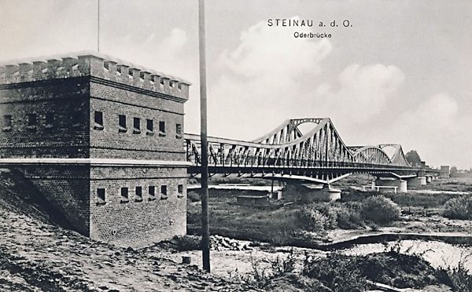

### Filipiny

20 października generał Douglas MacArthur z wielką pompą powrócił na Filipiny i mógł przez radio wszystkim ogłosić "*People of the Philippines, I have returned!*"

Dziś przeniósł sówj sztab do Hacienda Luisita (100 km na północ od Manili)

### Reorganizacja frontu niemieckiego

Dziś na rozkaz Hitlera dokonano przetasowania nazw.

- Grupa Armii Północ (do niedawna Środek) została przemianowana na **Grupę Armii Kurlandia**.
- Natomiast Grupa Armii A pod dowództwem generała Ferdinanda Schörnera na **Grupę Armii Środek**.
- Pośrodku czyli na obszarze północnej Polski powstaje **Grupa Armii Wisła** pod dowództwem... Heinricha Himmlera.

### Warszawa

Jak to podaje dr Andrzej Skalimowski z Centrum Interpretacji Zabytku Muzeum Warszawy, decyzję o odbudowie stolicy narzucił Stalin podczas rozmowy z Bierutem 25 stycznia 1945. Dzisiaj więc los Warszawy został przesądzony na najwyższym szczeblu. Od tej decyzji nie było odwołania.

### KL Stutthof

Armia Czerwona parła na północ, zagrożone było Pomorze. Do obozu koncentracyjnego Stutthof o 5 rano dotarł rozkaz ewakuacji (Einsatzbefehl nr 3), wykonano go natychmiast. Plan ewakuacji opracowany został jeszcze jesienią, więc załoga była przygotowana. Uformowano kolumny marszowe i zorganizowano eskortę SS-manów z karabinami i pistoletami maszynowymi. Osobno maszerowały kolumny kobiece z przydzielonymi nadzorczyniami z SS. Do każdej kolumny dołączono lekarza-więźnia z 2 sanitariuszami.

Na marsz śmierci wyruszyło 11 tys. ludzi, dziennie pokonywali odległość 20 km, mróz sięgał 20 stopni. Maszerowali na Mikoszewo, Tam przeprawiali się przez Wisłę i dalej ich droga prowadziła na Pruszcz Gdański i kończyła się w Pomieczynie. 11 dni później do celu dotarło 7 tys. Każda z kolumn przebyła ok 150 km. Połowa z brakującego stanu to były udane ucieczki. Na tym terenie mogli liczyć na pomoc. Około 2 tys. to ofiary brutalności, wycieńczenia i mrozu.

To właśnie ciała ofiar obozu koncentracyjnego Stutthof były używane przez nazistowskiego dyrektora Instytutu Anatomii w Gdańsku, Rudolfa Spannera, do wytwarzania mydła.

- [KULTURA POWIATÓW "Stutthof idzie!" [YT 58:37]](https://www.youtube.com/watch?v=OnSu01FWyRQ)
- [Łukasz Bindek "KONZENTRATIONSLAGER STUTTHOF" [YT 43:24]](https://www.youtube.com/watch?v=FaUCqCJlAts)

### Tygrysy z Kwidzynia

- [Olaf Popkiewicz "Tajemnica Tygrysów z Kwidzyna" [YT 32:47]](https://www.youtube.com/watch?v=dTppv72GrcE)

### Brygada Świętokrzyska

W tym czasie przez Śląsk zmierza inna grupa ewakuowanych ludzi. Również pod eskortą SS. Brygada Świętokrzyska NSZ jest w okolicach Ziębic. Z Goworowic zmierzają do Bobolic. Dotrą tam 28 lutego.

### Egzekucja włoskich generałów

W Kuźnicy Żelichowskiej (k Krzyża Wielkopolskiego) Waffen-SS dokonał egzekucji 5 włoskich generałów. Włoscy sojusznicy zostali wzięci do niewoli we wrześniu 1943 kiedy zawarli rozejm z aliantami.

### Poznań

Po tak imponujących zwycięstwach i przebyciu w ciągu niecałych dwóch tygodni kilkuset kilometrów przed 1 Frontem Białoruskim stoi największe i najtrudniejsze wyzwanie: zdobycie Poznania. Stopniowo zaczyna go okrążać od północy, dziś zdobyto Oborniki i Pniewy. Na północnym odcinku walki Sztum.

### Rajd na Kostrzyn nad Odrą

W tej sytuacja na najwyższych szczeblach Stawki powstaje kalkulacja, że tężejący opór wokół pozycji poznańskiej ma charakter tylko lokalny, że głębiej na zapleczu wciąż panuje chaos i jest to ostatni moment, żeby z tego skorzystać. Armie sa wyczerpane, ale druga taka szansa się nie powtórzy.

Na rozkaz Stalina Żukow ma zdobyć szybkim, szaleńczym wręcz marszem przyczółek na zachodnim brzegu Odry. Teraz kiedy Niemcy się tego jeszcze nie spodziewają. Istnieje ponadto szansa, że taka operacja spowoduje panikę i dezorganizacje sił w regionie Poznania. Kto wie, może Kostrzyń jeszcze nie jest zamieniony w twierdzę. Jest to 150 km rajdu za linię wroga. Żukow powierzył tę misję swoim najlepszym jednostkom 1 i 2 Gwardyjskiej Armii Pancernej.

Żeby to było możliwe, w region Poznania natychmiast muszą zostać dociągnięte armie ogólnowojskowe, które mogą przejąć ciężar walk o miasto.

### Joseph Beyrle

FBTODO

- Dark Docs ["The Soldier Who Hated Nazis So Much He Joined Both the Russian and American Army" [YT 9:11]](https://www.youtube.com/watch?v=juUOsZVsco8)

### Ścinawa

W Ścinawie batalion czołgów zdołał zdobyć z zaskoczenia 60-tonowy most. Jak pisze Majewski
>natychmiast jednak uderzył na miasto, nie zapewniając dostatecznej osłony tyłom. Dowódca batalionu został wkrótce ciężko ranny, co wprowadziło dezorganizację w działaniach jego oddziału. Nie zdążyły obsadzić mostu główne siły 62 Brygady, które nadeszły z opóźnieniem. Wykorzystując tę sytuację, hitlerowcy wysadzili most w powietrze. W Ścinawie zostały odcięte załogi trzech czołgów radzieckich, które nie mogąc się przebić do swoich, bohatersko walczyły do końca

Z braku innych możliwości dowódca 4 Armii Pancernej zdecydował o przeprawieniu wszystkich czołgów w Chobieni.

Możliwe, że miało to miejsce 24 stycznia - więcej i dokładny opis wydarzeń tu - [Dolny Śląsk - pole bitwy 1945](http://npm.pl/forum/viewtopic.php?f=37&t=6003)

*Ścinawa, most drogowy na Odrze zbudowany w 1903. 
Źródło: pocztówka [Oderbrücke Steinau/Ścinawa](http://www.brueckenweb.de/2content/datenbank/bruecken/3brueckenblatt.php?bas=43486")*

### Dolny Śląsk

13 Armia dotarła do Odry, uchwyciła przyczółek na północ od Ścinawy (pomiędzy Buszkowicami a Przychową), główne siły Armii przeprawiły się w Chobieni.

Tymczasem na zachód od Zielonej Góry 18 osobowa grupa zwiadu na zdobycznym pojeździe rozpoczyna zdumiewający rajd aż do Krosna Odrzańskiego gdzie udało im się uchwycić most i utworzyć przyczółek. Nikt jeszczce nie nakręcił o tym filmu? [RAJD NA PRZEDPOLACH KROSNA ODRZAŃSKIEGO](https://www.facebook.com/bobr1945/posts/3506403476139957)

1 Front Ukraiński zdobywa dziś niezniszczoną Trzebnicę. To ważne miasto dla przyszłości Polski na Dolnym Śląsku. Długo tu będzie kończyła się kolej, dalej w kierunku Wrocławia z braku samochodów trzeba będzie iść pieszo. Będzie to również koniec linii telefonicznej i siedziba władz województwa. Krótko na przełomie marca i kwietnia również sztab 2 Armii WP w czasie kiedy dostanie zadanie zdobycia Wrocławia.

Raport Oberkommando:
>25 stycznia 1945: Czoła nieprzyjacielskich oddziałów zaczepnych przesuwają się od południowego wschodu bliżej Breslau. Na wschód od miasta nie pojawił się żaden atak wroga.

### Odnośniki

- [Dr Andrzej Skalimowski: w styczniu 1945 r. odbudowa Warszawy nie była oczywista](https://dzieje.pl/wideo/dr-andrzej-skalimowski-w-styczniu-1945-r-odbudowa-warszawy-nie-byla-oczywista)
- [Adam Leszczyński "Jak walczyło NSZ: próby współpracy z Niemcami, rabunki, ataki na AK. Publikujemy dokumenty"](https://oko.press/walczylo-nsz-wspolpraca-niemcami-rabunki-ataki-ak-publikujemy-dokumenty/)
