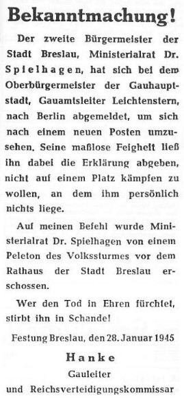

### Kłajpeda

16 Litewska Dywizja Strzelecka 3 Frontu Białoruskiego zajmuje dziś opuszczoną Kłajpedę (niem. Memel). W mieście przebywało tylko 50 ludzi. Miasto-symbol, krótko było tymczasową stolicą Prus i dla wszystkich Niemców było rozpoznawalnym miejscem na mapie. Odzyskanie Kłajpedy w marcu 1938 było wielkim triumfem Hitlera opisywanym entuzjastycznie przez prasę.

### Operacja wiślańsko-odrzańska

Żołnierze nacierających oddziałów Armii Czerwonej są już skrajnie wyczerpani. Jednostki po wielu dniach walki (odpowiednio 16 i 14 dni) mają ogromne straty, często wahające się w okolicy połowy pierwotnego składu. Dywizja piechoty zamiast 9600 ludzi liczyły ich tylko 5000. Równie poważne były straty w sprzęcie. Pojawiają się trudności w zaopatrzeniu - linie zaopatrzenia zostały wydłużone o 500 km, a do 2 lutego nie można było liczyć na kolej. Zerwana jest łączność. Wkrada się chaos. Opór niemiecki tężeje, od czterech dni trwa bitwa o Poznań. Już teraz wiadomo, że Wrocław będzie broniony zaciekle.

### 1. Front Białoruski

1 Front Białoruski wkroczył na teren przedwojennych Niemiec, zdobył Nowe Kramsko k Babimostu i Krzyż Wielkopolski.

### 1 Front Ukraiński

1 Front Ukraiński zdobył Kęty, Maków Podhalański, Mikołów, Mysłowice Tychy i Chorzów.

### Katowice

Główne siły niemieckie opuściły już Górny Śląsk, po czterech dniach oblężenia Armia Czerwona w nocy z 27 na 28 stycznia wkracza do Katowic napotykając niewielki opór. W wyniku podpaleń dokonanych przez nich dokonanych spłonęła część śródmieścia pomiędzy ulicą św. Jana i Pocztową, oraz pierzeja między Rynkiem i ul. Stawową.

Andrzej Rożanowicz tak wspomina wejście czerwonoarmistów do Katowic, działo się to samo co wcześniej w Gliwicach:
>Działy się straszne rzeczy. Tylko w naszej kamienicy żołnierze zgwałcili dwie kobiety. Rosjanie rabowali też co popadnie, pili, dzielili się łupami. W centrum nie było prądu. Żołnierze palili ogień w budynkach by się ogrzać, szukali wódki, rabowali. Podkładali też ogień. Spłonął ratusz, cała południowa pierzeja rynku, kilka kamienic przy ul. Pocztowej, dwa domy towarowe na ul. 3 Maja i słynne delikatesy Emila Misery. Spalono też jedną z restauracji czy kino Colloseum. Rosjanie Katowice kontrolowali przez parę dni.

### Wędrujący kocioł

Oddziały "Wędrującego kotła" przechodzą przez Górę, która jak się okazuje, została już zdobyta i opuszczona przez oddziały 3 Armii Pancernej Gwardii, które zapuściły się daleko na zachód, oderwane od reszty własnych wojsk.

### Brygada Świętokrzyska NSZ

Dziś w asyście SS przechodzą przez Bobolice.

### Dolny Śląsk

Jednostki 4 Armii Pancernej, które przeprawiły się już na lewy brzeg Odry, zaczynają okrążać Ścinawę. Broni jej silny garnizon złożony m in ze szkoły podoficerskiej, oddziałów zapasowych i batalionów Volkssturmu. Do 30 stycznia Ścinawa zostanie zamknięta w oblężeniu. 31 stycznia zostanie zdobyta od zachodu.

Jest to ostatni akt wojny na tym etapie ofensywy 1 Frontu Ukraińskiego, wszędzie pod koniec stycznia widoczne jest spowolnienie działań i przejście do defensywy. Więcej już nie można zrobić.

Nastąpiło ustalenie linii frontu. Z chwilą zdobycia Ścinawy sytuacja będzie się przedstawiać następująco: na szerokim odcinku front sowiecki jest opary o Odrę. Ma dwa przyczółki: Ścinawa - Chobień oraz Oława, na zapleczu wciąć mająca dużą swobodę pozycja niemiecka w Głogowie z dużym zgrupowaniem wojsk.

Walki o Rudną. [Z WALK O RUDNĄ – RAUDTEN 1945](https://www.facebook.com/bobr1945/posts/3767364470043855)

Boguszyce. [TRAGEDIA W BOGUSZYCACH – GOTTESDORF 1945](https://www.facebook.com/bobr1945/posts/3764699453643690)

### Iwan Koniew

W tej sytuacji marszałek Iwan Koniew zdecydowany jest rzucić wszystkie swoje oddziały do walki, nie pozostawiając żadnej Armii w odwodzie operacyjnym. W dzisiejszej propozycji dalszych działań dla Stawki pisze:
>Zadać główne uderzenie z dwóch dużych przyczółków na Odrze - na północ i na południe od Wrocławia. W jego wyniku [...] okrążyć to silnie umocnione miasto, następnie zaś po zdobyciu go bądź obejściu rozwijać natarcie głównego zgrupowania na Berlin. W tym czasie wojska lewego skrzydła 1 Frontu Ukraińskiego miały rozbić nieprzyjaciela na odcinku drezdeńskim.

Widać tu wyraźnie trzy bardzo istotne rzeczy

- Wciąż los Wrocławia nie jest rozstrzygnięty, to nie Poznań i można go pozostawić w oblężeniu.
- Zasadniczym celem Koniewa jest Berlin, chce się tam dostać przed Żukowem.
- Ogromne znaczenie Drezna, niewynikające z roli samego miasta. Więcej na temat Drezna w odrębnym artykule o bombardowaniu 13 lutego. Jest to największe miasto garnizonowe Rzeszy, ale tu ma znaczenie tylko ze względu na położenie. Dotarcie do Drezna rozetnie nieprzyjaciela na dwie części, zablokuje każdą ewentualną pomoc dla Berlina idąca od południa. A wiadomo, że są tam poważne zgrupowania wojsk. I już wkrótce będzie tam Schörner. Sztab Grupy Armii Środek po tygodniu w Opolu został po raz kolejny ewakuowany tym razem do Czech.

Uderzenie na Berlin miało wyjść z odcinka ścinawskiego. Równolegle miały wyjść ataki po obu stronach Wrocławia w celu okrążenia miasta. Kluczowe znaczenie na tym etapie mają przyczółki. Drugie zgrupowanie miało wyjść od południa Wrocławia na Świdnicę. Zgorzelec i Drezno właśnie. Trzecie: Wałbrzych, Żytawa. Jak się okaże, to ostatnie nie wypaliło, drugie poszło inaczej, a Wrocław...

Pierwotny termin rozpoczęcia nowej ofensywy 6 lutego, z powodu opóźnienia logistyki zostanie przesunięty na 8 lutego.

### Przyczółki

73 Korpus zmierzając do Wrocławia, zdobywa dziś Domaszczyn, Pasikurowice, Czerńczyce i Szewce. Wieczorem jego żołnierze dotarli do Odry między Kotowicami a ujściem Widawy (10 km od Wrocławia). Pierwsza, podjęta z marszu próba sforsowania rzeki nieudana.

### Wolfgang Spielhagen

W mieście zaczynają się rządy terroru. W niedzielę 28 stycznia o godzinie 6 rano, na rozkaz Gauleitera Karla Hanke na Rynku obok pomnika Fryderyka II "Starego Fryca", został rozstrzelany, odpowiedzialny za finanse miasta, wiceburmistrz Wolfgang Spielhagen. Jak to opisał Hugo Hartung:
>Jeden z naszych podchorążych przychodzi blady i wzburzony na kwaterę i opowiada, że na Rynku widział rozstrzelanie burmistrza doktora Spielhagena, które nastąpiło na rozkaz Gauleitera Hankego. Często spotykaliśmy doktora Spielhagena w tramwaju kiedy rano jechaliśmy do naszych biur, Przeprowadziłem kilka rozmów z tym bardzo mądrym człowiekiem, który bez ogródek sarkastycznie krytykował skrywane przez władze nadużycia i niedomogi. Jestem wstrząśnięty jego strasznym końcem

Oszczędny i zasadniczy Spielhagen od lat był w konflikcie z Hanke. Hanke żyjąc na zesłaniu, odtwarzał życie dworu berlińskiego, do którego za wszelką cenę chciał powrócić. Wystawne i wydawane na koszt miasta przyjęcia, przepych i gigantomania spotykały się z krytyką i oporem wielu miejskich urzędników, szczególnie zaś odpowiedzialnego za finanse miasta zasadniczego i oszczędnego wiceburmistrza Spielhagena. Hanke nienawidził go i chciał się pozbyć.

Pierwsza okazja przydarzyła się 20 lipca 1944, po zamachu Stauffenberga oświadczył "*Spielhagen, jak sądzę też w tym uczestniczył i przyszła na niego kolej*" ale ponieważ oskarżenia się nie dało udowodnić zemsta musiała poczekać.

W styczniu 1945 Spielhagen z powodu choroby serca zwolniony ze służby w Volkssturmie zgłosił zamiar wyjazdu do Berlina, skąd pochodził. Tym razem Hanke nie potrzebował żadnych dowodów, bo wojna w granicach Śląska dawała mu pełnię władzy. Dopiero wejście wrogiej armii na Śląsk dało mu pełnię władzy dyktatorskiej w Twierdzy.

Ciało Spielhagena wleczono samochodem po ulicach i z mostu wrzucono do Odry. Był to początek całej serii publicznych egzekucji, także urzędników i funkcjonariuszy partyjnych.

*Obwieszczenie gauleitera Karla Hanke o egzekucji wiceburmistrza Wilfganga Spielhagena. Egzekucji dokonano w niedzielę 28 stycznia, o 6 rano, przy nieistniejącym już pomniku Fryderyka II Wielkiego. Pomnik stał w środku placu pomiędzy Nowym Ratuszem, a zachodnią pierzeją Rynku. 
Źródło: Wikipedia: [Von Unbekannt - Eigener Scan, Gemeinfrei](https://commons.wikimedia.org/w/index.php?curid=23162858)

Na ulicach Twierdzy pojawiło się obwieszczenie:
>Obwieszczenie! 
>Drugi burmistrz miasta Wrocław, radca ministerialny dr Spielhagen, zgłosił u nadburmistrza stolicy prowincji, Leichtensterna, swój wyjazd do Berlina, celem poszukania sobie nowego stanowiska. Jego bezgraniczne tchórzostwo kazało mu jednocześnie złożyć oświadczenie, że nie zamierza walczyć na stanowisku, na którym mu osobiście nie zależy. 
>Na mój rozkaz radca ministerialny dr Spielhagen został przed ratuszem miasta Breslau rozstrzelany przez pluton Volkssturmu. 
>Kto obawia się śmierci w chwale, umiera w hańbie! 
>Twierdza Wrocław, 28 stycznia 1945 
>Hanke 
>Gauleiter i Komisarz Obrony Rzeszy

### Egzekucja w Środzie Śląskiej

W rzeźni miejskiej w Środzie Śląskiej z rozkazu średzkiego Kreisleitera NSDAP Ernsta Dickmanna SS zamordowało 93 więźniów.

### 600. (russ.) Infanterie-Division

Dzisiaj na poligonie w Münsingen (Badenia-Wirtembergia) zakończono formowanie 600 DP niemieckiej... tzn. rosyjskiej. To dłuższa historia.

Otóż 12 lipca 1942 do niewoli niemieckiej dostał się zdolny sowiecki generał Andriej Andriejewicz Własow. Barwna osobowość i ciekawy życiorys. Aż do Wielkiej Czystki jego życie to była zwyczajna kariera ambitnego i zdolnego oficera, związany był z Leningradzkim Okręgiem Wojskowym. Od aresztowania Tuchaczewskiego w maju 1937 zaczyna się Wielka Czystka w wojsku. W tym czasie Własow zostaje oddelegowany do Kijowskiego Okręgu Wojskowego i obu okręgach zasiada w trybunałach wojskowych biorąc czynny udział w represjach. Ma na koncie kilkaset wyroków. Zamordowano 40 tys oficerów, przy czym im wyższy stopień tym większe straty, w niektórych szarżach przekraczają połowę składu, miejsce doświadczonych oficerów zajmują zastraszeni ignoranci. Armia Czerwona zostaje pozbawiona mózgu. Kiedy z wyczerpania liczby ofiar Czystka wygasa, Własow zostaje wysłany do Chin jako doradca wojskowy. Wraca stamtąd w grudniu 1939 i zaczyna się jego kariera generalska. Jest jednym z pupili Stalina. W krytycznym momencie Operacji Barbarossa dowodzi 20 Armią na przedpolach Moskwy. Potem zostaje wysłany do obrony Leningradu. Dowodził 2 Armią Uderzeniową, której nie udało się wydostać z okrążenia. Wtedy schwytali go Niemcy.

Od samego poczatku Własom deklarując antykomunizm zgłaszał chęć przyłączenia się do armii niemieckiej w walce przeciwko sowietom.

Wszyscy czerwonoarmiści wiedzieli o istnieniu Rosyjskiej Armii Wyzwoleńczej (niem. Russische Befreiungsarmee, ros. Русская освободительная армия), wielu nawet chciało się do niej przyłączyć. W rzeczywistości taka armia nie istniała. To był tylko twór propagandy hitlerowskiej mający na celu osłabienie ducha walki. Rozczarowany Własow uznał, że taka armię trzeba stworzyć. Było to niemożliwe na tym etapie wojny. Hitlerowcy gardzili Słowianami i z niewielkimi wyjątkami (Słowacy, Chorwaci) nie zgadzali się na ich uzbrajanie.

Do pewnego stopnia sytuację zmieniła klęska w Stalingradzie. Już wcześniej Własow uzyskał pewną swobodę. 27 grudnia 1942 ogłosił Deklarację Smoleńską mówiąca o potrzebie stworzenia rosyjskiej armii u boku Wehrmachtu. Na wiosnę 1943 miał serię publicznych wystąpień, jego artykuły publikowała praca na terenach okupowanych. 8 czerwca Hitler kazał to zakończyć i odesłać Własowa do izolacji.

Wbrew zakazom i odgórnej polityce praktyka wcielania Słowian z podbitych terenów była normą Wehrmachtu. Hilfswilliger czyli jak to w skrócie mówiono Hiwisi (opaska "Im Dienst der Deutschen Wehrmacht") byli ważnym elementem armii niemieckiej, było to ponad 10% żołnierzy Wermachtu na wschodzie. Zdarzało się że tworzyli formacje frontowe.

Operacja Bagration, czyli dotarcie Armii Czerwonej do Wisły sprawiła, że sytuacja Wehrmachtu stała się dramatyczna. Poza wiedzą Hitlera Himmler spotkał się z Własowem 16 września 1944. Zezwolił na powołanie Komitetu Wyzwolenia Narodów Rosji. 14 listopada w Pradze został przedstawiony i podpisany Manifest KONR, a Własow został mianowany głównodowdozącym Sił Zbrojnych KONR... które jeszcze nie istniały.

Dopiero bowiem 1 grudnia powołano pierwszą dywizję tych sił zbrojnych, właśnie powyższą 600 DP. W sumie powstały trzy, kolejną była 650 DP.

600 Dywizja składała się z żołnierzy 29 oraz 30 Dywizji Grenadierów Waffen SS oraz 13 rosyjskich batalionów Wehrmachtu, jeńców wojennych i robotników przymusowych. Dość niecodzienny skład, a jeszcze dziwniejszy jeżeli zobaczymy co to za dywizje.

Otóż 29 Waffen-Grenadierdivision der SS RONA to tzw Brygada Kamińskiego, czyli zbrodnicza jednostka znana wszystkim Polakom, tak wsławiona podczas tłumienia Powstania Warszawskiego. Została powołana pod koniec 1941 do zadań policyjnych, ale z czasem do 1943 jej liczbność wzrosła do 10 tys ludzi. Kamiński nazwał ją Rosyjska Narodowa Armia Wyzwoleńcza (ros. Русская освободительная народная армия). Po bitwie pod Kurskiem zostali skierowani na Białoruś w okolice Witebska gdzie odznaczyli się niebywałym okrucieństwem. W marcu 1944 jednostkę przemianowano na Volksheer-Brigade Kaminski, a w czerwcu zostali włączeni do Waffen-SS jako Waffen-Sturm-Brigade RONA. Kamiński dostał nieistniejący stopień Waffen-Brigadeführer der SS.

Jednostkę charakteryzowały trzy rzeczy: kompletny brak dyscypliny, brak zdolności bojowych oraz bestialstwo wobec ludności cywilnej w stopniu sprawiającym kłopoty armii niemieckiej. Zdziesiątkowani podczas Operacji Bagration do połowy, zostali skierowani na poligon w Świętoszowie (niem. Neuhammer) i tam ostatecznie powstała wzmiankowana właśnie 29. Waffen-Grenadier-Division der SS (russische Nr. 1), którą kojarzymy z Powstania. Było ono również fatalne dla dywizji. 18 sierpnia Niemcy zabili Kamińskiego za niesubordynację. a 27 sierpnia cała jednostka została wycofana z Warszawy i skierowana do tłumienia powstania na Słowacji. Ostatecznie w październiku 1944 rozformowani.

Jeszcze dziwniejszą historię ma 30 Dywizja. Otóż latem 1941 na wschodnich terenach okupowanych zostały powołane bataliony policyjne Schutzmannschaft (w skrócie Schuma), tzw czarna policja. Składały się z lokalnych, słowiańskich ochotnikow i jeńców wojennych. Była to jedyna siła policyjna na tych terenach, podlegała niemieckiej policji porządkowej (Ordnungspolizei, Orpo). W lipcu 1944 z takich właśnie jednostek został powołany Schutzmannschaft-Brigade Siegling o mieszanym rosyjsko-białorusko-ukraińskim składzie w sile 1500 ludzi. Przeszli przeszkolenie w Niemczech. 31 lipca wydano rozkaz utworzenia 30. Waffen-Grenadierdivision der SS (weißruthenische Nr. 1), do końca sierpnia było to ok 11600 ludzi.

Zostali wysłani do północno wschodniej Francji i już tydzień po przeniesieniu jeden z batalionów w całości z bronią w tym ciężką, po zabiciu niemieckiego dowódcy, przeszedł na stronę francuską. Spora część jego żołnierzy zostala później wcielona do Legii Cudzoziemskiej i walczyła po stronie aliantów. Nie był to jednostkowy przypadek. 29 sierpnia 2 bataliony uciekły do Szwajcarii. Niesubordynacja, zabijanie niemieckich dowodców i liczne dezercje można by rzec potwierdzały opinię dowództwa niemieckiego o słowiańskich oddziałach. Jednostkę zreorganizowano, część żołnierzy odesłano do oddziałów cywilnych (służba kolejowa). Zmniejszona o połowę dywizja zdążyła jeszcze wziąć udział w walkach w kotle kolmarskim. Rozformowana 1 stycznia 1945.

Z takich to żołnierzy powstawała ROA Własowa.

- [Mark Felton Productions "Hitler's Russian Army" [YT 11:20]](https://www.youtube.com/watch?v=3u5k7Pd3vPU)

### Lockheed P-80 Shooting Star

W USA pionierem napędu odrzutowego był Lockheed. Już w 1939 opracowali projekt samolotu o nazwie L-133. Tak wyprzedzał swoją epokę, że armia go nie zrozumiała i nie była zainteresowana. Pomysłodawcą zastosowania nowego rodzaju napędu był Nathan Price, który we wczesnych latach 30 eksperymentował z samolotami napędzanymi... silnikiem parowym. Ostatecznie skierowało to jego zainteresowania do podobnego co do zasady silnika odrzutowego. Przekonał do swojego pomysłu szefa działu rozwoju Clarence'a "Kelly" Johnsona co ostatecznie doprowadziło do L-133. Szacowano, że może osiągnąć prędność prawie 1000 km/h. Szacowano, bo ostatecznie żaden samolot nie powstał. L-133 został zakończony w 1942, zaraz po tym jak armia uznała go za niewykonalny i niepotrzebny.

Do napędu odrzutowego powrócono już rok później na wiosnę 1943 kiedy wywiad doniósł o pracach nad Me 262. Amerykanie potrzebowali odrzutowca natychmiast, a ponieważ żaden silnik turboodrzutowy nie był dostępny zdecydowali się użyć brytyjskiego (Brytyjczycy byli pionierami w tej dziedzinie), kiedy okazało się że i ten nie zostanie dostarczony na czas, wzięli tylko dokładne wymiary i w 143 dni od podstaw zbudowali samolot dopasowany do nowego rodzaju napędu. Założenia L-133 zostały poważnie zredukowane do tego co się da zrobić bardzo szybko. Projekt był tak tajny, że tylko 130 ludzi wiedziało, że ma to być odrzutowiec. Specjalnie skonstruowano mu fałszywe śmigła, żeby nie wzbudzał niepotrzebnego zainteresowania podczas transportu. Kiedy w końcu dostarczono silnik, podczas pierwszej próby został zniszczony przez zassanie zewnętrznego obiektu. Trzeba było ściągnąć jeszcze jeden silnik. Ale lot testowy 8 stycznia 1944 okazał się pełnym sukcesem - samolot osiągnął 808 km/h.

Jesienią 1944 jeszcze wersje eksperymentalne weszły do służby. Amerykanie chcieli sprawdzić je w walce. Tak szybko jak tylko mogli w koncu grudnia 1944 wysłali cztery sztuki do Europy. Dwa do Anglii do testów i porównania z Gloster Meteor i dwa do Włoch bez ściśle określonego zadania bojowego, być może chodziło o walkę z bombowcem odrzutowym Arado Ar 234, który dzięki prędkości ponad 700 km/h bezkarnie wykonywał misje zwiadowcze.

Dzisiaj niestety jeden z nich na lotnisku RAF Burtonwood zakończył lot katastrofą spowodowaną pożarem silnika. Pilot major Fred Borsod zginął. Być może dlatego dwa YP-80 włączone do 1st Fighter Group w bazie lotniczej Lesina we Włoszech były trzymane daleka od akcji. Wykonały kilka lotów, ale nie zostały skierowane do walki.

Za rok, 27 stycznia 1946, P-80 wykona pierwszy lot transkontynentalny z napędem odrzutowym: Long Beach (Kalifornia) - Nowy Jork w 4 godziny 13 minut co daje średnią prędkosć przelotu 940 km/h. 

P-80 był nie tylko krokiem wstecz wobec ambitnej, futurystycznej wizji L-133, miał wiele wad pospiesznie wdrażanej nowatorskiej konstrukcji. To wysoce awaryjny samolot, który zabił wielu pilotów i nie był dobrym mysliwcem. Wziął udział w wojnie koreańskiej, sowiecki MiG-15 bił go jak chciał. Stosunek zestrzeleń do strat to 17/277. Bardzo szybko został w pierwszej linii wymieniony na F-86 Sabre i służył jako samolot szturmowy i szkoleniowy. Wycofany z czynnej służby w USAAF w 1957.

- [The Atomic Cafe "F-80 Shooting Star | Americas first jet fighter" [YT 13:59]](https://www.youtube.com/watch?v=GOT4UDbheiU)
- [Mark Felton Productions "P-80 Shooting Star - America's WW2 Combat Jet" [YT 9:33]](https://www.youtube.com/watch?v=0hf4ET6CGfI)

### Odnośniki

- [Vox populi czy na pewno vox Dei](http://info-gora.blogspot.com/2015/12/vox-populi-czy-na-pewno-vox-dei.html)
- Oblicza XX Wieku ["Bitwa o Leningrad cz. 1 "Inwazja"" [YT 25:51]](https://www.youtube.com/watch?v=awct4aukQTQ) | ["Bitwa o Leningrad cz. 2 "Blokada"" [YT 27:59]](https://www.youtube.com/watch?v=kZx3lCoVMYQ) | ["Bitwa o Leningrad cz. 3 "Przełamanie"" [YT 37:55]](https://www.youtube.com/watch?v=L1czrZVFvBc)