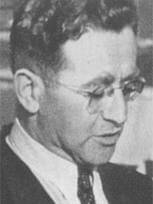

### Jerzy Borejsza

Jeszcze w okresie Rzeczpospolitej Lubelskiej powstała znana nam wszystkim Spółdzielnia Wydawnicza "Czytelnik". Wydawnictwo to i wszystkie jego flagowe pisma było to dzieło Jerzego Borejszy, człowieka ogromnej aktywności, który - cytując Miłosza
>z niczego zbudował, poczynając od 1945 roku, swoje państwo książki i prasy. "Czytelnik" i inne domy wydawnicze, gazety, tygodniki, wszystko od niego zależało – posady, przyjęcie książek do druku, honoraria. Byłem w jego stajni, wszyscyśmy byli

Pierwszym pismem była "Rzeczpospolita", której pierwszy numer ukazał się jeszcze w Chełmie 23 lipca 1944. Był to organ prasowy PKWN, jego nazwa nawiązywała do pisma istniejącego w okresie międzywojennym. Również w 1944, ale już w Lublinie zaczęło się ukazywać pismo społeczno-kulturalne "Odrodzenie". 15 października 1944 w Lublinie ukazał się pierwszy numer "Życia Warszawy".

- Dziś do grona tych polskich gazet dołączył "Dziennik Polski".
- Już 15 kwietnia ukaże się pierwszy numer "Przekroju"
- W sierpniu w Krakowie "Twórczość" najstarsze polskie pismo literackie (od 1950 w Warszawie).
- Również w 1945 zacznie się ukazywać społeczno-kulturalna "Kuźnica", później w 1950 z połączenia Kuźnicy i Odrodzenia powstanie "Nowa kultura".
- "Problemy" pismo popularnonaukowe publikujące w latach 80 fantastykę naukową: 1945-1993
- "Przyjaciółka" od 21 marca 1948

*Jerzy Borejsza (1905-52) 
Źródło: Wikipedia [Fair use](https://en.wikipedia.org/wiki/File:Jerzy_Borejsza_Goldberg.jpg), [Link](https://en.wikipedia.org/w/index.php?curid=29620840)*

Borejsza był organizatorem Światowego Kongresu Intelektualistów w Obronie Pokoju, który odbył się we Wrocławiu w dniach 25–28 sierpnia 1948, potem zaczął być źle widziany w Moskwie.

### Jałta

Pierwszy dzień Konferencji Jałtańskiej. Było to, po Teheranie w 1943, drugie spotkanie Wielkiej Trójki: Roosevelta, Churchilla i Stalina. Odbyło się z inicjatywy Roosevelta, który początkowo nalegał, żeby zorganizować je w 1944 przed wyborami prezydenckimi, ale kiedy je wygrał, nalegał już, tylko by odbyło się w jakimś neutralnym miejscu. Jeżeli teren państwa sowieckiego był neutralnym, to życzeniu prezydenta USA stało się zadość - miejscem tej konferencji była Jałta na Krymie.

Jednym z kilku ważniejszych tematów były sprawy polskie i los powojennych Niemiec. Co do Polski ustalono, że utracą ziemie na wschodzie i jako rekompensatę dostaną późniejsze tzw. Ziemie Odzyskane. Nikt wówczas nie myślał o nich w tych kategoriach, bardzo długo opozycja demokratyczna w ogóle nie chciała słyszeć o przejęciu ziem wschodnich Niemiec właśnie dlatego, że oznaczałoby to akceptację strat na wschodzie. To jednak już było przesądzone. Ponadto alianci zachodni przekazali sowietom zwierzchnictwo nad przyszłą Polską i zaakceptowali powstanie w Warszawie Tymczasowego Rządu Jedności Narodowej, warunkując to wolnymi wyborami, które mają się odbyć, tak szybko jak to jest możliwe. Ponadto ustalono podział Niemiec na cztery strefy okupacyjne, a Stalin obiecał wysłanie Armii Czerwonej na wojnę z Japonią najpóźniej w trzy miesiące po zakończeniu wojny w Europie.

### Bombardowanie Kobe

W lutym i marcu trwa kampania bombardowań japońskich miast mającej na celu osłabienie zdolności do prowadzenia wojny. Najbardziej znane jest oczywiście bombardowanie Tokio 9-10 marca, które zabiło 100 tys ludzi. Było to najbardziej mordercze w skutkach bombardowanie w dziejach ludzkości.

Ogromna liczba ofiar tych bombardowań wynika ze specyfiki japońskiego budownictwa. Zabudowa większości japońskich miast była drewniana, a Amerykanie używali bomb zapalających. Kiedy obrzucili duży obszar bombami, wszyscy na tym terenie byli w pułapce, otoczeni zewsząd pożarami nie mieli dokąd uciec.

Kampania ta zaczyna się dziś od bombardowania Kobe, trzeciej - niedoszłej - ofiary bomby atomowej.

### Dolny Śląsk

W okolicach Ścinawy, we wsi Mleczno (niem. Mlitsch) 126 Pułk Pancerny 17 Brygady Zmechanizowanej Gwardii napotkał dwie Pantery, straty własne 6 czołgów zniszczonych, 4 uszkodzone. Zginał dowódca pułku major Iwan Tkaczuk. Pantery zostały zniszczone. [„Pantery” przeciwko T-34 -„Czarny dzień” 126 Pułku Pancernego - Mleczno](https://www.facebook.com/bobr1945/posts/2780203608759951)

Pierwszy atak na Glogów. 25 Korpus Pancerny ponosi poważne straty: 16 czołgów T-34 oraz 2 działa samobieżne SU-76. [Z walk 25 Korpusu Pancernego – północne przedpola Festung Glogau.](https://www.facebook.com/bobr1945/posts/3380272208753085)

### Flettner Fl 282 Kolibri

Anton Fletner jest zapomnianym niestety wynalazcą. Kiedy wybuchła Wielka Wojna zgłosił się do wojska z pomysłem zdanego sterowania maszynami wojennymi. Projekty zdalnie sterowanej torpedy, pojazdu i samolotu zostały odrzucowne. Zaproponował zdalnie sterowany smaolot i kierowaną przewodowo bombę lotniczą. Wymyślił klapkę odciążającą na końcach sterów, od jego nazwiska nazywaną fletnerem. Po wpjnie skonstruował wentylator rotorowy, a potem napęd rotorowy statków, rewolucjonizując używany od tyięcy lat żagiel.

Tak zaczął się jego zwiazek z Marynarką, w 1935 skonstruował wiatrakowiec Fl 184, a potem wirolot, już na zamówienie Kriegsmarine, która chciała mieć pojazd obserwacyjny pionowego startu. Oblatany w 1939 rozwijał prędkość 140 km/h, miał zasięg 300 km, udźwig jednej tony i osiągał pułap 4 km.

Tak gwoli wyjaśnienia: wiatrakowiec napedzany jest śmigłem w poziomie, a wirnik jest bierny, obraca się wskutek autorotacji. Wirolot ma już napęd wirnika, ale dodatkowo ma śmigło napędowe.

W 1937 Anton Fletner opracował konstrukcję wirników nośnych śmigłowca, w której dwa wirniki nachodzą na siebie i pracują zsynchronizowane i umieszczone wobec siebie pod kątem ostrym - nazywa się to układem Flettnera i dziś np amerykański Kaman produkuje helikoptery w tym układzie. Taka maszyna nie ma momentu obrotowego więc nie potrzebuje śmigła ogonowego.

Oblatany w 1941 Koliber był pierwszynm na świecie seryjnie produkowanym śmigłowcem. Wyprodukowano ich w sumie ponad 20 egzemplarzy. Był to przede wszystkim pojazd obserwacyjny Kriegsmarine, który od 1942 służył na Bałtyku, Morzu Śródziemnym i Egejskim. Używała go również Armia jako platformy dla obserwatora artyleryjskiego. Mały, sprawdzony i niezawodny.

Z powodu rosnącej liczby bombardowań Berlina w sierpniu 1943 zakład Flettnera zaczał się przenosić do Świdnicy, transfer w trudnych okolicznościach zajął kilka miesięcy. W lutym 1944 w świdnickim zakładzie pracowało 120 ludzi. 22 czerwca 1944 zorganizowano symulowaną walkę lotniczą Kolibra z Fw 190. W 1944 Ministerstwo Lotnictwa Goeringa zadowolone z maszyny zamówiło w BMW 1000 tych śmigłowców.

Ale nadciąga Armia Czerwona. Na przełomie stycznia i lutego zakład Flettnera jest ewakuowany na lotnisko Berlin Tempelhof. Dwa dni po ściągnięciu tam śmigłowców zostają one zniszczone kolejnym bombardowaniem. To co ocalało przeniesiono do Bad Tolz (Bawaria), zostały już tylko dwa Kolibry kiedy wkraczają tam Amerykanie.

Ten śmigłowiec jest również związany z gauleiterem Karlem Hanke, ale o tym kiedy nadejdzie ku temu okazja.

### Brzeg

Jednoczesne uderzenie na dwóch przyczółkach w pobliżu Brzegu 5 Armii Gwardii i 21 Armii zakończone już pierwszego dnia zamknięciem Brzegu w oblężeniu. Broni się tam 3 tys. żołnierzy niemieckich. Połączenie przyczółków utworzyło jeden duży o szerokości 80 i głębokości 27 km.

Brzeg ze względu na położenie, mosty, koszary i lotnisko ma ogromne znaczenie w procesie okrążania Twierdzy Wrocław.

### Wrocław

Hartung
>Jest niedziela i panuje cisza po tym, jak nocą znów szalało piekło. Nasze nędzne baraki trzęsły się tak, że o mało co nie pozrzucało nas z łóżek. [...] zauważamy pierwsze kwitnące bazie.

Wrocław stał się już miastem frontowym, od dawna jego mieszkańcy nasłuchują coraz silniejszego i coraz bardziej wyraźnego ognia ze wschodu i północy. Największe przerażenie wzbudzają wyrzutnie rakiet przez Niemców nazwane "Organami Stalina" (niem. Stalinorgel; znane nam jako katiusze).

Może trzeba będzie zrobić jakiś przewodnik po rzeczywistości Twierdzy. Niby wszyscy wiedzą co to jest kukuruźnik, czy katiusza. Ale...

### Antifaschistische Freiheitsbewegung

Antyfaszystowski Ruch Wolności sformowany przez działaczy KPD (H. Hartmann, F, Schar, K. Launer, G. Ulbrich i E. Waschlewski) miała siedzibę na ul Michała Wrocławczyka 16/18 (wówczas Paulstasse).

Drukowali ulotki, a w lutym zaczęli wydawać własną gazetę "Der Freiheits-Kampfer". Informowali w niej o wydarzeniach na froncie i nawoływali do oporu.

Ulotka z początku lutego: 
>Obywatele wrocławscy 
> 
>Jeszcze kilka godzin i nazistowska tyrania dobiegnie końca. Pokażcie, że rozpoznaliście oszustwo. Gdy naziści zechcą was ponownie wysłać na ulicę, wyrzućcie ich. Zerwijcie im symbole ciemiężenia. Powiedzcie żołnierzom: 
>Połóżcie kres wojnie. Niech żyją Wolne, Niezawisłe Niemcy! 
> 
>Podać dalej. 

### Odnośniki

- All the World's Rotorcraft [Flettner Fl 282 "Kolibri"](http://www.aviastar.org/helicopters_eng/flettner_kolibri.php)
- [Kolibry nad Świdnicą](http://historia-swidnica.pl/kolibry-nad-swidnica/)
- [Vertical Rewind: Spoils of War](https://verticalmag.com/features/verticalrewindspoilsofwar/)
- [Full text of "Odra 5 1961"](https://archive.org/stream/Odra351961/Odra%203%205%201961_djvu.txt)