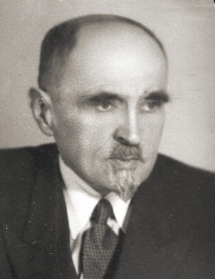

### Kraków

Alfred Fiderkiewicz został prezydentem Krakowa.

### UPA

W Baryszu koło Tarnopola (wówczas Barysz to było miasto) UPA dokonało kolejnego ataku. Lokalny oddział samoobrony został poważnie uszczuplony w 1944 przez pobór do wojska, do tego w przeddzień masakry większość oddziału wezwano do Buczacza. Na miejscu zostało tylko 10 żołnierzy. Zamordowano 135 ludzi.

W ciągu kilku następnych dni pochowano pomordowanych, Polacy przenieśli się do Buczacza, gdzie oczekiwali na repatriację. Pamięć o zbrodni kultywowana jest w Smardzowie k Siechnic).

### Georges Kars

Georges Kars znany głównie z pejzaży i aktów czeski malarz pochodzenia żydowskiego zabił się dzisiaj, wyskakując z okna hotelu w Genewie. Od 1942 przebywał w bezpiecznej Szwajcarii, a teraz jechał z powrotem do wyzwolonego Paryża. Przyczyną samobójstwa prawdopodobnie była depresja spowodowana wiadomością o śmierci rodziny, doświadczeniami wojennymi i represjami. Jeszcze przed wyjazdem malował smutne dzieci, w Szwajcarii głównym tematem byli uchodźcy szukający ratunku. Wojna zabijała nie tylko odłamkami.

### Franciszek Szanior

Śmierć Franciszka Szaniora, jednego z najbardziej znanych polskich ogrodników (Ogród Saski, założył Park Ujazdowski) natomiast była zupełnie naturalna, miał 92 lata.

### Colditz

Do najsłynniejszego zamku - obozu jenieckiego, przeznaczonego dla najważniejszych i najtrudniejszych (ucieczki) jeńców przywieziono generała Tadeusza Bora-Komorowskiego z innymi polskimi oficerami. Jest to dowódca Armii Krajowej odpowiedzialny za wybuch Powstania Warszawskiego.

### Jałta

Drugi dzień Konferencji Jałtańskiej.

### Lubin

Dramatyczna walka w Składkowicach (niem. Ziebendorf, 5km na NE od Lubina) [Epizod ze Składowic ( Ziebendorf) – moździerzyści w walce](https://www.facebook.com/bobr1945/posts/3424116324368673)

### Uniwersytet Wrocławski

Wydziałem Szkół Wyższych w PKWN kierował prof. Henryk Raabe, dziś wysłał list do ministra oświaty, w którym proponuje założenie we Wrocławiu uniwersytetu i politechniki przez połączenie dorobku materialnego uczelni niemieckich i wysłaniu do Wrocławia polskich uczonych z innych ośrodków. Uniwersytet Wrocławski zaczyna powstawać po raz trzeci.

Co też warto zauważyć, jest to pierwsza oficjalna wzmianka wskazująca, że rząd warszawski jako oczywistość traktuje Wrocław w granicach przyszłej Polski. To już jest przesądzone. Taka jest decyzja Stalina, rzeczywistość w Polsce dyktują nie międzynarodowe konferencje, ale Fronty marszałków Koniewa i Żukowa, a oni zrobią to co im Stalin każe. Polska ma być po Odrę i Nysę (Łużycką) i będzie. Tak samo jak terytorialne zyski, tak samo będą dyktowane straty Polski. Zresztą o tych stratach również Raabe pisze wprost, proponując wysłanie uczonych z innych ośrodków. Polska kadra uniwersytecka poniosła takie straty, że da się to zrealizować tylko przy założeniu likwidacji ośrodków w Wilnie i Lwowie.

We Wrocławiu wciąż się zastanawiają czy dojdzie do oblężenia, w Warszawie już mają plany co zrobić z "dorobkiem materialnym uczelni niemieckich".

*Henryk Raabe (1882-1951) 
Źródło: Wikipedia By unknown-anonymous - "Robotnik" 1946, Domena publiczna, [Link](https://commons.wikimedia.org/w/index.php?curid=58938477)*

### Wrocław

Tymczasem we Wrocławiu - ogłoszenie wyroku sądowego.
>Dwóch żołnierzy z jednostki walczącej w obrębie twierdzy zostało wysłanych po koce do wsi położonej bardzo blisko ich pozycji. Oni jednakże zdjęli w owej wsi mundury, włożyli ubrania cywilne i na piechotę wyruszyli w drogę, aby dostać się swych rodzinnych miejscowości. Ujęci 5.II.45 r. przez patrol wojskowy, zostali tego samego dnia skazani na śmierć przez sąd doraźny i rozstrzelani

Zarzutem jest maruderstwo (niem. Drückeberger).

>Gerhard Malek z Oporowa, robotnik zakładów zbrojeniowych rozstrzelany jak to napisano w uzasadnieniu za nieoddanie ulotek rosyjskich oraz defetystyczne rozmowy. Wyrok wykonano na miejscu.

Zarzutem jest defetyzm i zdrada.

### Project Manhattan

Inżynier wojskowy Franklin Matthias, kierownik zakładu rozdzielającego w Hanford, osobiście w Los Angeles przekazał pierwsze 80 gram azotanu plutonu o czystości 95% kurierowi z Los Alamos.
