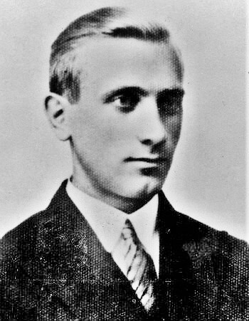

### 1 Front Białoruski

1 Front Białoruski: Drawno i Kalisz Pomorski.

### 1 Front Ukraiński

1 Front Ukraiński: Czechowice (obecnie Czechowice-Dziedzice) w powiecie bielskim.

9 Korpus Zmechanizowany zdobył Jawor.

### Belgia

Achille Van Acker z Belgijskiej Partii Socjalistycznej został pierwszym powojennym premierem Belgii. Jest to jeden z twórców belgijskiego welfare-state.

### UPA

W nocy nastąpił atak sotni UPA na wieś Puźniki. Mieli ułatwione zadanie, bo samoobrona, która do tej pory broniła wsi przestała istnieć. Najpierw po wejściu wojsk sowieckich ujawnił się jej dowódca, został aresztowany i zesłany do łagrów. Potem większość jej żołnierzy wcielono do WP. Duża licząca 800 mieszkańców prawie wyłącznie polska wieś mająca długą historię walk z UPA została prawie bezbronna.

UPA zaatakowało o 4 w czasie zmiany warty. Większość Polaków zdołała się schronić w przygotowanych do obrony miejscach. Liczbę ofiar ocenia się na 50 do 120 ludzi.

W ciągu kilku następnych dni mieszkańcy wsi ewakuowali się do Koropca i Buczacza. Potem przesiedlono ich na tzw. Ziemie Odzyskane: wsie Niemysłowice (gmina Prudnik) i Ratowice (gmina Czernica k Wrocławia).

### Dmytro Klaczkiwski

Dla Polaków najważniejszą osobą kojarzoną ze zbrodniami UPA (około 100 tys zamordowanych Polaków) jest Stepan Andrijowycz Bandera. Tak się jednak składa, że podczas Rzezi Wołyńskiej i wcześniej, bo od 1941 Bandera był uwięziony w obozie koncentracyjnym Sachsenhausen. Zapewniono mu wygody i miał kontakt ze światem zewnętrznym, ale nie ma dowodów, by wydawał rozkazy, lub choć w jakimś stopniu wspierał czystki etniczne prowadzone przez UPA. Większość szefostwa organizacji Bandery, czyli OUN-B została uwięziona przez Niemców.

Osobą bezpośrednio i niewątpliwie odpowiedzialną za plan wymordowania Polaków był dowódca UPA-Północ Dmytro Klaczkiwski. Od dłuższego czasu na jego tropie była grupa operacyjna 20 Brygady Wojsk Wewnętrznych NKWD. Pojmany 17 dni wcześniej jego żołnierz po 12 dniach przesłuchań opowiedział śledczym dość, żeby mogli go złapać. 10 lutego rozbito oddział osłony Klaczkiwskiego. Dzisiaj żołnierze 233 batalionu 20 Brygady WW NKWD pod dowództwem starszego lejtnanta Chabibulina przeczesując las, wykryli ognisko, a następnie idąc po śladach, natrafili na trzech uciekających mężczyzn, dwóch ochroniarzy Klaczkiwskiego osłaniało dowódcę, po krótkiej walce wszyscy trzej zostali zabici.

Klaczkiwski został zidentyfikowany i pogrzebany w nieujawnionym miejscu.

*Dmytro Klaczkiwski (1911-45) 
Źródło: Wikipedia By nieznany - [http://www.kivertsi.in.ua/news/120211182958.jpg](http://www.kivertsi.in.ua/news/120211182958.jpg), Domena publiczna, [Link](https://commons.wikimedia.org/w/index.php?curid=18852670)*

### Ziemia Lubuska

Z leżącego przy Odrze miasteczka Schwedt/Oder (20 km na północ od Cedyni) biegnie droga w kierunku SE na Odrę. Po drugiej stronie 3 km od rzeki znajduje się wieś Grabowo. Dziś tam walczył SS-Fallschirmjäger-Bataillon 600. Znana i rozpoznawalna jednostka, od jesieni 1944 jedyni spadochroniarze SS. Wspierajac 210. StuG Abteilung bronili pozycji Odry przed atakiem kilku batalionów piechoty, kilku kompanii czołgów T-34-85 i jednej kompani IS-2.
>Teraz Rosjanie zapełnili drogę czołgami. Opuściłem moją wysuniętą pozycję z dowódcą mojej kompanii. Każdy z nas miał panzerfausta. Pełzliśmy jak Indianie. Nagle usłyszałem głuchy dźwięk – odgłos wystrzelonego Panzerfausta. Dowódca wystrzelił ze swojej broni. Widziałem pocisk przelatujący nad czołgiem. "Aha"" pomyślałem, "on celował na 80 m, a mi się wydaje że jest to 60 m." Wycelowałem i odpaliłem mojego Panzerfausta. Moje obliczenia okazały się trafne gdy Panzerfaust dosięgnął celu... 
>Rosjanie nadjeżdżali teraz czołgami IS. Chcieliśmy uszkodzić te kolosy i po ich zdobyciu odholować je. Raz po raz starałem się z dowódcą mojej kompanii, Hauptscharführerem, którego imienia już nie przywołam, zbliżyć się do czołgu IS. Tym razem Rosjanie byli uważni i ostrzelali nas z pistoletów maszynowych zmuszając do odwrotu. Obeszliśmy ich i spróbowaliśmy jeszcze raz z drugiej strony drogi. Zabrałem ze sobą Waltera Birke dla bezpieczeństwa.
>Posuwaliśmy się do przodu lasem, wzdłuż prawej strony drogi ale nie znaleźliśmy dobrej pozycji do oddania strzału. Rozkazałem odwrót. Tuż przed skrajem lasu, w kierunku na otwarty teren, usłyszałem strzał z karabinu. Odwróciłem się. Moje ubezpieczenie strzeliło z przydrożnego rowu z karabinu snajperskiego w Rosjanina majstrującego przy uszkodzonym T–34. Gdy obejrzałem się, zauważyłem jak wieża czołgu IS powoli odwracała się w naszym kierunku.
>Następnie zobaczyłem wystrzał z armaty czołgowej, usłyszałem eksplozję, zauważyłem ogień bezpośrednio koło mnie i upadłem na plecy. Nagle zdałem sobie sprawę, że zostałem ranny. Chciałem się podnieść i poszukać schronienia, ale nie byłem w stanie tego zrobić. Moje nogi nie utrzymałyby mnie, więc dowlokłem się za małe wzniesienie terenu i sprawdziłem rękoma swoje nogi. Były całe we krwi, pomyślałem, "Cholera, teraz stracę nogi!"

Jednostka ta trzymała pozycję Odry ponad miesiąc, a kiedy wojska niemieskie wycofywały się stamtąd, stanowili straż tylną. [500 SS-Fallschirmjägerbataillon –jednostka specjalna SS](https://www.facebook.com/permalink.php?story_fbid=185582836350117&id=110114217230313)

### Dolny Śląsk

Sowieci przekroczyli Bóbr w Gryżycach (Elektrownia Wodna Grajówka) kilka km na północ od Żagania. [FORSOWANIE BOBRU – ZDOBYCIE HYDROELEKTROWNI GRYŻYCE(GREISITZ)](https://www.facebook.com/bobr1945/posts/3167450643368577)

Pierwszy atak na Kożuchów (93 Brygada Pancerna z 4 Armii Pancernej). Odparty. Następnego dnia Brygada dostała posiłki i zdobyła miasto. [Sowieckie czołgi w walkach o Kożuchów – 12 lutego 1945 roku](https://www.facebook.com/bobr1945/posts/3041999539247022)

### Wrocław

Kontratak wzmocnionych posiłkami oddziałów niemieckich odbija Zakrzów i odzyskuje całe Psie Pole.
>Około godziny 23.00 kapitan Günther wprowadza swoich dowódców kompani na pozycje wyjściowe. Jest jasna księżycowa noc. Tu i ówdzie pada w ciemnościach pojedynczy strzał. Nagle o 5.55 rozpoczyna się uzgodniony ostrzał artyleryjski. Początkowo wszystko przebiega zgodnie z planem. Wyrwani ze snu Rosjanie tylko w pojedynczych przypadkach stawiają bardziej zorganizowany opór [...] Po krótkim starciu batalion dociera do północnego skraju Zakrzowa. Do dowódcy pułku idzie meldunek - cel zdobyty! Wtedy na horyzoncie pojawiają się sowieckie czołgi. Grzechoczące gąsienicami i strzelające na oślep kolosy nie stwarzają jeszcze zagrożenia, ale kapitan Günther wie, że jego zmęczeni żołnierze potrzebują chwili wytchnienia i mogą nie powstrzymać nacierających. Sytuację komplikuje fakt, że także od strony Pawłowic rozbrzmiewa bitewny alarm i zbliżają się Rosjanie.

Poniedziałek zwykle kojarzy się z czymś nowym, z jakimś początkiem. Ten jest inny. Od dłuższego czasu Wrocław stoi wobec perspektywy oblężenia i jest ona trochę jak front wschodni. Bardzo długo odległa i groźna, później nagle realna, jakby niespodziewanie wbrew wszelkim zapewnieniom i nadziejom. Nagle w ciągu kilku dni, które minęły niemal niezauważone, staje się nieunikniona i dyktuje warunki. O tym dniu komendant twierdzy Hans von Ahlfen pisze
>tymczasem do 12 lutego sytuacja na Śląsku nad Odrą i na południe od Wrocławia przybrała tak niekorzystny obrót, że trzeba było się liczyć z rychłym zamknięciem pierścienia wokół Wrocławia.

Naprawdę? Rychłym? Tego dnia Wrocław był już de facto okrążony. Wróg miał kompletną kontrolę nad północą i wschodem, blokował autostradę i umacniał się na kierunku zachodnim. Jedyna droga wyjścia wiodła na południe, ale ludność cywilna już nie dysponowała własnymi samochodami, nawet gdyby ktoś tamtędy jechał, cały czas by się patrzył w lewo, wypatrując sowieckich czołgów. Ruch kolejowy wstrzymywano i uruchamiano w zależności od sytuacji w Kątach Wrocławskich, bo właśnie toczyły się o nie walki - jak pisze Ahlfen
>w nocy z 10 na 11 lutego nie udało się zatrzymać wielkiej sfory rosyjskich czołgów na autostradzie w kierunku Kąty Wrocławskie - Wrocław

Była to jedyna droga ucieczki, na którą być może można było liczyć, a już wkrótce zamknie się ostatecznie. Droga powietrzna była własnością Luftwaffe i była bardzo ryzykowna, bo panowanie w powietrzu mieli sowieci. Tylko temu, że najwidoczniej 2 Armia Lotnicza nie używała radarów, Luftwaffe zawdzięcza istnienie mostu powietrznego.

W nocy z 11 na 12 lutego ostatecznie oddano rejon Oławy, broniły się tam będąca w trakcie formowania 609. Dywizja i sąsiadująca z nią od prawej 269. Dywizja zagrożona na swoim zachodnim skrzydle.

Ponieważ nie padł rozkaz, by bronić się w okrążeniu (tym razem ktoś zapomniał o utworzeniu Twierdzy) większość sił udało się wyprowadzić z okrążenia przez istniejącą jeszcze lukę w kierunku na Jordanów (niem. Jordansmühl), pozostała część musiała się wycofać do Wrocławia wzmacniając załogę Twierdzy.

Hugo Hartung wciąż jest na lotnisku w Strachowicach, ale odległy o kilkaset metrów Krzeptów jest już oblężony z trzech stron, pisze
>zostajemy odwołani z powrotem do bazy. Udaje się nam ujść z kleszczy wroga w ostatniej chwili. W Strachowicach nie ma już wody ani prądu. Za to jedzenia picia i papierosów mamy aż nadto. Wieczorem siedzimy przy świecach w kwaterze. Prawie nikt się nie odzywa. Czujemy, że kataklizm przybliża się z każdą godziną.

Tego dnia ksiądz Peikert odnotowuje dwie najistotniejsze rzeczy, choć zmniejszyła się znacznie ilość wiernych, aktywność religijna tych, którzy pozostali wzrosła, natomiast władze miasta zaprzestały wymuszać terrorem opuszczenie miasta, oczywisty znak desperacji i klęski:
>Msza święta wczesnym rankiem o godz. 7, jak w ogóle msza św. w ostatnich tygodniach, ma bardzo dużą frekwencję. Codziennie udziela się 270-300 komunii. Odkąd pociągi nie kursują, ustaje terroryzowanie i nakłanianie ludności do opuszczania Wrocławia. Nowe przymusowe ewakuacje dużych obszarów Śląska. Wielokilometrowe kolumny uchodźców, nędzy i ubóstwa ciągną na chłód i poniewierkę. [...] Zgorzelec i Łużyce pod groźbą ewakuacji.
