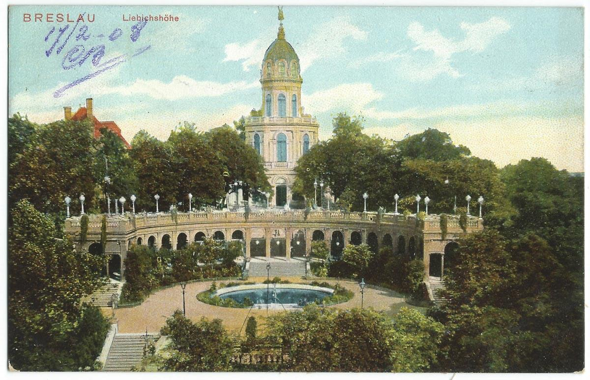

### Eisenhower

Głównodowodzący zachodnim frontem generał Dwight Eisenhower skontaktował się z rządami aliantów (Francja, UK i USA) w sprawie spodziewanego kryzysu humanitarnego na zdobytych terenach. Gospodarka niemiecka nie istniała, wszystko zostało podporządkowane wojnie, rolnictwo było uzależnione od pracy robotników przymusowych. Przywrócenie podstawowej sprawności systemu zajmie miesiące, w międzyczasie zabraknie żywności i środków transportu dla milionów ludzi. To co posiadała armia to było zbyt mało, nawet by zając się jeńcami wojennymi, których będzie kilka milionów. Ostrzegł przed klęską głodu, na ogromnych obszarach Europy nie będzie dość żywności dla Niemców, dipidów (DP ang. displaced persons), jenców wojennych, a nawet własnej armii. Głownym źródłem żywności miała być Wielka Brytania, która sama borykała się z wojennymi brakami żywności do tego stopnia, że trzeba było ja racjonować.

- [The Rhine Meadows Camps - What Really Happened?" [YT ]"](https://www.youtube.com/watch?v=icFKdMw7nT8)

### Oblężenie

Trwa bezlitosna walka o Galowice. Dla 269 DP to ostatnia szansa na wyrwanie się z obleżenia. Jej dowódca generał Wagner nie dostał rozkazu pozostania w Twierdzy, usiłował więc wydostać oddział. Atak przypuściła w nocy z 13 na 14 lutego i trwał do rana. Użyto m in zdobycznego czołgu T-34 który miał udawać sowieckie siły, do pewnego momentu trik się udawał, czołg jednak został rozpoznany i zniszczony. Z ogromnym poświęceniem odpierano kolejne szturmy, Niemcy wdarli się do wsi. Dywizja została odparta, prawdopodobnie części piechoty się udało przedostać.

Leo Hartmann z 311 Brygady Dział Szturmowych
>Przydzieleni wraz z 10 działami samobieżnymi do 269 Dywizji Piechoty, 12 i 13 lutego w okolicach Wrocławia próbowaliśmy przeszkodzić w połączeniu się Rosjanom nacierającym z przyczółków w Brzegu i Ścinawie. Na próbie się skończyło. Na południe od naszej grupy szturmowej rosjanie zamknęli pierścień wokół Wrocławia i rozdzielili nas z naszym taborem. W nocy z 13 na 14 lutego chcieliśmy się przedrzeć na południe. Ale wieś Galowice, przez którą musieliśmy przejść, byłą naszpikowana działami przeciwpancernymi i granatnikami. Stało tam również wiele czołgów. Zamiar przedarcia nie powiódł się. O świtaniu jako ostatni przejechałem z moim działem, mijając wypalone pojazdy. Zebraliśmy sie w majątku w Karwianach. Trzeba było przewieźć do Wrocławia pozostałych 6 dział naszej 311 Brygady Dział Szturmowych.

Robert Primke, Maciej Szczerepa "Kierunek Festung Breslau"
>Wielokrotnie dochodziło do walki wręcz, używano kolb, gołych pięści. Szregowiec Bajdimir Pakyrbajew z 2 Batalionu Piechoty Zmechanizowanej 25 Brygady Zmechanizowanej Gwardii w ulicznym boju zastrzelił z automatu sześciu Niemców, w tym dwóch oficerów. Jednego z nich, gdy zaciął się automat, zatłukł kolbą.

Wczesnym popołudniem oddziały 7 Korpusu Zmechanizowanego otrzymały kolejno po sobie kilka rozkazów (stąd zamieszanie w relacjach), ostatni z nich nakazywał udanie się na spoczynek w rejonie na południe od Budziszowa Wielkiego (zachodni kraniec rejonu operacyjnego 6 Armii), uzupełniły paliwo w Krzyżowicach i udały sie w drogę. Z tego powodu 7 Korpus zluzował zajmowane pozycje zanim zostały przejęte przez biedną, szarą piechotę 5 Armii Gwardii od wschodu i 6 Armii od wschodu.

Nie trwające długo rozluźnienie pozycji sowieckich zbiegło się z kolejnym poważnym atakiem tym razem z południa, od strony Świdnicy. Atakujaca na linii Mirosławiec, Gniechowice, Małuszów, Tyniec Mały 19 Dywizja Pancerna mająca w składzie m in 10 niszczycieli czołgów Nashorn przebiła drogę do Twierdzy. Kontakt ten utrzymano do 15 lutego.

Natomiast oddziały 6 Armii kierują się na Wrocław. Do dzisiejszego wieczora umocniły się na rubieży skraj Domasławia - Bielany Wrocławskie - południowy skraj Oporowa i Krzeptowa - Żar - Brzezina - Prężyce. Przede wszystkim zaś zabezpieczyły zaplecze natarcia zdobywając Środę Śląską i Lutynię.

### Porozumienie USA - Arabia Saudyjska

Prezydent Franklin Delano Roosevelt i król Arabii Saudyjskiej Abd al-Aziz ibn Su’ud spotkali się na pokładzie okrętu USS „Quincy”, podpisując m.in. porozumienie o nawiązaniu stosunków dyplomatycznych.

### Drezno, Praga

Drugi dzień bombardowania Drezna - [Drezno bombardowanie 13-15 lutego 1945](/festung-breslau/article/drezno-bombardowanie/)

Zaraz po południu 62 bombowce B-17 z 398. grupy bombowców Eighth Air Force zrzuciły 152 tony bomb na gęsto zaludnione dzielnice centrum Pragi, zginęło 700 osób. Chwilę przed nalotem ogłoszono alarm bombowy, ale prażanie zlekceważyli go bo ciągle je ogłaszano w celach ćwiczebnych. Jak się okazało, zła pogoda, popsuty sprzet radionamierzania i silny wiatr spowodowały pomylenie miasta. Te bombowce były skierowane na stację rozrządową w Dreźnie. 120 km różnicy.

Od jednej z bomb, która spadła na Pragę, w atelier na Mánesově ulici 20 zginęło małżeństwo Štáfl. Otakar odkrył Tatry jeszcze przed Wielką Wojna. Po wojnie był tam regularnie, dzierżawił schronisko. W 1927 ożenił się z Vlastą. W 1928 wydano tekę z jego 120 akwarelami tatrzańskimi. Vlasta pisała książki dla dzieci i dziewczyn i też kochałą góry. Zainicjowali założenie Cmentarza Symbolicznego na Popradzkim Stawie. Od 1947 znajduje się tam również tablica im poświęcona.

### UPA

Byczkowce w większości polska wieś w byłym powiecie czortkowskim województwa tarnopolskiego została napadnięta przez duży liczący ponad 500 osób oddział nacjonalistów ukraińskich, pomimo stawienie zaciekłego oporu zabili ponad 100 Polaków.

### Warszawa

Jak już wiemy, jeszcze we wrześniu, podczas Powstania Warszawskiego, PKWN powołał Mariana Spychalskiego na Prezydenta Warszawy.

22 stycznia zaledwie pięć dni po zdobyciu Warszawy Spychalski powołuje do istnienia Biuro Organizacji Odbudowy m.st. Warszawy pod kierunkiem Jana Zachwatowicza. Kierownikiem biura jest Roman Piotrowski, a jego zastępcami Witold Plapis oraz słynny później i wzbudzający tyle kontrowersji Józef Sigalin. Pierwszym zadaniem było rozminowanie ruin i usunięcie licznych pułąpek pozostawionych przez okupanta, dopiero potem inwentaryzacja i zabezpieczenie ocalałych reliktów zabudowy.

Dzisiaj biuro zostało przemianowane w Biuro Odbudowy Stolicy, które ostatecznie zadanie zawarte w nazwie wykonało. W kwietniu zatrudniało 200 osób, we wrześniu 400. Byli to architekci, studenci, technicy. Architekci byli pod wpływem przedwojennych kierunków: modernizmu i awangardy. Już wkrótce zostaną określone jako burżuazyjne i wsteczne.

Status i rola BOS zostałą potwierdzona dekretem z 24 maja 1945 o odbudowie m. st. Warszawy.

### 1 Front Białoruski

1 Front Białoruski: Piła, Chojnice!

### 1 Front Ukraiński

1 Front Ukraiński na odcinku ścinawskim opór nieprzyjaciela już słabnie, dziś zdobyto Nową Sól, Zieloną Górę i Nowy Kisielin.

Awangarda Frontu dotarła do Nysy Łużyckiej naprzeciwko miejscowości Gross Gastrose, w nocy z zaskoczenia zdobyli most na Nysie Łużyckiej i zaczęli się przeprawiać na druga stronę.

### Ziemia Lubuska

Wczoraj Stare Żabno, dziś Nowa Sól zdobyta, atak w kierunku Zielonej Góry. [„ZAPALNICZKI” W BOJU O NOWĄ SÓL I ZIELONA GÓRĘ](https://www.facebook.com/bobr1945/posts/3492797917500513)

### Lubsko

Dzisiaj prawie zapomniane Lubsko (niem. Sommerfeld) od drugiej połowy XIX wieku dzięki położeniu na skrzyżowaniu dwóch ważnych tras kolejowych, jednej z Berlina na Śląsk zbudowanej w 1846, przeżywało swój okres świetności.

To strategiczne położenie zostało docenione przez Armię Czerwoną - 28 stycznia zrzucono tam polska grupę zwiadowców "Wisła": Kazimierz Cieliszak, Franciszek Mazurkiewicz i Józef Kuriata. Mieli rozpoznać znajdujęce się w okolicy węzła kolejowego jednostki wojskowe, zakłady zbrojeniowe i urządzenia obronne. Zadanie ułatwiła obecność dużej liczby Polaków robotników przymusowych, którzy udzielili grupie "Wisła" pomocy. 14 lutego Lubsko zostało zdobyte przez Armię Czerwoną a polscy zwiadowcy o mały włos nie zostaliby rozstrzelani, dowdodzący czerwonoarmistami oficer nie mógł bowiem uwierzyć w obecność polskiej jednostki. Uratowała ich interwencja oficera NKWD, któremu chciało się sprawdzić ich relację na wyższym szczeblu.

Oddziały pierwszoliniowe podążyły na Nysę Łużycką i zostawiły w mieście niewielkie siły. Jak były słabe swiadczy fakt, że 16 lutego Lubsko zostało odbite przez SS Brygadę Dirlewangera. Jak to powiedział inny esesman Ernst Rode "*Była to brygada raczej świń niż żołnierzy*". To prawdopowodnie dziełem dirlewangerowców była egzekucja 76 jeńców francuskich, których ciała znaleziono w lesie koło cegielni. Nikt nie odpowiedział, za tę zbrodnię, nie ma nawet pewności kto jej dokonał. 19 lutego Armia Czerwona wróciła, najpierw ostrzał artyleryjski i zdobycie miasta 20 lutego.

Jak bardzo sytuacja była skomplikowana świadczy fakt, że jeszcze tej nocy z 20 na 21 lutego przez Lubsko przeszły oddziały niemieckie zmierzające do Gubina.

### Groß-Rosen

Wyzwolenie obozu koncentracyjnego Groß-Rosen. Więcej na temat samego obozu i ogólnie całego systemu obozów koncentracyjnych i obozów zagłady, historii represji i Holokaustu: [Obóz koncentracyjny Groß-Rosen (1940-45)](/festung-breslau/article/groß-rosen)

### Dolny Śląsk

21 Armia atakując Strzelin nie osiąga wielkich sukcesów, zdobywa Wiązów.

Po wejściu do Strzegomia czerwonoarmiści dokonują egzekucji i gwałtów.

Walki na autostradzie. [ŚMIERĆ NA MOŚCIE – OLSZYNA (ERLENHOLZ)??](https://www.facebook.com/groups/dolny.slask/permalink/1698473920305708/)

### Wrocław

W ciągu ostatnich kilku dni 269 DP, niedobitki 17 DP i sztab grupy korpuśnej Wrocław zdołały się wymknąć z Twierdzy. Część w ostatniej chwili.

Walentynki mające korzenie w starożytności, są obecnie w Niemczech obchodzone dokładnie na takiej samej zasadzie jak w Polsce, jako świeży import kulturowy. W 1945 wiedzą o nim tylko Niemcy dobrze znający kulturę anglosaską. Na 14 lutego 1945 przypada inne święto popularne w Niemczech i znane w Polsce - Środa Popielowa (Der Aschermittwoch), pierwszy dzień Wielkiego Postu, czterdziestodniowego okresu wyczekiwania na święto śmierci i zmartwychwstania Chrystusa. W oblężonym Wrocławiu ten Wielki Post miał trwać znacznie dłużej, a to co 6 maja zobaczą zwycięzcy i zwyciężeni w niczym nie będzie przypominać zmartwychwstania. Przez następne 80 dni, przez prawie 12 tygodni, Wrocław będzie codziennie masakrowany, niszczony, podpalany, bombardowany; kwitnące dobrze zorganizowane miasto zamieniane podpaleniami i wybuchami w gruzy śmierdzące trupim swądem, gęsty duszący smog zakryje słońce, ale będzie dość jasno by było widać rzędy trupów ułożone wzdłuż ulicy.

Wrocław wiosną 1945 - udzielne księstwo Gauleitera Karla Hanke. Gauleiter jest problemem dla kronikarzy opisujący wydarzenie dzień po dniu, żeby przedstawić go w pełnym świetle, należałoby przedstawić jego czyny, do samego końca. Ale zrobić to teraz to wyprzedzić bieg wydarzeń, pozostaje więc śledzić go i podążać za nim w milczeniu, zdać relację jak z niemej pozbawionej komentarza kroniki filmowej, pokazywać skutki jego władzy, ambicji. Po gorączkowej ewakuacji, dniach amoku, kiedy wygnano na mróz i poniewierkę 700 tysięcy ludzi, nastąpiły trzy tygodnie niepewności, nadziei na to, że jest jakieś miejsce gdzie można się ukryć, przeczekać, ocaleć. Dziś i to minęło, zamknęły się drogi wyjścia. To już nie jest tak, że wszyscy mówią o wojnie, dziś wszystko co się robi jest jakimś udziałem w wojnie. Zimne dreszcze ogarnęły miasto i jego mieszkańców, cień przesądzonego losu, fatum gracza patrzącego na rozdane karty. Całe kwartały będą wstrząsane dreszczami, z hukiem i w eksplozji wybuchów będzie odchodzić w przeszłość duma Śląska, dreszcze, odrętwienie i konwulsje agonii rozłożonej na wiele tygodni, planowej i realizowanej na wiele sposobów egzekucji, tym było oblężenie Wrocławia.

*Wzgórze Partyzantów (niem. Liebichshohe) 
Źródło: By nieznany - Vintage postcards private collection, Domena publiczna, [Link](https://commons.wikimedia.org/w/index.php?curid=36745382)*

Nowa siedziba sztabu twierdzy w bunkrze przy Wzgórzu Partyzantów zgłosiła gotowość bojową, jak pisze Ahlfen:
>Kolejnym niemal symbolicznym wobec osiągniętej teraz gotowości bojowej aktem była przeprowadzka dowództwa z "cywilnych" gabinetów przy ulicy Gajowickiej (Gabitzenstraße) do przygotowanego tymczasem stanowiska bojowego w podziemiach Wzgórza Liebicha, Przeprowadzka ta odbyła się zresztą w samą porę. 14 lutego bowiem, kiedy przeniesiony już oddział właśnie zameldował gotowość bojową, bomby spustoszyły gabinety w dotychczasowej siedzibie dowództwa. Na konieczną przeprowadzkę był więc już najwyższy czas. Miejsce to, oferujące sztabowi, jego rozległym urządzeniom telekomunikacyjnym oraz licznym, dzielnym i wiernym łącznikom oddziału, podziemne schronienie w prostych warunkach typu polowego i wystarczające do zadań sztabu stanowiska pracy ze stałym sztucznym oświetleniem, wybrano z powodu jego centralnego, korzystnego pod względem komunikacyjnym położenia, instalacji telekomunikacyjnych oraz zalet budowlanych, zrazu jednak tylko pozornych. Część tych pomieszczeń kilka lat wcześniej rozbudowano jako centralę dowodzenia obrony przeciwlotniczej Wrocławia. Także dlatego podjęto decyzję o wyborze tego miejsca. Tym większe było zdziwienie, gdy pewien sprytny oficer sztabu wbrew początkowemu niedowierzaniu twierdził, a potem dowiódł za pomocą szybko zorganizowanych planów budowlanych, że betonowy strop bunkra został wybudowany bez żelaznego zbrojenia. Ten lepszy "domek z kart" został natychmiast umocniony przez pracowitych saperów z Volkssturmu, którzy z okolicznych. zamkniętych dla ruchu kołowego ulic wyrwali dostateczną ilość słynnej dużej kostki brukowej ze śląskiego granitu i według starych wzorów ułożyli ją na zbyt słabym stropie w postaci warstwy tłucznia. Dzięki temu strop już pod koniec lutego wytrzymał kilka uderzeń. Na uznanie za swą czujność zasługuje porucznik Seewann, wcześniej odkomenderowany do sztabu z batalionu Tenscherta. Sztab zawdzięcza mu życie i możliwość działania. Krótko potem czerpiąc lekcję z tego doświadczenia w dużej mierze z inicjatywy owego, jak się okazało, "specjalisty od stanowisk bojowych w twierdzy", znaleziono i prewencyjnie rozbudowano kolejne stanowisko bojowe w wielusetletnich podziemiach Biblioteki Uniwersyteckiej na Piasku. Porucznik Seewann wybudował na wschodzie jeszcze jedno stanowisko bojowe, które jednak nigdy nie zostało użyte.

Ten przydługi cytat pokazuje kilka rzeczy, Ahlfen dziarskim tonem opowiada o przeniesieniu siedziby sztabu, w mieście będącym od wielu dni obiektem bombardowania ale zamiast "*zrobiliśmy to w ostatniej chwili*" pisze "*był więc już najwyższy czas*", później okazuje się, że schron jest wadliwy, ale w jego narracji jest to tylko pretekst by pochwalić najpierw "*sprytnego oficera*" a potem "*pracowitych saperów*". Najciekawsze jest na końcu, o nowej siedzibie sztabu na Piasku będzie jeszcze mowa, dokonano tam niewyobrażalnego wręcz wandalizmu, ale nie obciąża to Ahlfena, bo już nie był komendantem. Czy ktoś wie gdzie dokładnie znajdowało się to stanowisko bojowe na wschodzie?

Ksiądz Peikert wczoraj obojętnie wylicza straty, pojedyncze budynki i charakter zniszczeń, ale zaczyna się poddawać, rezygnuje wobec skali zniszczeń pisze
>Nadchodzą również wiadomości o dużych zniszczeniach na całym obszarze miasta. [...] Chociaż nie dokonano jeszcze na Wrocław żadnych wielkich nalotów bombowych, to jednak stopniowo rosną szkody w całym mieście w następstwie codziennych zrzutów. [...] Nie ma więc prawie ulicy nieuszkodzonej

a dziś
>Rano niezwykle duża frekwencja na nabożeństwie. Ludzie garną się do Stołu Pańskiego i do przyjęcia krzyża popielcowego z poświęconym popiołem. W południe nieprzyjacielski nalot bombowy na południe miasta i ostrzeliwanie przez nieprzyjacielską artylerię. Wyrządzono duże szkody w tej dzielnicy zwłaszcza na Sudeckiej. [...] Południe miasta oczekuje szturmu nieprzyjaciela. Nie chce on zdobywać miasta od północy, gdzie musiałby sforsować stojące na przeszkodzie liczne odnogi Odry, lecz od południa. Na cmentarzu otaczającym kościół św. Maurycego za murem osadza się gniazdo karabinu maszynowego skierowanego na południowy wschód. Udało się przeszkodzić w zainstalowaniu posterunku obserwacyjnego na wieży naszego kościoła. Dzień i nocą potężne wstrząsy od wysadzania starych domów w mieście na gruz pod barykady. Zburzono tak te domy, które zostały przeznaczone do rozbiórki w planach regulacji urbanistycznej

chodzi o rejony obecnej Trasy W-Z.

Ksiądz Walter Laßmann zaczyna swą relację w minorowym nastroju
>Przenieśliśmy się do budynku schronu przeciwlotniczego w budynku przy Ofenerstraße 30 (pl. Krakowska). Był to dzień smutny i posępny. Mogliśmy w nowym miejscu pozostać tylko jeden dzień.

To wszystko.

Hugo Hartung na lotnisku w Strachowicach, wczoraj:
>Nagle znowu nastaje zima. Mglisty dzień z przelotnymi opadami śniegu. [...] Odkąd nie ma prądu nie możemy już słuchać radia.

Dziś natomiast:
>Przez cały dzień Strachowice pod ciężkim ostrzałem artylerii. Granaty spadają na dachu murowanych zabudowań, z których rozlega się łoskot jak podczas wiosennej burzy. Prawie wszystkie drogi w bazie są w polu widzenia wroga, można je pokonywać tylko pojedynczo i biegiem. [...] Nasze nastroje sięgają dna, gdy ogłoszony zostaje rozkaz naczelnego dowództwa twierdzy: odtąd wchodzimy w skład wojsk głównej linii frontu, której należy bronić "do ostatniego człowieka". Wszelkim próbom jej opuszczenia "należy w razie potrzeby przeciwdziałać najbrutalniejszymi środkami". Tymczasem mało który z nas ma pojęcie o wojaczce, a w rubryce wykształcenie naszej książeczki wojskowej znajduje się tylko wpis "przeprowadzono szkolenie w zakresie dyscypliny". Ile może zdziałać takie wojsko? O drugiej w nocy naszym schronem wstrząsa tak silna detonacja, że mamy wrażenie, jakby mury waliły nam się na głowę. Potem dowiadujemy się, iż eksplodował skład amunicji. Z potajemnym ukontentowaniem zdajemy sobie sprawę, że teraz nareszcie pozbyliśmy się tych okropnych pięćsetfuntowych bomb.

Wrocław jest w przeważającej większości luterański, a luteranie również świętują Środę Popielcową. Ale pastor Ernst Horning w ogóle o święcie nie wspomina, zajęty jest oblężeniem. Przytacza relację generała Sachsenheimera
>w tych dniach [11-13 lutego] zaatakowali po obu stronach autostrady w kierunku Kąty Wrocławskie - Wrocław i tak umocnili się na tym terenie, że nie można było już ich z niego przepędzić. [...] Główny przebieg, jak i znaczenie tych walk polegały na tym, że wróg przez niedający się powstrzymać atak okrążył teraz Wrocław.

Rosjanie wszędzie, nawet w bezpośredniej bliskości Wrocławia mają przewagę w ludziach, sile ognia, sprzęcie, także w woli walki. Opowieść Horninga z tych krytycznych dni jest równie chaotyczna, jak sytuacja na froncie. Pisze on jednocześnie, że dwa pociągi oczekujące od 12 do 14 lutego czekały na możliwość wyjazdu, a 14 lutego dwa pociągi jeden sanitarny Wehrmachtu i drugi zajęty przez chorych cywili i diakonisy z Bethanien musiały zostać opróżnione, chorzy pozostawieni przez kilka dni bez opieki w pociągach przynajmniej mieli nadzieję, teraz wrócili do szpitali wiedząc, że już nie uciekną. Jednocześnie podaje optymistyczny komunikat Wehrmachtu z 13 lutego mówiący o nieudanej próbie oblężenia miasta i potem
>W dniu 14 lutego udało się niespodziewanie na krótko otworzyć od zewnątrz połączenie na południu miasta. Dzięki temu niedaleko Bielan Wrocławskich udało się wywieźć jeszcze 1 tysiąc rannych i amunicję. Potem ta żelazna obręcz była szczelnie zamknięta przez prawie trzy miesiące

Nie jest jasne dlaczego miano by wywozić z Twierdzy amunicję, ale taką liczbę ludzi można wywieźć tylko koleją, przez Bielany przebiega linia kolejowa na południe do Kobierzyc, gdzie rozdwaja się na południowy zachód do Sobótki i na południe do Jordanowa Śląskiego, ta druga pozycja ma w tym momencie walk duże znaczenie, jest miejscem gdzie przegrupowują się siły niemieckie po rozbiciu obrony wokół Oławy.

Zamknięcie pierścienia oblężenia jeszcze nie nastąpiło, ale sytuacja Twierdzy od dawna była beznadziejna. Nie było już bezpiecznej drogi ewakuacji, jedno lotnisko wciąż w rękach niemieckich nie nadawało się do już użytku, wróg widział je gołym okiem. Drugie było nieustannie bombardowane. Ostatni transport wyjechał dzisiaj i było jasne, że następnego już nie będzie. Ahlfen tak przedstawia sytuację:
>Na Wrocław nacierały wówczas: 1 dywizja z zachodu na Leśnicę, 1 dywizja z okolic Kątów w kierunku południowo-zachodnich granic Wrocławia oraz silniejsza grupa (3-4 dywizje) w kierunku południowych granic Wrocławia

dalej z zadowoleniem opowiada o chwilowym powstrzymaniu wroga, o tym, że
>na południe od Kleciny, na drodze wiodącej pod wiaduktem autostradowym saperzy za pomocą "Goliatów" za jednym zamachem zniszczyli 6 nieprzyjacielskich ciężkich dział przeciwpancernych

oraz
>Nocą z 13 na 14 lutego z frontu odrzańskiego na linię Bystrzycy powrócił pułk Besslein, który miał teraz przed oczami swój garnizon w Leśnicy, znajdujący się już na terenie wroga.

kończy zaś stwierdzeniem
>Tak czy owak, począwszy od 14 lutego, front wokół Wrocławia miał odpowiadającą tamtym trudnym warunkom przejrzystą strukturę.

Tak przedstawiała się sytuacja Wrocławia w Święto Zakochanych i Środę Popielcową zarazem. Na całej długości frontu siły obrońców przeszły do defensywy, oddały walkę z przyczółkami, wróg już był wszędzie naokoło i zdominował pole walki. Pierścień okrążenia właśnie się domykał. Bolesław Dolata pisze jednak
>W nocy z 13 na 14 lutego oddziały 7 korpusu zmechanizowanego gwardii połączyły się z wojskami 32 korpusu piechoty 5 armii gwardii, zamykając ostatecznie pierścień wokół Wrocławia. "Festung Breslau" została okrążona. W "kotle" znalazł się około 80-tysięczny garnizon twierdzy

Jednak połączenie wojsk to jeszcze za mało, by uznać okrążenie. Pozostaje jeszcze ustalenie pozycji, domknięcie pierścienia i uformowanie frontu. To wszystko nastąpi wkrótce.

### Odnośniki

- [Egzekucja pod platanem](http://historia-swidnica.pl/egzekucja-pod-platanem/)
- zielonagora.naszemiasto.pl ["Żołnierze Armii Czerwonej zajęli Zieloną Górę"](https://zielonagora.naszemiasto.pl/zolnierze-armii-czerwonej-zajeli-zielona-gore/ar/c10-4012920)
