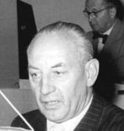

### 2 Front Białoruski

2 Front Białoruski Tuchola (poligon V-2)

### Stargard

Początek bitwy pancernej o Stargard Gubiński (najbardziej prawdopodobne bo Stargard Szczeciński został zdobyty dopiero 5 marca, Starogard Gdański 6 marca, ale Stargard Gubiński, to mała wioska na drodze do Gubina).

### 1 Front Białoruski

Bitwa o Poznań. W wyniku ostrzału radzieckiej artylerii spłonęła katedra św. Apostołów Piotra i Pawła. Ocalały jedynie kaplice, wypalone wnętrze odsłania pozostałości z okresu gotyku.

### 1 Front Ukraiński

Dotychczasowe zdobycze nad Nysą Łużycką na lewym brzegu Bobru stanęły pod znakiem zapytania. Udał się tam marszałek Iwan Koniew i rozkazał rzucić do walki wszystkie rezerwy operacyjne, a nawet wycofać oddziały zza Nysy Łużyckiej.

### Strzegom

Walki na północ od Strzegomia. Duże straty 7 Korpusu Pancernego Gwardii. [Pancerne starcie koło Strzegomia: Żółkiewka – Wieśnica– 15 lutego 1945 r.](https://www.facebook.com/bobr1945/posts/3703161219797514)

### Oblężenie

Oddziały 6 Armii na prawej flance zdobyły wieś Wysoką i na tym odcinku ustaliły rubież na linii Wysoka - Karwiany - Komorowice. W Komorowicach uzyskały połączenie z 5 Armią Gwardii.

Ze zmiennym szczęściem toczył się bój o klecinę i Oporów. Zdobyto Mokronos Górny i Mokronos Dolny. Strachowice wciąż były w rękach niemieckich, natomiast z rubieży Samotwór - Gałów szykowano atak na Jerzmanowo.

Niemcy - walczący na tym odcinku batalion SS Besslein - zostali wyparci z kluczowej pozycji w Żarach i zepchnięci do Leśnicy. Jeszzcze w nocy z 14 na 15 lutego patrol hitlerowski podszedł od wschodu do Lutynii i widział plądrowanie wsi.

Na odcinku północnym 6 Armia osiągnęła linię Wilkszyn - Piskorzowice.

Oddana pod komendę 6 Armii 294 Dywizja Strzelecka zdobyła Kłokoczyce (obecnie osiedle Zgorzelisko) i zaczęła walkę o Psie Pole.

Wciąż istnieje utworzone wczoraj połączenie niemieckiej 19 Dywizji Pancernej z garnizonem Twierdzy w Tyńcu Małym. Po kilkunastu godzinach dziś za dnia lub w nocy z 15 na 16 lutego korytarz ten został ostatecznie przecięty przez 7 Korpus Pancerny Gwardii, który powrócił ratować sytuację. Wrocław jest okrążony trwale.

Wieść ta obiega cały 1 Front Ukraiński i wywołuje krótkotrwałą euforię.

### Wrocław

Ocenia się, że walki o miasto potrwają może ze 4 dni.

Takie szacunki wynikają z błędnej oceny liczebności garnizonu Twierdzy. Po tym jak 269 DP generała Wagnera wymknęła się z okrążenia, sowieci uważają, że cała załoga pozostałą w mieście to 20 tys. żołnierzy niemających szczególnej wartości bojowej. Jak bardzo rzeczywistość byłą odmienna świadczy fakt, że po krwawych walkach trwających trzy miesiące do niewoli dostało się 45 tys. żołnierzy. Majewski do tego dodaje 6 tys zabitych i 6 tys. ewakuowanych rannych co w sumie daje 57 tys. pierwotnej liczebności załogi Twierdzy. Głuzdowski 8 maja melduje, że we Wrocławiu broniło się 65 tys. żołnierzy - ma jednak wyraźny interes w tym, żeby tę liczbę przeszacować.

Co gorsza, 6 Armia po stratach wojennych i oddaniu 7 Korpusu Pancernego Gwardii była niewątpliwie najsłabszą Armią Frontu. 4 lutego liczyła niecałe 50 tys żołnierzy i taki sam stan miała w połowie lutego. Wybitnie źle przedstawiają się te proporcje jeżeli wziąć pod uwagę liczbę żołnierzy w batalionach piechoty 30 do 11 a później 15 tys żołnierzy.

Pierścień składał się z:

- 218 DP Bielany Wrocławskie
- 309 DP pod Kleciną, Oporowem i przy stacji Muchobór Wielki
- 359 DP Muchobor Wielki i Strachowice
- 181 DP Maślice, Żerniki i dolny bieg Ślęży
- 34 Korpus Piechoty w okolicach Tresna i Mokrego Dworu
- 294 DP na północy 

Z chwilą odcięcia Wrocławia garnizon Twierdzy przestaje podlegać grupie korpuśnej Wrocław. Cała 609 Dywizja i wszystkie jednostki wojskowe we Wrocławiu od tej pory podlegają wyłącznie komendantowi. Tej nocy Wrocław dostaje pierwszy zrzut lotniczy.

Koniec formowania wrocławskiego Volkssturmu, pomimo odesłania do Saksonii wszystkich volkssturmistów III i IV rzutu, pod kierownictwem Obergruppenfuhrera SA Herzoga udało się sformować 38 batalionów, każdy po 4 kompanie, do tego 2 bataliony HJ (chłopcy 16-18 lat). Łączna liczebność Volkssturmu 15 tys ludzi. Jak to wykazała praktyka bitewna, Volkssturm nie tworzył jakościowo gorszych jednostek, w jednakowym stopniu przyczyniał się do strat sowieckich.

Składający się z jeńców, których udało się namówić na współpracę Związek Oficerów Niemieckich zwraca się do komendanta Twierdzy z propozycją kapitulacji zwracając uwagę na bezsens dalszej walki
>Pełen poważnych trosk o los miasta Wrocław, zwracam się do Pana z polecenia generała von Seydlitza, wiceprezydenta Komitetu "Wolne Niemcy". 
>Pan zna niebezpieczne położenie Wrocławia. Znaczne siły armii rosyjskiej posuwają się naprzód na zachód, od północy i od południa miasta. Sam Wrocław został okrążony i stał się terenem walk.[...] 
>Wrocław może zostać uratowany, jeśli Pan - z pobudek wyłącznie świętej odpowiedzialności wobec narodu i ojczyzny - podda miasto bez walki[...] 
>Pan sam wie, że to czego Hitler żąda dziś od dowództwa i żołnierzy Wehrmachtu, nie stanowi już bohaterskiej walki, lecz przestępstwo

Apel podpisał pułkownik Luitpold Steidle dowódca 767 pułku 376 dywizji piechoty. Nie wiadomo czy apel dotarł do generała Ahlfena.

*Luitpold Streidle w 1956 (1898-1984) 
Źródło: Wikipedia By Bundesarchiv, Bild 183-40306-0012 / Wittig; Blumenthal / CC-BY-SA, [CC BY-SA 3.0 de](https://creativecommons.org/licenses/by-sa/3.0/de/deed.en), [Link](https://commons.wikimedia.org/w/index.php?curid=37119753)*

Ahlfen najpewniej już w nowym stanowisku dowodzenia. w samym sercu Twierdzy wezwał do trwania w walce. Frontowa Schlesische Tageszeitung przekazała:
>Wrocławianie! 
>Twierdza Wrocław została okrążona. Nie stało się to dla nas niespodziewanie, ponieważ twierdza zawsze musi być przygotowana na okrążenie i na walkę w okrążeniu. Chodzi tylko o to, aby każdy człowiek w twierdzy mimo okrążenia był gotowy do walki[...]. 
>W związku z obroną należy się liczyć z dalszymi wypadkami burzenia, np. także mostów odrzańskich. Nie dopuśćcie do zachwiania waszej postawy! Zarządzam tylko to, co dla obrony jest niezbędne i konieczne ze względów wojskowych, a niezależnie od wszystkiego, co by się stać mogło, pamiętajcie, jak wielkie zadanie stoi przed Wrocławiem i jego załogą.

### ENIAC

Bez spektakularnych zwrotów akcji i dających się wyznaczyć punktów zwrotnych odbywa się proces tworzenia najbardziej zaawansowanej maszyny XX wieku - komputera. W okresie WWII mamy przynajmniej trzech kandydatów do tego miana:

- maszyny kryptoanalityczne Colossuss w Bletchley Park, dzieło Alana Turinga
- Z3 Konrada Zuse (Niemcy)
- Atanasoff-Berry Computer zbudowany na Uniwersytecie Stanu Iowa
- ENIAC (Electronic Numerical Integrator and Computer) zbudowany na Uniwersytet Pensylwanii

Najważniejszy z nich jest ten ostatni, głównie z tego powodu, że konstrukcja wszystkich późniejszych komputerów wywodzi się z niego, podczas kiedy Colossusy zostały wszystkie zniszczone na rozkaz Churchilla, a Z3 nie odniósł sukcesu. Tylko w USA był wystarczający potencjał biznesowy i właściwe połączenie wojska, które chciało rozwoju zaawansowanych technologii i uniwersytetów zainteresowanych w realizacji tych projektów. ENIAC był maszyną wielozadaniwą od sammego początku, w zasadzie miał wyliczać dane balistyczne dla artylerii, ale szybko okazało się, że najwięcej mocy obliczeniowej potrzebuje projekt Manhattan. To dlatego przez całą wojnę było tak cicho o budowie tej maszyny.

Uruchomiono ją 10 grudnia 1945, a za rok właśnie 15 lutego 1946 odbędzie się pierwsza publiczna prezentacja komputera. Prasa okrzyknęła ENIACA "Giant Brain". Żeby zainteresować dziennikarzy zamontowano specjalny panel losowo zapalający kontrolery, później taki mrugający panel stał się sztandarowym wyobrażeniem mainframe'a w mediach i SF.

ENIAC obliczał tor balistyczny w 30 sekund, człowiekowi zajmowało to 20 godzin.
