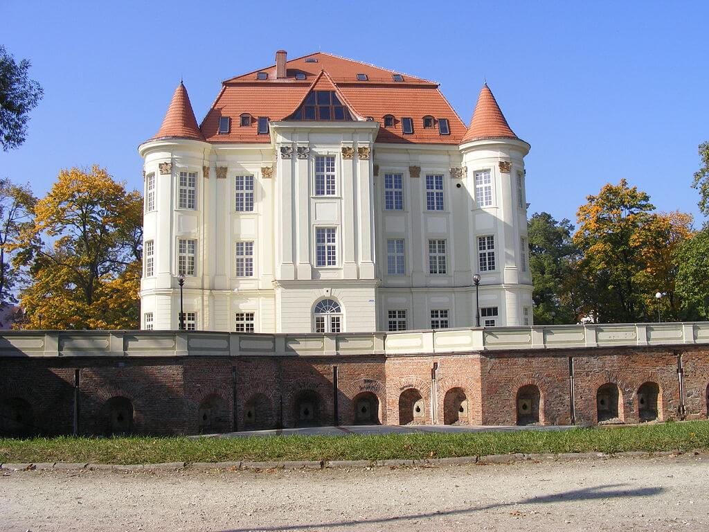

### Londyn

Ustalenia konferencji jałtańskiej są już powszechnie znane.

W Londynie powstaje Polski Ruch Wolnościowy Niepodległość i Demokracja. Coraz większa liczba Polaków na emigracji zdaje sobie sprawę, z tego że nieuchronny kierunek zmian w Polsce wyklucza ich powrót, że muszą zostać na emigracji i nawet swoje publiczne, polskie sprawy ułożyć, zorganizować poza Polską. Ruch założyło pięciu działaczy związanych z przedwojenną sanacją, ale mających wobec Polski międzywojennej krytyczne podejście.

Inaczej niż za zaborów, centrum polskiego życia emigracyjnego nie będzie Paryż, ale Londyn.

### Wrocław

Ultimatum bez odpowiedzi. Czas minął.

Armia Czerwona zaatakowała.

Atak od strony Kleciny i Brochowa. Na Trestno i Nowy Dwór.

Wczoraj wzięty Ołtaszyn. Natarcie na Borek i Krzyki.

Zaporowy atak od Kątów Wrocławskich i Wiązowa w kierunku Jordanowa Śląskiego miało powiększyć dystans do oblęzonego miasta.

Ksiądz Peikert opisuje całkowicie zgodną z relacją księdza Laßmanna całkowitą przewagę wroga w powietrzu i słabość niemieckiej obrony przeciwlotniczej, dużo uwagi poświęca temu, co musiało szczególnie boleć cywilów pozostałych w mieście, systematyczne wyburzenia dokonywane przez hitlerowców:
>Nad miastem krążą przez całą noc bombowce i myśliwce nieprzyjacielskie. Nasza obrona, jak zwykle, wyjątkowo słaba. Przez cały dzień padają nieprzyjacielskie bomby na miasto. Towarzyszy im huk licznych detonacji od wysadzanych bloków mieszkalnych śródmieścia. Jest to znamię czasów, że wybrano właśnie te trudne dni na burzenie bloków, które planowano w normalnych czasach jako odnowienie śródmieścia. Mieszkańców tych bloków w większości ewakuowano pod przymusem. Wolno im było zabrać tylko nieliczne rzeczy. Całe wyposażenie domu musiało pozostać. Domy wysadza się w powietrze nie zabezpieczywszy uprzednio w jakikolwiek sposób wyposażenia mieszkań (bielizny, mebli, pamiątek rodzinnych) Sprzęt domowy pochłaniają gigantyczne masy gruzu wymieszanego z meblami, bielizną i obrazami. Akcja wysadzania zatacza szerokie kręgi w obrębie miasta. Planuje się nawet wysadzenie w powietrze muzeum archeologicznego. Rodzi się pytanie jak będzie można zastąpić te domy i mieszkania, kto w przyszłości usunie te olbrzymie zwały gruzu? Tu znów widać skutki szaleństwa militaryzmu.

Budynki, których wyburzanie opisuje znajdują się na obecnej Trasie W-Z, to znana z wielu pocztówek i obrazów malownicza i potwornie niewygodna zabudowa obszaru wewnętrznej fosy.

Po odrzuceniu kapitulacji walki rozpoczęły się natychmiast. Pastor Ernst Hornig relacjonuje wydarzenia na froncie i na tyłach, znając sytuację w szpitalach polowych, przedstawia ogromny ludzki koszt wojny prowadzonej w cywilnym mieście pośpiesznie uzbrojonymi cywilami, często po prostu dziećmi:
>Dnia 17 lutego Rosjanie po odrzuceniu przez załogę twierdzy wezwania do kapitulacji, rozpoczęli z południa nowy atak na miasto. Ponownie rozgorzały walki o Park Południowy, gdzie oddziały Hitlerjugend z powodzeniem, ale przy ogromnych stratach, broniły się przez jakiś czas. [...] Tymczasem w dniach ciężkich walk piechoty na południu i na południowym wschodzie, szpital i lazaret "Bethesda" wypełniły się rannymi, przede wszystkim z ranami głowy. Straty na południu były duże. Już 16 lutego przeorysza Margarete Ziegler tak opisała swoje wrażenia z "Bethesda": "To jest wstrząsające, w salach leży tylu młodych ludzi z ciężkimi ranami głowy i oczu, zmęczonych i wyczerpanych. Większość z tych żołnierzy jest bardzo przygnębiona. Brakuje bardzo broni i amunicji.

### Leśnica

Gwałtowny atak czołgów na nieprzygotowane do obrony pozycje niemieckie pozwolił sowietom zając Leśnicę i szybko oprzeć front na linii Bystrzycy. Żołnierze SS z pułku Besslein mogli tylko bezradnie patrzeć na własne koszary z drugiego brzegu rzeki.

Epizod ten miał spore znaczenie dla późniejszej historii miasta, wzięta bowiem praktycznie bez walki Leśnica nie została zniszczona i była jedną z oaz osadnictwa polskiego po wojnie. Szybko została zasiedlona, a ponieważ tak duża liczba mieszkańców dojeżdżających regularnie do centrum wymagała efektywnej komunikacji, dociągnięto tam linię tramwajową. Symbolem tego, w jakich warunkach przebiegała odbudowa i jak powoli polska ludność wrastała w zabudowywane przez siebie pozostałości urbanistyki niemieckiej, jest fakt, że aż do dziś dociągnięcie linii tramwajowej do Leśnicy jest największą całkiem nową inwestycją powojenną w transport szynowy na terenie miasta.

Opanowanie Leśnicy najgorzej wspominają żołnierze z SS Besslein.

*Zamek w Lesnicy 
Źródło: Wikipedia By I,Stanislaw Szydlo, [CC BY 3.0](https://creativecommons.org/licenses/by/3.0"), [Link](https://commons.wikimedia.org/w/index.php?curid=4987853)*

Georg Haas uczestniczący w walkach wspomina rozgoryczenie i wściekłość swoich podkomendnych:
>Gdzie byli inni obrońcy Twierdzy Wrocław? Gdzie były przygotowane rzekome linie obronne? Żadnej pomocy, żadnych posiłków, kończąca się amunicja. Rosjanie nie zostawili jednak czasu ani na rozmyślanie, ani umocnienie się na kolejnych pozycjach. Z Żar wycofaliśmy się prawie brzegiem w kierunku naszych koszar w Leśnicy. W tym czasie dopadły nas rosyjskie czołgi, zadając ciężkie straty. Na naszych karkach czołgi wdarły się do baraków koszarowych na skraju miasta. Nikt ich w praktyce nie bronił. Zostały utracone w ciągu kilkunastu minut. Lissa była utracona. Odziały SS wycofały się za Bystrzycę i obsadziły jej prawy brzeg. Podliczono straty. W naszej kompanii plutony utraciły około połowy swojego stanu liczbowego.

Hendrik Verton:
>To był jedyna rzeka przegradzająca drogę do Wrocławia i miała strategiczne znaczenie. Znaleźliśmy się na wschodnim brzegu rzeki przy głównej drodze, którą musieli się posłużyć Rosjanie. Otrzymałem rozkaz zajęcia z moją grupą dwupiętrowego budynku na prawo od mostu, bardziej na południe [...] Nasi saperzy przygotowali most do wysadzenia w powietrze, jak tylko ostatnie niemieckie oddziały przejdą przez niego. Nagle nastąpiła ogłuszająca eksplozja. Podłoga się zatrzęsła, a w ciemnej piwnicy zrobiło się nagle jasno. Świece migotały tak gwałtownie, że prawie przygasły [...] Wyszliśmy z piwnicy na zewnątrz. Wyglądało jakby przeszedł huragan. Żaden z domów nie miał już dachówki. Leżała teraz rozrzucona razem z odłamkami szkła i innym gruzem. Wielka część mostu znikła. Duże bloki utonęły w rzece. Lecz reszta mostu pozostała. Wszystkie one zostaną wykorzystane przy odbudowie. Rosjanie byli w tym ekspertami. Jeszcze tej nocy rozpoczęli naprawy.

