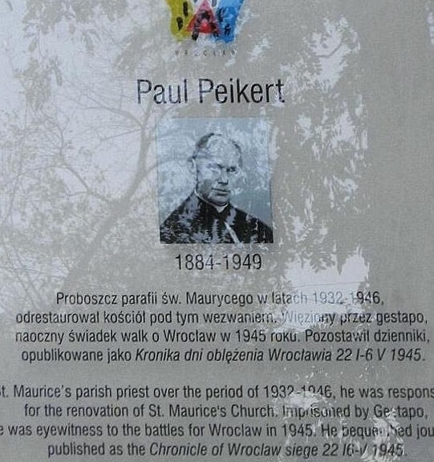

### Venona project

Venona project to był kotrwywiadowczy program USA nasłuchiwania i kryptoanalizy wiadomości sowieckiego wywiadu. Trwał 37 lat: od 1 lutego 1943 do 1 października 1980.

Dzisiaj została przechwycona wiadomość Venona 1822 KGB Washington-Moscow 30 March 1945, mająca znaczenie dla późniejszego oskarżenia Algera Hissa o współpracę z GRU. W 1948 był przesłuchiwany przed Komisją ds. Działalności Antyamerykańskiej (ang. House Committee on Un-American Activities). W 1950 skazany na 8 lat więzienia i dożywotni zakaz wykonywania zawodu prawnika. Do dzisiaj kwestia czy Hiss był agentem sowieckim jest przedmiotem sporu. Zmarł w 1996.

Venoma odegrała ważną rolę w ujawnieniu sowieckiej siatki działającej w Projekcie Manhattan. Istnienie tej operacji ujawniono dopiero w 1995.

### V1

Ostatnia bomba V1 skierowana na Antwerpię. Od wczoraj Anglia jest wolna od zagrożenia niemieckimi pociskami. 26 marca uderzyła w nią ostatnia rakieta V2, wczoraj - 29 marca - ostatnia latająca bomba V1. Kolejne cele to była Antwerpia (szczególnie port) i Bruksela.

Więcej o broniach V (niem. Vergeltungswaffe - broń zemsty) w artykule: [Wunderwaffe](/festung-breslau/article/wunderwaffe)

Port w Antwerpii był głównym miejscem rozładunku zaopatrzenia dla alianckich sił inwazyjnych, zniszczenie go poważnie by utrudniło operacje na froncie zachodnim. O dostęp do tego portu stoczono długę bitwę (bitwa o Skaldę) od 2 października do 8 listopada 1944, w której wzięły udział również jednostki polskie. Port udało się uruchomić 29 listopada 1944. Bitwa o Skaldę, a konkretnie opóźnienie w jej przeprowadzeniu i niski priorytet jaki nadał jej Montgomery jest przedmiotem poważnje kontrowersji. Wielu dowódców uważało, że można było to zrobić wcześniej i zamiast zakończonej fiaskiem Market Garden.

Do ochrony Antwerpii skierowano baterie plot brytyjską 80 AA Brigade i amerykańską 30th AAA Group. Używali 10cm radarów SCR-584 o zasięgu 25 km, do automatycznego kierowania ogniem służył przelicznik artyleryjski M9. Od października 1944 do 30 marca 1945 wykryto 4883 bomby, tylko 211 (4,5%) się przedarło.

I warto zwrócić uwagę na ten mało znany epizod w historii WWII - była to bowiem pierwsza w dziejach świata wojna robotów. Zaprogramowane samoloty-bomby, jak byśmy dzisiaj powiedzieli drony kierowano na strefę, której obrona plot opierała się na zdalnym, radarowym wykrywaniu celu i sprzężonym z danymi dostarczanymi przez radary automatycznym systemem kierowania ogniem (SKO). O takim cybernetycznym systemie mówi w podlinkowanym poniżej filmie Norbert Wiener:

- [We've Come So Far "Norbert Wiener - Anti-Aircraft Gun" [YT 3:00]](https://www.youtube.com/watch?v=qkDCmEtYcjU)
- [Tipsyfish History "German V1 Flying rocket instructional video" [YT 29:00]](https://www.youtube.com/watch?v=5EEZuXQyA-E)

### Główny Urząd Geodezji i Kartografii

Powstaje Główny Urząd Geodezji i Kartografii.

### Gdańsk

2 Front Białoruski: Gdańsk! Całe Trójmiasto jest w rękach sowieckich. Broni się jeszcze Westerplatte.

Zniszczone zostało 90% zabytkowego Śródmieścia, połowa zniszczeń ma charakter wojenny, przyczyną były bombardowania i ostrzał artyleryjski, reszta to skutek regularnego niszczenia miasta po zwycięstwie.

Leszek Adamczewski "Prusy w ogniu" (s 322):
>Dla cywilnych Niemców, którzy pozostali w Gdańsku, nastał zły czas. Ale nie tylko dla nich. Ich losy zmieszały się z losami gdańszczan polskiego pochodzenia, których czerwonoarmiści traktowali na równi z Niemcami. Przez miasto przetoczyły się fale przede wszystkim grabiezy i gwałtów. 
>"Rozpoczęły się okrzyki »rabotać«, czyli, że chcą mieć stosunki z kobietami. Wywlekli do innych pomieszczeń w kamienicy wszystkie kobiety, które uznali za nadające się do zgwałcenia. Kładli je na stołach albo na łóżkach i ustawiali się do nich w kolejce. Los zgwałconych nie ominął mnie i mojej siostry. Takie zgwałcenia powtarzały sie niemal każdego dnia. Robili to gdy tylko mieli na to ochotę. Gdy któraś próbowała oporu, dostawała ostrzegawcze uderzenie lufą pepeszy w pierś. Miało to znaczyć, żeby uważała, bo w każdej chwili może zostać zastrzelona. Więc albo szła do "roboty", albo dostawała serią w pierś" - wspominała Magdalena Meller, gdańszczanka polskiego pochodzenia, która w mieście nad Motławą przezyła trudny czas wojny, marcowe bombardowania i walki o miasto. Przeżyła też pierwsze powojenne tygodnie, chociaż - jak nadmieniała - nie było to dane jej siostrze: "5 maja zmarła moja siostra. W rakcie gwałtu zarażono ją chorobami zakaźnymi, w tym tyfusem. Po ciężkiej chorobie zmarła w Akademii medycznej, opieka niemieckiego lekarza nie pomogła. Wiedziałam, czułam, że umiera. Mimo ostrzeżeń o zagrożeniach, udałam się do niej. Niewiele starsza, dwudziestojednoletnia siostra była już w agonii".

Jak wspomina jedna z kobiet:
>Do Gdańska Rosjanie wkroczyli. Gdańsk jedne gruzy. Smród do nieba, bo pod gruzami dużo trupów leżało. I pierwszy raz, kiedy mieliśmy odwagę wyjść z piwnicy i tak trochę się rozglądać po gru­zach, spotkałam Helgę G. (...) Ucieszyłyśmy się, że przeżyłyśmy. Ja trochę lepiej, jak ona, bo ją Rosjanie zgwałcili i była ona w ciąży. (...) Ale to załatwili Szwedzi. Bardzo prędziutko przyjechali tutaj, urządzili szpi­tal. Wszędzie były ogłoszenia: »Kobiety i dziewczyny mają się zgłosić do ośrodka na badania«. Bo były i w ciąży, i zarażone jakimiś chorobami wenerycznymi. Szanuję Szwedów do dzisiaj, że tak po cichutku tę sprawę załatwili. Ani jedno mongolskie dziecko się nie urodziło w całym Gdańsku. A zgwałcone były prawie wszystkie

Kilka tygodni po wkroczeniu Armii Czerwonej pojawiły się szwedzkie i duńskie misje humanitarne (m.in. Szwedzka Misja Eu­ropejska, Szwedzka Organizacja Pomocy, organizacje Czerwonego Krzyża), pomagające ludności cywilnej, np we Wrzeszczu przychodnia lekarska i kilka punktów medycznych, żłobek dla osieroco­nych dzieci. Gdańszczanie otrzymywali posiłki, żywność, odzież i obuwie.

Obwieszczenie wojewody gdańskiego z 30 marca 1945:
>Na mocy dekretu Tymczasowego Rządu Rzeczypospolitej Polskiej z 30 marca 1945 r. utworzone zostało województwo gdańskie, w skład którego wchodzi: w całości teryto­rium byłego Wolnego Miasta Gdańsk oraz powiaty: gdyńsko-grodzki, kartuski, morski, starogardzki, kościerski i tczewski

### 1 Front Białoruski

1 Front Białoruski: Kostrzyn-Stare Miasto! Żeby zrozumieć oc to wlasciwie oznacza trzeba wyjaśnić geografię Kostrzyna. Otóż jest to miasto położone w miejscu niebywale strategicznym. Na trasie Poznań - Berlin, na dużej rzece (Odrze) do tego na wyspie. Nic więc dziwnego, że ta wyspa została wybrana na miejsce budowy fortecy.

To właśnie tam był więziony przez ojca młody Fryderyk II, po schwytaniu podczas próby ucieczki. Niemal na jego oczach, bo przed oknem jego celi zbudowano szafot, na którym zabito jego przyjaciela (dziś byśmy powiedzieli - bliskiego przyjaciela) - towarzysza ucieczki. Szafot ten po egzekucji nie został rozebrany, w ten sposób ojciec dał mu do zrozumienia, że może być następny.

Z czasem miasto się rozwijało i po obu stronach powstały dwa przedmieścia: na wschodzie, po obecnej polskiej stronie Neustadt, a na zachodzie po niemieckiej asymilowano osadę Kietz i powstał Kustrin-Kietz. Wschodnią część Kostrzyna (Nowe Miasto) zdobyto dość szybko bo 12 marca. Głównym punktem obrony była twierdza ze znajdującym się przy niej Starym Miastem. Skutki dla tego miejsca były koszmarne. Kostrzyn nad Odrą, czyli dawne Nowe Miasto jest odbudowanym, normalnie funkcjonujacym miastem. Z dawnego Starego Miasta i twierdzy pozostały smutne resztki. Zmasakrowano to miejsce w ogniu walk.

Armia Czerwona zajęła pozycje do ataku na Berlin. Od Seelow dzieli ich tylko 15 km.

- Stowarzyszenie Eksploracji PERKUN ["Twierdza Kostrzyn - Miasto Widmo" [YT 14:45]](https://www.youtube.com/watch?v=bk2oSjmxR1U) | ["Twierdza Kostrzyn - Mamy To !!!" [YT 20:14]](https://www.youtube.com/watch?v=uf1miJEm1X0) | ["Twierdza Kostrzyn - Arsenał z Kostrzyna nad Odrą" [YT 8:48]](https://www.youtube.com/watch?v=_6IYCaQdyfs) | ["Twierdza Kostrzyn - Polski RKM Browning WZ. 28" [YT 32:12]](https://www.youtube.com/watch?v=vBTRRYr8x14) | ["Enigma w Twierdzy Kostrzyn" [YT 17:23]](https://www.youtube.com/watch?v=uasB_iv9n6c)

### Wrocław

Jutro pożegnamy główny wątek zawsze rzeczowej i obszernej, bogatej w szczegóły kronikę księdza Peikerta. Pozostaje jego inny tekst, pisany dość ogólnikowo opis wydarzeń do maja 1945. Peikert bardzo rzadko pozwalał sobie na emocjonalne uniesienia. O swojej ocenie sytuacji pisał wprost, bez ogródek, nie wplątując w treść żadnych gdybań i wątpliwości. Ale w ten sposób, mimowolnie czyni nas świadkami relatywizowania etyki działania w ocenie tzw dobrego Niemca.

Nad dolą podbitych narodów ubolewa kiedy ten los - wygnańca i ofiary wojny - dotyka samych Niemców. 10 tysięcy wrocławskich Żydów i z jego świadomości zniknęło nie tylko bezpowrotnie ale zostało wymazanych w ogóle z historii miasta, tak jakby w ogóle nie istnieli.

Jakaś część uwagi poświęca im przywódca wrocławskiego kościoła wyznającego (część kościoła luterańskiego nie poddająca się hitlerowskiej dogmatyce) pastor Ernst Hornung, ale i to dotyczy tylko miszlingów (mieszańców) oraz członków gminy luterańskiej pochodzenia żydowskiego. Klanowość (etniczna, zawodowa, ideologiczna) i podziały klasowe tworzyły osobnych niemieckich ludzi nie tylko nie umiejących porozumiewać się ze sobą, ale często mających problem we wzajemnym zauważeniu się. Społeczeństwo tych czasów było o wiele bardziej zaangażowane w rozmaite organizacje społeczne i polityczne, ale był to albo objaw albo przyczyna dla której nie widziało się jako całość. Duch wspólnotowy kończył się na wycieraczce przed drzwiami. Być może dlatego z tak zaskakującą łatwością hitlerowcom przyszło zapanować nad tym wielkim krajem. Szybko i skutecznie zmanipulowali i uprzedmiotowili wszystkie istotne części tego kraju, a duch protestu, któremu przecież nie brakło ani organizacji ani ludzi, nie znalazł dosć mocy.

Wyglądało to tak jakby sukces nazistów skompromitował republikę weimarską, a kompromitacja republiki zapewniła sukces nazistów. Co było tu pierwsze - jajko czy kura?

*Tablica upamiętniajca księdza Paula Peikerta na kościele pw św. Maurycego. 
Von [Wroclaw_kosciol_swMaurycego_PaulPeikert.jpg](https://commons.wikimedia.org/wiki/File:Wroclaw_kosciol_swMaurycego_PaulPeikert.jpg): [Julo](https://commons.wikimedia.org/wiki/User:Julo) derivative work: [Rabanus Flavus](https://commons.wikimedia.org/wiki/User:Rabanus_Flavus) ([talk](https://commons.wikimedia.org/wiki/User_talk:Rabanus_Flavus)) - [Wroclaw_kosciol_swMaurycego_PaulPeikert.jpg](https://commons.wikimedia.org/wiki/File:Wroclaw_kosciol_swMaurycego_PaulPeikert.jpg), Attribution, [Link](https://commons.wikimedia.org/w/index.php?curid=16204724)*

Nie dywagując nad tym ksiądz Peikert opis dnia dzisiejszego zaczyna głęboko w nocy. W nocy bowiem jest jedyny czas kiedy można prowadzić przesiedlenia, ukryć ruch ludności przed lotnictwem nieprzyjaciela:
>Znów była stosunkowo spokojna, niezakłócona noc. Po nocy znów dochodziły odgłosy zbiórki wysiedleńców, z poszczególnych ulic przed lokalem grupy obwodowej. Wobec wielkiej liczby ewakuowanych trzeba wykorzystać również noc, aby tych ludzi zaprowadzić na ich nowe miejsce schronienia. Raz po raz wybucha płacz i szloch ludzi, którzy żegnają wtedy dom i udają się w nieznane. Wstaję znów wczas rano, by w ciszy godzin porannych wczuć się w powagę tego dnia. Rzadko się trafia tak głębokie zrozumienie tajemnicy Krzyża, by człowiek sam się czuł pod jego brzemieniem, jak to dziś przeżywamy. Już o godz. 5.30 udaję się do kościoła i znów oblegają mnie w konfesjonale aż do godz. 7, gdy rozpoczynają się ceremonie wielkopiątkowe. Niedziele i święta zostały w naszej twierdzy zniesione, dlatego nabożeństwa trzeba było odprawiać już wczas rano, jak w dniu wczorajszym. Dzisiaj okazuje się, jak parafia opustoszała. Gdy zwykle kościół był w Wielki Piątek przepełniony, głowa przy głowie, to dziś ławki są tylko częściowo zajęte. Pozostała mała garstka, a wśród uczestników nabożeństwa jest nawet pewna liczba osób, które przybyły z Sępolna, aby święcić Wielki Piątek w swym macierzystym kościele. Podniosłe ceremonie tego dnia przebiegają zgodnie z rytuałem, bez tej zewnętrznej okazałości, jak dawniej, o wiele skromniej, ale może oddziaływają silniej. Jakże wzruszają modlitwy u krzyża za wszystkich tych ludzi, także za tych, którzy tułają się na obczyźnie (peregrinantibus). Jakimż przeżyciem staje się odsłonięcie krzyża, zwłaszcza w naszym kościele! Wielki krzyż na ołtarzu głównym, który jest zasłonięty, zdejmuje się. Jest to wielki, pełen wyrazu krzyż, toteż jego odsłonięcie może także skutecznie oddziaływać. Chwyta za serce rozbrzmiewające "Ecce lignum Crucis" [Oto drzewo Krzyża] w nawach kościoła. Grób, skromny i prosty, jak już wyżej powiedziano, jest w bocznym ołtarzu. Ponieważ parafia jest tak nieliczna i Najśw. Sakrament wystawiony stałby samotnie, bez modlących się, został więc przechowany w tabernakulum bocznego ołtarza, a świece paliły się przez cały dzień. Smutkiem nastraja dziś Wielki Piątek, ból ściska wszystkie ludzkie serca, a niepewność jutra przygnębia bardzo.

### Zamachy bombowe

I nagle w kronice księdza Peikerta odnajdujemy głos zupełnie inny, taki do którego pojawienie się po tak długim czasie znoszenia tyranii i terroru twierdzy zaskakuje:
>Oby te utrapienia i niedola zbliżyły znów naród niemiecki do Boga. Wtedy po obecnym Wielkim Piątku naszego narodu nadejdzie wspaniała Wielkanoc: wielki powrót do Chrystusa i jego świętego Kościoła. Dziś nadchodzi wiadomość, że na trzy grupy obwodowe dokonano zamachów za pomocą bomb zegarowych. Bomby te umieszczone były w teczkach. Teczki pozostawiono w biurach grup obwodowych; potem w odpowiednim czasie eksplodowały. Napis z ognia na mur dla tych gnębicieli i oprawców narodu: policzono, zważono, podzielono

Przypis informuje nas, że
>Zamachy bombowe zostały dokonane na lokale obwodowych grup partii NSDAP (Ortsgruppe) "Gneisenau" (obecnie budynek przy ul. Kilińskiego 2) i "Elbing" (ul. Jedności Narodowej 70/72).

Poprzedniego dnia obaj, zarówno ksiądz Peikert jak i ksiądz Laßmann informują nas o zniszczeniu kościoła pw św Józefa:
>Wbrew wszelkim obietnicom kościół wraz z przyległymi budynkami został obrócony w perzynę w Wielki Czwartek, dnia 29 marca 1945 r. Aby dzieło zniszczenia zrealizować gruntownie, wniesiono do samego kościoła 8 wiader denaturatu. To, co opierało się ogniowi, zostało rozbite brutalną i bezwzględną ręką, tak nasz piękny obraz mozaikowy, ołtarz, a nawet posadzka... Najboleśniejsze przy tym było jednak to, iż nie był to wróg, który dokonał owego dzieła zniszczenia; duszy zadano nam tu ranę, która się chyba nigdy nie zagoi...

Laßmann:
>Najmniej względów miano dla mienia prywatnego. 27 marca gauleiter Hanke zarządził akcję opróżniania opuszczonych mieszkań. Zabierano z nich meble, obrazy, dywany, jednym słowem wszelki łatwopalny dobytek, i palono na placach. "Wolni od wszelkiego balastu", jak to zapowiadał Hanke już 5 marca, mieli wrocławianie bronić swojego miasta. - Rozpacz, jaka ogarnęła mieszkańców znalazła sobie wreszcie ujście w dwóch zamachach bombowych. 30 marca wyleciały w powietrze siedziby terenowe grup partyjnych "Gneisenau" i "Elbing". Sposób przeprowadzenia tych zamachów wzorowany był na zamachu z 20 lipca, tyle że tym razem sprawców nie zdołano ująć.

Ernst Hornig również pisze o zamachach:
>Friedrich Grieger opowiada o tych wydarzeniach: "Beznadziejna atmosfera wśród ludności wreszcie znalazła swój upust w dwóch zamachach. dnia 30 marca wyleciały w powietrze siedziby dwóch Ortsgruppen: Gneisenau i Elbing, dokładnie według wzoru z 20 lipca. Podłożono tam, tak jak i wówczas, dwie aktówki z zapalnikiem czasowym, z jedną różnicą zamachowcy nie zostali zdemaskowani. Przyczyn tych zamachów można się tylko domyślać. Rozgoryczenie z powodu bezwzględnego przymusu pracy kobiet i dzieci przy grożącej śmiercią budowie pasa startowego i ponoszone tam ogromne straty, nieznane ogółowi starcia ludności cywilnej z członkami Ortsgruppen i ich funkcjonariuszami, mogły doprowadzić do tych czynów, które należy potępić. Wygląda na to, że sprawcy obu tych zamachów pozostawiali ze sobą w kontakcie albo też byli to ci sami ludzie. Zarówno sposób dokonania zamachu jak i czas były jednakowe. "Festungzeitung" oraz radio milczały na ten temat, ale i tak całe miasto wiedziało o tych zamachach, które były wyraźnym znakiem, że w oblężonym mieście mimo całej czujności Gestapo, istniał ruch oporu, a przynajmniej działały grupy oporu. Wewnętrzny opór ludności przeciwko rządom partii w tej coraz bardziej rozpaczliwej sytuacji był wszędzie wyczuwalny, tak że te dwie akcje niekoniecznie musiały być dziełem komunistów. W tym samym czasie w więzieniu na Kleczkowskiej wzrosła liczba aresztowanych i skazanych za defetystyczne wypowiedzi

Ilu ze współczesnych czytelników wspomnień pastora zamiast potępienia, odnajduje w sobie raczej pytania: "dlaczego tak późno? dlaczego tak mało?" Możliwe, że sprawcami byli działacze Antifaschistische Freiheitsbewegung, wrocławskiego podziemia KPD. Ruch oporu w twierdzy istniał i wkrótce, kiedy tylko pozwoli na to osłabienie działań bojowych napiszemy o nim więcej, zajmiemy się także próbą odpowiedzi na pytanie dlaczego niczego nie osiągnął, która może okazać sie zaskakująca.

Hugo Hartung nic o zamachach nie wie, pisze
>To osobliwe, że do Wrocławia znów dociera poczta, mimo że samoloty zaopatrzeniowe nie mogą już lądować ani startować. Ostatnio zestrzelonych zostało nad miastem tyle maszyn, że ranni i chorzy zaczęli postrzegać powietrzną ewakuację jako "Himmelfahrtskomamndo" - swoistą przepustkę do nieba. Poczta zrzucana jest w bombach zaopatrzeniowych i na spadochronach

### Zoo

Kończy się egzekucja zwierząt wrocławskiego zoo, dokonana na rozkaz komendanta twierdzy. Dotąd, prawdopodobnie jeszcze w lutym zabito drapieżniki: wilki, lwy, tygrysy. Dziś 30 marca zabite zostały cztery słonie, prawdopodobnie przez pielęgniarzy bronią myśliwską bedącą na wyposażeniu ogrodu. Ich kości prawdopodobnie zostały zagrzebane pod wybiegiem. Niestety informacje na ten temat są niejasne i niepotwierdzone.

Historii wrocławskiego zoo oraz egzekucji zwierząt podczas wojny poświęcony jest osobny artykuł: [Wrocławski Ogród Zoologiczny (1865 - 1945)](/festung-breslau/article/zoo/)
