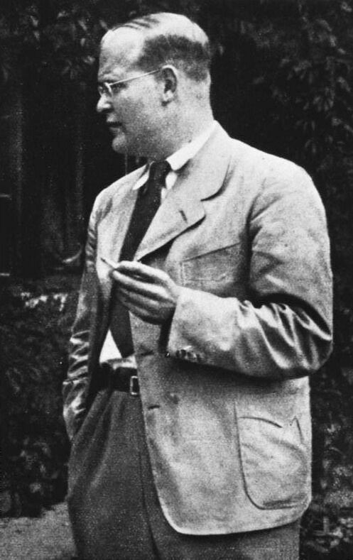

### Włochy

Rozpoczęła się bitwa o Bolonię.

### Egzekucja w KL Flossenbürg

W obozie koncentracyjnym we Flossenbürgu w Bawarii odbyła się egzekucja, której listę zabitych sporządził osobiście Adolf Hitler. Byli to jego osobiści więźniowie a wobec rychłej klęski i braku jakichkolwiek innych sukcesów jedyne co mogło mu sprawić radość to zabicie wrogów, których trzymał w niewoli. Przede wszystkim był to szef Abwehry admirał Wilhelm Canaris, oprócz niego zabici zostali generał Hans Oster oraz słynny teolog protestancki, urodzony we Wrocławiu Dietrich Bonhoeffer.

Bonhoeffer był szczególnym przypadkiem księdza, jednocześnie teologiem z ogromnym potencjałem i bardzo odważnym człowiekiem. Wiedząc jak niewielkie są szanse powodzenia i znając ryzyko, czynnie zaangażował się w walkę z hitleryzmem. Działanie w obliczu nieludzkiego reżimu było dla niego ludzkim i religijnym obowiązkiem.

Canaris dzień przed egzekucją przekazał wiadomość, że nie jest zdrajcą i działał z pobudek patriotycznych. Jak ktoś to ujął: "*wierzył w nazizm, ale nie w Hitlera*".

[115 lat temu urodził się pastor Dietrich Bonhoeffer](https://www.facebook.com/adam.ciucka/posts/4094531973903691): w czerwcu 1944 po uwięzieniu przez gestapo napisał wiersz (tłumaczenie: Jarek Kubacki i Łukasz Liniewicz)

>**Kim jestem** 
>
>Kim jestem? Mówią mi często, 
>że wychodzę ze swej celi, 
>opanowany, pogodny i mocny 
>jak możnowładca ze swojego zamku. 
>Kim jestem? Mówią mi często, 
>że rozmawiam ze swymi strażnikami 
>swobodnie, przyjacielsko i prosto, 
>jakby moja rzeczą było wydawać polecenia. 
>Kim jestem? Mówią mi też, 
>że znoszę dni nieszczęścia, 
>spokojny, uśmiechnięty i dumny, 
>jak ktoś, kto przywykł zwyciężać. 
>Czy jestem rzeczywiście tym, co inni o mnie mówią? 
>Czy może tylko tym, co sam o sobie wiem? 
>Niespokojny, stęskniony, chory jak ptak w klatce, 
>walczący o życiodajny oddech jakby mi ktoś ściskał gardło, 
>łaknący kolorów, kwiatów, głosu ptaków, 
>spragniony dobrego słowa, bliskości drugiego człowieka, 
>trzęsący się z gniewu na samowolę i najmniejszą zniewagę, 
>miotający się w oczekiwaniu na wielkie rzeczy, 
>bezsilnie drżąc o przyjaciół nieskończenie daleko, 
>zmęczony, zbyt pusty by się modlić, myśleć, tworzyć, 
>przytępiony i gotowy pożegnać się ze wszystkim? 
>Kim jestem? Tym czy tamtym? 
>Czy jestem dziś taki, a jutro zupełnie inny? 
>A może dwoma naraz? Wobec ludzi hipokrytą, 
>przed samym sobą tylko godnym pogardy biadolącym słabeuszem, 
>a może co we mnie jeszcze zostało jest niczym pokonana armia, 
>która chaotycznie cofa się przed już osiągniętym zwycięstwem? 
>Kim jestem? Kpią ze mnie zadawane w samotności pytania. 
>Kimkolwiek jestem – Ty mnie znasz, Twój jestem, Boże.

*Dietrich Bonhoeffer (1906-45). 
By Bundesarchiv, Bild 146-1987-074-16 / CC-BY-SA 3.0, [CC BY-SA 3.0 de](https://creativecommons.org/licenses/by-sa/3.0/de/deed.en), [Link](https://commons.wikimedia.org/w/index.php?curid=5483382)*

- TheUntoldPast ["The BRUTAL Execution Of Wilhelm Canaris - Hitler's Spymaster" [14:27]](https://www.youtube.com/watch?v=QVVO7qH-t-s)

### Georg Elser

Tego samego dnia w KL Dachau został zabity Georg Elser organizator zamachu na Hitlera w Bürgerbräukeller w Monachium.

FBTODO

### Me 262

Urodzony w Nysie fähnrich (stopień odpowiadający młodszemu sierżantowi) Hans Mutke pilotujący Me 262 eskadry szkoleniowej Ergänzungs-Jagdgeschwader 2 (EJG 2) wystartował z Fliegerhorst Lechfeld k Lagerlechfeld (Bawaria) i wzniósł się na 12 tys m. Była piękna pogoda, fantastyczne warunki do lotu, widzialność na 100 km.

Ponieważ został zaalarmowany o zbliżającym się P-51 Mustang mając pełną moc silnika zaczął leciec 40 stopni w dół. Twierdzi, że nagle jego samolot wpadł w wibracje, zaczął chybotać a prędkościomierz powietrzny utknął na 1100 km/h (maksymalna prędkość samolotu to 870 km/h). Pełną sterowność maszyny odzyskał dopiero po zmniejszeniu prędkości do ok 500 km/h.

Prędkość dźwięku na tej wysokości to 1062 km/h, co oznaczałoby że Mutke byłby pierwszym człowiekiem, który przekroczył barierę dżwięku. Mutke twierdzi zresztą, że nie zdawał sobie sprawy z tego co się działo, dopiero kiedy usłyszał jak opisuje to Chuck Yeager, pierwszy człowiek, który dokonał tego z całą pewnością w 1947, zrozumiał, że być może przypadkiem przydarzyło mu się cos badzo podobnego. Wiele wskazuje, że Mutke doświadczył efektów prędkości poddźwiękowej, czyli powyżej 0.8 Macha, których kilka zdarzyło się tej wojny, pierwszy taki wypadek miał miejsce już w 1942 i dotyczyło to Republic P-47 Thunderbolt, potem miały tego dokonać P-51 Mustang i Spitfire.

Istnieje również relacja, ale bez żadnych innych dowodów czy potwierdzeń, że pilot oblatywacz Heini Dittmar 6 lipca 1944 lecąc na samolocie rakietowym Me 163B Komet V18 osiągnął prędkość 1130 km/h i dało się słyszeć grzmot dźwiękowy.

Możliwe zresztą, że pierwszym człowiekiem, który przekroczył barierę dźwięku był pilot oblatywacz Lothar Sieber, który 1 marca 1945 dokonywał oblotu pionowzlotu rakietowego Bachem Ba 349 Natter. W 55 sekund wzniósł się na wysokość 14 km. Niestety zginął podczas tego lotu.

Rutynowo prędkość dźwięku przekraczały wszystkie rakiety V2 startujące od 1942, we wrześniu 1944 V2 podczas końcowej fazy loty przekraczały prędkość 4 Mach.

Anglicy w tym czasie rozwijali projekt odrzutowego samolotu nadźwiękowego Miles M.52, który w kwietniu 1945 osiągnął fazę testów na modelach. Na początku 1946 odgórnie go wygaszono.

- [Hans Guido Mutke](https://en.wikipedia.org/wiki/Hans_Guido_Mutke)

### Masakra w Celle

2862 więźniów obozu koncentracyjnego Drütte (filia KL Neuengamme) podczas ewakuacji, transportu do obozu Bergen-Belsen zgromadzono w mieście Celle (Dolna Saksonia). Kierowano ich do Bergen-Belsen. W Celle przyłączono ich do poprzedniego transportu więc łączna liczba więźniów przekroczyła 4 tys ludzi. Na węźle kolejowym obok wagonów z więźniami zatrzymał się wagon z cysternami i amunicją.

Nalot alianckich samolotów spowodował liczne eksplozje i zniszczenie części wagonów z więźniami. Wielu ludzi zginęło, pozostali zaczęli uciekać. Część zbiegła do miasta, częśc do pobliskiego lasu.

SS, Gestapo i cywile zaczęli obławę. 30 ludzi zostało rozstrzelanych na miejscu. Większość schwytanych zaprowadzono w marszu śmierci do Bergen-Belsen gdzie następnego dotarło tylko 487. Pięć dni później obóz został wyzwolony przez wojska brytyjskie i kanadyjskie. Reszta została zabita, lub zmarła w drodze z wycieńczenia.

12 kwietnia do Celle wkroczyli Brytyjczycy, po śledztwie dotyczącym obławy nazwanej przez miejscowych Hasenjagd (pl. polowanie na zające) uznano, że liczba ofiar tej obławy to 200 do 300 ludzi, reszta zmarła lub zginęła z innych przyczyn.

W grudniu 1947 za udział w masakrze skazano 7 osób, wszyscy zostali wypuszczeni za dobre sprawowanie w październiku 1952. Zbrodnia ta uzyskała osobliwą nazwę: "Celler Hasenjagd" polowanie na zające w Celle.

### Pancernik Admiral Scheer

Podczas bombardowania Kilonii zacumowany w zatoce pancernik typu Deutschland zwodowany w 1933 wWilhelmshaven - Admiral Scheer dostał bezpośrednio lub z bardzo niewielkiego dystansu kilkunastoma bombami sejsmicznymi Tallboy. Obrócił się dnem do góry i nie nadawał się do naprawy.

Częściowo został wyrabowany, usunięto cenniejsze części okrętu, ale cały kadłub pozostał na miejscu. Ponieważ zatoka została zasypana gruzami cały hitlerowski pancernik spoczywa obecnie pod parkiem miejskim.

- [Mark Felton Productions "The Buried Battleship!" [YT 8:36]](https://www.youtube.com/watch?v=d0lsdvdOdQs)

### Królewiec

Czwarty i ostatni dzień bitwy o Królewiec. Kiedy opór niemiecki załamał się komendant twierdzy generał Otto Lasch z własnej inicjatywy wysłał emisariuszy i o godz. 18.00 dotarli do linii sowieckich. Rozpoczęły się negocjacje. Do północy ustalono warunki kapitulacji i twierdza poddała się.

Gauleiter Koch ze swojej rezydencji w Neutief (obecnie Kosa, wschodnia część Bałtyjska) na Mierzei Wiślanej wysłał radiogram:
>Mein Fuhrer, dowódca Królewca generał Lasch, wykorzystał moją chwilową nieobecność w twierdzy, by tchórzliwie skapitulować. Ja walczę nadal w Sambii in na Mierzei Wiślanej.

Pom otrzymaniu tej wiadomości Hitler skazał generała Lascha na karę śmierci zaocznie, dla postrachu jego rodzinę uwięziono w obozie koncentracyjnym. Również sowieci skazali go na karę śmierci, ale tym razem za przedłużanie wojny. Wkrótce tę karę zamieniono na 25 lat gułagu. Został zwolniony do RFN w 1955.

### Wydawnictwa Szkolne i Pedagogiczne

Z inicjatywy Ministerstwa Oświaty powstają Wydawnictwa Szkolne i Pedagogiczne.

### 2 Armia WP

Dywizje piechoty 2 Armii LWP osiągnęły wyznaczony region ześrodkowania w rejonie Tomisławia i Osiecznicy. Oddziały pancerne wyruszyły później i tej nocy dotarły w rejon Bolesławca i Lubina. Sztab Armii ulokował się we wsi Jagodzin.

### Wrocław

Walki nie miały już takiego natężenia jak podczas dwóch pierwszych dni kwietnia, ale opis księdza Laßmanna nie pozostawia wątpliwości, że terror wojny nie zelżał:
8 kwietnia
>Wieczorem nieprzyjacielskie samoloty bombardują nas bombami fosforowymi. Trafione zostaje prawe boczne skrzydło naszego domu i od razu staje w płomieniach. Z sąsiedzką pomocą udało się nam jednak ugasić pożar, zanim mógł ogarnąć dom. Noc jest niespokojna i nie ma mowy o spaniu. Podrywamy się przy każdej kolejnej eksplozji w pobliżu. Nocne warty przeciwpożarowe stały się teraz koniecznością.

9 kwietnia "Bleib übrig!"
>Nie brakowało jednak i wesołych towarzyskich chwil, kiedy potrafiliśmy także śmiać się serdecznie. Utarła się wtedy na pożegnanie formułka: "Pozostań przy życiu!" Niejedna osoba, która się z nami tak żegnała, życie straciła.

Potwierdza to ksiądz Peikert pisząc w części notatnika pozbawionej daty, ale przed 26 kwietnia:
>Na Sępolnie żyliśmy pod ciągłą groźbą śmierci od tego dnia aż do; 8 maja, dnia zawieszenia broni. W mieście można było zawsze jeszcze znaleźć schronienie przed bombami w piwnicach starych solidnych gmachów. Na Sępolnie domy o lekkiej konstrukcji nie zapewniały najmniejszego bezpieczeństwa. Byliśmy wydani na łup niemal codziennych nalotów, tak więc nieustanna groźba śmierci, trwająca tygodnie godzina śmierci. Wieczorem między godz. 9 a 10 od rakiet świetlnych noc była jasna jak dzień. Niedługo potem pojawiały się ciężkie bombowce i zrzucały swój przerażający ładunek na pozycje stojącej w pogotowiu artylerii. Ludzie byli przeto stale przygotowani na najgorsze. Udając się do chorych z ostatnimi sakramentami, nie mogłem przejść ulicą. Ludzie cisnęli się do księdza i na kapłańskie serce spadła cała niedola ludzka. Bo każdy nalot pociągał z sobą liczne ofiary. Chodząc ulicami Sępolna, stale nosiłem ze sobą święconą wodę, czarną stułę i agendę, by zawsze być przygotowanym na poświęcenie zabitych, którzy stracili życie w czasie nalotów minionej nocy lub w ciągu dnia. Na podwórzach leżeli zabici owinięci w koce albo w trumnach, i spełniałem przy nich ostatnią posługę, nie bacząc na to, czy byli katolikami, protestantami, czy też apostatami.

W opowieści Hartunga następuje przerażający obraz jeszcze ocalałych ludzi, którzy jak ludzkie widma ograniczone do egzystencji wbrew okolicznościom nieustannie przenoszą się z jednej piwnicy do drugiej. Jest ich każdego dnia coraz mniej, a ci którzy pozostają coraz mniej posiadają. Wrocław komendanta Niehoffa, to miasto mordowanych, wygnańców i wyzutych z mienia. Oto mówiąc słowami Hitlera "wzór i przykład do naśladowania dla całego narodu niemieckiego":
8 kwietnia
>Ostatnimi czasy Rosjanie informują przez megafony, które rejony miasta zamierzają zaatakować nazajutrz. Zaraz potem zaczyna się żałosny korowód starców, chorych i kalek, dzieci i kobiet objuczonych plecakami i wózkami, w których od piwnicy do piwnicy transportują resztki swojego dobytku. Odkąd nad zachodnią i południową częścią miasta nieustannie unoszą się pióropusze dymu i ognia, ludzie najczęściej starają się przedostać do Karłowic, Szczytników i Sępolna.

9 kwietnia:
>Wielkie pożary wybuchły także po przeciwległej stronie placu (św. Macieja). Blask ognia i rakiet sprawił, że noc była jasna jak dzień. Rosjanie zasypywali ogniska pożarów kolejnymi bombami, a "maszyny do szycia" niczym natrętne owady krążyły coraz niżej, stebnując seriami z karabinów ulice i place oraz nocne transporty zaopatrzeniowe, kolumny ciężarówek zaopatrzeniowych i zaprzęgów konnych.

Na froncie zachodnim kończą się zażarte walki o Lasek Dębowy, który w ostatnich dniach wielokrotnie przechodził z rąk do rąk, odbyła się tam bitwa pancerna, teraz jest pod kontrolą Armii Czerwonej. Niemcom nie udało się go odbić. Sowieci doszli do nasypu kolejowego.
