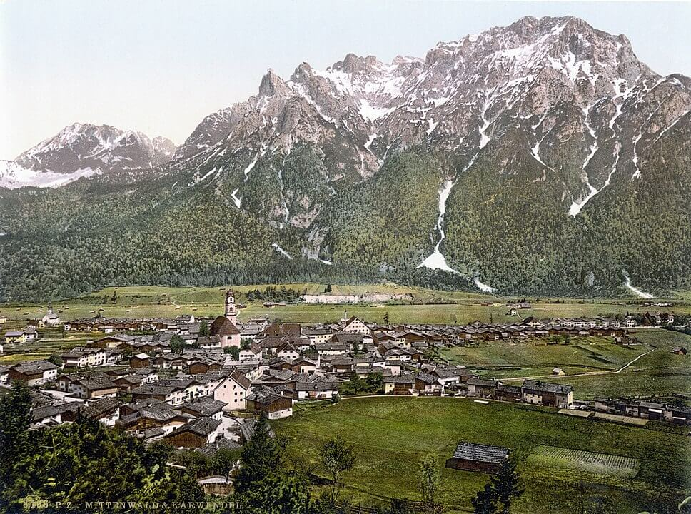

### Fejzi Alizoti

Fejzi Alizoti został dziś rozstrzelany na przedmieściach Tirany. W listopadzie 1944 został aresztowany przez władze komunistyczne pod zarzutem kolaboracji z okupantem, a po trwającym kilka miesięcy procesie skazany na śmierć i konfiskatę majątku.

Był starej daty politykiem albańskim pamiętającym jeszcze czasy Imperium Otomańskiego, w 1891 ukończył szkołę dla urzędników w Stambule. W okresie międzywojennym parlamentarzysta, dwukrotnie minister finansów. 16 maja 1943 stanął na czele kolaboracyjnego quasi-parlamentu: Najwyższej Faszystowskiej Rady Korporacyjnej (alb. Këshilli i Epërm Korporativ Fashist).

### Maurice Sachs

Podczas marszu śmierci zastrzelony został Maurice Sachs francuski pisarz pochodzenia żydowskiego. Był wielkim oryginałem. W 1925 dokonał konwersji na katolicyzm, nawet chciał zostać księdzem ale przeszkodził mu w tym temperament i homoseksualizm.

Jakiś czas handlował sztuką w Nowym Jorku, potem w Paryżu był w kręgu znajomych Jean Cocteau i Coco Chanel, cały czas prowadząc podejrzane interesy i oszustwa. Kiedy wybuchła wojna nie został wcielony ze względu na homoseksualizm. Podczas okupacji zarabiał na Żydach uciekających do Vichy i jednocześnie pracował dla Gestapo.

Został uwięziony w Fuhlsbüttel (Hamburg). Trzy dni temu zarządzono ewakuacje więzienia. Maurice znany z pogardy dla żydowskich ofiar hitleryzmu nie mogąc już iść dalej, sam nią pozostał.

### U 1206

Dla ułatwienia życia na niemieckich okrętach podwodnych pod koniec wojny zaczęto instalować istotną nowość - toalety hydrauliczne, których można było używać także pod wodą. Ponieważ były bardzo skomplikowane, do obsługi był wyznaczony specjalny marynarz nazywany Scheissemannem.

Taka toaleta znajdowała się m in na U 1206 (Typ VII C), który w swój dziewiczy rejs wyruszył 16 marcu 1944. Od 1 lutego pełni służbę jako jednostka bojowa w 11 Flotylli. Dzisiaj jest na Morzu Północnym u wybrzeży Szkocji.

Chcący skorzystać z toalety kapitan Karl-Adolf Schlitt odprawia Scheissemanna twierdząc, że doskonale zna obsługę toalety.

Niestety popełnił błąd, Okręt był w zanurzeniu i do środka zaczęła wpływać woda morska, która zalała przedział dziobowy, niosąc ze sobą zawartość toalety. Zalała akumulatory i zaczął wydobywać się z nich chlor. Okręt musiał wynurzyć się w biały dzień na obcych wodach. Dostrzegły ich brytyjskie samoloty i zbombardowały.

W tej sytuacji dzielny kapitan rozkazał zatopić okręt i na szalupach dostać się na brzeg, trzech marynarzy zatonęło, reszta dostała się do niewoli.

### Reichsbank

Druga z trzech ewakuacji Banku Rzeszy.

Dzisiaj ze stacji stacji kolejowych Berlin-Michendorf i Berlin-Lichterfelde-West odjechały na południe dwa pociągi specjalne Orzeł (niem. Adler) i Kawka (niem Dohle). Berlin i wszystko co się w nim znajdowało było nieustannie bombardowane. Chaos panował na całej trasie i nie było bezpiecznego środka komunikacji. Droga na południe do Monachium zajęła dwa tygodnie, w tym czasie zza Odry ruszyła sowiecka ofensywa i dotarła do Berlina. Może właśnie temu, że alianci zachodni przestali się pokazywać nad Berlinem a sowieci zajęli się ofensywą berlińską w ogóle można zawdzięczać fakt, że z ogromnym opóźnieniem i wieloma przygodami po drodze oba pociągi dotarły do celu. Jeden z nich przejechał przez Czechy i Austrię. Przewoziły pieniądze: marki niemieckie warte 209 mln dolarów i 146 worków z dewizami.

Pierwotnym celem był tzw bunkier Bormanna w Monachium (może chodzić o Obersalzberg), ale dowodzący akcją generał SS nie zgodził się na to, zamiast tego transport skierowano do kopalni ołowiu Pleissenbergu - 80 km od Monachium. Kiedy tam dotarli okazało się, że z powodu nalotów jest już zalana i nie nadaje się na przechowanie skarbu. W pobliskim Mittenwald znajdowała się Szkoła Strzelców Alpejskich (niem. Gebirgsjägerschule). Odpowiedzialnym za ukrycie skarbu w pobliskich górach został pułkownik Franz Pfeiffer. Kiedy razem ze swoimi żołnierzami wykonał zadanie dostał rozkaz by część natychmiast odzyskać i przekazać na potrzeby bieżącej walki. Wyruszyli znowu w góry przy okazji resztę ukrywając w jeszcze innym miejscu. Na miejscu pozostał kapitan Neuhauser obserwując wszystkie kryjówki.

Kiedy w okolicy pojawili się Amerykanie wiedzieli, że gdzieś w górach ukryty jest skarb Reichsbanku. Ale nie wiedzieli jak go znaleźć, głównie dlatego, że główny organizator akcji pułkownik Pfeiffer ukrył się u swoich znajomych von Blücherów w górskim kurorcie Garmisch-Partenkirchen. Kiedy razem postanowili odzyskać skarb i przewieźć go do bezpiecznej Szwajcarii sprawa się wydała i większość skarbu została odzyskana głównie dlatego, że sam pułkownik Pfeiffer w czerwcu 1945 zgłosił się do Amerykanów i ujawnił wszystkie znane sobie skrytki.

Ale czy na pewno wszystkie? Po przeliczeniu wszystkiego okazało się, że brakuje 17 worków z dewizami i 5 skrzynek ze sztabkami złota. Do dzisiaj jest wiele przypuszczeń co do dalszych losów brakującej części skarbu, ciągle w okolicy pojawiają się poszukiwacze.

*Mittenwalde ok 1900 
By nieznany - Ten image pochodzący z zasobów [Biblioteki Kongresu Stanów Zjednoczonych](https://commons.wikimedia.org/wiki/Library_of_Congress" title="Library of Congress), oddziału Prints and Photographs division jest dostępny pod numerem [ppmsca.01177](http://hdl.loc.gov/loc.pnp/ppmsca.01177).Ten szablon nie wskazuje stanu prawnego pliku. Standardowy szablon licencji jest nadal wymagany. Aby dowiedzieć się więcej zajrzyj na stronę [Commons:Licencja](https://commons.wikimedia.org/wiki/Commons:Licencja)., Domena publiczna, [Link](https://commons.wikimedia.org/w/index.php?curid=232960)*

### Wrocław

Laßmann:
>Sobota, 14 kwietnia 1945 r. 
>Dzisiaj generał Niehoff przeniósł swoją kwaterę dowodzenia z Liebichshohe na Wyspę Piaskową do piwnic Biblioteki Uniwersyteckiej, która z miejsca staje się ulubionym celem rosyjskich lotników, Do schronu piwnicznego przy pl. Katedralnym 6, w którym mieszkaliśmy do czasu wielkiego pożaru wielkanocnego, wprowadzają się czołgiści i łącznościowcy.

Czyli wiedza o lokalizacji sztabu była powszechna, a miejsce znane było także Armii Czerwonej. Czy może Laßmann dokonał tak znaczącej redakcji tekstu, że późniejszą wiedzą obdarzył wszystkowiedzącego obiektywnego narratora?
Zastanawiają ci czołgiści, pojazdów pancernych było niewiele i pełniły rolę "straży pożarnej" na froncie. W tym czasie miały miejsce starcia pancerne po obu stronach nasypu kolejowego Popowice / Szczepin. Z pewnością załogi nie były ulokowane daleko od miejsca walk.

Więcej o nowej siedzibie sztabu: [Klasztor asugustianów](/festung-breslau/article/klasztor-augustianow)

Hartung, który cieszy się, że dostał spokojną tyłową służbę:
>Czasami z pokoju dowódcy słyszę radiową muzykę. Z biblioteki seminaryjnej pożyczyłem "Zielonego Henryka" Gottfrieda Kellera, którego sobie ukradkiem podczytuję między telefonami i meldunkami. Dzięki temu udaje mi się uciec myślami daleko od upiornej rzeczywistości.
