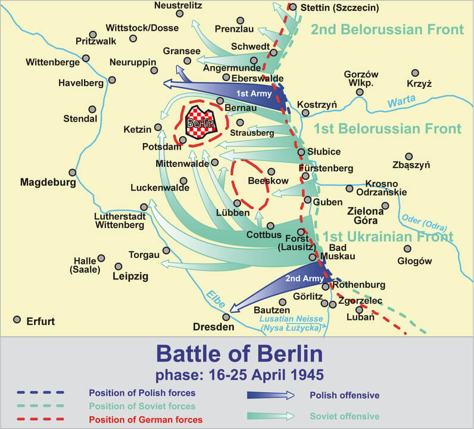

### Kapitulacja Grupy Armii B / Zagłębie Ruhry

17 kwietnia otoczona w Zagłębiu Ruhry Grupa Armii "B" feldmarszałka Walthera Modela skapitulowała. Do niewoli dostało się 300 tysięcy żołnierzy Wehrmachtu.

Model był dowódcą znanym z samodzielności, popularnym wśród żołnierzy. Z powodu otrzymywania trudnych misji nazywany czasem "strażakiem Hitlera", nie był politycznie zaangażowany i od dawna był świadomy, że wojna jest przegrana (jak to ujął albo zdobędziemy Moskwę do Bożego Narodzenia, albo w ogóle), wiedział o zbrodniach nazistowskich, ale traktował je z obojętnością.

Kilka dni po kapitulacji, 21 kwietnia, nie chcąc stanąć przed alianckim sądem zastrzelił się w lesie w pobliżu Duisburga.

### Hitler

Państwo niemieckie już nie istniało. Tę przerażającą prawdę zrozumiał generał Heinrici na naradzie w bunkrze Hitlera. Kiedy zażądał wzmocnienia frontu odrzańskiego obecni tam funkcjonariusze zaczęli się licytować w liczbie żołnierzy, których mogą posłać na śmierć, jak pisze Cornelius Ryan:
>Zaofiarowali niewyszkolone, bez wyposażenia, niezdolne do walki oddziały z własnych prywatnych imperiów, płacąc życiem zamiast pieniędzy na tym swego rodzaju upiornym przetargu. Licytowali się nie po to żeby uratować Niemcy, ale żeby zrobić wrażenie na Hitlerze

Rzeczywiście, to co było niegdyś jednym z najpotężniejszych państw na świecie zniszczyła wojna, a resztki zostały rozdarte i zawłaszczone przez potężnych bonzów partyjnych mających własne służby, pałace pełne nakradzionych dóbr i przede wszystkim tak cenne w krytycznej chwili zasoby: łączność, transport i paliwo. Przestała działać poczta, z ulic zniknęła policja. Wciąż działały służby miejskie, banki i sklepy, ale to odbywało się już tylko siłą rozpędu. Żyły wciąż poszczególne komórki tego organizmu, ale zawłaszczone przez Partię państwo już od dawna nie było przez nikogo kierowane. Organy decyzyjne nie pełniły swoich funkcji. Najważniejsi ludzie w państwie potajemnie i w panice zaczęli realizować swoje sekretne przygotowywane od miesięcy plany ewakuacji, ratunku siebie, swoich rodzin i majątków.

### Operacja berlińska

Bunkier Hitlera był oderwaną od życia psychodeliczną Czerwoną Królową zajętą przemieszczaniem urojonych wojsk po wytartej od potu mapie. Urzędnicy niższego szczebla wciąż realizowali plany i procedury powstałe w zupełnie innej sytuacji. Z Berlina ewakuowano ministerstwa i zasoby państwowe, ale tylko jeżeli były jeszcze ciężarówki i było jeszcze do nich paliwo. Chaos zapanował w gabinetach Berlina, a od dziś zaczął władać berlińską ulicą. Piekło wojny dotarło do stolicy Rzeszy. Ofensywa poprzedniego dnia nie została usłyszana w Berlinie, było to za daleko i Berlin wtedy jeszcze spał. Ale bardzo dobrze została usłyszana w przygranicznych miasteczkach. Przerażeni funkcjonariusze Partii i urzędnicy zaczęli dzwonić do Berlina z prośbą o polecenia, posiłki, wsparcie. Pierwsze o ofensywie dowiedziały się berlińskie telefonistki z porannej zmiany - "*Zaczęło się!*" - i już za chwilę wiedzieli o tym wszyscy w mieście. "*Zaczęło się!*". O godzinie 8 rano podano przez radio:
>na froncie nad Odrą trwają ciężkie ataki rosyjskie

Ofiary, które otrzymał w bunkrze Hitlera generał Heinrici były bez znaczenia. To było tylko daremne poświęcenie ludzkiego życia. Dywizja spadochronowa Göringa, z której był tak dumny składała się z ludzi, którzy nigdy nie widzieli walki, służyli w kwatermistrzostwie. Spieszeni lotnicy i mechanicy nie wiedzieli nic o wojnie w okopach. Tysiące marynarzy miało walczyć bronią, której obsługi ich nie nauczono. Wielu z nich tej broni w ogóle nie dostało. Heinrici z wściekłością odmówił wzmocnienia swojej armii dziećmi z Hitlerjugend, ale kilkuset chłopców już było w okopach i rozjechały ich czołgi, bo nie dotarł do nich rozkaz że mają się wycofać do Berlina. Przestała działać łączność.

Mgła wojny i groza dni ostatnich jak przekleństwo rzucone przez Stalina napłynęły znad Odry. Na początku kwietnia odebrano generałowi Heinriciemu siedem niesłychanie cennych dywizji pancernych, wysyłając je na południe pod dowództwo feldmarszałka Schörnera "bo tam zostanie skierowany atak Iwana". W tej sytuacji on sam pozbawił wszystkich pojazdów bojowych dowódcę Grupy Armii Północ Manteuffla, teraz już generała wojsk pancernych bez jednego czołgu. Berlin błagał go o jakąkolwiek pomoc.

"*Czy nie widzicie, że robię wszystko żeby trzymać wojnę jak najdalej od Berlina?*" - Heinrici nie mógł wprowadzić swoich czołgów do miasta gdzie straciłyby wartość bojową, ale przede wszystkim nie mógł pozwolić by Berlin stał się drugim Stalingradem.
"*Nie spodziewajcie się nas*"" - wyjaśnił pułkownik Artur Hõlz, szef sztabu generała Bussego dowódcy niemieckiej Dziewiątej Armii - "*Dziewiąta Armia stoi i będzie stać nad Odrą, a gdy zajdzie potrzeba polegniemy tam, ale się nie cofniemy*".

I tak się stało. Heinrici dokładnie przewidział kiedy nastąpi atak Żukowa i wprowadził w życie plan opracowany na potrzeby operacji styczniowej przez generała Xylandera Schlittenfahrt (jazda saniami) polegający na wycofaniu się w momencie ataku na drugą, właściwą linię obrony. Xylander przewidywał natychmiastowy powrót na pierwszą linię, przynajmniej na niektórych odcinkach, ale Heinrici wiedział, że zostanie w całości zniszczona. Obronę ulokował tylko w jednym miejscu, na Wzgórzach Seelow. Udało mu się tam zatrzymać nacierające siły sowieckie. Jak relacjonował generał Popiel, marszałek Żukow dał wyraz swojej wściekłości "*w potoku szczególnie mocnych słów*" i rozkazał rzucić do walki trzymane w zapasie armie pancerne, które miały wejść do akcji dopiero po zdobyciu wzgórz oraz natychmiast zbombardować wzgórza czym się dało, miał do dyspozycji całą flotę bombowców i samolotów szturmowych.

Od rana trwało intensywne przygotowanie artyleryjskie. 800 samolotów bombardowało pozycje nieprzyjaciela. W zmasowanym ataku oddziały Armii Czerwonej przemieszały się, na wąskim odcinku nacierały 2 Armia Pancerna Gwardii i 5 Armia Uderzeniowa. Wszyscy wiedzieli, że Seelow jest ostatnią pozycją obrony na drodze do Berlina. Do zmroku czerwonoarmiści atakując fala za falą uzyskali przełamanie drugiej linii obrony, kosztem ogromnych strat w ludziach udało się wyrwać Niemcom kolejne 8 km terenu.

### Leonidas-Staffel

Samobójcze ataki najbardziej kojarzone są z japońskimi kamikaze, ale wśród Niemców ta idea też była popularna. Najważniejszą promotorką była Hanna Reitsch. W opozycji do niej był Hayo Hermann, który proponował równiez niebywale ryzykowną, ale dająca szansę przeżycia taktykę taranowania. Niemcy dla misji samobójczych lub prawie samobójczych uzywali określenia Total-Einsatz.

Jeszcze bardziej sceptyczny był Werner Baumbach, dowódca kluczowej w rozwoju nowych broni jednostki KG-200, który w ogóle uważał tego typu ataki za bezsensowną stratę życia i zasobów. Udało mu się przeforsować ideę samolotów hybrydowych, czyli dwóch samolotów połączonych w układzie bombowiec-myśliwiec. Całością kieruje pilot z myśliwca, który tuż przed uderzeniem w cel odłącza się od zestawu i wraca. Natomiast bombowiec staje się bombą. Próbowano różnych rozwiązań, ostatecznie za najlepsze uznano połączenie Ju 88 i Focke-Wulf Fw 190.

5 eskadra Kampfgeschwader 200 jednostki specjalnej Luftwaffe znana była jako "eskadra Leonidas" przeprowadziła tylko jedną operację Selbstopfereinsätze w dniach 17-20 kwietnia mająca na celu zatrzymanie Armii Czerwonej przez zniszczenie wszystkich przepraw na Odrze. To były ataki samobójcze przy użyciu czego się dało. 35 pilotów zginęło. Skutek był odległy od zamierzonego. Most jest najtrudniejszym celem. Z całą pewnością zniszczono jeden most - w Kostrzynie nad Odrą. Już 20 kwietnia sowieci zdobyli Jüterbog gdzie znajdowało się lotnisko macierzyste jednostki.

- [Mark Felton Productions "German Kamikazes - The Leonidas Squadron" [YT 10:55]](https://www.youtube.com/watch?v=D1aYEoqQgCY)

### 1 Armia WP

Dziś do ofensywy została dołączona 1 Armia WP, z przyczółka zaatakowała siłą 4 dywizji (1, 2, 3, 6 DP) i na swoim odcinku uzyskała 8 km.

- [Mark Felton Productions "Battle of the Seelow Heights 1945" [YT 11:48]](https://www.youtube.com/watch?v=aigpXmWSWxM)
- [ProjektErinnerung 1939-1945 "P:E Schlacht um Seelow/ battle of Seelow 1945" [YT 4:23]](https://www.youtube.com/watch?v=nbIjiFBHfX4)

### 1 Front Ukraiński

Pomiędzy dwiema wielkimi, europejskimi rzekami Odrą i Łabą płynie ku północy Szprewa. Jest to ważna oś geograficzna bo przepływa przed obie łużyckie stolice, najpierw stolicę Łużyc Górnych Bautzen (pl. Budziszyn), a potem przez stolicę Łużyc Dolnych Cottbus (pl. Chociebuż). Na końcu zaś w rejonie Berlina Szprewa wpływa do Haweli, która potem jeszcze w Brandenburgii wpływa do Łaby, wielkiej rzeki z przygodami zaczynającej się pod Łabskim Szczytem (stąd nazwa), potem na północ od Pragi odbierającej Wełtawę i po przecięciu gór płynącej przez Saksonię (Pirna, Drezno, Miśnia, Torgau) ostatecznie zaś wpływającej do Morza Północnego w Hamburgu.

*Operacja berlińska, pierwsze dni, niebieskimi strzałkami zaznaczone kierunki natarcia i planowany cel obu polskich Armii. 
Von [Lonio17](https://commons.wikimedia.org/wiki/User:Lonio17) / [Orionist](https://commons.wikimedia.org/wiki/User:Orionist) - Eigenes Werk based on: [File:Operacja berlin 1 1945.png](https://commons.wikimedia.org/wiki/File:Operacja_berlin_1_1945.png), in turn based on: Praca zbiorowa Boje Polskie 1939-1945 Przewodnik Encyklopedyczny, Bellona, Warszawa 2009, [CC BY-SA 4.0](https://creativecommons.org/licenses/by-sa/4.0), [Link](https://commons.wikimedia.org/w/index.php?curid=18335618)*

Dziś do Szprewy dotarły wojska 1 Frontu Ukraińskiego. Przekroczyły rzekę w okolicy miasteczka Spremberg - leżącego dokładnie na zachód od Bad Muskau i 15 km na południe od Cottbus. Uzyskano przełamanie drugiej linii obrony i siły sowieckie zaczęły się wlewać na zachód. W ten sposób Koniew miał dostęp do dróg biegnących na Berlin. Zaraz po tym jak Amerykanie zrezygnowali z marszu na Berlin, Koniew dostał własną autostradę do Berlina.

Wieczorem 17 kwietnia, po dokładnym rozważeniu co ma do powiedzenia zadzwonił do Stalina i przedstawił mu dokładnie sytuację, mówiąc że czołówka jego sił znajduje się 60 km na zachód od Cottbus (czyli dokładnie na południe i niecałe 100 km od Berlina). Stalin mówiąc iż u Żukowa ciężko, zaproponował przemieszczenie sił Frontu Białoruskiego przeprawami Koniewa, na co ten odrzekł że zabierze to zbyt wiele czasu, oraz - co najważniejsze - sam ma dość sił by zaatakować Berlin. Zaproponował atak na Zossen. Stalin zapytał "*czy wiecie, że w Zossen znajduje się kwatera główna hitlerowskiego Sztabu Generalnego?*". Koniew odrzekł, że wie. Ale z Zossen był związany jeszcze jeden fakt, o którym nie wspomniał ani Koniew, ani Stalin. Było to bowiem zbyt oczywiste. Z miasteczka wybiegały cztery drogi wyjazdowe, na wschód, południe, zachód i północ, najkrótsza była ta północna, miała tylko 17 km i kończyła się na rogatkach Berlina. Marszałek Koniew w ten sposób otrzymał pozwolenie na atak na Berlin:
>Bardzo dobrze, Zgadzam się. Skierujcie swoje armie pancerne na Berlin

O tej decyzji marszałek Żukow dowiedział się bezpośrednio od Stalina. Wpadł we wściekłość.

### 2 Armia WP

2 Armia WP pod dowództwem nieszczęsnego generała Świerczewskiego rusza do walki. Zaczyna się dla niej operacja łużycka zakończona jej zagładą pod Budziszynem. Atakują z okolic Bielawy Dolnej i wdzierają się na teren nieprzyjaciela w Rothenburgu kilka km. Daje o sobie znak niedostatek komendy i brak zgrania pomiędzy jednostkami.

### Austriacka Partia Ludowa

Powstaje Austriacka Partia Ludowa (niem. Österreichische Volkspartei, ÖVP) - chadecja. Z partii wywodziło się 6 kanclerzy, a także prezydenci Kurt Waldheim i Thomas Klestil. Wywodzi się z działającej do 1934 Partii Chrześcijańsko-Społecznej (niem. Christlichsoziale Partei Österreichs, CS) założonej w 1893 przez Karla Luegera. Polityka, nawiasem mówiąc dość dziś kontrowersyjnego bo łączył aktywne polityczne chrześcijaństwo z antysemicką legislacją i propagandą. Lueger był wzorcem dla Adolfa Hitlera.

### Operacja Hannibal

Rocznica zatopienia Titanica nikogo w Niemczech nie obeszła. W warunkach wojennych nikt nie miał głowy do rozpamiętywania śmierci 1500 ludzi.

- 30 stycznia 1945 na Bałtyku w wyniku ataku okrętu podwodnego S-13 został zatopiony MS Gustloff i zginęło prawie 10 tys ludzi.
- 11 lutego ten sam S-13 zatopił MS Steuben, zginęło 5 tys ludzi.
- 13 marca parowiec SS Karlsruhe zatopiony przez sowieckie samoloty torpedowe, 1 tysiąc ofiar.
- 16 kwietnia torpedy wystrzelone przez podwodny stawiacz min L-3 zatopiły MS Goya, zginęło 6 tys ludzi.

Łącznie w tych atakach zginęło 22 tysięcy ludzi, czyli czternaście razy tyle co na Titanicu. Takie było oblicze całkowicie zapomnianej wojny na Bałtyku.

### UPA

Daleko za linią frontu, na tyłach trwała podstępna, skomplikowana wojna. 17 kwietnia 1945 oddział UPA dokonał masakry polskiej ludności w odległej o 30 km wsi Wiązownica (koło Jarosławia). Szybko zareagowała polska samoobrona wypierając wroga. Zginęło ok 100 Polaków i kilkunastu napastników. Atak UPA był zapewne odpowiedzią na zamordowanie 31 marca przez samoobronę wsi 10 bezbronnych Ukraińców, głównie kobiet i dzieci. Ta z kolei zbrodnia też była odpowiedzią - na zabicie Polaka.

Dziwnie pasuje tu meldunek ze wzgórz Seelow - "*Nie wiem jak długo to może potrwać*".

### Holandia

Wprawdzie rozkaz Nerona nie został wprowadzony w życie, to jednak w pewnej mierze Niemcom udawało sie wprowadzić taktykę spalonej ziemi, szczególnie na obcych terytoriach. Najbardziej znanym przykładem takiego sabotażu było zniszczenie urządzeń melioracyjnych na Błotach Pontyjskich w maju 1944. Podobnej rzeczy usiłowali dokonać w Holandii, od dawna usiłowali wydrążyć w zaporze Wieringermeer otwory na ładunki wybuchowe, ale zatrudnieni przy tym miejscowi z oczywistych powodów nie pracowali wydajnie. W końcu ściągnęli ich pod bronią i zmusili do dokończenia pracy. Eksplozja była dość ograniczona i polder tonął powoli. Nie było ofiar w ludziach. Dość szybko udało się przywrócić pierwotny stan, bo polder zalała słodka woda.

### Wrocław

Wojna we Wrocławiu osiągnęła kolejny stopień desperacji, jak relacjonuje Ernst Horning:
>Dnia 16 kwietnia ogłoszono apel do wszystkich dziewcząt i kobiet w wieku od szesnastu do trzydziestu pięciu lat, aby dobrowolnie meldowały się na służbę do Wehrmachtu w celu zastąpienia udających się na front mężczyzn, wykonujących dotąd pracę biurową lub odbywających służbę w zaopatrzeniu. W krótkim czasie widok tych pomocnic w mundurach Wehrmachtu stał się czymś powszechnym. Alfons Buchholz zauważa: "To sprowadza kolejne cierpienia na rodziny, które muszą się martwić już nie tylko o zagrożonych synów na polach bitewnych, ale także o córki w twierdzy. Droga na posterunek znajduje się bowiem często pod ostrzałem.

Hartung:
>Na naszym północnym froncie panuje obecnie prawie zupełny spokój. Odbieram tylko telefoniczne meldunki o małych incydentach z udziałem patroli zwiadowczych, podczas których albo nasi ludzie przeprawiają się na drugi brzeg Widawy, albo wrogowie pojawiają się po naszej stronie. Poruszenie nastaje gdy nasi zestrzeliwują karabinem jedną ze znienawidzonych sowieckich "maszyn do szycia". Obaj piloci, widać, że dobrze odżywieni i pyzaci Rosjanie zostają przyprowadzenie do biura szefa. Potem widzę ich jak siedząc w ogrodzie, obojętnie ćmią papierosy. Dobrze wiedzą, że ich niewola nie potrwa długo.

W relacjach z Wrocławia z tego dnia nie widać żadnej świadomości, że zaczęła się ofensywa berlińska. Niemożliwe, żeby to nikogo nie obchodziło. Miało to ogromne znaczenie dla trwania obrony, która miała przecież na celu doczekanie na pomoc z zewnątrz. Atak na Berlin ostatecznie taką pomoc uniemożliwiał.

