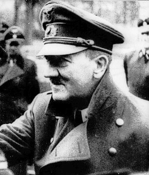

### Bombardowanie Berlina

Amerykanie urządzili urodzinowe bombardowanie Berlina. I jednocześnie pożegnalne. Własnie oddali miasto Iwanowi, odtąd loty nad Berlin będą obciążone zbyt dużym ryzykiem starcia, którego nikt nie chce.

### Urodziny Hitlera

W artykule [Państwo hitlerowskie](/festung-breslau/article//panstwo-hitlerowskie) opisywałem rok ceremonialny hitlerowskiech Niemiec, rytualny patos partyjnych i państwowych świąt nasyconych treściami ideologicznymi. Do końca wojny będą jeszcze dwa takie święta: pierwszomajowe z oczywistych powodów nie zaistnieje. Natomiast dziś jest ostatnie, ostatnie, naprawdę ostatnie nazistowskie święto - urodziny Hitlera (niem. Führergeburtstag). Najhuczniej świętowane były 50 urodziny - 20 kwietnia 1939 z uroczystą paradą w Berlinie i fetą w całym państwie. Było to święto flag, składania życzeń Führerowi i deklaracji partyjnych oraz narodowych. w ten dzień chłopcy licznie zapisywali się do Hitlerjugend, a niemieckie rodziny dostawały dodatkowe racje wojenne.

Dziś są 56 urodziny Hitlera, nikt nie ma wątpliwości, że ostatnie. Od kilku lat dostęp do Hitlera jest ściśle regulowany, brak jest wystąpień publicznych. Wszyscy, którzy go widzieli po zamachu 20 lipca 1944 po kilkuletniej przerwie mówili to samo: od zwycięstwa we Francji do zamachu niebywale się postarzał. Sam zamach przeżył właściwie bez szwanku, ale fala uderzeniowa poczyniła szkody w jego organiźmie. Niezdrowy tryb życia, oddanie się felczerowi (Morell to był raczej dr Feelgood, niż prawdziwy lekarz) i niebywały wręcz stres wojenny odcisnęły swoje piętno. Hitler był 56-letnim wrakiem człowieka. Nie panował nad lewą reką, która cały czas drżała i dlatego trzymał ją sztywno przy ciele, skurczył się i zgarbił.

Dzisiaj propaganda usiłuje robić swoje, ale są to już frazesy w które nikt nie wierzy. Niemcy dostają przydziałową marmoladę i butelkę wina, ostatni gest III Rzeszy, ale to już jest koniec i nawet w bunkrze Hitlera nie ma co do tego złudzeń. Ostatnim podrygiem nadziei była śmierć Roosevelta. Ale trzy dni po tym jak ta nowina dotarła do bunkra zaatakował Iwan. Do bunkra napływały życzenia urodzinowe głównie od najważniejszych bonzów partyjnych ale także od Mussoliniego. Odbyła się skromna i ostatnia uroczystość na zewnątrz upamiętniona przez kamerę filmową. Jest to ostatni film z Hitlerem. Widać jak usiłuje ukryć trzęsącą się dłoń. Na tyłach Nowej Kancelarii Rzeszy znaleziono teren jeszcze nie zryty bombami i pod murem ustawiono wybranych przez szefa Hitlerjugend Arthura Axmanna kilkunastu gierojów nazistowskiego oporu, chłopców, którzy odznaczyli się zniszczeniem sowieckich czołgów. Najmłodszym z nich jest 12-letni wówczas Alfred Czech. Był tam też znany z Lubania 16-latek Wilhelm "Willi" Hübner. Obaj chłopcy przeżyli wojnę i umarli w latach 2010-11. Axmann pojmany w Lubece jako nazista dostał przysłowiowe trzy lata jak dla brata, nie został uznany za zbrodniarza wojennego i również dożył słusznych lat umierając dopiero w 1996. Hitler będzie żył jeszcze 10 dni.

Po rozdaniu Żelaznych Krzyży, zdawkowych życzeniach i uściśnięciu ręki Hitler ponownie schronił się w czeluściach bunkra, z których już nie wyszedł. W bunkrze zaś wieczorem odbyła się skromna, groteskowa uroczystość w niewielkim gronie najbardziej zaufanych osób zorganizowana przez Evę Braun. Szampan, muzyka i tańce. Do dziś nikt jeszcze nie znał odpowiedzi na pytanie czy Hitler planuje ucieczkę, czy pozostanie w bunkrze do końca.

Jutro przedostatnia szansa na ucieczkę.

- [The Bunker Boys - Hitler's Child Soldiers, Berlin 1945 "The Bunker Boys - Hitler's Child Soldiers, Berlin 1945" [YT 11:16]](https://www.youtube.com/watch?v=OqFhvKarYjU)

*Hitler na ostatnim filmie, 20 kwietnia 1945. 
By Source, [Fair use](https://en.wikipedia.org/wiki/File:Hitler_20_April_1945.jpg), [Link](https://en.wikipedia.org/w/index.php?curid=46200095)*

### Berlin

Z okazji urodzin Hitlera a murach Berlina pojawiły się okolicznościowe banery:
>Unsere Mauern Brachen, Aber Unsere Herzen Nicht

Zamknięto dopływ wody do berlińskiego ZOO.

### Herbert Lange

FBTODO

- [Herbert Lange](https://pl.wikipedia.org/wiki/Herbert_Lange)

### Samobójstwa hitlerowców

Hitlerowiec się zabija: Erwin Bumke prezes Sądu Najwyższego (niem. Reichsgericht) w Lipsku. Usłużny hitlerowcom prawnik wysokiej rangi. Gorliwie brał udział w dopasowaniu prawa do potrzeb NSDAP, np w związku z ustawami norymberskimi czy Akcją T4. W RFN dotknięty damnatio memoriae. Dwa dni po wkroczeniu Amerykanów do Lipska. Miał dwóch synów, obaj zginęli na wojnie.

Lipsk ma dobry rezultat, to już w sumie dziewiąte samobójstwo hitlerowskie z tego miasta znane z imienia i nazwiska.

### 1 Front Ukraiński

Wieczorem 20 kwietnia marszałek Iwan Koniew, dowódca 1 Frontu Ukraińskiego wpatrywał się w swój wymarzony cel. Teraz jeszcze na mapie. Już wkrótce będą tam jego ludzie. I on, marszałek Koniew w Berlinie. Deszcz orderów zaszczytów i między nimi wszystkimi ten najcenniejszy - triumf zdobywcy Berlina. Wszystko było gotowe. Zadzwonił do swojego najlepszego dowódcy:
>Pawle Siemionowiczu, nie martwcie się, nacierajcie dalej

Tymi słowami wystrzelił pancerną strzałę kierując swoją elitarną jednostkę na Zossen - siedzibę OKH czyli tzw Maybach I oraz OKW czyli Maybach II. Adresatem tych słów był generał Rybałko, dowódca 3 Gwardyjskiej Armii Pancernej znamy nam już z manewru, który zadecydował o rozstrzygnięciu bitwy o Górny Śląsk, gwałtownym nie dającym się przewidzieć manewrem z okolic Częstochowy uderzył na tyły niemieckiej 17 Armii, która znalazłszy się w krzyżowym ogniu, atakowana z obu stron musiała się wycofać. Ale wtedy ryzyko było niewielkie, choć zawrócenie i zmiana kierunku ataku o 90 stopni wymagała wielkich umiejętności i dyscypliny, operacja odbywała się w ramach nacierającego frontu.

Teraz zadaniem, które postawił marszałek Koniew przed 3 Armią Pancerną był marsz naprzód, nieprzerwany i bez zmiany kierunku. Ale wymagało to oderwania się od własnych sił, uderzenia na wrogim terenie o przewidywalnym kierunku i przede wszystkim operacji bez zabezpieczenia boków. Z rubieży na linii Lübbenau - Luckau do Zossen było ok 50 km, do Berlina następne 20 km. Na płaskim, zalesionym terenie z wątłą siecią dróg. Według zasad taktyki wojskowej, biorąc pod uwagę planowaną głębokość natarcia zadanie które postawił Koniew przed swoim pupilem było samobójcze. Ale jak to po latach napisał generał Rybałko
>Szliśmy z południa gdy za nami pozostawały jeszcze nie dobite dywizje niemieckie. Nie obawialiśmy się jednak o losy naszych komunikacji, ponieważ byliśmy pewni, że wyższe dowództwo podejmie niezbędne kroki w celu likwidacji tych niedobitków. Skrzydła i tyły były w ciągu całej operacji skutecznie osłonięte.

24 godziny później, wieczorem 21 kwietnia, po morderczym i rekordowym marszu na północ i pokonaniu ponad 50 km mając nieprzyjaciela z każdej strony generał Rybałko zameldował:
>Towarzyszu marszałku, walczymy na przedmieściach Zossen

Czołgi Koniewa były u wrót Berlina. Jeszcze tego dnia czołgi sowieckiej 3 Armii Pancernej zgłosiły pozycje 5 km od lotniska Shõnefeld co oznaczało zamknięcie niemieckiej 9 Armii w oblężeniu.

### 1 Front Białoruski

Marszałek Żukow zdopingowany jak nigdy dotąd nie czekał na uporządkowanie pobojowiska pod Seelow. Mniej zaangażowane w walkę jednostki ciągle zachowujące szyk bitewny wysforowały się naprzód, prosto w stronę Berlina. 5 Armia Uderzeniowa zdobyła Strausberg (w połowie drogi z Seelow do Berlina) i wieczorem zameldowała się z Atlandsberg oddzielonego od Berlina kilkoma km lasu. 2 Gwardyjska Armia Pancerna kierowała się bardziej na północ na Werneuchen żeby po dotarciu do Berliner Ring otaczać miasto od północy i północnego wschodu.

2 Front Białoruski nacierał z północy. Kierunki uderzeń Armii Czerwonej i ich dynamika nie pozostawiały złudzeń co do taktyki. 

Po bojach o Seelow celem nie jest zniszczenie wojsk niemieckich, ale jak najszybsze dotarcie do Berlina. Sowieci ufali w swoją kilkukrotną przewagę, w to że w przeciwieństwie do Niemców mieli zaplecze. Pozostawiali rozdzielone trzymające się większych miejscowości zgrupowania niemieckie i parli na Berlin.

### Borownica

Wieś Borownica w byłym powiecie dobromilskim województwa lwowskiego była w przeważającej części polska (766/42), była ważnym polskim ośrodkiem w regionie. Do tego stopnia, że byłą siedzibą polskiej administracji przeniesionej z Żohatyna i znajdował się tam posterunek MO oraz lokalna samoobrona.

W lipcu 1944 2 Ukraińców zastrzeliło wikarego, a 2 lutego 1945 podobno "banderowcy" zabili kilku mężczyzn w okolicy wsi. Na odprawie lokalnego dowództwa OUN postanowiono zaatakować wieś, bo znajdowała się na trasie przemarszu oddziałów UPA.

Około 4 rano w nocy z 19 na 20 kwietnia kilka oddziałów w sile 230 ludzi dokonały ataku na przysiółki Borownicy i samą wieś, Podczas ataku zabito około 60 Polaków, w tym kobiety i dzieci (ale w tym wypadku raczej jako przypadkowe ofiary). Około 6 wycofali się z bliżej nieznanych powodów. Napastnicy stracili 7 zabitych. Następnego dnia przybyła pomoc, milicja ewakuowała ocalałych do Birczy. W 1947 Polacy powrócili do wsi i odbudowali ją. W 1996 na miejscu zbrodni ustawiono pomnik.

### Józefa Bojanowska

W wieku 72 lat w w schronisku dla nauczycielek w Zielonce zmarła Józefa Bojanowska herbu Junosza, feministka i działaczka społeczna. założycielka licznych organizacji kobiecych. Prowadziła Czytelnię Naukową dla Kobiet przy Nowym Świecie, w 1905 została członkinią Komitetu Obywatelskiego pod przewodnictwem Bolesława Prusa, była jedną z założycielek lokalnych oddziałów Związku Równouprawnienia Kobiet Polskich. Publikowała artykuły w wielu gazetach. Od 1915 prowadziła kursy maturalne, w 1919 została dyrektorką pierwszej Państwowej Szkoły Przemysłowej Żeńskiej w Warszawie.

### Wacław Sieroszewski

Tego samego dnia w wieku 87 lat zmarł również Wacław Sieroszewski.

### Łagry Oświęcim

Mało znany rozdział w historii obozów Auschwitz. Powstały tam sowieckie łagry, obozy przejściowe pod zarządem NKWD, w których było ponad 25 tys ludzi. Dzisiaj byśmy je nazwali filtracyjnymi. Dowódcą był pułkownik Masłobojew. Taka była zresztą pierwotna funkcja hitlerowskiego KL Auschwitz.

Były tam dwa obozy sowieckie:

- Łagier 22 - na terenie KL Auschwitz I; zebranie i wybadanie jeńców niemieckich przed wysłaniem ich na wschód. Nie byli traktowani źle, ale brakowało opieki medycznej i wielu z nich zmarło w wyniku odniesionych obrażeń. 
- Łagier 78 - na terenie obozu kobiecego KL Auschwitz II-Birkenau (BIa i BIb) do wiosny 1946. Do września 1945 byli tam również cywile z Górnego Śląska i Podbeskidzia, któryz zostali zwolnieni po polskiej interwencji

Więziony tam Ulli Scholz napisał
>Chciałem powiedzieć, że nie czuję nienawiści do polskich i rosyjskich ludzi, ponieważ przy poznaniu tych obozów (szczególnie w Oświęcimiu) zrozumiałem wielki ból i cierpienie, które zadały polskim, żydowskim i innym obywatelom zbrodnicze, faszystowskie Niemcy

Trzeci obóz założyli Polacy, był to Powiatowy Urząd Bezpieczeństwa Publicznego w Oświęcimiu mający siedzibę w byłym Gemeinschaftslager w pobliżu dworca kolejowego. Obóz składał się z pięciu ogrodzonych baraków, więziono tam ludzi podejrzewanych o sympatie hitlerowskie albo współpracę z hitlerowcami. Razem z więźniami niemieckimi demontowali zakłady przemysłowe przeznaczone do wywózki na wschód. Podobnie jak Niemcy nie byli traktowani źle, ale od 20 kwietnia do lutego 1945 (10 miesięcy) odnotowano 150 zgonów.

- [Obozy NKWD i UB w Oświęcimiu](http://cyra.wblogu.pl/obozy-nkwd-i-ub-w-oswiecimiu-2.html)

### Wrocław

[Tak Manfred Preussner z 1 plutonu 5 kompanii Batalionu "Lindenschmidt" Grupy Bojowej "Hitlerjugend" wspomina walki o nasyp kolejowy 20 kwietnia 1945 roku:](https://www.facebook.com/EchazFestungBreslau/posts/3916544335072914)

Hartung:
>W sali seminarium odbywa się ponura uroczystość z okazji "urodzin führera". Pułkownik z umiarkowanym patosem wygłasza mowę, w której daje wyraz ufności w triumf zwycięstwa. Na twarzach większości oficerów maluje się raczej sceptycyzm. Znowu wręczane są ordery i ogłaszane awanse. Zaletą tego dnia jest zaś to, że dostajemy wyborny obiad i butelkę wina. Na frontach miasta Breslau panuje względny spokój.

Laßmann:
>W schronie komendanta twierdzy trwają obchody urodzin "Führera". Leje się dużo szampana, a generał Niehoff osobiście rozdaje czekoladę pracującym kobietom i dzieciom. Położenie miasta staje się coraz bardziej beznadziejne. Wrocław stał się samotną wyspą w morzu nacierających na całym Śląsku Rosjan, jedyną już ślaską twierdzą po tym jak po sześciotygodniowym oblężeniu poddał się 12 kwietnia Głogów. Na zachodzie Rosjanie już dawno opanowali Sudety, na południu wkraczają od strony Nysy i Głubczyc na tereny dawnego Śląska austriackiego, a ziemie ślaskie położone na północ od Wrocławia są także w ich ręku. Sen o odsieczy z Czech o słynnym klinie, który marszałek Schörner miał wbić od Sudetów aż do Wrocławia, w rosyjskie wojska, rozwiał się. Rozkazy nakazują jednak walczyć dalej. Ostre rozporządzenie dowództwa Wehrmachtu, podpisane także przez Himmlera i Bormanna, grożące śmiercią przedwcześnie kapitulującym dowódcom skutecznie odwodziło od myśli poddania Wrocławia. Przykład generała Lascha, który za poddanie twierdzy królewieckiej skazany został na śmierć przez powieszenia, a jego rodzina została aresztowana działał odstraszająco. Aby zaradzić brakowi sił pomocniczych w wojsku od 20 kwietnia powoływane są do służby także dziewczęta. Muszą się przy tym poddawać wszystkim obowiązkowym procedurom poborowym, m.in. stając nago do oględzin medycznych przed wojskową komisją lekarską. [...] Dziewczęta służą jako wojskowe pomocnice w kompaniach, bateriach, w łączności i jeszcze trzy tygodnie przed kapitulacją grupka takich umundurowanych żołnierek trafia do pomocy w sztabie komendanta.

Komendant Królewca Otto Lasch rzeczywiście został zaocznie skazany na śmierć. Ale ponieważ dostał się do niewoli sowieckiej był to akt raczej symboliczny, to co naprawdę odstraszało innych dowódców było aresztowanie i wzięcie jako zakładników rodziny. Lasch wrócił z niewoli w 1955, napisał wspomnienia wydane w 1958 i umarł w 1971.

Wbrew temu co pisał Laßmann Sudety były poza zasięgiem 1 Frontu Ukraińskiego, po pierwsze od bitwy na przełęczy dukielskiej sowieci bali się wchodzić w góry. Po drugie ewentualny atak na Sudety został odłożony ze względu na priorytet operacji berlińskiej. Do końca wojny cały teren na zachód i południe od Sobótki był pod kontrolą niemiecką. Dlatego Polacy miasta sudeckie i całą infrastrukturę otrzymali nienaruszoną - z koniecznym zastrzeżeniem grabieży sowieckiej, władza komendantów sowieckich trwała w niektórych miejscach dość długo, np w Wałbrzychu aż do 1948.

Osobliwe wydaje się (no ale Laßman to ksiądz) oburzenie, że dziewczyny muszą stanąć nago przed komisją przy zupełnym braku odniesienia się do faktu, że są zmuszane do służby w oddziałach frontowych.

Dziwi też brak informacji o Berlinie. Choć na pewno sytuację przynajmniej w ogólnym zarysie znano. Hornig pisze:
>Dnia 20 kwietnia Gauleiter Karl Hanke wygłosił z Breslau przez Deutsche Rundfunk oficjalną przemowę urodzinową dla Hitlera. Hanke był wówczas jedynym chyba, oprócz Goebbelsa, Gauleiterem, który pozostawał jeszcze na swoim stanowisku. Przemówienie było przesiąknięte iluzjami o ostatecznym zwycięstwie.", a przedtem: "Od około 20 kwietnia sytuacja zaczęła się zmieniać z dnia na dzień. Po Breslau krążyła informacja z Rzeszy, że oddziały sowieckie dotarły w wielu miejscach już do Łaby".

Na froncie wrocławskim panował raczej spokój, tylko na Szczepinie sowieci przypuścili gwałtowny atak przypierając pułk Mohr na odcinku obecnej ul Długiej. Do wsparcia wysłano esesmanów z Besslein, jak pisze Verton:
>Nie po raz pierwszy zostaliśmy wysłani, aby wspomóc uszczuplony obecnie pułk Mohra, który został przesunięty na południowy odcinek frontu, uważany za spokojny. Pogoda 20 kwietnia była "królewska" co pomagało rozwijać się roślinom. W porozbijanych ogrodach miasta kwitły krzewy i drzewa. Temperatura wynosiła 25 stopni w cieniu i nie zanosiło się na to, aby wiośnie miało coś przeszkadzać w prezentowaniu jej wdzięków.

