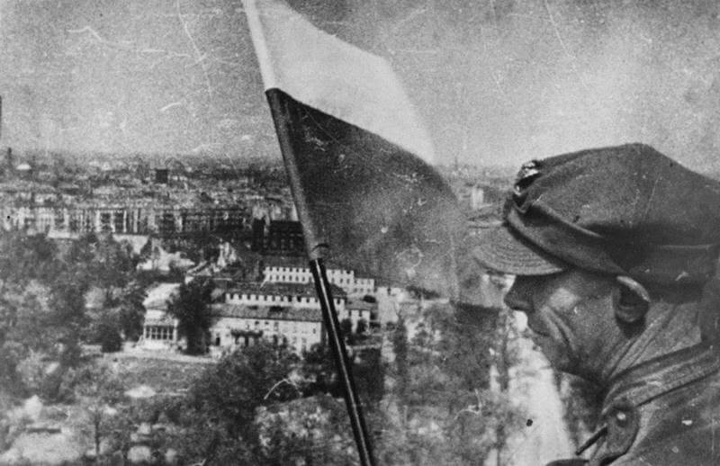

### Berlin

Działania wojenne miały ustać do 1300, ale była już prawie 1700 kiedy ucichły ostatnie strzały.

Niekończące się kolumny więźniów rozpoczęły długą wędrówkę na wschód. Sowieci twierdzą, że tego dnia wzięli 134 tys jeńców w Berlinie, ale prawdopodobnie był to wynik łapanki wszystkich pełnosprawnych mężczyzn, a czasem także i kobiet, do obozów pracy. Cały dzień trwało przeszukiwanie miasta i wyłapywanie niemieckich żołnierzy.

Tego samego dnia marszałek Koniew rozpoczął wycofywanie swoich sił z rejonu Berlina w ramach przygotowań do kolejnej dużej operacji połączonej z 2 i 4 Frontem Ukraińskim, która miała rozpocząć się 6 maja przeciwko Grupie Armii Środek w Czechosłowacji.

1 Dywizja WP została również wycofana z Berlina w południe 2 maja, aby dołączyć do swojej macierzystej formacji w Nauen, ale dopiero wtedy polscy żołnierze zawiesili swoje czerwono-białe flagi narodowe na Siegessäule.

W odizolowanych budynkach żołnierze SS wciąż stawiali opór. Sowieci nie podejmowali walki, likwidowali je artylerią. Niezależnie od prób przebicia i ciągle trwających gdzieniegdzie walk dziś zakończyła się bitwa o Berlin, w życie weszła bezwarunkowa kapitulacja jaką złożył dowódca garnizonu generał Weidling w ręce generała Czujkowa, który dwa lata wcześniej bił się w oblężonym Stalingradzie.

9 Korpus Strzelecki 5 Armii Uderzeniowej zajął budynek Kancelarii Rzeszy. Skapitulowała niemiecka załoga Reichstagu i 350-osobowa załoga ZOO Flakturm.

Tak wyglądała kapitulacja Berlina. Stolica III Rzeszy była w rękach Stalina.

- [Mark Felton Productions "Reichstag Assault 1945" [YT 10:16]](https://www.youtube.com/watch?v=qiFvWoM5Sb0)

### Sztandar nad Reichstagiem

Jewgienij Ananjewicz Chałdiej wykonał jedną z najbardziej znanych fotografii II wojny światowej przedstawiającą żołnierzy Armii Czerwonej zawieszających flagę Związku Radzieckiego na dachu Reichstagu (ros. Знамя Победы над рейхстагом). Zjęcie było rekonstrukcją wydarzenia z 30 kwietnia, które nie zostało sfotografowane. Fotografia Chałdeja stała się symbolem pokonania III Rzeszy i zwycięstwa Armii Czerwonej w Wielkiej Wojnie Ojczyźnianej. Została opublikowana 13 maja czasopiśmie Ogoniok.

Ze względu na żydowskie pochodzenie Chałdiej znalazł się w niełasce władz sowieckich, więc przez cały okres powojenny aż do upadku ZSRR nie było prawidłowej atrybucji zdjęcia. Dopiero po upadku ZSRR na szczęście wciąż żyjący autor doczekał się uznania. W 1995 organizowano spotkanie z Joe Rosenthalem, autorem Sztandaru nad Iwo Jimą, którym Chałdiej się inspirował. Zmarł w 1997.

- [Sztandar nad Reichstagiem](https://pl.wikipedia.org/wiki/Sztandar_nad_Reichstagiem)
- Vox ["Why the Soviets doctored this iconic photo" [YT 4:46]](https://www.youtube.com/watch?v=4HchGsN7eM4)

### Bunkier

Pierwszą rzeczą jaką zrobili sowieci było odnalezienie bunkra Hitlera i jego zwłok. Nie było to łatwe, bo ci którzy znali dokładną lokalizację właśnie uciekali.

Pytając napotkanych ludzi i przeszukując Kancelarię Rzeszy jak to pisze Ryan "w labiryncie piwnic i korytarzy" w końcu znaleźli do niego wejście. Znaleźli tam ciała generałów Krebsa i Burgdorfa oraz nadpalone ciała Josepha i Magdy Goebbelsów wraz ze zwłokami ich sześciorga dzieci.

Po przeszukaniach okolicy odnaleziono częściowo spalone ciało mężczyzny w płytkim grobie, ale nie było pewności czy to on. Potem jednak znaleziono jeszcze jedno ciało również w mundurze, ale ten drugi mężczyzna choć podobny do Hitlera miał pocerowane skarpetki. Zebrani świadkowie nie potrafili rozpoznać, którym z zabitych jest Hitler.

Wobec tych wątpliwości kilka dni później generał Wasilij Sokołowski nakazał oględziny stomatologiczne. Znaleziono i sprowadzono Fritza Echtmanna i Kathe Heusermann, techników dentystycznych doktora Blaschkego, który był dentystą Hitlera. Echtmann otrzymał polecenie narysowania szkicu uzębienia Hitlera i stwierdzono zgodność, a Heusermann pokazano szczękę i mostki. Rozpoznała je z łatwością bo sama je wykonała.

Wszystkie szczegóły dotyczące identyfikacji ciała Hitlera ujawnił w wydanej w 1968 roku "Śmierci Adolfa Hitlera" Lew Bezymeński lekarz, który brał w niej udział. Przechowywane w sowiekciej bazie w NRD szczątki Hitlera i Goebbelsów zostały spalone w 1970, popioły wrzucono do rzeki.

### 1 Armia WP

1 Dywizja Piechoty WP

- 3 pułk jeszcze w nocy zdobył stację kolejową Tiergarten, gdzie wziął 450 jeńców, potem skierował atak przez park Tiergarten i około 6:55 dotarł w rejon Bramy Brandenburskiej, gdzie zetknął się z oddziałami radzieckiej 8 Gwardyjskiej Armii. Mówi się czasem o polskich flagach na Bramie Brandenburskiej, ale jest to niepotwierdzone.
- 2 batalion i część 1 batalionu 3 pułku piechoty, batalion czołgów z 66 Brygady Pancernej i 7 bateria 1 pułku artylerii lekkiej zdobył Siegessäule. Pięciu polskich żołnierzy zatknęło biało-czerwone flagi na środku trzeciej kondygnacji i na balkonie drugiej.
- 1 pułk o świcie przekroczył Grolmanstrasse i dotarł do Hardenbergstraße.

Kanonier Eugeniusz Mierzejewski:
>Flagi nie mieliśmy ze sobą. Zrobiliśmy go z podartych niemieckich pierzyn. Spinaliśmy to czym kto miał. Ale czasu na świętowanie zdobycia Berlina nie było. Wysłali nas za wycofującymi się Niemcami. Dla nas walka skończyła się dopiero 7 maja 

- polskieradio24.pl ["76 lat temu biało-czerwona flaga zawisła na Kolumnie Zwycięstwa w Berlinie"](https://polskieradio24.pl/39/156/Artykul/2502891,76-lat-temu-bialoczerwona-flaga-zawisla-na-Kolumnie-Zwyciestwa-w-Berlinie)

*Polska flaga na Kolomnie Zwycięstwa. Tiergarten, Berlin. 2 maja 1945. 
By Polish Army - Encyklopedia Powszechna PWN 1975, Domena publiczna, [Link](https://commons.wikimedia.org/w/index.php?curid=49369104)*

### Ucieczki

Weidling wstrzymywał negocjacje jak długo się dało aż do północy by dać szansę ucieczki pod osłoną nocy, tym którzy jeszcze mogli.

#### Jebenstrasse

Grupa 300 żołnierzy z Jebenstrasse uciekła tunelami U-Bahn ze stacji Zoo na Adolf-Hitler-Platz (obecnie Theodor-Heuss-Platz), co zajęło im dwie godziny, a potem na Heerstrasse. Kiedy ktoś nieostrożnie zapalił zapałkę ostrzelano ich serią z kaemu. Skręcili w stronę Ruhleben, gdzie natknęli się na austriacką jednostkę czołgów z 15 Tygrysami i udali się z nimi na Stresowplatz, który był zatłoczony uchodźcami czekającymi na przejście przez most Charlottenbrücke do Spandau. Nagle zostali ostrzelani z dachów i pod ogniem w biegu przedarli się do Döberitz, gdzie otoczeni po wystrzelaniu całej amunicji musieli się poddać ok 0500 2 maja

#### Zoo

W nocy z 1 na 2 maja generał dywizji Luftwaffe Otto Sydow z 1. Flak-Division zorganizował próbę ucieczki z Zoo. Pozostałe czołgi i transportery opancerzone Dywizji Pancernej Müncheberg i 18 Dywizji Grenadierów Pancernych zostały wysłane przez Kantstrasse do Adolf-Hitler-Platz (obecnie Theodor-Heuss-Platz), a następnie przez Reichsstrasse i Stadion Olimpijski do Ruhleben. Oddział kilkuset żołnierzy piechoty z rannymi i kilkuset cywilami przeszedł 7 km tuneli U-Bahn do Ruhleben i kolejne 3 km do mostów Spandau. Cudem plan zadziałał. Wędrówka przez tunele musiała odbywać się w ciszy i bez świateł, ponieważ praktycznie cała trasa przebiegała pod liniami radzieckimi, a w tunelu było wiele otworów prowadzących do ulic. Chociaż szli wolno, przed północą dotarli do celu.

Na Haweli wciąż były dwa mosty. Freybrücke został wysadzony o 1800 tego wieczoru, kiedy przypadkowy pocisk uderzył w komorę detonacyjną. Nie ma relacji o przejściu przez Schulenburgbrücke w centrum, prawdopodobnie był zbyt strzeżony.
Siły rosyjskie na przeciwległym brzegu przy moście Charlottenbrücke były stosunkowo słabe. Gdy tylko wojska przedarły się, uchodźcy zaczęli się zbierać i czekali, a kiedy droga była wolna, tłumy przedarły się przez most. Wiele osób zostało zmiażdżonych przez przejeżdżające w pośpiechu pojazdy wojskowe. Cały czas byli ostrzeliwani. Żołnierze skierowali się do Brunsbüttler Damm na Lotnisko Staaken, które stało się węzłem dróg ewakuacji. Większość jednostek kierowała się na poligon Döberitz. Panowała zasada "ratuj się kto może" (fr. sauve-qui-peut). Większość z żołnierzy została zabita lub wzięta do niewoli. Niewielu udało się dotrzeć do Łaby.

#### Czołgi

Wkrótce po zapadnięciu zmroku generał Wasilij Iwanowicz Kuzniecow (tak, ten od słynnego lotniskowca) dowódca 3 Armii Uderzeniowej (tak, tej która zdobyła Reichstag) zadzwonił do marszałka Żukowa z informacją, że około 20 niemieckich czołgów przedarło się przez linie 52 Dywizji Strzeleckiej Gwardii na północny zachód. Żukow zaalarmował 47, 61 i 1 Armię WP z poleceniem zablokowania wszystkich tras na zachód i północ, a 2 Gwardyjska Armia Pancerna i 3 Armia Uderzeniowa otrzymały rozkaz zorganizowania pościgu. O świcie 2 maja niemieckie czołgi zostały znalezione porzucone z braku paliwa i zniszczone około 15 km na północny zachód od Berlina.

#### Generał Bärenfänger

Generał Bärenfänger dowodzący siłami między Alexanderplatz i Szprewą ("Ost") zorganizował ucieczkę żołnierzy na północ, ale czerwonoarmiści z powodu poprzedniego incydentu zablokowali drogę przez Schönhauser Allee. Bärenfänger, jego żona i szwagier popełnili samobójstwo w bocznej uliczce.

#### Generał Mohnke

Wyrwanie z Kancelarii Rzeszy zostało opóźnione o 24 godziny przez generała dywizji SS Mohnke z powodu przecięcia osi wschód-zachód przez Sowietów 30 kwietnia. Planując nową trasę, poradził swoim ludziom, aby trochę odpoczęli. Skontaktował się z generałami Krebsem i Burgdorfem, ale obaj zdecydowali sę na samobójstwo. Zadzwonił również do generała Weidlinga, aby poinformować go o swoich zamiarach i uzyskał jego zgodę na unikanie kapitulacji do świtu 2 maja.

Ucieczka rozpoczęła się 1 maja o 2300 w 10 nieregularnych grupach, z Mohnke na czele pierwszej. Planował, że będą wyruszać w dziesięciominutowych odstępach i podążać tunelami U-Bahn i S-Bahn aż do Stettiner Bahnhof (obecnie Nordbahnhof), która jak sądził, znajdowała się już a liniami sowieckimi. Stamtąd mieli dotrzeć na stację Gesundbrunnen k Humboldhain Flakturm, po czym każda grupa osobno i na własną rekę przez Neuruppin do głównych sił niemieckich. Ten plan wynikał z niechęci czerwonoarmistóow do nieznanych sobie tuneli, ale również pokazywał jak niewiele Mohnke wie o sytuacji na północy Berlina.

Grupa Mohnkego przez Wilhelmplatz dotarła do stacji metra Kaiserhof, gdzie chronili się cywile i w całkowitych ciemnościach do stacji Stadtmitte, północną linią dotarli do stacji Friedrichstrasse. Tam godzinę musieli przeczekać z powodu silnego ostrzału. Przeszli na tunel S-Bahn na stacji Friedrichstrasse, ale na odcinku pod Szprewą ich i grupę cywilów zatrzymali dwa ściśle przestrzegający regulaminu strażnicy. Nie ma przejścia i już. Szukali innej drogi. Weidendammer Brücke był zablokowany przez niemiecką barierę przeciwpancerną i ostrzeliwany przez czerwonoarmistów, więc przeszli kładką pieszą w moście kolejowym nad Szprewą. Idąc zrujnowaną okolicą dotarli do ruin Muzeum Historii Naturalnej, dopiero wtedy zorientowali się, że przekroczyli Invalidenstrasse. Jak dotąd nie widzieli czerwonoarmistów. Dołączyło do nich kilku niemieckich maruderów. Cywile, których napotkali, powiedzieli im, że choć szpital Charité po ich lewej jest zatłoczony to w okolicy jest niewiele sowieckich patroli. Ostrzał, który ucichł o godzinie 0130, wznowiono nagle o godzinie 0230 i patrząc wstecz, zobaczyli, że Friedrichstrasse i obszar mostu Weidendammer były pod ostrzałem ciężkiej artylerii i rakiet z Tiergarten oraz oświetlony przez szperacze.

Ten wybuch ognia został sprowokowany przez inne grupy z Kancelarii Rzeszy, które przedostały się nad ziemię, przyciągając w ten sposób uwagę sowietów. Trzecia grupa zgubiła drogę na stacji Stadtmitte, gdzie podzieliła się na dwie oddzielne sekcje, a następnie zdecydowała się podróżować nad ziemią.

Generał dywizji SS Krukenberg, którego żołnierze walczyli w tym terenie, wściekły że Mohnke uciekł nie informując go o niczym, teraz, gdy sowieci zostali zaalarmowani, był zmuszony skorzystać z okazji i wyrwać się póki można z tymi których udało mu się zebrać, pozostawiając innych na pastwę losu. Ostatnie 5 Tygrysów użył do przebicia się przez most Weidendammer i od razu w bitwie wszystkie te czołgi stracił, ponieśli ciężkie straty. Tylko kilku przedarło się z generałem.

Mohnke skorzystał z odwrócenia uwagi, i zabrał swoich ludzi na Chausseestrasse, północną kontynuację Friedrichstrasse, ale kiedy dotarli do Maikäferkaserne (po wojnie Walter-Ulbricht-Stadion, a obecnie siedziba Bundesnachrichtendienstes) okazało się że są tam czołgi wroga i zawrócili na Invalidenstrasse. Przypadkowym pociskiem zabity został generał dywizji SS Jürgen Ziegler, poprzednik Krukenberga. Schronili się na nieczynnym placu towarowym w pobliżu Stettiner Bahnhof (obecnie Nordbahnhof), gdzie ostatecznie dołączył do nich Krukenberg i ocaleni z jego grupy wraz z innymi oddziałami ukrywających się w okolicy.

O 0700 grupa Mohnkego, licząca 150-200 osób, podążała opuszczonymi ulicami Bernauer Strasse i Brunnenstrasse, by dotrzeć do wieży Humboldhain Flak o 0900. Dotarły wieści o rozkazach generała Weidlinga, by się poddać, ale grupa Mohnkego postanowiła się wyrwać i schroniła się w browarze Schultheiss w Prinzenallee.

Podczas gdy reszta się zabawiała, oficerowie zeszli do piwnic, aby naradzić się. Niektórzy zdecydowali się na indywidualne ucieczki m in dwie sekretarki Hitlera i sekretarka Bormanna, wszystkie trzy bezpiecznie przedostały się na zachód. Mohnke wysłał pułkownika Claussena, który nie był z SS żeby zgłosił kapitulację, zanim zostaną zaatakowani. Zostali wzięci do niewoli o 2000. Ambasador Walter Hewel i fanatyczny młody porucznik SS popełnili samobójstwo.

#### Uciekinierzy z bunkra

Inna grupa dowodzona przez Axmanna przeszła całą drogę nad ziemią, ponosząc wiele ofiar.

W międzyczasie pięciu uciekinierów z Kancelarii po przekroczeniu Szprewy skręcili w lewo. Bormann, Axmann, pułkownik SS dr Ludwig Stumpfegger (ostatni lekarz Hitlera), major Weltzin (pomocnik Axmanna) i generał Luftwaffe Hans Bauer (pilot Hitlera) - schronili się na Schiffbauerdamm, dopóki ogień nie ustał. Potem podążali wzdłuż torów kolei miejskiej S-Bahn prowadzących do Moabit. Naprzeciwko Reichstagu znaleźli się pod ostrzałem snajperów, a generał Bauer został oddzielony od reszty i pozostał w tyle. 4 pozostali przeszli przez Humboldthafen przy moście kolejowym i zeskoczyli na jezdnię pod stacją Lehrter S-Bahn, tylko po to, by znaleźć się w środku biwakującego plutonu przyjaznych rosyjskich żołnierzy, którzy wzięli ich za Volkssturm zmierzający do domu. Bormann i Stumpfegger zaczęli biec, wzbudzając tym samym podejrzenia Rosjan, dwóm pozostałym udało się odejść. Jednak gdy Baur pojawił się wkrótce potem, został postrzelony, poważnie ranny i schwytany przez ten sam pluton.

Axmann i Weltzin weszli do Moabit, dopóki nie zostali zawróceni przez ogień czołgów. Przechodząc przez most drogowy nad głównymi torami prowadzącymi na dworzec Lehrter, natknęli się na ciała Bormanna i Stumpfeggera, którzy najwyraźniej popełnili samobójstwo. Zdecydowali się rozdzielić, Axmann znalazł schronienie u przyjaciółki i dotarł bezpiecznie na zachód, ale Weltzin został jeszcze tego ranka schwytany.

#### Łotysze

Podczas przerwy w walkach w nocy 1 maja 80 ocalałych żołnierzy z 15 Batalionu SS Łotewskiego porucznika SS Neilands wycofało się na nowe pozycje w ogromnym, masywnym Ministerstwie Lotnictwa. Przeoczono ich w planach ucieczki i rano okazało się że w okolicy nie ma żadnych wojsk, ani niemieckich ani sowieckich. Zdecydowali się przedrzeć na północ przez ruiny i dotarli na plac w Pankow, gdzie zebrało sie ok 1000 niemieckich żołnierzy czekających na wzięcie do niewoli. Tam rozdzielili się dalej uciekając indywidualnie.

Jak się później okazało ci zapomnieni Łotysze sami zapomnieli o innych żołnierzach, z francuskiego Waffen-SS, którzy zmęczeni walką zasnęli w piwnicach Ministerstwa Lotnictwa. Wszyscy zostali schwytani.

#### Wannsee

W nocy z 1 na 2 maja resztki 20 Dywizji Grenadierów Pancernych, do której dołączyła grupa podpułkownika Weissa, próbowały wyrwać się z "wyspy" Wannsee. Planowali przedrzeć się przez linie sowieckie na stacji Wannsee S-Bahn, a potem skręcić na południe przez las, by spotkać się z 12 Armią. Kiedy dotarli na most prowadzący do przejścia podziemnego pod linią kolejową, okazało się, że jest zablokowany przez barierę przeciwpancerną, zostali ostrzelani i ponieśli duże straty. Weiss został schwytany w Wannsee, ale jego dwaj towarzysze uciekli do lasu, następnego ranka pozbyli się mundurów i w cywilnych ubraniach udało im się uciec na zachód pod udając cudzoziemskich robotników przymusowych.

Ostrzał który ściągnęli na siebie dotknął równiez grupę kurierską majora Johannmeiera. Podczas walk trzysilnikowa latająca łódź Dornier wylądowała na Haweli w pobliżu Pfaueninsel i nawet nawiązano kontakt z kurierami, ale ostrzał zmusił pilota do natychmiastowego startu zanim dotarli do samolotu.

Żaden w kurierów testamenttu Hitlera nie zakończył misji sukcesem, wszyscy w końcu dotarli do bezpiecznych miejsc, ale dokumenty zostały odzyskane przez aliantów zachodnich.

### Schenkenhorst

Jak wspomina marszałek Koniew, kwatera główna generała Leluszenko z 4 Gwardyjskiej Armii Pancernej we wsi Schenkenhorst tego dnia została zaatakowana przez ok 2 tys żołnierzy. Uznano ich za część garnizonu poczdamskiego, ale bardziej prawdopodobne było, że to uciekinierzy z Wannsee. Po 2 h walk kiedy przybyły posiłki 7 Gwardyjski Pułk Motocyklowy i inne jednostki z okolicy zostali pokonani.

### Martin Bormann

Podczas próby ucieczki z Berlina ginie Martin Bormann, jedna z bardziej tajemniczych postaci reżimu, szara eminencja III Rzeszy.

Po ucieczce Rudolfa Hößa sekretarz Hitlera, to on decydował kto ma do niego dostęp, a to stanowiło największą władzę zaraz po samym Hitlerze. Dopiero pod koniec wojny alianci zorientowali się jak ważny jest, tak bardzo trzymał się w cieniu. Wtedy się okazało, że nie dysponują żadnym jego zdjęciem. Bardzo długo jego los był nieznany i krążyło na jego temat wiele teorii spiskowych. Dopiero w 1972 odnaleziono dwa szkielety, podejrzenia, że jeden z nich to Bormann potwierdziły badania DNA.

### Kapitulacja wojsk niemieckich we Włoszech

29 kwietnia, dzień przed śmiercią Hitlera w Casercie podpisano akt kapitulacji Grupy Armii C (niem. Heeresgruppe C).

Kapitulacja wchodziła w życie 2 maja o godzinie 1400. Milion niemieckich żołnierzy we Włoszech dostało się do niewoli.

### Kapitulacja Armii Wisła

Poddała się również resztka Armii Wisła, czyli dwie ostatnie jednostki, które do niej należały: 21 Armia pod dowództwem generała Kurta von Tippelskircha i Trzecia Armia pancerna pod dowództwem generała Hasso von Manteuffela.

### Operacja Eclipse

Północna część frontu aliantów zachodnich należała do Brytyjczyków. Dowództwo brytyjskie dostrzegło niespodziewany problem na styku wojskowości i polityki. Z uwagą śledzono postępy 2 Frontu Białoruskiego, zachodziła obawa że z rozpędu jako, że są armią znieznająca granic zajmą Danię. Dawałoby im to Bałtyk jako wewmętrzne morze i bezpieczne wyjście na Morze Północne. Nawet gdyby sowiecka okupacja była czasowa stanowiła by ich atut a stratę aliantów. Należało temu zapobiec.

Wybrano Wismar jako odpowidni punkt do blokady. Znajdował się na wschód od Lubeki, nie był dużym miastem i był dość łatwy do obrony. W razie utraty pozycji pozostawałaby jeszcze Lubeka. Ponieważ wymagany był pośpiech oddział nie mógł być zbyt duży, z drugiej strony musiał być skuteczny.

Najlepszą dostępną jednostką były 3 i 5 Brygada 6 Dywizji Spadochronowejj brytyjskiej. Żeby na pewno wykonały swoją misję wysłano je oddzielnymi drogami. Nie wiadomo było z jakim oporem niemieckim się zetkną. Awangardą 3 Brygady był 1 kanadyjski batalion spadochronowy, jedyna kanadyjska jednostka tego typu. To byli doświadczeni zołnierze. Jednostka powstała w lipcu 1942 i dokładnie rok później weszli w skład 3 Brygady. Brali udział w lądowaniu w Normanii, Kontrofensywie w Ardenach, Operacji Varcity, 15 kwietnia wyzwolili KL Bergen Belsen.

2 maja zajęłi Wismar i postawili blokadę. Było to ogromne zaskoczennie dla czerwonoarmistów. 7 maja w Wismar spotkali się marszałkowie Montgomery i Rokosowski. Zgodnie z ustaleniami jałtańskimi Wismar był w sowieckiej strefie okupacyjnej i 1 lipca został przekazany sowietom.

Dania została uratowana.

- [Mark Felton Productions "Canadian Paratroopers Save Denmark! Operation Eclipse 1945" [YT 13:33]](https://www.youtube.com/watch?v=OWcRl7Q7pGs)
- [Operation Eclipse](https://www.historylearningsite.co.uk/world-war-two/world-war-two-and-eastern-europe/operation-eclipse/)

### Wernher von Braun

Kiedy w styczniu 1945 Armia Czerwona znalazła się 160 km od Peenemünde, von Braun rozpytał ludzi komu chcą się poddać. W lutym otrzymali sprzeczne rozkazy, Wehrmacht kazał im się przyłaczyć do walki a Kammler reprezentujący SS rozkazał przenieść ośrodek badawczy do Niemiec środkowych do Mittelwerk i ten rozkaz zdecydowali się wykonać, bo dawało do możliwość poddania się Brytyjczykom.

Obawiając się, że SS każe zniszczyć dokumentacje ukryli ją w pobliskiej kopalni. Później wg wskazówek von Brauna Brytyjczycy odzyskali 15 maja - było to 14 ton dokumentów. W marcu kierowca von Brauna zasnął za kierownicą i spowodował wypadek. Efektem były poważne złamania. Von Braun nie miał czasu na hospitalizację, zaraz po założenu gipsu wrócił do swoich ludzi. Na początku kwietnia Kammler rozkazał przewieźć cała ekipę do Bawarii gdzie będą trzymani pod strażą SS mającą rozkaz zabić ich jeżeli mieliby wpaść w ręce wroga. Von Braun przekonał go że lepiej będzie jeżeli zostaną rozproszeni po okolicznych wioskach.

29 kwietnia Amerykanie zdobyli Oberammergau i większość ekipy von Brauna, który z kilkoma współpracownikami uciekł do Austrii gdzie zaszył się na odludzi. 2 maja jego brat Magnus jadąc rowerem odnalazł amerykanskiego żołnierza, szeregowca z 44 DP i powiedział łamaną angielszczyzną "*My name is Magnus von Braun. My brother invented the V-2. We want to surrender.*"

Później von Braun powiedział prasie:
>We knew that we had created a new means of warfare, and the question as to what nation, to what victorious nation we were willing to entrust this brainchild of ours was a moral decision more than anything else. We wanted to see the world spared another conflict such as Germany had just been through, and we felt that only by surrendering such a weapon to people who are guided not by the laws of materialism but by Christianity and humanity could such an assurance to the world be best secured

Von Braun był na szczycie Czarnej Listy specjalnej listy najważniejszych niemieckich uczonych i inżynierów. Przewieziono go do Zamku Kransberg w którym przeprowadzano przesłuchania najważniejszych jeńców związanych z ekonomią, nauką i techniką. Przypisano go do Operation Overcast (późniejszego Paperclip).- 

### Heisenberg

Ostatnie zadanie Misji Alsos wykonane. Profesor Heisebnberg pojmany.

### Lubeka

W zdobytej Lubece w ręce aliantów wpadł jeden z bardziej osobliwych pojazdów WWII - "podwodny czołg" okręt podwoodny na gąsienicach - Morski Diabeł.

- [Seeteufel](https://en.wikipedia.org/wiki/Seeteufel)
- [Mark Felton Productions "Panzer U-Boat - The German Submarine Tank" [YT 10:01]](https://www.youtube.com/watch?v=8UWEZGrQvKs)

### Szlezwik-Holsztyn

Wojska brytyjskie zdobyły Eutin w Szlezwiku-Holsztynie.

### Samobójstwa hitlerowców:

Pierwszym z nich jest Max de Crinis mający duże osiągnięcia niemiecki psychiatra i neurolog, kierownik instytutu w Kolonii i berlinskiej Charité. Austriak, w NSDAP od 1931. Lekarz SS, jeden z ważniejszych ekspertów Akcji T4. to on napisał rozkaz Hitlera nakazujący wykonanie Akcji T4. Od 1941 szef ministerstwa Edukacji. Po raz ostatni w klinice Charité pojawił się 21 kwietnia. Jakiś czas czekał na sowietów w willi w Wannsee, ale później usiłowali się z żoną wydostać z oblężenia, kiedy to okazało się niemożliwe zażyli cyjanek potasu. Jest jedną z głównych postaci 2 części serialu "Charité".

Uciekając z bunkra Hitlera wspomniany powyżej Walter Hewel dyplomata wyznaczony do delikatnych i trudnych misji schronił sie w piwnicy i kiedy wkraczali do nie czerwonoarmiści zastrzelił się. Był starym bojownikiem jeszcze z czasów puczu monachijskiego, potem opuścił Niemcy. Kiedy Hitler został kanclerzem powrócił zajmując się misją zagraniczną.

Również wspomniani w rozdziale od ucieczkach: Erich Bärenfänger od kwietnia 1945 jeden z najmłodszych generałów Wehrmachtu, mianowany dowódca wschodniego odcinka obrony, kiedy zobaczył że ucieczka nie jest możliwa zastrzelili się z żoną i szwagrem w podziemiach Kulturbrauerei na Prenzlauer Berg.

Dwaj generałowie z bunkra Hitlera zastrzelili się zaraz po północy: Wilhelm Burgdorf i szef sztabu Hans Krebs.

### Krościenko nad Dunajcem

Dokładnie za rok 2 maja 1946 w okolicy Krościenka nad Dunajcem partyzanci pod dowództwem Józefa Kurasia "Ognia" bestialsko zamordowali grupę kilkunastu Żydów.

- Wirtualny Sztetl [Okolice Krościenka - miejsce egzekucji grupy Żydów w 1946 r.](https://sztetl.org.pl/pl/miejscowosci/k/1048-kroscienko-nad-dunajcem/116-miejsca-martyrologii/47515-okolice-kroscienka-miejsce-egzekucji-grupy-zydow-w-1946-r)

### Wrocław

Komendant:
>Jednak gdy generał Niehoff naradzał się ze swym najbliższym sztabem, wszystkie fronty bronione w ostatniej dekadzie kwietnia stały w miejscu. Wrogowi nigdzie nie udało się przedrzeć aż do centrum miasta, nie mówiąc już o choćby najdrobniejszym rozszczepieniu niemieckich sił. Ale twierdzy zagrażały ciemne chmury nadciągającej burzy, którym teraz nie można było stawić czoła. Berlin upadł i rosyjskie dowództwo otrzymało stamtąd wsparcie. Zmasowane chmary bombowców – z początku niebombardujących – odbywały ostrzegawcze parady nad Wrocławiem. Dowództwo twierdzy, dobrze poinformowane o swoim położeniu zarówno przez stronę niemiecką, jak i przez sowieckie głośniki, zorientowało się, że Wrocław swoje zadanie wykonał.

Verton:
>Względnie pokojowe godziny 1 maja nie trwały długo. Każdego dnia aż do 5 maja naloty wzmagały się. Wielkie eskadry nieprzyjacielskie za każdym razem zabijały lub raniły, według księdza Horninga, około 1000 mieszkańców. Codziennie były dwa naloty, a czołgi rosyjskie próbowały szczęścia, aby się ponownie przedrzeć do centrum miasta, ale były odpierane. Nasze kontrataki były obecnie tak samo silne, jak poprzednio. Nie spełniły się ich nadzieje na to, iż uwierzymy w puste obietnice o wolnej drodze do domu lub o zwolnieniu jeńców wojennych zaraz po tym, jak tylko skończy się wojna.

Nikt nie miał wątpliwości, że to już ostatnie dni, jak pisze 2 maja Hugo Hartung:
>bez względu na to co się teraz dzieje, wszyscy mówią, że są to ostatnie chwile tego kataklizmu. Wojna w zawrotnym tempie dobiega końca. Znowu nasilą się walki w naszym mieście. Na Carlowitz również spada kilka bomb, które trafiają w boczne skrzydło seminarium. Ginie nasz stary poczciwy szewc. Jeszcze wczoraj gdy odbierałem u niego naprawione buty dzielił się ze mną wiarą w to, że wkrótce wszyscy będziemy "w domu".

Przypuszczenie, że sytuacja na froncie ulegnie już wkrótce pogorszeniu było powszechne. Jak pisze Walter Laßmann:
>Berlin jest już cały w rękach Armii Czerwonej. Ale Niehoff nadal chce bronić twierdzy. Rosjanie grożą zmasowanym atakiem, jeżeli miasto nie zostanie szybko poddane. Strach mieszkańców rośnie z godziny na godzinę. Lęk przeradza się w swego rodzaju masową psychozę. Udręczeni ludzie słusznie pytają: czy po tym jak twardo wytrzymaliśmy przez te wszystkie tygodnie i miesiące, po tym jak Hitler i Goebbels osądzili się sami i Berlin upadł, czy teraz gdy kontynuacja oporu stała się bezcelowa, wciąż jeszcze mamy ginąć pod bombami? Aż nadto zrozumiałe jest iż znajdujemy się na skraju wielkiego zwątpienia. Z tej niedoli rodzi się wreszcie postanowienie aby położyć na szali wszystko i zapobiec dalszemu rozlewowi krwi i dalszym zniszczeniom. Zapada decyzja aby delegacja obydwu wyznań stawiła się u komendanta twierdzy i skłoniła go do poddania miasta.

Laßmann:
>Tego dnia dowiadujemy się o "bohaterskiej śmierci Führera". Dzisiejsze wydanie "Gazety Frontowej" informuje wielkimi literami: "Bohaterska śmierć Führera. Następcą został mianowany wielki admirał Dotnitz. Naród i Wehrmacht stają pod jego przywództwem." Dalej czytamy "Jak informuje główna kwatera wodza, nasz Führer Adolf Hitler zginął wczoraj po południu za Niemcy walcząc do ostatniego tchu na swoim stanowisku dowodzenia w Kancelarii Rzeszy" [...] "30 kwietnia Hitler mianował wielkiego admirała Dönitza swoim następcą. Admirał przejął dowodzenie Wehrmachtem i przywództwo narodu niemieckiego." W tym samym wydaniu "Gazety Frontowej" został opublikowany następujący rozkaz dzienny komendanta twierdzy: 
> 
>Rozkaz dzienny 
>Obrońcy Twierdzy Wrocław! W dziejowej walce narodu niemieckiego poległ Führer. Rozkazem z dnia 30 kwietnia mianował wielkiego admirała Dönitza swoim następcą. Wierni naszej przysiędze wojskowej stajemy pod jego naczelną komendę.! We Wrocławiu ja pozostaję na czele waszych szeregów. Ufajcie mi nawet w najczarniejszej godzinie. możecie być pewni, że dowodząc Wami kieruję się tylko Waszym dobrem 
>Twierdza Wrocław dn. 1 maja 1945 r 
>Komendant Twierdzy /podp. Niehoff/ generał piechoty

Major Otto oficer ze sztabu komendanta:
>Żołnierze Grup Armii Środek! 
>Jako męczennik swej idei i wiary oraz jako żołnierz europejskiego posłannictwa zginął Adolf Hitler, walcząc do ostatniego tchu przeciwko bolszewizmowi. Jego dzieło i misja będą świętym spadkiem dla przyszłych pokoleń. 
>My żyjący, mamy obowiązek kontynuować walkę według jego założeń i dokończyć dzieła. Walka o wolność i przyszłość Niemiec toczy się dalej. Admirał Dönitz przejął dowództwo nad niemieckim narodem i niemieckim Wehrmachtem. Wierni i posłuszni gromadzimy się wokół niego w tej godzinie. Wiemy, ze w końcu tych krwawych zmagań zostanie mimo wszystko zabezpieczony byt naszego narodu. Bohaterska śmierć Führera jest najwyższym zobowiązaniem dla każdego uczciwego żołnierza. Niechaj każdy tak walczy, aby mógł z czystym sumieniem stanąć przed poległym Führerem. 
>Heil Adolf Hitler!"

### Odnośniki

- [Polacy w Berlinie](http://polska-zbrojna.pl/home/articleshow/31035?t=Polacy-w-Berlinie)
