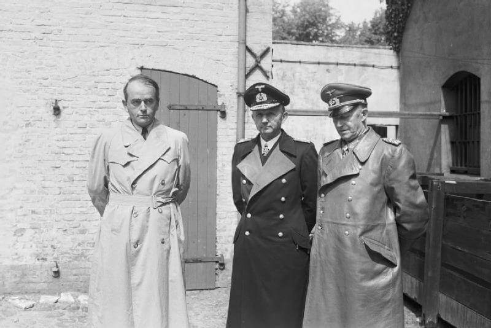

Wszyscy wiemy, że wojna w Europie zakończyła się bezwarunkową kapitulacją hitlerowskich Niemiec i poddaniem się do niewoli wszystkich wojsk niemieckich. Ale jak to dokładnie wyglądało?

### Rola Hitlera

Historycy są zgodni co do tego, że system wzajemnych aliansów i organizacja Ligii Narodów, która miała stać na straży porządku wersalskiego już w połowie lat 30 był martwy. Niemcy zaś były skazane na reakcyjną dyktaturę, a wojna porównywalna z Wielką Wojną była nieuchronna.

Ale tempo w jakim do tej wojny doszło i jej skala, okrucieństwo i niewyobrażalne dotąd zbrodnie są już osobistym dziełem Hitlera. Bez Hitlera wojna by wybuchła kilka lat później i nie byłoby ludobójstwa, obozów koncentracyjnych i zagłady, Holokaustu. Bez Hitlera Niemcy nie poszłyby na wojnę ze wszystkimi i to wbrew wszelkim niesprzyjającym okolicznościom.

### Wehrmacht

Głównym narzędziem wojen Hitlera był Wehrmacht, nowa niemiecka armia poborowa. Jej powołanie 16 marca 1935 dekretem mobilizacyjnym było jawnym i oficjalnym zerwaniem z ograniczeniami narzuconymi Niemcom przez kończący Wielką Wojnę traktat wersalski, który ograniczał armię niemiecką do 100 tys zawodowej Reichswehry. Dekret mobilizacyjny powoływał armię poborową, bez żadnych ograniczeń w zakresie liczebności czy broni. Porządek wersalski raz na zawsze przestał istnieć.

Ale jeszcze przed powołaniem Wehrmachtu, bo od 2 sierpnia 1934 żołnierze niemieccy byli związani przysięgą wierności osobiście wobec Hitlera personalnie, nie tylko jako formalnego głównodowodzącego. Nie zostało to Reichswehrze narzucone przez hitlerowców, była to inicjatywa sztabu, który w ten sposób chciał związać Hitlera z armią.

Skutek był jednak taki, że armia z konieczności stałą się bezwolnym narzędziem w rękach dyktatora, który rzucał ją na kolejne wojny za każdym razem z intuicją hazardzisty podbijając stawkę. W końcu rzucił ją do walki w sowietami, licząc na to, że Armia Czerwona osłabiona stalinowskimi czystkami i komunistyczna gospodarka nie wytrzymają uderzenia Wehrmachtu. Do jesieni 1941 sowieci mieli utracić wszelką możliwość kontrataku i odtworzenia armii. Nie utracili. Natomiast Wehrmacht zaczął ponosić gigantyczne straty. W 1941 było to 160 tys zabitych. Od tego czasu 80% zaangażowania i strat niemieckich to front wschodni.

### Koalicja antyhitlerowska, Wielka Trójka

Atak na sowiety miał jeszcze jeden niebagatelny skutek. Do tej pory Stalin był wiernym sojusznikiem Hitlera. Od sierpnia 1939 do czerwca 1941. Teraz Wielka Brytania, jedyna europejska potęga walcząca z hitlerowskimi Niemcami stała się naturalnym sojusznikiem. Co więcej 7 grudnia 1941 Japonia zaatakowała amerykańską bazę marynarki wojennej w Pearl Harbor, a Hitler jeszcze raz podbił stawkę wypowiadając wojnę USA 11 grudnia. Był pewien, że zanim Amerykanie otrząsną się ze strat ponoszonych na Pacyfiku, zanim zdążą wesprzeć Wielką Brytanię i przygotują inwazję na kontynent, Armia Czerwona zostanie pokonana i stanie się przeszłością. Ale kolejny rok wojny nie przyniósł przełomu. Wehrmacht nacierał, dotarł do Stalingradu i Kaukazu. Ale opór sowiecki nie został pokonany.

W 1943 w dniach 28 listopada - 1 grudnia w Teheranie, miało miejsce pierwsze spotkanie Wielkiej Trójki. Podstawowym warunkiem ustalonym wtedy było ostateczne pokonanie Niemiec i zmuszenie ich do bezwarunkowej kapitulacji, w tym samym momencie wobec wszystkich walczących stron: czyli Niemcy nie mogą stawiać żadnych warunków i nie ma mowy o żadnym separatystycznym pokoju. Wszyscy walczą do ostatecznego zwycięstwa. O dziwo pomimo rozbieżności a nawet wrogości pomiędzy tymi z musu sojusznikami umowa ta została dotrzymana.

### Upadek

1944 był już cały rokiem cofania się wojsk niemieckich. Na wschodzie zostali zepchnięci do linii Wisły, na zachodzie aliantom udało się stworzyć drugi front i dotarli do Renu. W obliczu klęski 20 lipca dochodzi do prawie udanego zamachu na Hitlera dokonanego przez oficerów niemieckich.

W takim właśnie momencie 12 stycznia 1945 zaczyna się ta kronika wojenna. Operacja wiślańsko-odrzańska a potem berlińska niszczą opór niemiecki i kończą wojnę.

29 kwietnia Hitler, chwilę po ślubie z Evą Braun spisał testament, osobisty i polityczny, w tym drugim na swoich następców wyznaczył w sprawach wojskowych admirała Dönitza, w politycznych Goebbelsa.

30 kwietnia ok godz. 16 Adolf i Eva Hitler zabijają się w bunkrze na tyłach Nowej Kancelarii Rzeszy. Od 10 dni trwała bitwa w samym Berlinie, 30 kwietnia czerwonoarmiści byli na pl Poczdamskim od południa, a od północy przeszli Most Moltkego i widzieli Reichstag.

Miejsce gdzie wciąż są zawalone pozostałości bunkra upamiętnia tylko tablica na parkingu jakieś 100 m na południe od Pomnika Holokaustu. Z budynku Nowej Kancelarii Rzeszy nic nie pozostało. Po wojnie to była wschodnia część Berlina i enerdowcy urządzili Hitlerowi damnatio memoriae likwidując wszystko, zresztą od 1961 powstał tuz obok Mur Berliński.

30 kwietnia kilka godzin po samobójstwie Hitlera, generał Krebs oznajmia generałowi Czujkowowi, że Fuhrer nie żyje i wobec gotowi są poddać garnizon Berlina. Czujkow - zwycięzca ze Stalingradu - zgodnie z ustaleniami sojuszniczymi wymaga kapitulacji bezwarunkowej.

Wtedy pierwszego maja na wieść o warunkach sowieckich Goebbelsowie się zabijają. Magda Goebbels zabija sześcioro swoich dzieci, a potem z Josefem popełniają samobójstwo. To pozostawia admirała Dönitza w roli jedynego legalnego następcy Hitlera.

Kapitulacja Berlina została uzgodniona po północy z 1 na 2 maja i weszła w życie o godz 1300 2 maja. 

### Flensburg

2 maja marszałek Dönitz formuje we Flensburgu (południowy Szlezwig) rząd pohitlerowski, w którym Dönitz był jednocześnie naczelnym wodzem i głową państwa. Było tam nawet 12 ministerstw obsadzonych przez 9 oficjeli. Z najwyższej rangi dowódców wojskowych pozostali tylko generałowie Jodl, Keitel (z powodu swojej służalczości wobec Hitlera przezywany w sztabie Lokeitel) i Erich von Manstein chwilowo nieosiągalny.

W ciągu kilku następnych dni kapitulują wojska niemieckie we Włoszech, w płn-zach Niemczech, w Bawarii, Holandii, a przez Łabę ucieka do Amerykanów 12 Armia Wencka. Poza Czechami i paroma izolowanymi miejscami nie ma już oporu, ale formalnie Niemcy są w stanie wojny. Wciąż. Aż do 7 maja 1945.

Ten osobliwy twór istniał do 23 maja, czyli w sumie trzy tygodnie.

*Speer, Dönitz i Jodl po aresztowaniu we Flensburgu, 23 maja rząd Dönitza przestał istnieć. 
By Malindine E G (Capt), No 5 Army Film &amp; Photographic Unit - [http://media.iwm.org.uk/iwm/mediaLib//37/media-37799/large.jpg](http://media.iwm.org.uk/iwm/mediaLib//37/media-37799/large.jpg)(https://commons.wikimedia.org/wiki/File:IWMLondonThumbnail.jpg)This is photograph [BU 6713](https://www.iwm.org.uk/collections/item/object/205194788) from the collections of the [Imperial War Museums](https://www.iwm.org.uk/).(https://commons.wikimedia.org/wiki/File:Flag_of_the_United_Kingdom.svg), Domena publiczna, [Link](https://commons.wikimedia.org/w/index.php?curid=24494241)*

### VE-Day (Victory Europe Day)

5 maja na polecenie Dönitza do kwatery głównej aliantów zachodnich w Reims (tak, tym słynnym mieście koronacyjnym królów francuskich) przybywa von Friedeburg. Jego zadaniem jest wynegocjowanie poddania się wojsk niemieckich tylko na froncie zachodnim. Ale głównodowodzący SHAEF generał Eisenhower domaga się bezwarunkowej kapitulacji wobec wszystkich walczących ze stron. Następnego dnia przybywa Jodl. Negocjacje przeciągają się, alianci zgodnie z ustaleniami sojuszniczymi, tak samo jak wcześniej Czujkow, wymagają bezwarunkowej kapitulacji. Dönitz nie chce się zgodzić, a Jodl nie ma kompetencji do samodzielnej decyzji. Jest już sporo po północy kiedy przychodzi depesza od Dönitza ze zgodą na warunki aliantów.

Jodl podpisuje kapitulację Wehrmachtu i wszystkich podległych sił. Jest 7 maja 1945, godzina 0241. I to jest VE-Day (Victory Europe). Dzień zwycięstwa świętowany w całym zachodnim świecie.

Pod aktem kapitulacji podpisy złożyli:

- Przedstawiciele Niemiec (z upoważnienia Naczelnego Dowódcy Wehrmachtu wielkiego admirała Karla Dönitza):
  - generał Alfred Jodl, Szef Sztabu Dowodzenia Wehrmachtu w Naczelnym Dowództwie Wehrmachtu, reprezentujący wojska lądowe oraz całość sił zbrojnych
  - admirał Hans-Georg von Friedeburg, Naczelny Dowódca Kriegsmarine
  - generał Wilhelm Oxenius, przedstawiciel Naczelnego Dowódcy Luftwaffe
- Przedstawiciele aliantów:
  - generał Walter Bedell Smith jako przedstawiciel Naczelnego Dowódcy Wojsk Ekspedycyjnych generała Eisenhowera
  - generał Iwan Susłoparow reprezentujący najwyższe dowództwo radzieckie

Akt kapitulacji mówił o zaprzestaniu działań zbrojnych przez wszystkie siły lądowe, morskie i powietrzne będące pod dowództwem niemieckim w dniu 8 maja o godzinie 23.01 czasu środkowoeuropejskiego. Zaproszony w ostatniej chwili francuski generał François Sevez przedstawiciel Francji był podczas świadkiem.

Do Nowego Jorku jest sześć godzin różnicy, ale ówczesne media tak szybko nie działają jak współcześnie. Amerykanie o kapitulacji Niemiec dowiadują się 7 maja z samego rana.

### Die Stunde Null

Tekst kapitulacji zawiera kluczowe zdanie
>All forces under German control to cease active operations at 2301 hours Central European Time on May 8, 1945

Oznacza to, że podpisana rano, przed świtem 7 maja kapitulacja wchodzi w życie dnia następnego, przed północą. I to jest właśnie niemiecka "Godzina Zero". My w Polsce możemy to kojarzyć z "grubą kreską" premiera Tadeusza Mazowieckiego. Odcinamy złą przeszłość i budujemy państwo na nowo. Godzina Zero to fundamentalny konstrukt ideologii politycznej powojennych Niemiec, to właśnie dzisiaj wszystkie media niemieckie mówią o końcu wojny i "wyzwoleniu Niemiec z nazizmu" co jest przyznaniem, że sami nie byli w stanie tego zrobić.

Do tego określenia nawiązuje tytuł doskonałego neorealistycznego filmu Rosseliniego "Germania anno zero" z 1948.

### День Победы / Dzień Zwycięstwa

Stalin jest oburzony. Kapitulację podpisano w SHAEF w Reims w kwaterze Eisenhowera. Nie było tam przedstawicieli Armii Czerwonej poza jednym nikomu nieznanym generałem. Krzyczy:
>A kto jest ten dzielny generał Susłoparow, który przyjął kapitulację III Rzeszy?

A to przecież Armia Czerwona pokonała Hitlera. I to ona zdobyła Berlin. Poprzednią umowę nazwano "wstępnym protokołem kapitulacji". Trzeba wszystko zorganizować na nowo. W Berlinie. Zanim to się udało był już 8 maja wieczór.

Odbyło się to w szkole saperskiej w Berlin-Karlshorst (niem. Pionierschule I der Wehrmacht), wówczas kwaterze Żukowa, obecnie jest tam Muzeum Niemiecko Rosyjskie (niem. Deutsch-Russisches Museum). Protokół uzupełniono informacją, że kapitulujące wojska zdają broń miejscowym dowódcom koalicji.

- Alianci:
  - Ze strony sowieckiej był marszałek Żukow - dowódca 1 Frontu Białoruskiego i zdobywca Berlina.
  - Aliantów zachodnich reprezentował marszałek RAF A.W. Tedder
- Przedstawiciele Niemiec (z upoważnienia Naczelnego Dowódcy Wehrmachtu wielkiego admirała Karla Dönitza):
  - feldmarszałek Wilhelm Keitel, Szef Naczelnego Dowództwa Wehrmachtu i Naczelny Dowódca Wojsk Lądowych
  - admirał Hans-Georg von Friedeburg, Naczelny Dowódca Kriegsmarine
  - generał Hans-Jürgen Stumpff, jako reprezentant Naczelnego Dowódcy Luftwaffe, generała felmarszałka von Greima
- Dodatkowo jako świadkowie kapitulacji podpisali się:
  - generał Carl Spaatz (USA)
  - generał Jean de Lattre de Tassigny (Francja)

Była 23.01 8 maja 1945. W Moskwie mającej dwie godziny różnicy do Berlina był już 9 maja godzina 01.01.

### Podsumowanie

Stąd ta rozbieżność w datach:

- Kraje zachodnie w tym głównie USA koniec wojny w Europie świętują 7 maja.
- RFN 8 maja.
- Sowiety a potem Rosja 9 maja.
- Kraje tzw demokracji ludowej (w tym Polska), a to zależy, które i kiedy, czasem 9, a czasem 8 maja.
- Jesienią 1949 powstaje NRD. Dzień Wyzwolenia w Izbie Ludowej został uchwalony już w 1950 jako *Tag der Befreiung des deutschen Volkes vom Hitlerfaschismus*; do 1985 9 maja, potem 8. W latach 1950-67 (wtedy wprowadzono 5-dniowy tydzień pracy) i potem od 1975 był to dzień wolny od pracy.

### Odnośniki

- [Museum of the Surrender Reims](https://musees-reims.fr/reims-museums/)
- [Deutsch-Russisches Museum Berlin-Karlshorst](https://www.museum-karlshorst.de)
- [Zeitgeist "Die Stunde Null - Europa nach dem Krieg (1)" [YT 44:50]](https://www.youtube.com/watch?v=xKjJX21n1WI)
- ["Why did the Japanese treatment of POWs change so dramatically between the Russo-Japanese War and the Second World War?"](https://www.reddit.com/r/AskHistorians/comments/eg5shj/why_did_the_japanese_treatment_of_pows_change_so/)
- Mark Felton Productions ["Hitler's Army in Allied Service 1945-46" [YT 8"06]](https://www.youtube.com/watch?v=p8RJpJdFjIw) | ["Rump Reich - The Nazi Government in Power After VE-Day 1945" [YT 9:09]](https://www.youtube.com/watch?v=y99DxDKhOPw)
- War Stories with Mark Felton ["Rat Lines - The Hunt for Nazi War Criminals (Episode 1)" [YT 26:33]](https://www.youtube.com/watch?v=Lo3vzQ9NGL0) | ["Rat Lines - The Hunt for Nazi War Criminals (Episode 2)" [YT 38:33]](https://www.youtube.com/watch?v=7kIXTyUTq9o) | ["Rat Lines - The Hunt for Nazi War Criminals (Episode 3)" [YT 30:20]](https://www.youtube.com/watch?v=2IY_Fg4OsL0) | ["Rat Lines - The Hunt For Nazi War Criminals Episode 4" [YT 24:06]](https://www.youtube.com/watch?v=cCiCfdVnI4w) | ["Rat Lines -The Hunt for Nazi War Criminals (Episode 5)" [YT 39:00]](https://www.youtube.com/watch?v=65FbH5w-uHA)
- [Operation Unthinkable](https://en.wikipedia.org/wiki/Operation_Unthinkable)
- [ALFASHIRT "Die letzten Bilder der Wehrmacht in Farbe ( Mai 1945 )" [YT 6:53]](https://www.youtube.com/watch?v=NgOgBaj7UEY)

<!-- 
### Arktyka

[ https://www.facebook.com/groups/HistoriaNaKazdyDzien/permalink/3032457883489715/ ]

03.09.1945 r.
Działania wojenne w Arktyce: na Ziemi Północno-Wschodniej, na północ od Spitsbergenu, skapitulowali członkowie ekspedycji meteorologicznej pod wodzą Wilhelma Dege, stając się ostatnim kapitulującym niemieckim oddziałem biorącym udział w II wojnie światowej.

Majowa kapitulacja Wehrmachtu w 1945 r. oznaczała upadek III Rzeszy, ale, jak się okazuje, ostatnia jednostka armii Hitlera złożyła broń dopiero cztery miesiące później, we wrześniu, i to gdzie! Na wyspie położonej blisko bieguna północnego, w północno-wschodniej części Spitsbergenu. Był to oddział opatrzony kryptonimem „Haudegen”, wprawdzie niewielki, ale wykonywał zadania o bardzo znaczącej militarnie wadze: to jednostka meteorologiczna, dostarczająca siłom morskim, powietrznym i lądowym Niemiec informacji umożliwiających trafne przewidywania pogodowe, pozwalające sztabom dostosować plany bitewne i logistyczne do najbardziej sprzyjających warunków atmosferycznych. Owa jednostka to 11 wyspecjalizowanych żołnierzy pod dowództwem kpt. dr. Wilhelma Dege (od jego nazwiska pochodziła nazwa jednostki). To dzięki ich prognozom wybrany został trafnie moment rozpoczęcia ostatniej ofensywy Hitlera, tej w Ardenach – przewidziano wtedy bowiem niski pułap chmur utrudniający operację dominującego już w powietrzu lotnictwa alianckiego przeciwko czołgom niemieckim.

Nie tak dawno dwaj członkowie jednostki „Haudegen”, ludzie już bardzo leciwi, wylądowali na miejscu, gdzie we wrześniu 1945 r. poddali się kapitanowi norweskiego kutra myśliwskiego. Po 60 latach zastali ukryty wśród skał, nieźle zachowany jeszcze, składany drewniany barak, który kiedyś był ich domem i zarazem arktyczną stacją meteorologiczną Wehrmachtu.

Sentymentalna podróż starszych panów przywróciła w Niemczech pamięć (relacje prasowe, zapisy kronikarskie, dokumentacja telewizyjna) o jeszcze jednym, jakże ważnym, a mało znanym opinii publicznej froncie zmagań – o wojnie meteorologicznej, równie bezwzględnej i wymagającej ogromnego wysiłku i ofiar, jak ta na polach bitew. Była to wojna bez linii frontowej, bo przecież nie o zdobycze terytorialne ani ich utrzymanie szła gra, jej stawką była wiedza o pogodzie. Prądy atmosferyczne, idące spod bieguna północnego na Atlantyk i Europę, odpowiednio rozeznane przez służby obserwacyjne takie jak „Haudegen” i przekazane szyfrem przez radio, były dla niemieckich generałów jedną z podstawowych przesłanek ich strategicznych decyzji.

Jednostka „Haudegen” nie była, oczywiście, jedyną taką grupą niemiecką w Arktyce. Była natomiast ostatnią tego typu, ulokowaną tam we wrześniu 1944 r. z misją przewidzianą na dwa lata.

Poczynając od 1940 r., Niemcy utrzymywali na dalekiej północy – na Spitsbergenie, na wschodnim wybrzeżu Grenlandii, a także na radzieckiej Ziemi Franciszka Józefa, dziewięć takich stacji. Do tego dochodził uzupełniający system lokowanych na wodach północnych automatycznych sond meteorologicznych, prawdziwych majstersztyków myśli technicznej. Rozmieszczane na dnie morskim przez okręty Kriegsmarine i samoloty Luftwaffe, wypływały o wyznaczonej godzinie, wypuszczając balony z aparaturą pomiarową, by po pobraniu danych automatycznie przesłać je drogą radiową do stacji odbiorczych Wehrmachtu, a następnie ponownie zniknąć w głębinie. Alianci wypłacali wysokie nagrody rybakom za wyłowienie takich sond.

Mimo stosunkowo małych liczebnie sił ludzkich zaangażowanych w owej wojnie meteo była ona równie dramatyczna, obfitująca w bitwy i potyczki, wymagająca kamuflażu, wzajemnego tropienia się, ucieczek i pogoni, klęsk i zwycięstw, udziału tęgich głów uczonych, a także niebagatelnego wysiłku materialnego. Mało tego, tajne lokowanie w Arktyce stacji, ich zabezpieczanie, zapewnianie dostaw zaopatrzenia, ewakuacji w momentach wykrycia przez przeciwnika, angażowało liczne statki i okręty, najczęściej łodzie podwodne, a także samoloty dalekiego zasięgu. W bitwach z tym związanych (bo alianci prowadzili staranne obserwacje, skutecznie tropiąc Niemców) uczestniczyły liczące się siły morskie, włącznie z niszczycielami, łodziami podwodnymi, nawet krążownikami. Stawka w tej wojnie podbiegunowej była przecież ogromna. Bez przesady można by przeliczać na siły dywizji wagę informacji dostarczanych spod bieguna północnego sztabom Hitlera.

Od początku wojny Niemcy zdawali sobie sprawę z ogromnego znaczenia dobrej wiedzy meteorologicznej.

Zaraz po opanowaniu Norwegii, w maju 1940 r., wyspecjalizowana jednostka Luftwaffe – eskadra V – rozpoczęła systematyczne loty obserwacyjne na daleką północ.
Równocześnie przerobiony na ruchomą stację meteorologiczną statek rybacki „Sachsen” działał w rejonie wyspy Jan Mayen. Na Spitsbergenie istniała wtedy norweska stacja meteo, przesyłająca do swojej centrali systematyczne raporty pogodowe, które trafiały oczywiście do rąk Niemców. Dlatego o świcie 25 sierpnia 1941 r. do Ejsfjord zawinęła eskadra okrętów brytyjskich (dwa krążowniki, trzy niszczyciele wraz z przekształconym w jednostkę transportową pasażerskim „Empress of Canada”), dokonując desantu w Barentsbergu. Wysadzono w powietrze stację meteo, elektrownię, radiostację, zniszczono zapasy paliwa, dosłownie wszystko, a ludzi ewakuowano – Norwegów do Szkocji, a Rosjan do Archangielska (na podstawie międzypaństwowych umów Norwedzy i Rosjanie wspólnie eksploatowali tamtejsze pokłady węgla).

To wtedy Niemcy postanowili tworzyć własne stacje obserwacyjne meteo w Arktyce. Wkrótce po desancie brytyjskim w Barentsbergu samolotami przetransportowali oddział dziesięciu swoich meteorologów w rejon Longyearbyen, gdzie – zaopatrywani z powietrza – funkcjonowali do czerwca 1942 r., tą samą drogą powracając do Niemiec.

Ale wcześniej, w październiku 1941 r. utworzono na Spitsbergenie inną stację. Dwa statki eskortowane przez U-Booty dostarczyły do Zatoki Singehamma grupę, która pod kryptonimem „Knospe” działała do lipca 1942 r. Wtedy to jednostkę ewakuowano samolotem, na miejscu pozostawiając stację automatyczną dostarczającą raporty pogodowe aż przez dziewięć miesięcy!

Jesienią 1942 r. ponownie w Zatoce Singehamma Niemcy zainstalowali dostarczoną przez U-Boota stację „Nussbaum”. Działała ona przez osiem miesięcy, do czasu wykrycia przez wywiad lotniczy Brytyjczyków i pośpiesznej ewakuacji łodzią podwodną do Norwegii.

A był to już czas, gdy alianci zintensyfikowali obserwacje obecności Niemców w Arktyce. Przezorny gubernator duński Grenlandii, Eske Brun, podpisał z Amerykanami porozumienie o przejęciu przez nich ochrony. Następstwem było zbudowanie bazy lotniczej, stworzenie nasłuchu radiowego oraz systemu patrolowego okrętów. Wkrótce potem, zimą 1942 r., nasłuch radiowy wykrył, że na Grenlandii działa jednostka niemiecka. Jednakże warunki zimy polarnej uniemożliwiały użycie zarówno samolotów (noc polarna), jak i okrętów (lody). A sygnały pochodziły z pływającej stacji na statku „Sachsen”, który zakotwiczył tym razem u brzegów Grenlandii, mając na pokładzie jednostkę o kryptonimie „Holzauge”. Oddział podzielił się na dwie grupy – jedna przenosiła się na ląd, a druga pozostała na pokładzie uwięzionego wśród lodów okrętu.

To, czego nie mogli dokonać lotnicy i marynarze amerykańscy, uczynił jeden z patroli saneczkowych, który 13 marca 1943 r. dotarł do Niemców. Doszło do bitwy, w której zwycięzcami okazali się naziści. Ale dwa miesiące później amerykański B-59 zbombardował stację „Holzauge”, całkowicie ją niszcząc. Nikt z Niemców jednak nie zginął. Drogą lotniczą zabrano ich do Norwegii, razem z psami pociągowymi zdobytymi od patrolu duńskiego. Trafiły one wkrótce potem do tajnego ośrodka szkolenia kadr meteorologów arktycznych Kriegsmarine w pobliżu Śnieżki w Karkonoszach.

W międzyczasie na Spitsbergen, do Barentsbergu, powrócili Brytyjczycy, organizując tam ponownie stację meteorologiczną. I sytuacja powtórzyła się, z tym że przy odwróconych rolach: o świcie 7 września 1943 r. pojawiła się tam eskadra okrętów niemieckich z pancernikiem „Tirpitzem”. Ponownie Barentsberg zrównano z ziemią. Ale cena tej wyprawy okazała się dla Niemców wysoka: „Tirpitz” po powrocie do fiordów norweskich rychło został wytropiony przez lotnictwo brytyjskie i zniszczony.

Niemcy jednak nadal uparcie lokowali w Arktyce swoje stacje. Jesienią 1943 r. do fiordu Liefdelfjord na Spitsbergenie dotarł ich statek „Carl J. Busch” z kolejną grupą meteo o kryptonimie „Kreuzritter”. Zaopatrywana samolotami stacja pracowała do lipca 1944 r., kiedy to ewakuowano ją do Norwegii, na miejscu pozostawiając stację automatyczną i… grób dowódcy dr. Knospela, który zginął od wybuchu własnej, niemieckiej miny.

Inna jednostka, „Schatz- gräber”, eskortowana przez U-Boota wpłynęła na statku rybackim „Kehdingen” na radzieckie wody arktyczne, zakładając stację meteo na Ziemi Franciszka Józefa, gdzie przebywała do maja 1944 r. Jej żołnierze mieli pecha – znudzeni konserwami, upolowali niedźwiedzia i zatruli się przygotowanymi z niego kotletami. Chorych musiano pośpiesznie ewakuować samolotem.

Usprawniony z biegiem czasu przez Amerykanów system nadzoru radiowego (na wyspie Jan Mayen ulokowano silną stację nasłuchową) zdał egzamin. Gdy Niemcy jesienią 1943 r. umieścili na wschodnim wybrzeżu Grenlandii grupę „Bassgeiger” na statku „Coburg” zamienionym na bazę meteo, rychło ich namierzono. Atak patrolu na saniach został jednak przez nazistów odparty, choć ich wojskowy dowódca, por. Röder poległ. Ostatecznie stację musiano ewakuować.

Na wschodnim wybrzeżu Grenlandii pojawiła się kolejna ekspedycja niemiecka – „Edelweiss” na statku „Kehdingen”. Zanim zdążyli jednak wylądować, wykryła ich amerykańska jednostka patrolowa. Okręt USA pojawił się, gdy eskortująca wyprawę łódź podwodna pobierała z „Kehdingen” paliwo. Wystrzelone w pośpiechu torpedy chybiły – U-Boot musiał salwować się ucieczką. Grupa „Edelweiss” poddała się, zatapiając swój statek.

Niemieckie dowództwo nie skapitulowało – wysłało kolejną wyprawę, oznaczając ją jako „Edelweiss II”, na pokładzie statku rybackiego „Externsteine” i tym razem kierując ją na Grenlandię, na wyspę Koldewey. Dotarli do niej w końcu października 1944 r. Funkcjonowali krótko, szybko wykryci przez Amerykanów trafili do niewoli.

I wreszcie przyszła kolej na grupę „Haudegen” pod komendą dr. Dege, uczestnika kilku wypraw polarnych przed wojną. Wszyscy jej członkowie, sami ochotnicy, zostali starannie wyszkoleni w Karkonoszach i w Alpach (lodowce!). Gdy ich transportowano, doszło do starcia eskortującego U-Boota z jednostkami alianckimi. Choć Niemcy zniszczyli jeden okręt nieprzyjacielski, stracili także U-Boota i ekspedycja musiała zawrócić do Norwegii, by ponownie wypłynąć pod eskortą kolejnego U-Boota. Czasu było już mało. Wytypowana jako cel skalista, pokryta lodem wyspa Nordostland w północno-wschodniej części Spitsbergenu możliwa była do osiągnięcia (na podstawie wieloletnich obserwacji) jedynie do połowy września. Dotarli na czas.

Z przywiezionych elementów zbudowano stację, a nawet saunę. Zadania obejmowały codzienne wysyłanie radiosond do dolnych warstw stratosfery, co trzy godziny badania naziemne, szyfrowanie danych i przekazywanie centrali poprzez stację pośrednią w norweskim Tromso. Uruchomiono też wytwórnię wodoru dla sond wysokościowych. Porozmieszczano w ukryciu w skałach olbrzymi ładunek (ogółem prawie 2 tys. skrzyń!), dostarczony na wyspę przez statek „Carl J. Busch”.

Wprawdzie Niemcy wysłali w okolice pomiędzy Spitsbergenem a Grenlandią jako stację ruchomą jeszcze jedną grupę – „Zugvogel” na pokładzie statku „Wuppertal” (częsta zmiana miejsca postoju miała utrudnić przeciwnikowi jej lokalizację) – ale operacja ta zakończyła się niepowodzeniem w październiku 1944 r. z powodu awarii motorów.

„Haudegen” jako jedyna pozostała więc na usługach Wehrmachtu. Jej żołnierze dostarczali wiadomości meteorologicznych do Niemiec do samego końca, o którym dowiedzieli się z radia. Po upadku Rzeszy nadal, choć już tekstem otwartym, bez szyfrowania, przekazywali wyniki swoich obserwacji do centrali, prowadząc równocześnie, już z woli swego komendanta, czysto naukowe badania arktyczne. Aż wreszcie otrzymali wiadomość: 3 września 1945 r. dotrze do nich norweski statek polujący na foki! A już myśleli, że świat o nich zapomniał. W euforycznym nastroju, choć nie bez pewnych obaw co do dalszego losu, powitali norweską jednostkę, składając przed jej załogą broń. A nazajutrz, 4 września, kpt. dr Wilhelm Dege podpisał wobec kapitana kutra norweskiego akt poddania się tej ostatniej zwartej jednostki hitlerowskiego Wehrmachtu.

Los obszedł się z załogą „Haudegen” łaskawie. W istocie uniknęli pobytu w niewoli. W Arktyce przetrwali najtrudniejsze, pierwsze po kapitulacji miesiące. Kpt. Dege zaś zrobił karierę naukową, na którą bez wątpienia liczący się wpływ miał dorobek długiego pobytu i pracy badawczej na Spitsbergenie. -->
