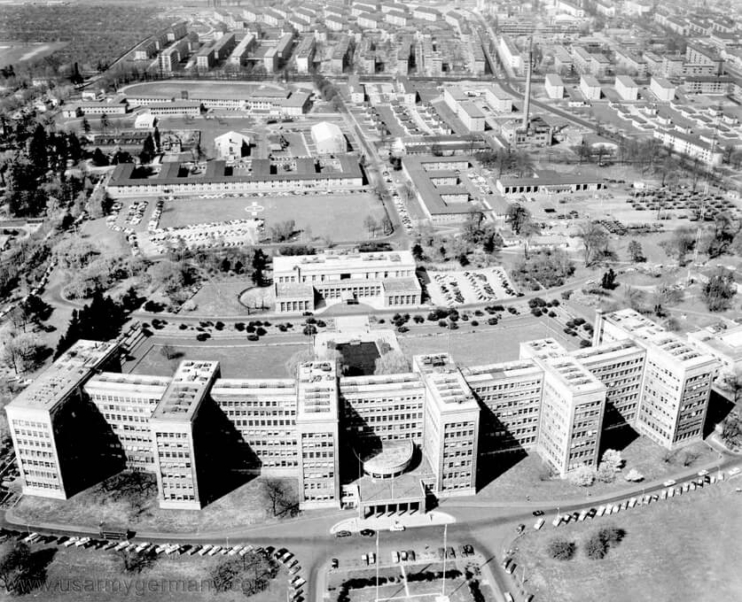

### Oberkommando

Na najwyższym szczeblu zapada decyzja o użyciu Armii Zapasowej. Były to ostatnie oddziały rezerwy strategicznej odbywające szkolenia w głębi Rzeszy, potężna siła której użycie we właściwym czasie mogło poważnie opóźnić postępy Armii Czerwonej. Decyzja pięć dni spóźniona, bo o tym, że mamy do czynienia z sytuacją przełomu było już wiadomo od 13 stycznia. Czy przez te pięć dni Naczelne Dowództwo uważało ofensywę za papierową?

### 1. Front Białoruski

Polakom z 1 Armii WP nie było dane triumfować w zdobytej Warszawie. Już dziś Armia zaczęła wymarsz w kierunku Pomorza. Polska krew miała legitymizować polskość zdobytych na Niemcach ziem północnych, szczególnie Gdańska.

O zasięgu uderzenia 1 Frontu Białoruskiego świadczą nazwy zdobytych miejscowości: Działdowo, Gostynin, Koluszki, Poddębice, Tomaszów Mazowiecki.

### 1. Front Ukraiński

Jednostki 1 Frontu Ukraińskiego zajęły Wieluń, Piotrków Trybunalski, oraz...

Kraków! Wiadomością dnia wczorajszego jest zdobycie Warszawy, niemal cudowne, bo wbrew rozkazom Hitlera Niemcy opuścili miasto prawie bez walki. Dzisiaj taka sama sensacja. Wzięci w kleszcze Niemcy opuszczają Kraków. Bez walki. Przez wiele dziesięcioleci przypisywano ten fakt geniuszowi strategicznemu dowódców sowieckich i ich trosce o tak ważne dla Polaków miasto, które wciąż było niezniszczone. Prawdopodobnie jednak przynajmniej równie ważnym czynnikami był chaos po stronie niemieckiej, opuszczenie miasta i Generalnej Guberni przez gauleitera Hansa Franka, brak realistycznych planów obrony i zalecona podczas ofensywy taktyka okrążania ważnych celów, zgodna z doktryną głębokich operacji. Walki w Krakowie i okolicach lokalnie trwały do 23 stycznia, Niemcy wciąż bronili się w centrum, 18 stycznia to początek walk o miasto. Nie potrwają długo.

Dzisiejszym rozkazem do walk o Kraków wchodzą 59 od północnego zachodu i 60 Armia od południa, a pozostająca dotąd w odwodzie 21 Armia i 1 Korpus Kawalerii rusza w kierunku Tarnowskich Gór i Koźla z zadaniem obejścia Górnego Śląska od północy.

- Sd.Kfz.251/3 Ausf. D "Rossi", numer taktyczny "29", numer rejestracyjny "WH - 1743549", zatonął w Pilicy na terenie wsi Brzustówka. Należał do 2 kompanii wydzielonego oddziału łączności 19 Dolnosaksońskiej Dywizji Pancernej Wehrmachtu (19. Panzer-Division). Przywrócony do pełnej sprawności technicznej należy do Skansenu Rzeki Pilicy w Tomaszowie Mazowieckim [Sd.Kfz. 250 Ausf. B wydobyty w 2015 roku z rzeki Pilicy](https://www.facebook.com/media/set/?vanity=PanzerFarm&set=a.4312563238773772).
- [Opis brawurowej akcji, oddziału zwiadowczego kpt. Czerniakowa o zdobycie i utrzymanie mostu na Warcie w Krzeczowie](https://www.facebook.com/groups/837847453218455/permalink/1473310946338766/)

### KL Auschwitz

Pięć dni temu amerykańskie bombardowanie wyłączyło z użytku fabrykę sztucznej benzyny w Policach k Szczecina. Dziś ostatecznie zakończyła działanie ostatnia fabryka benzyny, jaką dysponowała niemiecka machina wojenna. W obozie pracy KL Auschwitz III Monowitz ogłoszono ewakuację. Luftwaffe i armii pancernej zostają tylko zapasy.

Trwa ewakuacja komendantury i personelu obozowego. Wyjeżdża również Joseph Mengele. 18 stycznia przyjeżdża do Groß-Rosen. Już wkrótce z rozkazu naczelnego lekarza IKL Enno Lollinga zostaje najważniejszą osobą w obozie.

*Zbudowana w latach 1928-30 siedziba IG Farben, Frankfurt nad Menem, projekt Hans Poelzig. 
W czasach hitlerowskich główny koncern chemiczny III Rzeszy. Korporacja zbrodni. Właściciel KL Monowitz, wykorzystywał pracę niewolniczą, przeprowadzał eksperymenty na ludziach, miał 40% udziałów w przedsiębiorstwie produkującym Cyklon B. 
Źródło: [IG Farben Building](http://architectuul.com/architecture/ig-farben-building) [Some rights reserved](http://creativecommons.org/licenses/by-sa/3.0/) [Frankfurt Military Post](http://bibliotecapleyades.net/sociopolitica/sociopol_igfarben08.htm)*

### "Wędrujący kocioł"

Wycofując się w kierunki na Opoczno, w rejonie Białaczowa "Wędrujący kocioł" natknął się na elementy 342 Dywizji i XLII Korpusu. Jak słabe to były siły świadczy fakt, że von Alfhen podaje, iż jego "najcenniejszym uzupełnieniem" był nietknięty oddział artylerii składający się z 12 haubic.

Tymczasem transportowany koleją z Prus Wschodnich Korpus Pancerny Großdeutschland (m in dywizje "Brandenburg" i "Hermann Göring"), zamiast wg planu rozładować się i rozwinąć do walki pomiędzy Łodzią a Piotrkowem Trybunalskim, zatrzymał się w Łodzi. Generał von Saucken uznał, że jednostka nie może wejść do walki na terenie opanowanym przez wroga. Zadanie, które mu wyznaczono, zatrzymanie sowieckiego uderzenie, było już niewykonalne. Słysząc o "Wędrującym kotle" zaczął go szukać, przebijając się w kierunku Sieradza. Było to utrudnione, bo za Majewskim
>Jak pisze generał T. Buse, którego Hitler mianował w tym czasie na miejsce gen. von Luttwitza dowódca 9 Armii, "przez tę lukę płynęły na zachód w nieopisanym chaosie i pośpiechu resztki oddziałów walczących , tyły, oddziały pomocnicze, ewakuujące się urzędy i władze administracji, wojskowej i cywilnej przeważnie bez dowództw i bez broni, przemieszane z długimi kolumnami uciekinierów"

Wyłom, o którym pisze Buse to cały odcinek broniony przez 4 Armię Pancerną i 9 Armię, w tym czasie już jako związki wojsk rozbite. Poszczególne jednostki wycofywały się, szukając ze sobą kontaktu i unikając wykrycia lub dłuższych starć z Armią Czerwoną. Wykorzystując tę sytuację pancerne zagony sowieckie, zamiast niszczyć poszczególne "wędrujące kotły" narzuciły im wyczerpujące tempo w pospiesznym marszu na zachód, zdobywając zwykle atakami z okrążenia lub wielu stron naraz co większe miasta mogące być bazą dla utrzymania terenu. To był wyścig zwycięzców i przegranych.

### Budapeszt

Krwawe walki w Budapeszcie, bezwzględnie traktowani Niemcy i namawiani do poddania się Węgrzy, którzy jednak najczęściej walczyli do końca. Warto to podkreślić, że Węgrzy, choć do koalicji hitlerowskiej przystąpili późno i głównie po to, by odwrócić Trianon, byli wiernymi sojusznikami Hitlera i ostatnimi, którzy go porzucili. Też zresztą nie wskutek decyzji, po prostu Węgry zostały zajęte, a armia węgierska zniszczona. Dzisiaj Armia Czerwona zajęła wschodnią, bardziej historyczną część Budapesztu i historyczną stolicę Węgier - Budę. Wycofujące się wojska niemieckie wysadziły mosty na Dunaju.

### Śląsk

Śląsk zaczął się szykować do wojny, w miastach Górnego Śląska ogłoszono ewakuację. Opuścić domy musieli również mieszkańcy Kluczborka i Olesna. Chaos. 1 Front Ukraiński formuje uderzenie na Tarnowskie Góry i Koźle. Ma to być baza dla oskrzydlenia najcenniejszej dla sowietów części Polski - Górnego Śląska. Górny Śląsk miał nietknięty wpaść w ręce zwycięzców. Tu na marginesie warto dodać, że z samej tylko polskiej części Górnego Śląska II RP miała 1/3 budżetu.

Majewski:
>Bardzo dużo uwagi poświęcono problemowi szybkiego, i bez zniszczeń wyzwolenia Górnośląskiego Okręgu Przemysłowego. Marszałek Koniew wspomina, że w czasie omawiania planu operacji w Głównej Kwaterze Armii Radzieckiej "Stalin [...] ze szczególną uwagą badał na mapie śląski okręg przemysłowy [...]. Nawet na mapie wielkość Śląska i jego potęga wyglądały imponująco. Stalin, jak doskonale zrozumiałem, podkreślił ten fakt, gdy powiedział, wskazując palcem mapę i zakreślając granice rejonu: "Złoto". Zostało to tak powiedziane, że w gruncie rzeczy nie wymagało komentarza.
>Były niemiecki minister uzbrojenia A. Speer pisał na ten temat w swoich Wspomnieniach: "Już 16 stycznia zwróciłem w trybie pilnym uwagę Hitlera na to, że po odcięciu Zagłębia Ruhry od pozostałej części Rzeszy utrata Górnego Śląska musi pociągnąć za sobą szybkie załamanie się gospodarki. Przy pomocy dalekopisu jeszcze raz przekonywałem go o znaczeniu Górnego Śląska i prosiłem, ażeby grupie wojsk Schörnera przydzielić przynajmniej 30 do 50 procent zbrojeniowej ze stycznia".

### Wrocław

We Wrocławiu jeszcze nie ma paniki. Ale zaczyna się masowa już ucieczka, wokół Dworca Głównego i Świebodzkiego zbierają się tłumy. W warunkach wojennych pociągi nie jeżdżą według rozkładu, jeżdżą kiedy kolei uda się podstawić skład. Stąd ta niepewności i konieczność oczekiwania całymi godzinami. Wczorajsze bombardowanie i tłumy wokół dworców to dla wrocławian dopiero zwiastun nadchodzącej grozy.

Dziś kolejny nalot. Tym razem na Brochów i tamtejszy węzeł kolejowy. Słyszany i omawiany w całym mieście. Jeżeli komuś udawało się nie zauważać, lub nie myśleć o tym co się dzieje i co się wydarzy w najbliższej przyszłości, to jest jak kubeł zimnej wody wylany na głowę. Teraz codziennie będą oczekiwać sowieckich bombowców i już się od nich nie uwolnią.

Informacja, że następny nalot nastąpi dopiero 9 lutego nie byłaby żadną ulgą, bo to co się wydarzy jutro i pojutrze dla tysięcy ludzi okaże się gorsze życia pod bombami. W ten weekend zakończy się historia Wrocławia.

### Odnośniki

- [Mało kto wie, jak naprawdę wyzwalano Piotrków. 18 stycznia 1945r. Niemcy w popłochu opuścili miasto](https://piotrkowtrybunalski.naszemiasto.pl/malo-kto-wie-jak-naprawde-wyzwalano-piotrkow-18-stycznia/ar/c1-1256087)
- [Powstanie, którego nie było. Jak Kraków uniknął losu Warszawy](https://www.onet.pl/informacje/onetwiadomosci/powstanie-krakowskie-1944-dlaczego-w-krakowie-nie-wybuchlo-powstanie/2ms4jdf,79cfc278)
- [Wyzwolenie Sulejowa](https://sciaga.pl/tekst/24086-25-wyzwolenie_sulejowa)
