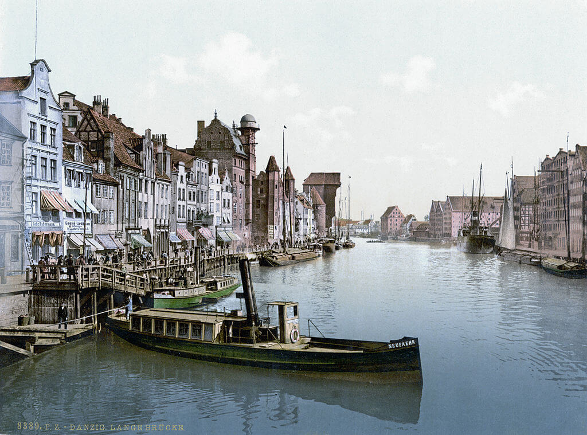

### Bombardowanie Würzburga

RAF zbombardował Würzburg (Frankonia, czyli Bawaria), zginęło 5 tys. osób.

Użyto sprawdzonej techniki niszczenia miast. Najpierw spadły bomby burzące, kilkaset, niewielka ilość mających dużą moc eksplozji co zapewniło wybicie wszystkich okien i powstanie szczelin w dachach. Potem zrzucono tysiące niewielkich bomb zapalających, powstały lokalne ogniska pożarów i burze ogniowe o temperaturze przekraczającej tysiąc stopni. Takie ogniska pożarów były ogromnymi pompami ciepła wysyłającymi rozgrzane powietrze do góry, zasysało to powietrze z całej okolicy w stronę pożaru. Na ziemi rozpętało się piekło. Jeżeli weźmiemy pod uwagę wielkość populacji / miasta było to najbardziej zabójcze i niszczące bombardowanie tej wojny.

To niewielkie miasto, obecnie ma 120 tys ludzi i 80km2. Przed wojną było to 100 tys ludzi. 6 kwietnia wkroczyła tam armia amerykańska. W zrujnowanym mieście mieszkało 35 tys ludzi. Sporządzony 10 kwietnia raport podsumowujący rezultaty bombardowania wyliczał, że miasto zostało zniszczone w 90%, a przedmieścia w 70%. Usunięcie gruzów zajęło 20 lat.

### Maurice Halbwachs

W obozie koncentracyjnym Buchenwald zmarł w powodu czerwonki Maurice Halbwachs, socjolog francuski, przedstawiciel szkoły Durkheima.

Jego kariera podczas wojny była niezakłócona, 10 maja 1944 dostał nominację profesorską na College de France. 23 lipca Gestapo aresztowało go za interwencję w sprawie szwagra, który był Żydem. Wystarczyło, żeby usiłował ratować krewnego, żeby wysłać go do obozu koncentracyjnego.

### Gdańsk

Ostatnim niemieckim dyrektorem gdańskiego Muzeum Miejskiego był prof Wille Drost. Jego syn wspomina:
>16 marca: cięż­kie naloty, rozległe pożary, zniszczony kwartał między ulicami Ogarną, Słodowników i Zbytki, spichlerze na Wyspie Spichrzów, ulice Długie Ogrody, Szeroka, Wa­łowa; 18 marca: naloty, płonie Ratusz Głównego Miasta, muzeum miejskie, pocz­ta przy ul. Długiej; 23 marca: naloty i ostrzał, zniszczenia na ul. Tkackiej, za­grożona Zbrojownia, zniszczenia w szpita­lu św. Ducha, w Fabryce Farb i Lakierów w Oliwie; 24 marca: naloty i ostrzał śród­mieścia i Wrzeszcza

Prawdziwa tragedia dla Gdańska dopiero nadejdzie.

*Gdańsk, Motława 1890-1900. 
By nieznany - Ten image pochodzący z zasobów [Biblioteki Kongresu Stanów Zjednoczonych](https://commons.wikimedia.org/wiki/Library_of_Congress), oddziału Prints and Photographs division jest dostępny pod numerem [ppmsca.00753](http://hdl.loc.gov/loc.pnp/ppmsca.00753).Ten szablon nie wskazuje stanu prawnego pliku. Standardowy szablon licencji jest nadal wymagany. Aby dowiedzieć się więcej zajrzyj na stronę [Commons:Licencja](https://commons.wikimedia.org/wiki/Commons:Licencja)., Domena publiczna, [Link](https://commons.wikimedia.org/w/index.php?curid=482068)*

### Śląsk

Walki w rejonie Dobrosławic i Maciowakrza (15 km na wschód od Głubczyc). [NA PÓŁNOC OD BABOROWA – BAUERWITZ 1945](https://www.facebook.com/bobr1945/posts/3751032145010421)

### Wrocław

Wczoraj jakby mający już zupełnie inny humor, nie poczuwając się do relacji z Eliaszem, ksiądz Peikert pisze zadowolony wiosną:
>Mamy dziś piękny wiosenny dzień. I gdy odprawiam egzekwie, słońce przedziera się przez mgłę, szpaki szczebiocą na suchych gałęziach drzew, a kos wyciąga swój piękny trel. Cóż za kontrast pomiędzy władztwem przyrody a poczynaniami ludzi! Czuć, że nadchodzi wiosna, a radość zmartwychwstania przenika dzieło stworzenia. Czy dla nas ludzi zniknie też wkrótce noc wielkopiątkowych cierpień i czy napełni nas radość Wielkiej Nocy?

Dzisiaj natomiast widząc tą samą wiosnę, zapisuje zupełnie inną, gorzką refleksję (moglibyśmy dodać, że o wiele bardziej odpowiednią dla sformułowanych oczekiwań wobec świąt wielkanocnych)
>Noc była znów względnie spokojna. Dziś, podobnie jak i wczoraj, jest wspaniały wiosenny dzień z ciepłą, łagodną pogodą. Błękitne niebo, słońce, rozśpiewane kosy, szpaki i zięby. Zdaje się, jakby przyroda drwiła sobie z tego, co czynią ludzie

Co się stało poprzedniego wieczora? Skąd ta różnica?

