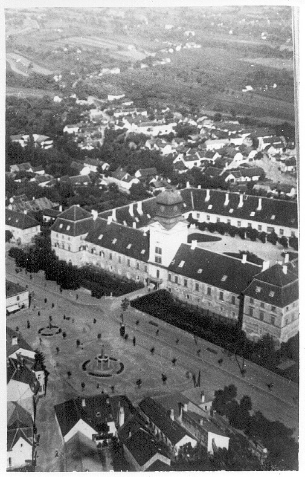

### Churchill

Winston Churchill udał się na linię frontu, podczas rozmowy Eisenhower powiedział mu o doskonałym punkcie widokowym w pewnym domu w Büderich tuż nad Renem. Rozciągał się stamtąd widok na pole bitwy. Ale kiedy tam przybyli przez lornetki mogli zobaczyć tylko rozległe łąki na wschód od Renu, Niemcy się nie pokazywali. Eisenhower musiał się udac do swoich obowiązków, Churchill tymczasem zobaczył amerykańską amfibię. Zdecydował się przekroczyć Ren. Towarzyszyli mu marszałkowie Monty, Alan Brooke, komandor Tommy Thompson i generał Simpson oraz sześciu żołnierzy amerykańskich. Kiedy wylądowali po drigiej stronie okazało się że walki toczą się zaledwie 2 km dalej. Skierowali się w stronę Wesel i tam weszli na znajdujący się na nasypie zniszczony most kolejowy, z którego przyglądali się wojnie. Zgrupowanie ludzi na moście musiało zostać dostrzeżone przez obserwatorów artyleryjskich bowiem już po chwili niecałe 100 m od nich w rzekę trafiły cztery pociski artyleryjskie. Z trudem udało się namówić Churchilla do zejścia z mostu i powrotu.

26 marca generał Miles Dempsey zorganizował mu kolejną wyprawę na wschodni brzeg Renu samochodem przez most pontonowy na wysokości Xanten. Auto Churchilla minęło kolumnę zdumionych jeńców niemieckich. Powrócił amfibią.

- [Mark Felton Productions "Winston Churchill - Nearly Killed by the Germans in 1945" [YT 10:26]](https://www.youtube.com/watch?v=eMuw_BsfmV4)

### U 234

Z Kilonii wypłynął U 234 i po dwóch dniach dotarł do Kristiansand w Norwegii. Jego misja była ściśle tajna i płynął przez Atlantyk zachowując ciszę radiową.

Po kapitulacji Niemiec szystkie jednostki morskie otrzymały rozkaz poddania się do niewoli. Do U 234 ten rozkaz dotarł dopiero 10 maja. Kapitan postąpił zgodnie z rozkazem, zgłosił swoją pozycję i wywiesił czarną flagę na peryskopie.

Okręt ten wiózł niezwykły ładunek do Japonii: ponad pół tony tlenku uranu dla japońskiego programu atomowego, bomba kierowana Hs 293, plany Me 262 i innych nowych typów broni i 5 mln dolarów. Na pokładzie byli również niemieccy eksperci od lotnictwa i broni rakietowych oraz dwóch japońskich oficerów specjalistów od budownictwa okrętowego i lotniczego. Na wieść o kapitulacji Japończycy popełnili samobójstwo przedawkowując środki nasenne.

- [Mysterious Cargo – U 234](http://dubm.de/en/mysterious-cargo-u-234/)

### Unternehmen Karneval

Jedyna udana akcja Werwolfu. Zrzuceni na spadochronach z przechwyconego B-17 wyszkoleni agenci wylądowali w Holandii, zabili strażnika na granicy i dostali się do okupowanych przez Amerykanów Niemiec. Niespodziewanie kluczową rolę w operacji odegrała 23-letnia Ilse Hirsch, aktywistka BDM (niem. Bund Deutscher Mädel).

Zastrzelili Franza Oppenhoffa burmistrza Akwizgramu uznanego przez nazistów za kolaboranta. Miało to byc ostrzeżenie dla wszystkich współpracująych z aliantami.

Wszyscy czlonkowie grupy oprócz dowódcy zostali schwytani i osądzeni. Dostali wyroki od roku do 4 lat więzienia. Hirsch puszczono wolno.

### Masakra w Rechnitz

W austriackim Rechnitz znajdował się obóz pracy. Kilka dni wcześniej 600 więźniów obozu, węgierskich Żydów Lager Wald zostało wywiezionych do Burg, do pracy przy umocnieniach Südostwall (aka Reichsschutzstellung). 200 z nich nie było w stanie pracować, więc odesłano ich z powrotem. 24 marca w pałacu Rechnitz odbywało się przyjecie miejscowych notabli NSDAP i SS. Przyjęcie wydała hrabina Margit von Batthyany. Uczestnicy tego przyjęcia zamordowali 180 więźniów, którzy zostali pochowani przez 15 pozostawionych przy życiu. Tych zabito następnego dnia. Hrabiostwo wyemigrowało do Szwajcarii i nikt ich nie niepokoił w tej sprawie. Nikt nie został ukarany za tę zbrodnię.

*Pałac Rechnitz. 
By Anonymous / unknown photographer - [Batthyány Family and Castle](http://www.gedenkweg.at), Domena publiczna, [Link](https://commons.wikimedia.org/w/index.php?curid=57691678)*

### Warszawa

Wraca normalne życie do stolicy, w Warszawie pierwszy towarzyski mecz piłkarski: Polonia i Okęcie Warszawa spotkały się na stadionie AZS w Parku Skaryszewskim. Mecz zakończył się remisem 3:3, ale tylko jedna bramka padła w pierwszej połowie. Kilka tysięcy widzów przeżyło wielkie emocje.

### UPA

Oddział UPA w mundurach sowieckich zajął wieś Kryłów k Hrubieszowa i z zaskoczenia wtargnął na posterunek MO. Zamordowali 17 związanych funkcjonariuszy MO i 28 cywilnych mieszkańców wsi. Dowódca posterunku major Stanisław Basaj został rozpoznany, bo był za okupacji dowódcą BCh, został pojmany, wywieziony, torturowany i zmordowany.

### Gdańsk

2 Front Białoruski: Stogi!

"Gazeta Lubelska" nr 42 z 26 marca 1945:
>Radzieckie Biuro Informacyjne donosi, że 25 marca wojska 3. Frontu Białoruskiego, kontynuując operacje, mające na celu zniszczenie okrążonych w Prusach Wschodnich wojsk niemieckich, zajęty miasto Święta Siekierka (po niemiecku Heiligenheil), ostatni punkt obrony nie­mieckiej na południowy zachód od Królew­ca. [...] Wojska radzieckie, posuwające się w kierunku Gdańska, zajęły przedmieście Gdańska Oliwę. 24 marca wzięto do niewo­li w tym rejonie przeszło tysiąc jeńców.

Gdańszczanie stali się ofiarą wojny dwóch totalitaryzmów. Gdańsk jest już pod ostrzałem artyleryjskim. Oficerowie widząc skalę zaangażowanych sił i możliwości obrony wątpią w sens walki. Kiedy Hitler się o tym dowiedział wydał rozkaz
>Każdy metr kwadratowy obszaru Gdańsk-Gdynia winien być zdecydowanie broniony

Generałów Spechta i Weissa aresztowano, odesłano samolotem do Berlina i rozstrzelano. Żołnierzy i szeregowców i oficerów przyłapanych na braku entuzjazmu bitewnego wieszano na drzewach na Adolf-Hitler-Alee. Napis na powieszonych "*Tak będzie z każdym, kto opuści po­sterunek bez rozkazu*".

Miasto było pełne uchodźców, którzy myśleli, że znajdą tu schronienie, a kto wie, może i ewakuację na zachód. Bombardowanie artyleryjskie trwało do 17 marca. Gdańsk bombardowały samoloty sowieckie, a 19 i 20 marca również alianckie. W tych dniach liczba ofiar śmiertelnych sięgnęła tysięcy.

### Wrocław

Tymczasem we Wrocławiu.

Hendrik Verton:
>Zbliżała się Wielkanoc i przemknęła chłodna zimowa pogoda. Warstwa wcześniej białego puchowatego śniegu pokrywająca gruzy Breslau, stała się teraz brudna, czarna. Oblężone miasto przez ostatnich dni było niezwykle spokojne. Było tak jakby nowo przebudzona "matka natura" powiedziała "Stój!" okropnościom wojny [...] 
>Bolszewicy stawiali zaciekły opór, zwłaszcza że sami tej samej nocy [...] przygotowywali cały batalion do ataku. Na tym w całości liczącym tylko 30 x 30 m placu było to krwawe żniwo, gdzie bolszewicy poza 82 szt. broni maszynowej, 12 zamontowanymi miotaczami ognia, 10 000 szt. amunicji strzeleckiej stracili ponad 200 zabitych i dużą ilość różnorakich materiałów. [...]Z nie wzruszonym zdecydowaniem spadochroniarze wraz z nacierającymi towarzyszami z innych batalionów kontynuują kontratak, aż jeszcze tego samego dnia odtworzona została w większej części zasadnicza rubież obrony przed gniazdem. Ta część akcji wcale nie była łatwiejsza, gdyż trzeba było pokonać płaską jak stół wolną przestrzeń, która z wielu stron była silnie ostrzeliwana przez przeciwnika. 
>Najgorsze było oddziaływanie czołgów nieprzyjaciela, które początkowo uniemożliwiały nam odbicie ostatniego odcinka okopów. Dopiero następnego ranka po nowym ataku grupy uderzeniowej udało się w pełni odtworzyć poprzednie położenie. Od tej chwili stara rubież obrony wraz z umocnieniami na północy Wrocławia znalazła się ponownie w naszych rękach. 
>Dowódca spadochroniarzy, wysoki, jasnowłosy major gdzieś z Meklemburgii, powiedział o tej akcji: Że odbijemy północny filar naszej twierdzy, było mi wiadome. Ale z jaką siłą będą szturmować i fanatycznie jak tygrysy rzucą moi spadochroniarze się odważnie na bolszewików, sam bym nigdy nie przypuszczał i to powoduje, że z moich chłopaków jestem jeszcze bardziej dumny!

Hartung:
>Ta Niedziela Palmowa aurą przypomina raczej Zielone Świątki niż zbliżającą się Wielkanoc. Jest słoneczna i wypełniona ptasim śpiewem. Po południu zaczyna się jednak tak burzliwy ostrzał, że ptaki milkną, a wiosenny błękit nieba zasnuwa ciężki, gryzący dym wielkich pożarów. To mój ostatni dzień w lazarecie. Otrzymuję żołd i kapitan lekarz, dr W. umieszcza w moich papierach adnotację: "wypisany na własne życzenie". Bo w gorących piwnicach nie sposób już dłużej wytrzymać.

Peikert o oddziałach niszczycielskich:
>Wznoszą się olbrzymie słupy dymu, gdyż dziś rzucono także wiele bomb zapalających. Szczególnie przygnębiające są wiadomości o szale pustoszenia i obłędzie niszczenia, które ogarnęły nasze własne kierownictwo partyjne i wojsko. Ludzie, którym siłą narzucono obowiązek pracy i którym polecono opróżniać mieszkania z mebli, zwłaszcza na Tauentzienstraße, Webskystraße i Königgrätzerstraße, są bardzo przygnębieni tą pracą w służbie niszczenia cennego dorobku rodzin. Opróżnia się wszystkie piętra, okna rozbija, wszelkie zaś ruchomości wyrzuca na ulicę: zarówno komfortowe, jak i proste wyposażenie pomieszczeń, cenną biżuterię rodzinną i ulubione świętości rodzinne, pamiątki tradycji rodzinnej, obrazy i figury świętych, modlitewniki i krucyfiksy, wszystko leci na ulicę. 
>Na dodatek do cna opróżnia się szafy i szuflady z odzieżą i bielizną pościelową; wszystko wywala się na ulicę, aby następnie podpalić. Tym sposobem wczoraj na Webskystraße i Tauentzienstraße szalał olbrzymi pożar. Rozpoczęło się już palenie ciągów budynków. Gigantyczne pióropusze dymu unosiły się ku niebu i wskutek łagodnej pogody zalegały nad miastem niby opary siarki. Mógł sobie księżyc wieczorem zlewać na miasto swoje srebrzyste blaski jak najpiękniej: niebo było purpurowe od pożogi całego ciągu ulicy. Cóż to za żałosny akt samounicestwienia narodu, o jakież drżenie i trwogę przyprawia każdego człowieka ten obłędny postępek, a jednak nikt nie znajduje dość siły, by mu się przeciwstawić! Wojsko i ludność cywilna są pomocnikami tego obłędu niszczenia narodowosocjalistycznego rządu. Ale jakże ci ludzie poniżają naród niemiecki. Zaprawdę lepiej nadawaliby się oni na przywódców bandy rozbójników niż na przywódców jednego z pierwszych cywilizowanych narodów świata, który przez swój bestialski światopogląd sprowadzili na takie dno upodlenia.

### Odnośniki

- [25 marca 1945 – mecz wśród ruin](https://www.warszawa.pl/miasto/25-marca-1945-mecz-wsrod-ruin/)

