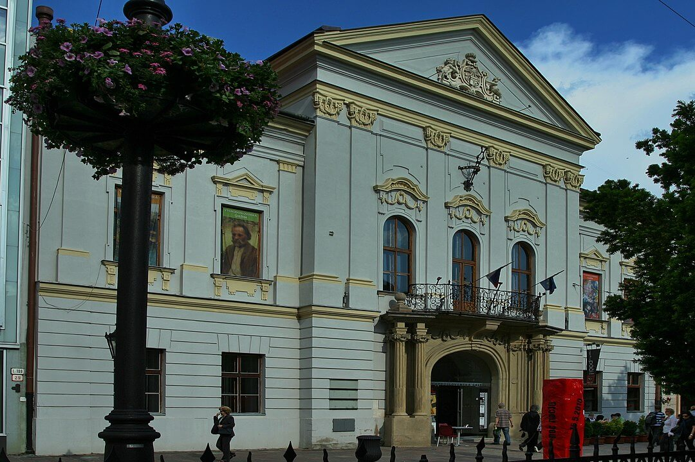

### Japonia

Mołotow powiadoomił japońskiego ambasadora w Moskwie, Satō Naotake, że zawarty 13 kwietnia 1941 i wciąż obowiązujący japońsko-sowiecki układ o nieagresji nie zostanie przedłużony i wygaśnie w ciągu roku.

Jeszcze przed jego wygaśnięciem i na podstawie uzgodnień jałtańskich Armia Czerwona zaatakowała 8 sierpnia 1945 pozycje Armii Kwantuńskiej - operacja kwantuńska. Sowiecki Front Zabajkalski dowodzony przez marszałka Rodiona Malinowskiego (dotychczasoweog dowódcę 2 Frontu Ukraińskiego) wziął krwawy odwet za klęskę pod Cuszimą. Przy niewielkiej dysproporcji sił (1,5 mln czerwonoarmistów i 1,2 mln Japończyków) w ciągu 12 dni Armia Kwantuńska została rozgromiona i ponad pół miliona żołnierzy japońskich dostało się do niewoli.

Taki był koniec wojny prowadzonej przez Japonię:

- 1 kwietnia - 22 czerwca bitwa na Okinawie
- 6 sierpnia bomba atomowa na Hiroszimę
- 8 sierpnia początek operacji Kwantuńskiej
- 9 sierpnia bomba atomowa na Nagasaki
- 14 sierpnia orędzie cesarza, wyemitowane następnego dnia
- 20 sierpnia koniec operacji kwantuńskiej, Armia Kwantuńska pokonana
- 2 września kapitulacja

Więcej o wojnie z Japonią: [Wojna na Pacyfiku](/festung-breslau/article/wojna-na-pacyfiku)

### Samobójstwa hitlerowców

Kolejny hitlerowiec popełnia samobójstwo w obliczu klęski. Arthur Rödl, pierwszy komendant Groß-Rosen, znany z pijaństwa, okrucieństwa i tępoty, wysadził się granatem w Szczecinie.

### Operation Blücher

Ale nie wszyscy hitlerowcy mieli kryzys morale. W Galii wciąż trzymała się jedna... nie, nie wioska, cała twierdza, jedna z tych tzw twierdz powołanych rozkazem Hitlera z 4 września 1944 - Festung Dünkirchen. Ta sama Dunkierka, z której Brytyjczykom udało się ewakuować podczas Operacji Dynamo ponad 300 tys żołnierzy.

W 1945 Twierdza Dunkierka dowodzona przez fanatycznego wiceadmirała Friedricha Frisiusa również stała się ostatnim punktem oporu. Atakowana najpierw przez Kanadyjczyków, potem od 8 października przez 1 Czechosłowacką Brygadę Pancerną była ostatnim niemieckim punktem oporu na francuskiej ziemi. Ale nie tylko oporu, dziś stała się miejscem ostatniej niemieckiej operacji ofensywnej poza Niemcami, a jeżeli pominąć tereny byłego NRD to w ogóle. Słabo uzbrojone czechosłowackie oddziały zaczęły ustępować (tracąc w walce 167 zabitych) i doszło do tego, że wysłani z pomocą Kanadyjczycy zabrali się za wysadzanie mostów, żeby nie dopuścić do przełamania frontu. W efekcie ofensywy Niemcy odzyskali przedpole utracone w 1944 wysuwając się kilkanaście km na kierunku natarcia.

Dunkierki nie udało się zdobyć. Walki trwały do 4 maja, Twierdza skapitulowała 9 maja.

- [Mark Felton Productions "Operation Blücher: The Last German Attack in France, April 1945" [12:56]](https://www.youtube.com/watch?v=FXqg-6YKU7Q)

### Rajd na Cap de la Hague

Od 30 czerwca aż do samego końca wojny, do 9 maja 1945 w niemieckich rękach były dwie brytyjskie wyspy na Kanale ok 50 km od wybrzeża Francji: Guersney i Jersey. Ze wzgledu na położenie, znaczenie strategiczne i kwestie prestiżowe (jedyne okupowane terytorium Wieliej Brytanii) na obu snajdował się duży niemiecki garnizon i obie były potężnie, w zasadzie ponad potrzeby ufortyfikowaane.

Artyleria, która się na nich znajdowała nie była zagrożeniem dla aliantów. Obie były małe, w sumie nieceałe 200 km2 (obecnie Wrocław ma 300), więc po inwazji obie pozostawiono nie atakując ich. Z powodu izolacji nie otrzymywali żadnej pomocy ze strony własnych sił i w lutym 1945 garnizon obu wysp znalazł się na krawędzi przetrwania. Ale nie był to żaden powód do kapitulacji. W grudniu 1944 z obozu jenieckiego w pobliskim Granville na te wyspy uciekło kilku żołnierzy niemieckich. Dzięki temu Niemcy wiedzieli sporo zarówno o mieście jak i porcie, wiedzieli jaki tam jest garnizon i ilu tam jest jeńców.

Już 8 marca przeprowadzili udany rajd na port Granville. Dziś w wyspy Jersey przeprowadzili akcję sabotażową na stację radarową na Cap de la Hague. Tym razem atak zakończył się niepowodzeniem. Po desancie z gumowych pontonów niemiecka załoga została wzięta do niewoli. Radary nienaruszone.

- [Mark Felton Productions "German Sea Wolves - The Granville Raid 1945" [YT 11:18]](https://www.youtube.com/watch?v=s7szB5So5Gs)

### Texel

Dziś w nocy 5 na 6 kwietnia 822 Gruziński Batalion Piechoty (niem. Georgische Infanterie Bataillon 822 "Königin Tamara"), który powstał w 1943 i stacjonował na holenderskiej wyspie Texel (60 km na północ od Amsterdamu) wszczął antyniemiecki bunt. Wkradli się do kwater i zabili prawie 250 żołnierzy niemieckich. Nie udało im się opanować baterii artyleryjskich ani uzyskać pomocy aliantów. Pomimo początkowego sukcesu najpierw padli ofiarą ostrzału artyleryjskiego, a potem desantu spieszonego oddziału Kriegsmarine. Walki o maleńką wyspę (160 km2 - połowa współczesnego Wrocławia) ciągnęły się 5 tygodni i trwały jeszcze 20 maja kiedy wreszcie wylądowali alianci. Z początkowej liczby 800 Gruzinów 565 zginęło. Zginęło tez ponad 800 Niemców i 117 holenderskich mieszkańców wyspy. 228 ocalałych Gruzinów wysłano do sowietów gdzie zostali skierowani do gułagów. Część przeżyła i po 1956 powrócili do ojczyzny. Ostatni uczestnik buntu zmarł w 2007 i został pochowany z honorami.

### Koszyce

Utworzony w Moskwie w marcu 1945 komunistyczny rząd czechosłowacki pod kierownictwem Klementa Gottwalda stacjonuje w Koszycach - mieście dzięki położeniu ważnym w historii obu krajów, to w Koszycach od XVI wieku działa uniwersytet, wydane zostały przywileje koszyckie dla polskiej szlachty.

Dziś na pierwszym posiedzeniu plenarnym rządu Frontu Narodowego Czechów i Słowaków ogłoszono tzw. Koszycki Program Rządowy (słow. Košický vládny program) zapowiadający równoprawnej dla Czechów i Słowaków Czechosłowacji, ustrój demokracji ludowej, sojusz ze Związkiem Radzieckim, konfiskatę mienia zdrajców i kolaborantów oraz wypędzenie przybyłych po pakcie monachijskim Węgrów i Niemców. W rzeczywistości Program powstał w wyniku negocjacji pomiędzy przedstawicielami stronnictw politycznych przyszłego Frontu Narodowego w Ambasadzie Czechosłowacji w Moskwie w dniach 22-29 marca. To właśnie tam wykuwała się powojenna Czechosłowacja i brali udział w tym również demokratyczni politycy. Wiele to mówi na temat różnic w polityce czeschosłowackiej i polskiej.

Premierem ogłoszony został Zdeněk Fierlinger, polityk przedwojennego rządu czechosłowackiego, związany z Edvardem Benešem, od 1937 na placówce w Moskwie. Tam został agentem NKWD. Pełnił funkcję premiera az do wyborów w 1946.

Do przewrotu, czy raczej zamachu w lutym 1948 Czechhosłowacja pozostawała krajem w zasadzie demokratycznym.

### Bratysława

Tak się złożyło, że również dziś Armia Czerwona zdobyła Bratysławę - stolicę Słowacji.

*Dom Gminny (Župný dom), w którym ogłoszono Program Kkoszycki. 
By [Rl91](https://commons.wikimedia.org/wiki/User:Rl91) - Praca własna, [GFDL](http://www.gnu.org/copyleft/fdl.html), [Link](https://commons.wikimedia.org/w/index.php?curid=11371955)*

### Węgry

Wehrmacht wycofał się z Węgier, był to ostatni sojusznik III Rzeszy.

### Kępa Oksywska

Do 5 kwietnia trwa opór oddziałów niemieckich zepchniętych na Kępę Oksywską. Część się poddała. Części udało się ewakuować na Hel gdzie pozostali do końca wojny.

Westerplatte wciąż się broni.

### Górajec

O 21.00 czyli właściwie w nocy z koszar wyruszył 2. Samodzielny Batalion Operacyjny KBW mający zadanie likwidacji sztabu UPA, który wg danych wywiadu stacjonował we wsi Górajec. Rano dokonają ataku na wieś, okaże się że była to pomyłka, nie tylko nie ma sztabu UPA, ale w ogóle żadnej jednostki. Później przy współudziale polskich mieszkańców wsi zamordowali 174 Ukraińców, w tym kobiety i dzieci.

### Wrocław

Natomiast na froncie wrocławskim wydaje się, że wróg został chwilowo zatrzymany, impet nieprzyjacielskiego natarcia osłabł, było wprawdzie kilka niebezpiecznych kierunków a straty były ogromne. Ale każdego dnia zdobycze sowieckie były coraz mniejsze i na coraz mniejszych odcinkach.

Tak z pewnością wyglądało to w propagandzie twierdzy. Jej komendant generał Hermann Niehoff, napisał na zakończenie dzisiejszego dnia, w nocy następujący radiogram:
>Tajna sprawa dowodzenia Nr 4276/45 K dow 
>Dowódca Twierdzy Wrocław melduje w nocy z 5/6 4. 45. do Grupy Armii Środek 
>Na zachodnim odcinku frontu nieustające ciągle ponawiane, ataki piechoty i czołgów nieprzyjaciela z najwyższym zużyciem amunicji. Siła własnego oporu jest, w wyniku przemęczenia, ognia i falowych nalotów lotniczych, na wyczerpaniu. Nieprzyjacielskie włamania są ryglowane tylko z największym trudem. Wystąpiły objawy paniki, zwłaszcza w Volkssturmie. ludność cywilna licząca około 140 000 głów, stłoczona jest w ciasnych nie wystarczających do pomieszczenia wszystkich piwnicach i ogarnięta rozpaczą. Proszę o odsiecz w najbliższym czasie lub o decyzję - czy się przebijać przez linie przeciwnika, czy też bronić się do końca? Co zrobić z ludnością cywilną? 
>Niehoff generał piechoty

Hermann Niehoff przypomina w ten sposób o obietnicy dowódcy Grupy Armii Środek Ferdinanda Schörnera, który właśnie dziś został mianowany feldmarszałkiem. Niehoff razem z nominacją na komendanta twierdzy Wrocław został powiadomiony, że jeśli utrzyma Wrocław przez dwa tygodnie, to Schörner zmontuje odsiecz i "poda mu rękę". Minął miesiąc. Jak wkrótce zobaczymy na tą odsiecz wrocławianie jeszcze długo będą czekać.

### Paul Peikert

Peikert towarzyszył nam od początku naszej kroniki i właśnie wczoraj go pożegnaliśmy. Wiele razy jeszcze powróci, jest zbyt ważną postacią, ale jego kronikę przestaliśmy cytować. Czasem mogliśmy odnieść wrażenie, że jego pamiętnik jest rodzajem ucieczki, że zostawiał tam zdania, których nie mógł powiedzieć, bo było to zbyt niebezpieczne.

Relacja księdza Peikerta jest pierwszą wydaną w Polsce pracą tego typu i zarówno jej jakość jak i szeroka znajomość stawiają ją w szczególnym miejscu wśród prac poświęconych bitwie o Wrocław. Tym bardziej jest dziwne i godne pożałowania, że do dziś mamy do czynienia tylko z okrojoną i ocenzurowana wersją tekstu. Jest to dokładnie to co zostało wydane ponad 60 lat temu w 1963. Ernst Hornig znał tą książkę i słusznie podnosił zastrzeżenia co do jej autentyczności i kompletności. Najwyższa już jest pora na pełne i krytyczne wydanie relacji Peikerta.

### Hugo Hartung

Hugo Hartung wczoraj opisuje wczoraj bardzo podobną historię do pamiętnej wiosny obserwowanej tylko z ubikacji szpitalnej:
>Najpiękniejszą porą dnia jest dla mnie zawsze poranek, gdy przynoszę z podwórkowej studni wodę w naszej jedynej blaszanej misce i mogę się na dworze ogolić przed kawałkiem lustra. Wydarzeniem staje się również wyprawa do WC, mimo że od dawna nie ma tam wody w spłuczce. Przez małe okienko widać stamtąd bowiem gęsto okwiecone gałęzie wiśni

Po szoku wszechobecnej zagłady celebracja zwyczajnych czynności dnia staje się reakcją obronną. Okazuje się, że jest przed czym, bowiem dziś:
>Zwołano wszystkich na smutny ceremoniał w podwórzu. W myśl rozporządzenia żołnierze powinni stawić się nań w pełnym rynsztunku bojowym. Jednak przepisowe wyposażenie wystarcza tylko dla pierwszego rzędu ustawionych w czworobok mężczyzn. Kobiety z domu od ulicy zbierają się przy pompie i z ciekawością słuchają komunikatu który odczytuje sierżant. Młody żołnierz z naszego batalionu, którego wielu kolegów znało i lubiło, trafił wczoraj za plądrowanie przed sąd wojenny. Wyrok śmierci został wykonany natychmiast po procesie. Obwieszczenie głosi, że w jednej z południowych dzielnic miasta razem z ojcem wyniósł z willi przeznaczonej do wysadzenia dwa materace, które mógł wykorzystać do urządzenia swojego nowego mieszkania. Był odznaczony Żelaznym Krzyżem za męstwo w walce z wrogiem. Zaraz po tym straszliwym komunikacie, którego ludzie wysłuchali z obojętnym wyrazem twarzy, z szeregu musi wystąpić pewien kapral z naszej kompanii. Zostaje zdegradowany z powodu "tchórzostwa w obliczu wroga". Widok człowieka, któremu drżą usta, gdy z jego munduru zrywane są galony, dotyka mnie do żywego. Ma przejść do batalionu karnego, co w zasadzie niewiele się różni od wyroku śmierci.

Proszę zwrócić uwagę na bezwzględność prawa twierdzy, willa była przeznaczona do wyburzenia, materace uległyby zniszczeniu. Ale ciągle jest to plądrowanie, wiemy że wszyscy wrocławianie plądrowali nieustannie, nie było innego wyjścia. To co mieli własnego, uległo zniszczeniu lub zostało utracone. Musieli brać to co mogli znaleźć, wokół nich ginęli ludzie, po bombardowaniu były całe obszary miasta gdzie nie było komu zbierać trupów. Martwi ludzie leżeli na ulicy. W tym trwającym od tygodniu koszmarze dylemat związany z przywłaszczeniem rzeczy de facto pozbawionej właściciela jest absurdalnym luksusem. Ale za każdym razem można ponieść konsekwencje ponieważ jest to zakazane. Nieliczni zostali na takim przywłaszczeniu schwytani i musieli ponieść absurdalną karę. Twierdza chwytaniu się za wszelką cenę rygoru prawa posunęła się do tego, że zabiła własnego żołnierza i ryzykowała morale całego oddziału.
