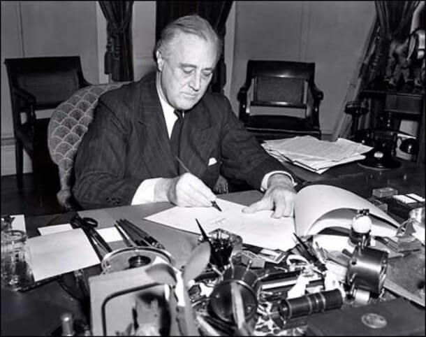

### Śmierć Roosevelta

Kiedy na początku kwietnia wybuchła afera z nieszczęsną depeszą Eisenhowera do Stalina, najbardziej zaangażowany w wojnę polityk demokratyczny, premier Wielkiej Brytanii Winston Churchill usiłował zniwelować szkody, przede wszystkim z ścisłej łączności z prezydentem USA Franklinem Delano Rooseveltem. Odpowiedzi, które otrzymywał były dziwne i nie takie jakich by oczekiwał. Zdawkowe, pozbawione istotnej treści powodowały najwyższe zaniepokojenie Churchilla, coś się dzieje, nie wiedział dokładnie co, mógł tylko podejrzewać, że to nie Roosevelt mu odpowiada. Istotnie, byli to urzędnicy z otoczenia prezydenta, którzy chcieli ukryć fakt, że prezydent kraju toczącego wojnę na kilku kontynentach jest w ciężkim stanie i umiera.

12 kwietnia 1945 Roosevelt zmarł, władze automatycznie przejął dotychczasowy wiceprezydent Harry Truman. Pierwszy prezydent USA kojarzony z zimną wojną i Żelazną Kurtyną. Śmierć Roosevelta w niczym nie zmieniła polityki USA, ani nie przeszkodziła w dalszej współpracy aliantów. Zwycięstwo, i to wspólne bez separatystycznych umów, zwieńczone bezwarunkową kapitulacją było w najlepszym interesie obu walczących stron, zarówno sowietów Stalina jak i aliantów zachodnich. Najpierw trzeba było dokończyć wojnę w Europie z dogorywająca III Rzeszą, potem z Japonią.

*Prezydent Roosevelt podpisuje ustawę lend-lease o pomocy dla Wielkiej Brytanii, Chin i Grecji. 
By Associated Press photograph. No. 21773. Forms part of: New York World-Telegram and the Sun Newspaper Photograph Collection (Library of Congress). SUBJECTS: Roosevelt, Franklin D. (Franklin Delano), 1882-1945. World War, 1939-1945--Economic &amp; industrial aspects. Document signings--Washington (D.C.)--1940-1950. FORMAT: Portrait photographs 1940-1950. Photographic prints 1940-1950. PART OF: New York World-Telegram and the Sun Newspaper Photograph Collection (Library of Congress) REPOSITORY: Library of Congress Prints and Photographs Division Washington, D.C. 20540 USA DIGITAL ID: (b&amp;w film copy neg.) cph 3c28765 [http://hdl.loc.gov/loc.pnp/cph.3c28765](http://hdl.loc.gov/loc.pnp/cph.3c28765) CARD #: 2001697018 - [[1]](http://lcweb2.loc.gov/cgi-bin/query/D?ils:7:./temp/~pp_jGsP::@@@mdb=fsaall,app,brum,detr,swann,look,gottscho,pan,horyd,genthe,var,cai,cd,hh,yan,bbcards,lomax,ils,prok,brhc,nclc,matpc,iucpub,tgmi), Domena publiczna, [Link](https://commons.wikimedia.org/w/index.php?curid=1743586)*

Inaczej śmierć Roosevelta widziano w hitlerowskich Niemczech. Od czasu nieszczęsnej operacji Barbarossa plan Hitlera na wygranie wojny polegał na zniszczeniu sił sowieckich i utworzeniu strefy wpływów sięgającej aż po Ural. Potem już chodziło o zniszczenie zdolności sowieckiej do przełamania limesu Stalingrad - Moskwa - Leningrad i pogodzono się z wizja trwających może i dziesięciolecia wojen pogranicznych. Na tym etapie Hitler w grudniu 1941 ochoczo rzucił się do wojny z USA, oceniając, że z Armią Czerwoną poradzi sobie zanim Amerykanie zdołają przygotować lądowanie na kontynent, na co potrzebne były przynajmniej 2 lata.

Od klęski pod Stalingradem czyli początku 1943 celem było skrócenie linii frontu i rozbicie w defensywie i kontratakach zdolności ofensywnej Armii Czerwonej. Co do aliantów zachodnich wiadomo było, że lądowanie w Europie jest zadaniem kosmicznie trudnym bez uchwycenia portu, a zdobycie ufortyfikowanego portu atakiem z morza było po prostu niemożliwe. Umacniano zatem Wał Atlantycki licząc na to, że inwazję uda się odeprzeć, a ponieważ na przygotowanie kolejnej Anglicy i Amerykanie będą potrzebowali przynajmniej 2 lat, więc do 1946 uda się zarówno powstrzymać postęp sowiecki jak i umocnić wybrzeże Francji tak by sam atak był niemożliwy.

Wojna w Afryce i basenie Morza Śródziemnego, także wojna w Italii miała marginalne znaczenie dla przebiegu wojny. Alpy były nie do przejścia. Atak zaś na południowe wybrzeże Francji był nieskuteczny skoro nie było zaplecza takiej ofensywy w Afryce. Jedynym miejscem gdzie można by rozwinąć drugi front było północne wybrzeże Francji, skąd jest blisko do Anglii i gdzie można liczyć na sprzyjającą inwazji ludność cywilną i współpracę ruchu oporu. Wojna w Europie zaś - i nigdy dość o tym przypominać, szczególnie w Polsce - rozstrzygnęła się na froncie wschodnim. 80% zaangażowania i strat sił niemieckich to Ostfront. Tak więc jedynym realnym wrogiem dla Wehrmachtu była Armia Czerwona, a zepchnięcie angloamerykańskiej inwazji miało zapewnić spokój na zachodzie na kolejne dwa lata.

Inwazja jednak zakończyła się sukcesem, po wylądowaniu na plaży alianci nie ruszyli na Cherbourg tak jak oczekiwano, ale zbudowali na tej plaży prowizoryczny, ale działający port wystarczający do wyładowania głównych sił. Cherbourg zdobyto dopiero po bitwie 21-26 czerwca. Potem odblokowali Caen i ruszyli w głąb Francji. Wtedy zaczęła się prawdziwa wojna na dwa fronty.

Jaka wtedy była kalkulacja niemiecka? Po pierwsze część sztabowców oceniała, że Iwan jest już tylko papierowym tygrysem. Że na Wiśle są tylko siły pozoracyjne, niezdolne nie tylko do ataku ale nawet do obrony. Nie wiedzieć czemu uważano, że Armia Czerwona w operacji Bagration wyczerpała siły do tego stopnia, że wystarczy porządnie uderzyć, żeby cay ten front się załamał i runął tak samo jak miało to miejsce w 1920. Po drugie liczono na zablokowanie aliantów zachodnich na Renie. Linia Zygfryda była co prawda już wyrabowana i słabo obsadzona, ale ciągle stanowiła poważną przeszkodę.

Ostatnią wojenną operacją, która miała przeważyć szale była operacja w Ardenach czyli rozcięcie sił sojuszniczych i urządzenie Amerykanom gigantycznej Dunkierki. Jednak i to zawiodło, a papierowy tygrys zza Wisły w niewiele ponad miesiąc dotarł do Odry. Co jeszcze pozostało? Wunderwaffe? Na to nie było czasu. Ostatnią szansą był tzw Cud Domu Brandenburskiego czyli niespodziewane wydarzenie zewnętrzne, w 1762 była to śmierć carycy Elżbiety i odwrócenie sojuszy na rzecz Prus. Tym więc na co liczono w berlińskim bunkrze była nagła niezgoda wśród ich wrogów. Próbowali użyć karty katyńskiej, to jednak wskutek zdecydowanego działania Brytyjczyków zawiodło. Teraz, zupełnie niespodziewanie umarł Roosevelt, więc zmieni się wszystko.

W wielu wspomnieniach przewija się ocena, że istnieje duża szansa, że Amerykanie zmienią politykę i teraz kiedy Roosevelt nie żyje pójdą na wojnę z sowietami i wtedy nagle Niemcy przestaną być ich wrogami. Liczono na odwrócenie sojuszy, hitlerowcy razem z USA mieli stoczyć ostateczną walkę z bolszewizmem. Dziś wiemy, że tak się nie stało, przede wszystkim dlatego, że nie doszło do żadnej zmiany w polityce amerykańskiej, po drugie jednak wiemy również, że nie było żadnej szansy na to, bo nie było żadnych kalkulacji ani przygotowań do wojny z sowietami. Churchill w maju 1945 kazał na wszelki wypadek sporządzić wstępny plan takiej wojny, ale sama nazwa tego planu jest wymowna: Operation Unthinkable.

Wiadomość o śmierci Roosevelta wywołała pewien niepokój wśród sojuszników USA, ale szybko się okazało, że niczego nie zmieni. Dłużej trwały nadzieje wśród hitlerowców:

Wydarzenia w bunkrze berlińskim znamy z relacji hrabiego von Krosigka (przytoczonej przez Williama Shirera w "The Rise and Fall of the Third Reich"), który od rządu Papena w 1932 do końca w 1945 pełnił funkcje ministra finansów. Otóż na początku kwietnia wieczorem Goebbels czytał Hitlerowi znaczący fragment z jego ulubionej książki Carlyle’a "Historia Fryderyka Wielkiego" opowiadający o wspomnianych powyżej dramatycznych wydarzeniach z początku 1762, Fryderyk (idol Hitlera, jego ulubione alter ego) czując zbliżającą się klęskę, miał powiedzieć, że jeśli do 15 lutego nie nastąpi zmiana w ich tragicznym położeniu to się podda, uzna że to koniec i zażyje truciznę. 12 lutego umarła caryca Elżbieta i Rosjanie będący do tej pory śmiertelnymi wrogami Prus zmienili front. Hitler słuchając tego miał podobno "łzy w oczach". Zachęcony taką reakcją Goebbels przysłał Hitlerowi analizy dwóch horoskopów pochodzących z archiwum Himmlera, dla którego ezoteryka była niebywale ważna. Jeden z tych horoskopów był dokonany przez nieznanego astrologa w 1918 i dotyczył dziejów Republiki Niemieckiej, a drugiego dokonano z chwilą objęcia władzy przez Hitlera 30 stycznia 1933. Otóż dokładna analiza tych horoskopów miała wykazać trafnie przepowiedziany wybuch wojny na wrzesień 1939 i w ten sposób uwiarygadniać ich dalszy ciąg, w szczególności wydarzenia z 1945. Czyli ciężką sytuację z początku kwietnia 1945, potem chwilowy przełom i umiarkowany sukces, następnie stagnację i pokój w sierpniu. Po kliku niełatwych latach od 1948 gwiazda Niemiec miała znowu wzejść. Wydarzyło się to przed śmiercią Roosevelta.

Kiedy do bunkra dotarła wieść było już po północy, 13 kwietnia. "*Otwórzcie najlepszego szampana! I dajcie Hitlera do telefonu*" zawołał Goebbels. "*Mój Fuhrerze*" zameldował "*Gratulacje. Roosevelt nie żyje. To jest zapisane w gwiazdach, że druga połowa kwietnia będzie dla nas punktem zwrotnym. Jest piątek, trzynastego i to jest nasz punkt zwrotny!*". Dokładna reakcja Hitlera nie jest znana, ale jak wynika z relacji Krosigka Goebbels był "w ekstazie". Zresztą Krosigk też zadzwonił do Goebbelsa z gratulacjami a potem napisał do niego list w którym śmierć Roosevelta nazywa "darem od Boga". Taki był stan umysłu przywódców Trzeciej Rzeszy.

Jak pisze Jońca:
>Goebbels był przekonany, że wiadomość o śmierci Roosevelta obudzi nowe nadzieje w narodzie niemieckim na ostateczne zwycięstwo Niemiec. Hitler ufał w swoją misję historyczną i wielkość, która stawiał ponad los narodu. Hitler wydał rozkaz do wojsk frontu wschodniego, przepojony wiarą w pomyślną zmianę sytuacji. 
>"Po raz ostatni śmiertelny wróg żydowsko-bolszewicki przystąpił do natarcia. Jeśli w tych przyszłych dniach i tygodniach każdy żołnierz frontu wschodniego spełni swój obowiązek, załamie się ostatni atak, podobnie jak spełznie także w końcu na niczym mimo wszystko włamanie się naszych wrogów na zachodzie. Berlin pozostanie niemiecki. Wiedeń znów niemiecki, a Europa nigdy nie będzie rosyjska. Twórzcie zaprzysiężoną wspólnotę do obrony – nie pustego pojęcia "ojczyzny", lecz do obrony waszej ojczyzny, waszych kobiet, waszych dzieci, a tym samym naszej przyszłości. W tych godzinach cały naród patrzy na was, swoich obrońców wschodu, i wierzy tylko w to, że dzięki waszej broni i pod naszym kierownictwem bolszewicka nawałnica udusi się w krwawej kąpieli. W chwili, w której los zabrał z ziemi największego zbrodniarza wojennego wszystkich czasów, dokona się zwrot sytuacji wojennej."

### Yokosuka MXY-7 Ohka "Baka"

Mitsuo Ohta współpracując z Instytutem Badań Lotniczych Uniwersytetu Tokijskiego opracował broń, która zainteresowała Marynarkę japońską. Był to samolot rakietowy kamikaze osiągający prędkość ponad 650 km/h i zasięgu 37 km. Ładunkiem było 1200 kg amonalu (ładunek wybuchowy często stosowany w torpedach, minach morskich i bombach głębinowych).

Najpopularniejszy był Model 11 napędzany silnikiem rakietowym na paliwo stałe Navy Type 4 Mark 1 Model 20. Taki napęd miał dwie wady: trudno jest regulować prędkość pocisku, no i przede wszystkim ma on niewielki zasięg co powodowało, że musiały zostać przetransportowane na pole walki przez bombowiec. Japończycy starali się rozwiązać te problemy konstruując silniki odrzutowe.

Na producenta wybrano Ishikawajima (IHI). Pierwszy: Tsu-11 był motorjetem, tzn zwykły silnik spalinowy (w tym wypadku kopia niemieckiego Hirth HM 504), tłokowy napędza sprężarkę dostarczającą powietrze do komory spalania silnika odrzutowego. Sprawiał on tyle problemów, że zdecydowano się na kopię niemieckiego BMW 003: Ne 20. Ale i w tym wypadku do końca wojny wyprodukowano zaledwie kilka egzemplarzy.

Tak więc ostatecznie rozwój Ohka zakończył się na rakiecie. Były najczęściej podwieszane pod bombowce Mitsubishi G4M2e Model 24J nazywane przez aliantów "Betty". Po odczepieniu pilot Ohki jakis czas leciał bez napędu, dopiero w strefie celu uruchamiał silniki rakietowe, albo wszystkie trzy naraz albo po kolei.

Ohki były używane tylko podczas bitwy o Okinawę. Pierwszy raz zatakowały 1 kwietnia, ale nie spowodowały żadnych istotnych zniszczeń.

Dzisiaj zatopiły niszczyciel USS Mannert L. Abele biorący udział w bitwie o Okinawę. Był to jedyny zatopiony przez nie okręt.

Zaatakowały jeszcze 14, 20 i 28 kwietnia nie powodując zniszczeń. 4 maja zniszczenia na niszczycielu USS Schea. 11 maja poważnie zniszczyły USS Hugh W. Hadley. Kolejny atak 25 maja nie przyniósł rezultatów. Ostatni atak miał miejsce 22 czerwca.

Podsumowując: na potrzeby bitwy Japończycy dysponowali 300 samolotami Ohka. Uzyli 74 z czego 56 zostało zniszczonych podczas transportu lub ataku. W sumie do końca wojny zatopiły jeden, zniszczyły kompletnie trzy kolejne okręty i poważnie jeszcze trzy. "Baka" po japońsku oznacza głupi.

- [kinsei1560 "Ultimate Kamikaze Attack Missile Weapon - Imperial Japanese Navy (IJN) Yokosuka MXY-7 Ohka" [YT 7:28]](https://www.youtube.com/watch?v=dxqsA3Ui-FY)

### Berlin

Berlińscy filharmonicy, którzy utracili siedzibę na skutek bombardowania 30 stycznia 1944, od tamtego czasu grali w Admiralpalast. Ale bombardowania się nasiliły, od 1 września 1944 żadne publiczne imprezy się nie odbywały.

Dziś zostali przeniesieni do Wioski Olimpijskiej zamienionej na wielki lazaret Wehrmachtu.

### KL Ohrdruf

Pierwszy obóz koncentracyjny wyzwolony przez Amerykanów odwiedzają generałowie Dwight D. Eisenhower, George S. Patton i Omar Bradley. Trwa sprzątanie zwłok i ratuje się jeszcze żywych.

Ike zadepeszował do generała George C. Marshalla główodowodzącego Kolegium Połączonych Szefów Sztabów w Waszyngtonie z relacją z obozu:
>The visual evidence and the verbal testimony of starvation, cruelty and bestiality were so overpowering as to leave me a bit sick. In one room, where they were piled up twenty or thirty naked men, killed by starvation, George Patton would not even enter. He said that he would get sick if he did so. I made the visit deliberately, in order to be in a position to give first-hand evidence of these things if ever, in the future, there develops a tendency to charge these allegations merely to 'propaganda

Patton:
>In a shed ... was a pile of about 40 completely naked human bodies in the last stages of emaciation. These bodies were lightly sprinkled with lime, not for the purposes of destroying them, but for the purpose of removing the stench. 
>When the shed was full—I presume its capacity to be about 200, the bodies were taken to a pit a mile from the camp where they were buried. The inmates claimed that 3,000 men, who had been either shot in the head or who had died of starvation, had been so buried since the 1st of January. 
>When we began to approach with our troops, the Germans thought it expedient to remove the evidence of their crime. Therefore, they had some of the slaves exhume the bodies and place them on a mammoth griddle composed of 60-centimeter railway tracks laid on brick foundations. They poured pitch on the bodies and then built a fire of pinewood and coal under them. They were not very successful in their operations because there was a pile of human bones, skulls, charred torsos on or under the griddle which must have accounted for many hundreds.

Pod wpływem teej wizyty Ike 19 kwietnia napisał do szefa sztabu US Army generała Marshalla domagając się przysłania do Europy kongresmenów i dziennikarzy, żeby na własne oczy mogli zobaczyć obozy koncentracyjne. Jeszcze tego samego dnia Marshall otrzymał na to zgodę od Trumana i sekretarza wojny Henry'ego Lewisa Stimsona.

### Combined Bomber Offensive

CBO (pl. połączona ofensywa bombowa) była wspólną operacją brytyjsko-amerykańską intensywnego bombardowania strategicznego. Rozpoczęła się 10 czerwca 1943 i trwała do 12 kwietnia 1945. Celem było zniszczenie gospodarki i woli walki. Główna faza operacji zakończyła się 1 kwietnia 1944. Potem koncentrowano się na niszczeniu zakładów wytwarzających paliwa i smary - [Oil campaign chronology of World War II](https://en.wikipedia.org/wiki/Oil_campaign_chronology_of_World_War_II) oraz logistyki niemieckiego frontu zachodniego.

Nie był to jednak koniec bombardowania Niemiec. Ale nie były one już tak intensywne. Ostatnie - raczej mające znacznie symboliczne niż wojskowe było bombardowania Berlina 21 kwietnia rano (kiedy do miasta wkraczała już Armia Czerwona) i Obersalzbergu (prywatna, górska siedziba Hitlera w Berchtesgaden, Bawaria) 25 kwietnia.

### Bombardowanie Erfurtu

Erfurt (stolica Turyngii) od kilku tygodni był systematycznie niszczony bombardowaniami:

- 26 marca 17 zabitych
- 27 marca 10 zabitych
- 30 marca 125 zabitych
- 31 marca 93 zabitych
- 4 kwietnia 15 zabitych
- kiedy zbliżały się wojska amerykańskie miasto padło ofiarą całej serii nieudokumentowanych ataków
- 12 kwietnia od 3 do 6 rano miasto ostrzeliwała artyleria, dziś wkroczyły wojska amerykańskie nie pozwalając gasić pożarów. 

Turyngia była w planowanej sowieckiej strefie okupacyjnej.

### Stadtilm

Miasto 30 km na południe od Erfurtu. W sierpniu 1943 grupa badawcza Kurta Diebnera zbudowała laboratorium atomowe w sklepionej piwnicy ówczesnego gimnazjum. Przeprowadzono tam eksperymenty z rozszczepieniem jąder uranu oraz testy spalania tlenkami uranu i deuteru. Na początku kwietnia Diebner zbiegł do Bawarii zabierając wyniki badań.

12 kwietnia miasto zdobyli Amerykanie. Oddział misji Alsos był już w drodze.

### Siedlce

Dziś w nocy grupa operacyjna UB w Siedlcach dokonała serii porwań i egzekucji kilkunastu osób uznanych za działaczy podziemia antykomunistycznego.

### Lublin

Na zamku lubelskim rozstrzelano dwóch oficerów AK:

- Czesław Rossiński, podporucznik AK, cichociemny, dowódca 8 pułku piechoty AK. Aresztowany przez NKWD 22 grudnia 1944 i skazany na śmierć 9 kwietnia 1945. W 1990 uniewinniony i zrehabilitowany.
- Mieczysław Szczepański, kapitan AK, cichociemny, pod przybranym nazwiskiem pracował w Departamencie Statystycznym PKWN

W listopadzie obaj brali udział w konspiracyjnych zebraniach, podczas których rozważano metody obrony przed NKWD, m in rozważano zamach na Bieruta lub Osóbkę-Morawskiego, od tych planów odstąpiono, ale dowiedziało się o nich NKWD.

### Nysa Łużycka

[Przygotowania do forsowania Nysy](https://www.facebook.com/bobr1945/posts/3459263630853942)

### Wrocław.

Verton:
>Nikły płomień jaki utrzymywaliśmy wzrósł ze śmiercią Franklina D. Roosevelta 12 kwietnia. Rozeszła się pogłoska, ze w obozie alianckim istnieją rozbieżności. Wydawało się, ze po tym wszystkim, ten nieszczęsny alians stoi w obliczu rozpadu, słyszeliśmy nawet, iż Amerykanie zamierzają razem z nami maszerować przeciwko bolszewikom. Ponadto, byliśmy pokrzepieni na duchu wiedzą, że poczyniono kroki aby nas uwolnić.

Sowieci dotarli do nasypu kolejowego i zdobyli rzeźnię miejską (obecnie Magnolia).

### Odnośniki

- Dark Docs ["Operation PLUTO" [YT 12:07]](https://www.youtube.com/watch?v=0GgZUbGltNs)
