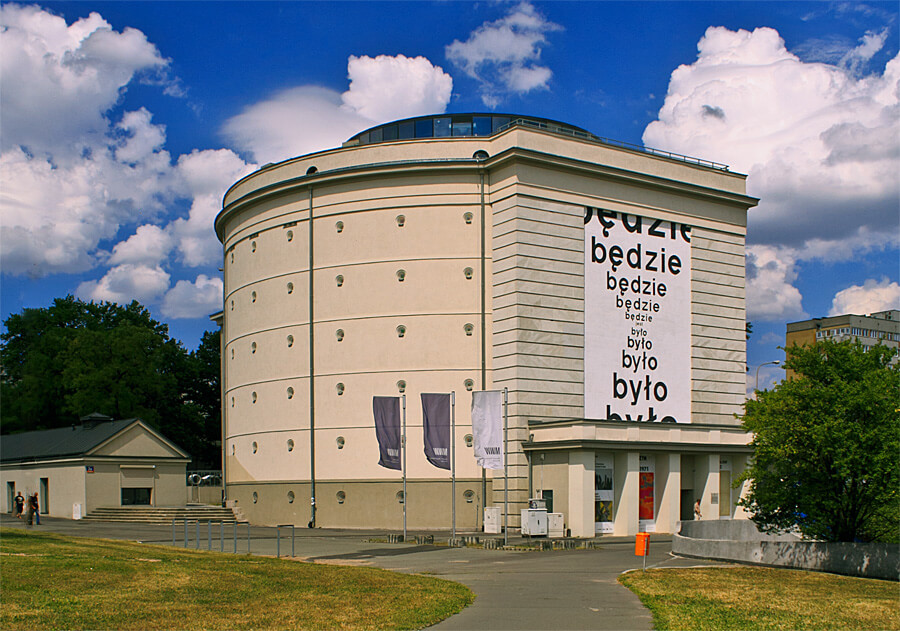

### Nowy Jork

Na Broadwayu w Nowym Jorku odbyła się premiera musicalu Carousel autorstwa Richarda Rodgersa i Oscara Hammersteina II.

Była to adaptacja dramatu autorstwa Ferenca Molnára "Liliom" z 1909. Najbardziej znanym jego dziełem jest oczywiście powieść "Chłopcy z Placu Broni" z 1906. Tytułowy Plac Broni istnieje tylko w polskim tłumaczeniu. Domu zbudowanego na miejscu placu, o który walczyli chłopcy należy szukać na skrzyżowaniu ulic Pál i Mária. W tytule oryginału i większości tłumaczeń mamy ulicę Pawła (Pál utca).

### Fabian Gerard Waculik

W bitwie nad rzeką Gaiano pod Bolonią kapelan Fabian Gerard Waculik (OFM) został zastrzelony przez niemieckiego snajpera kiedy udział ostatniej posługi śmiertelnie rannemu żołnierzowi.

### Saksonia

Amerykanie zatrzymali się na Łabie 15 kwietnia. Ale dotyczy to szerokości geograficznej Berlina. Uprzednie ustalenia sojusznicze wyraźnie określały podział Niemiec na strefy okupacyjne tak, że Turyngia, Saksonia i Saksonia-Anhalt należały do sowietów. A Łaba płynie przez środek Saksonii. Jak więc to w praktyce wyglądało w Saksonii.

14 kwietnia Rochlitz. 16 kwietnia po dwóch dniach walki zdobyli Colditz. Tego samego dnia bez walki zajęli Plauen. 17 kwietnia dotarli do Eilenburga, który został w ciągu trzech dni obrony prawie całkowicie zniszczony ogniem artyleryjskim i potem zdobyty prawie bez strat. Również 17 kwietnia ale zupełnie bez walki zostało oddane Zwickau. 19 kwietnia to koniec bitwy o Lipsk.

Jak widać ostatecznie dotarli do Muldy (lewego dopływu Łaby o przebiegu południkowym) i tam się zatrzymali.

Ale istniał dość spory obszar, który był na wschód od Muldy a do którego nie dotarła Armia Czerwona. Były to trzy gminy Schwarzenberg, Stollberg, i Aue. Po kapitulacji Niemiec hitlerowskich 8 maja władzę przejeła tam lokalna organizacja samorządowa o charakterze antyhitlerowskim. Powstała tam tzw Freie Republik Schwarzenberg, która oczywiście została w lipcu włączona do sowieckiej strefy okupacyjnej, ale uznano to oddolne działanie, większość lokalnych władz pozostała.

Do początku lipca był to teren pod kontrolą US Army. 3 lipca Saksonia w całości (za wyjątkiem części leżacej na wschód od Nysy Łużyckiej, która została przyłączona do Polski) weszła w skład Sowjetische Besatzungszone aka Ostzone czyli sowieckiej strefy okupacyjnej pod nadzorem NKWD.

### Lipsk

Bitwa o Lipsk skończyła się szybko. Ostatnim aktem była obrona pomnika Bitwy Narodów.

- Mark Felton Productions ["Last Stand at the Leipzig Monument 1945" [YT 9:29]](https://www.youtube.com/watch?v=3cfWQg-3euk)

### Samobójstwa hitlerowców

Kolejny hitlerowiec się zabija: dziś jest to Otto Dönicke karierowicz bez żadnych umiejętności. W NSDAP od 1925, w latach 30 starosta powiatu lipskiego, w 1937 został burmistrzem Lipska, ale skompromitował się podczas wizyty Hitlera, okazało się że nie nadaje się na to stanowisko i w 1938 stracił wszystkie stanowiska państwowe i partyjne. Jako stary działacz wziął udział w organizacji Volkssturmu. Po kapitulacji Lipska zastrzelił się w Nowym Ratuszu wraz z kilkoma innymi dowódcami Volkssturmu.

Byli to m in kreisleiter SA-Standartenführer Carl Strobel i jego zastępca Willy Wiederroth.

### Wzgórza Seelow

Koniec bitwy o Wzgórza Seelow. Droga do Berlina otwarta!

Po kolejnym dniu zaciekłych, krwawych walk do wieczora 19 kwietnia okolice miasteczka Seelow zostały zdobyte przez Armię Czerwoną. To była krwawa jatka, wszędzie leżały zwłoki poległych, płonęły pojazdy i budynki, sowieci wciąż byli ostrzeliwani przez artylerię i rozproszone oddziały niemieckie. W amoku walki oddziały sowieckie przemieszały się. Teraz potrzebowali kilku dni, żeby oczyścić teren z niedobitków, umocnić się, ale przede wszystkim przegrupować się i odzyskać porządek bitewny.

Żukow zwyciężył, ale było to zwycięstwo dalekie od oczekiwań. Co więcej dostał wiadomość, której obawiał się najbardziej. Jego konkurent, marszałek Iwan Koniew, wystrzelił pancerną strzałę w centrum dowodzenia w Zossen i w sam Berlin. Mogło być gorzej, podobno na wieść o problemach w Seelow Stalin rozważał zmianę głównodowodzącego Frontem. Bitwa zakończyła się sukcesem, ale straty i czas, który pochłonęła to była klęska. 1 Front Białuruski utracił ponad 30 tys zabitych, trzykrotnie więcej niż Niemcy.

Co gorsza, wprawdzie wszystkie trzy linie obrony, po kolei zostały przełamane i zniszczone, to siły niemieckie ciągle nie były rozbite. Wycofywali się zachowując łączność i porządek bitewny. Ponieśli ogromne straty, ale nadal było to niebezpieczne wojsko. Cała 9 Armia została rozcięta na trzy zgrupowania, lokalnie zdolne do kontrataku.

### Goebbels

Radio:
>Naród niemiecki musi wygrać tę próbę, inaczej zasłuży na bytowanie, którego powstydziłyby się najprymitywniejsze ludy Afryki. Bezgraniczna wierność dla Führera – oto co pokażemy wrogiemu światu. Można nas zranić, ale nie zabić, uderzyć do krwi, ale nie powalić.

### 1 Armia WP

1 Armia WP przełamała pozycje na Starej Odrze i zajęła wieś Neugaul (obecnie północna część miasta Wriezen przy drodze 167).

### 1 Front Ukraiński

Na Berlin zmierzała również pancerna elita 1 Frontu Ukraińskiego. 19 kwietnia byli już w Spreewaldzie na linii Lübbenau - Luckau. Jest to obszar śmiertelnie niebezpieczny dla sił pancernych, z mnogością przeszkód wodnych, zupełnie płaski i zalesiony. Jest niewiele dróg do wyboru. Do Berlina jest stamtąd już tylko dwadzieścia parę km. Wojska niemieckie były jednak w zupełnej defensywie. Gromadziły się przy głównych miejscowościach i drogi przez las były najczęściej bezpieczne.

### 2 Front Białoruski

Do 19 kwietnia 2. Front Białoruski opanował cały wschodni brzeg Odry na południe od Szczecina i utworzył przyczółki do ataku na zachód.

### 12 Armia niemiecka

Dwa tygodnie temu, 7 kwietnia przebywający na rehabilitacji w samym sercu rzekomej Twierdzy Narodowej, w Bechrtesgaden, generał Walther Wenck również otrzymał dziwny rozkaz. Wenck był szefem sztabu Guderiana i najmłodszym generałem Wehrmachtu, ale 13 lutego został poważnie ranny w wypadku samochodowym. Miał złamanych wiele żeber i wciąż nosił gipsowy gorset.

Otrzymał depeszę nakazującą mu natychmiast zadzwonić do kwatery głównej i kiedy to zrobił adiutant Hitlera generał Burgdorf rozkazał mu jak najszybciej stawić się w Berlinie, powiedział mu
>Hitler mianował pana dowódcą 12 Armii

Tego właśnie Wenck nie zrozumiał, nigdy nie słyszał o 12 Armii. Istotnie, taka armia jeszcze nie istniała. Kiedy Wenck był w drodze do Berlina była dopiero w stadium formowania. O tym, że został ostatnim obrońcą zachodniej rubieży Berlina generał Wenck dowiedział się na miejscu.

Historia 12 Armii jest kwintesencja ostatnich dni III Rzeszy. Coś co w zamierzeniu tyrana miało być zachodnim bastionem obrony Berlina, zostało ruchomym obozem uciekinierów zmierzającym do poddania się w niewolę. Wenck nie wykonał rozkazu, był dowódcą misji humanitarnej.

### Berlin

Berlin, już poważnie zniszczony licznymi bombardowaniami czekał los Wrocławia, miasta bronionego za wszelką cenę. Komendant miasta generał Reymann miał, wzorem Wrocławia i Królewca, zbudować lotnisko w centrum miasta - pomiędzy Bramą Brandenburską a Kolumną Zwycięstwa. Garnizon Twierdzy Berlin był przypadkową zbieraniną ludzi i sprzętu.

Reymann wielokrotnie domagał się przedstawienia planu ewakuacji ludności cywilnej i nieustannie otrzymywał zapewnienia, że takowy istnieje i zostanie wprowadzony w życie na rozkaz Goebbelsa. W końcu dotarł do tego planu, była to mapa w skali 1:300 000 z wyrysowanymi drogami ewakuacji, mieszkańcy Berlina mieli pieszo przebyć 20 do 30 km do najbliższych podmiejskich stacji kolejowych, gdzie miały na nich oczekiwać składy kolejowe. Nie przewidziano żadnych służb które miałyby tę ewakuację zorganizować, żadnych punktów sanitarnych, transportu dla chorych i słabych, nie przewidziano przede wszystkim skąd weźmie się te pociągi. Miała powtórzyć się sytuacja z Wrocławia. Podobnie jak Wrocław Berlin otoczony był przez trzy źle poprowadzone, istniejące fragmentarycznie i nieobsadzone linie obronne. Ale była jedna istotna różnica, o Wrocław walczyła trzeciorzędna, słaba 6 Armia, a na Berlin nacierała siła dwóch Frontów, całe wojsko jakie mógł rzucić do walki Stalin.

Podobnie jak Wrocław miasto oficjalnie zostało ogłoszone twierdzą, choć w rzeczywistości nie posiadało własnego garnizonu. Dotychczasowy przebieg wojny pozbawił społeczeństwo niemieckie rezerw mobilizacyjnych. Według ocen generała Reymanna do obrony Berlina potrzebny była załoga około 200 tysięcy przygotowanych do walki i dobrze uzbrojonych żołnierzy. Dysponował pewną trudną do ustalenia liczbą jednostek jeśli nie dobrze wyposażonych to przynajmniej zmotywowanych do walki, jak np. SS, ale większość załogi to było około 60 tysięcy pospiesznie zmobilizowanych i niewyszkolonych żołnierzy Volkssturmu. Formacja ta w ogóle nie podlegała dowództwu wojskowemu, była do dyspozycji Gauleitera i wojsko mogło im wydawać rozkazy dopiero w bezpośredniej strefie walki. Gauleiterem Berlina od początku aż do końca istnienia gau był zaś Joseph Goebbels, który nie miał czasu na takie drobnostki. Nie mieli mundurów, kuchni polowych, pojazdów ani własnej łączności. Niewiele ponad połowa w ogóle posiadała jakąś broń, a nawet ci którzy byli uzbrojeni nie zawsze wiedzieli jak się tą bronią posługiwać. Ich uzbrojenie było mieszaniną tego co się udało zebrać w magazynach i pochodziło z całej Europy. Jak to podliczył komendant posiadali co najmniej 15 typów karabinów i 10 typów karabinów maszynowych. Znalezienie do nich amunicji było koszmarnie trudnym zadaniem. W najlepszej sytuacji były bataliony wyposażone we włoskie karabiny - dysponowali 20 nabojami na żołnierza. W pierwszym dniu natarcia statystyczny Volkssturmista posiadał około 5 naboi. Później sytuacja się pogarszała.

Miasto opasane było kilkoma liniami umocnień:

- Pierwszy, najbardziej rozległy, istniał tylko częściowo, tam gdzie był pod bezpośrednim nadzorem armii. Nawet gdyby był ukończony nie miał szans odegrać żadnej roli - do obrony takiego obszaru Niemcy nie mieli już sił. Zgodnie z najlepszą tradycją propagandy sukcesu wystarczyło przygotować teren do umieszczenia stanowisk CKM, żeby zaznaczyć na mapie "silny punkt oporu".
- Trzy związane z miastem:
  - Zewnętrzny był prowizoryczną linią składającą się z przeszkód naturalnych, i w pośpiechu montowanych barykad, zapór, punktów ogniowych. Wszystko to konstruowano i montowano ręcznie, paliwo bowiem było zarezerwowane dla wojsk pancernych, zresztą maszyn już prawie nie było. Brakowało ludzi do budowy fortyfikacji, z planowanych 100 tysięcy udało się wysłać do pracy tylko 30 tysięcy. Nawet dla tej liczby brakowało łopat i prostych narzędzi. Prasa apelowała o kilofy i łopaty, ale jak to powiedział jeden z dowódców: "*berlińscy ogrodnicy najwyraźniej doszli do wniosku, że kopanie ich działek kartofli jest ważniejsze niż kopanie pułapek czołgowych*"
  - Środkowy - najlepszy z nich - zbudowany na bazie systemu kolejowego był prawdziwą przeszkodą, wymagał tylko obsadzenia załogą, wyposażenia w działa przeciwpancerne i zaminowania. Ale kto miał to zrobić skoro rozkazy wychodzące z bunkra Hitlera do jednostek polowych były jednoznaczne: pozostać na pozycjach, ani kroku w tył. Również dowódca Grupy Armii Wisła, generał Gotthard Heinrici, za wszelką cenę chciał uniknąć wprowadzenia swoich wojsk do miasta, a innych nie było.
  - Wewnętrzyny rejon umocnień, tzw Cytadela wytyczał kanał Landwehry i Szprewa, była to dzielnica rządowa.
  
Z różnych przyczyn żadna z tych linii umocnień nie odegrała żadnej roli w obronie Berlina, dwie zewnętrzne praktycznie nie istniały, środkowa nie została obsadzona, obrona wewnętrznej nie miała żadnego sensu, kiedy sowieci tam dotarli dowództwo już nie istniało.

Wiadomość o rozpoczętej ofensywie i sukcesach Armii Czerwonej wywołała zrozumiałą panikę. Komunikacja nie działała, więc ulice zaczęły się zapełniać uciekinierami, którzy już wkrótce utworzyli prawdziwe kolumny blokując i tak utrudniony ruch wojska. Podobnie jak we Wrocławiu nie wszyscy uciekali. Nie było już dokąd uciekać. Istniała grupa ludzi, która nie mogła opuścić miasta bez pozwolenia, elita urzędników i funkcjonariuszy partyjnych, państwowych, miejskich. Urząd komendanta zaczęły zasypywać prośby o takie pozwolenie uzasadniane często w sposób, który budził sarkastyczny śmiech. Szef sztabu komendanta wydawał je od ręki:
>Było coś niemal komicznego, jeśli chodzi o powody, jakimi funkcjonariusze partyjni i państwowi uzasadniali swe prośby o opuszczenie miasta. I chociaż Goebbels zarządził, że "żaden mężczyzna zdolny do noszenia broni nie może opuścić Berlina" nie robiliśmy trudności [...] Większość ludności pozostała. Nie mieli takich możliwości, a w każdym razie i tak nie było czym uciekać, brakowało środków transportu.

Korzystając z uprzywilejowanej pozycji i niedostępnych innym zasobów elity finansowe i polityczne, w tym wielu zagorzałych nazistów, uciekały jak tylko mogły daleko na zachód. Uciekali ludzie bogaci i wpływowi. Berlińczycy ironicznie nazwali to "ucieczką złotych bażantów".

### Wypadek z bronią

["Od wódki rozum krótki"..... Jedna z wielu tego typu niepotrzebnych tragedii....](https://www.facebook.com/ludowewojsko/posts/692168821476921)

### Wrocław

Hartung:
>18 kwietnia 
>Dzisiaj znowu przeżywam osobliwy epizod z granatem. Idę właśnie przez ogród seminaryjny do sztabu, gdy nagle w pobliżu słyszę znajomy, złowieszczy świst. Zapominam o tym, żeby natychmiast paść na ziemie, tylko pędzę przed siebie co sił w nogach. Jednak również ten pocisk nie eksploduje - bo wcale takowym nie jest. Okazuje się, że to bomba pocztowa zrzucona przez jeden z naszych samolotów zaopatrzeniowych. Jej spadochron się nie otworzył i teraz sympatyczny ładunek musi leżeć gdzieś niedaleko

W dzisiejszym wpisie pisze o listach od rodziny datowanych na 15 i 19 marca. Kończy
>Teraz już nie przejmuję się tym, że do trzeciej w nocy muszę siedzieć w biurze i stukać na maszynie nudne raporty.

Znana nam z wczorajszego wpisu przeorysza Margarete Ziegler:
>Ponieważ po posiłku było spokojnie, poszłam razem z siostrą Klarą zaraz po godzinie 13.00 na Rynek, mimo huraganowego wiatru, który wypełniał powietrze żółtymi obłokami pyłu i strącał cegły oraz kawałki szyb ze zniszczonych domów. Do placu dotarłyśmy bez ostrzału i odwiedziłyśmy najpierw nowy bunkier pod numerem 58., który z powodu braku wystarczającej liczby łóżek w mieście nieustannie był powiększany przez dołączanie nowych piwnic w sąsiednich domach. [...] Pomieszczenia sa dobrze chronione i zaopatrzone w światło, ale urządzenia sanitarne są absolutnie niewystarczające. Piwnice te nie zostały uszkodzone ani przez bomby, ani przez granaty, bardzo jednak ucierpiały podczas bombardowania sąsiednie domy, na przykład znana księgarnia Priebatscha, która była już tylko jedną, wielką kupą gruzów. Tysiące cennych książek leży na tym gruzowisku i każdy bierze sobie co mu się podoba. [...] W Schweidnitzer Keller odwiedziłyśmy siostry z "Bethesda" i prowadzone przez nie oddziały. Również i ten bunkier nie odniósł żadnych uszkodzeń podczas ostatniego ciężkiego ostrzału. Ratusz został trafiony w różnych miejscach, a wiele domów na Rynku było mocno zniszczonych.

We Wrocławiu walki przeniosły się już na drugą stronę nasypu kolejowego, na Szczepin. Celem ataku stał się gigantyczny schron na pl. Strzegomskim, jedna z dość zagadkowych konstrukcji Richarda Konwiarza, hitlerowskiego architekta działającego we Wrocławiu, jego specjalnością były obiekty sportowe.

We Wrocławiu istnieje pięć przypisywanych jemu żelbetowych, nowoczesnych schronów naziemnych z czasów wojny. Dokładne ich przeznaczenie nie jest jasne, nie wynika z lokalizacji, a ponieważ są dość zróżnicowane prawdopodobnie były jakiegoś rodzaju prototypami. Największym z nich jest ogromny, cylindryczny schron na Pl. Strzegomskim, obecnie oddział Muzeum Sztuki Współczesnej z kawiarnią na najwyższej kondygnacji.

*Schron Konwiarza na pl. Strzegomskim, stan współczesny. 
By [Volens nolens kraplak](https://commons.wikimedia.org/w/index.php?title=User:Volens_nolens_kraplak&amp;action=edit&amp;redlink=1) - Praca własna, [CC BY-SA 4.0](https://creativecommons.org/licenses/by-sa/4.0), [Link](https://commons.wikimedia.org/w/index.php?curid=39189460)*

W 1945 był z pewnością obiektem przykuwającym uwagę, z oczywistym zastosowaniem wojskowym więc na terenie ważnego węzła komunikacyjnego jakim jest plac był celem numer jeden. Niestety dla obrońców, charakterystyczne otwory na ścianach służyły tylko wentylacji, więc zamknięci w nim ludzie byli zupełnie bezbronni. Był to szpital polowy, a raczej trupiarnia, od samego smrodu umierających i już martwych żołnierzy można było zemdleć. Z czasem coraz trudniej było usuwać zmarłych. Podziemia kościoła w których kurował się Hartung były w porównaniu z tym miejscem rajską krainą.

Toczyły się o niego dramatyczne walki a jego zdobycie 25 kwietnia kończy walki we Wrocławiu:
>Rozpoczęła się gwałtowna strzelanina w pobliżu bunkra. Na razie nie groziło nam żadne niebezpieczeństwo za grubą ścianą betonu. Nie szkodził nam ogień radzieckich karabinów maszynowych, wzmagający się z godziny na godzinę. W pewnej chwili coś jakby zachwiało posadami naszego bunkra. Zbliżający się wał ogniowy ciężkiej artylerii ogarnął wyraźnie betonowy schron. Naliczyliśmy 9 potężnych detonacji na szczycie i ścianach, dziewiąta detonacja rozległa się już gdzieś we wnętrzu. Rozbite zostały akumulatory i zapanował ciemność. Przestały działać wentylatory, swąd groził uduszeniem. Padł rozkaz otwarcia bramy i opuszczenia bunkra. Nie łatwe to było zadanie gdyż w pobliżu wejścia zapaliło się rozlane paliwo. Podoficer wyskakujący potknął się może też trafiony kulą, upadł i spłonął. Desperackim susem przeskoczyłem płonącą część korytarza. Ogarnęły mnie płomienie ale wydostałem się na zewnątrz. Co sił biegłem przez plac na wprost siebie. Spalił mi się częściowo mundur i włosy, na razie jednak byłem uratowany. Koledzy którzy za mną wybiegali w prawo i lewo, wpadli od razu w ręce żołnierzy radzieckich otaczających bunkier. Ja dostałem się do niewoli kilka dni po kapitulacji garnizonu.
