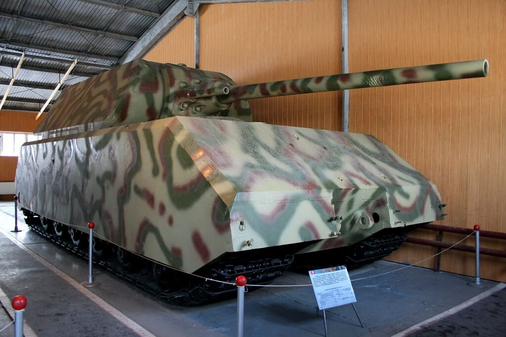

### Bolonia

Kampania włoska: została wyzwolona Bolonia.

### Zagłębie Ruhry

Kapitulacja Grupy Armii "B" w bitwie o Zagłębie Ruhry (en. Ruhr Pocket) była ogromnym zwycięstwem aliantów. Niemcy przyjęli ją z niedowierzaniem.

Paradoksalnie zwycięstwo to stanowiło dla Amerykanów poważny problem. Z dnia na dzień pod ich kontrolą znalazło się nie tylko ponad 300 tys jeńców wojennych, którymi trzeba było się zająć, ale też setki tysięcy więźniów obozów koncentracyjnych, robotników przymusowych oraz - co znacznie powiększało problem - zniszczona przez nich infrastruktura, zbombardowane miasta, obrócone w ruiny fabryki i zniszczona kolej. Sytuacja groziła katastrofą humanitarną i to na bazpośrednim zapleczu frontu.

### Walter Model

Po klęsce podległej mu Grupy Armii "B" popełnił samobójstwo marszałek Walter Model. Zabił się także jeden z jego generałów, dowódca XXXIX Korpusu Pancernego Karl Decker.

### Nalot na Berlin

Już tylko dwa tygodnie do pokonania hitlerowskich Niemiec. W nocy z 20 na 21 kwietnia ostatni nalot RAF - 78 bombowców Mosquito - oznaczało to oddanie miasta sowietom. Jeszcze tylko rano przylecą Brytyjczycy i od tej pory ani brytyjskie ani amerykańskie samoloty nie pojawiały się nad Berlinem.

W ostatnich dniach już dochodziło do incydentów. Ike uznał, że to zbędne ryzyko. Niebo nad Berlinem przejęły samoloty z czerwonymi gwiazdami. Armia Czerwona wkroczyła do Berlina naraz z trzech kierunków.

### Berlin

Berlin już wczoraj 20 kwietnia stał się oficjalnie linią frontu, takie było znaczenie operacji Clausewitz rozpoczętej na rozkaz Hitlera, czyli zupełnej ewakuacji instytucji wojskowych i SS w mieście.

Obronę miasta powierzono generałowi Helmuthowi Weidlingowi, który miał do dyspozycji z różnych dywizji Wehrmachtu i SS łącznie 45 tys żołnierzy. Dołączono do nich policję, Hitlerjugend, oraz 40 tys Volkssturmu. Garnizon ten przedstawiał się gorzej niż wrocławski. Weidling podzielił miasto na osiem sektorów oznaczonych literami od A do H (Adolf Hitler w każdym calu?), na czele każdego postawił pułkownika lub generała, większość z nich nie miała doświadczenia bojowego.

- XX DP na zachodzie
- IX dywizja Spadochronowa na północy
- Dywizja Pancerna Müncheberg północny wschód
- XI Dywizja Grenadierów Pancernych SS Nordland południowy wschód aż do lotniska Tempelhof

Rrezerwa to 18 Dywizja Grenadierów w centrum. Dodatkowo pod dowództwem SS-Brigadeführera Wilhelma Mohnke LSSAH dla dzielnicy rządowej.

Ale zaraz, przecież dwa dni temu pisałem, że komendantem miasta jest generał Reymann, skąd tu nagle Weidling?

- Helmuth Reymann był komendantem obrony Berlina od 6 marca
- 19 kwietnia został zastąpiony na tym stanowisku przez pułkownika Ernsta Kaethera, który specjalnie na tę okazję dostał awans generalski (przypadek Ahlfena).
- Kaether nie zdążył objąć stanowiska, bo jeszcze tego samego dnia Hitler wycofał tę decyzję i nominację i w swoim najlepszym stylu sam wyznaczył się na dowódcę obrony Berlina, mianując swoim zastępcą również promowanego na tę okoliczność generałem Ericha Bärenfängera.
- 23 kwietnia nagle dowódcą obrony miasta zostanie generał Weidling, który jeszcze kilka godzin wcześniej był skazany na śmierć. Nieoczekiwany awans.

Od 20 kwietnia Weidling jest dowódcą LVI Korpusu Pancernego. Już wkrótce za niewykonanie rozkazu zostanie skazany na śmierć. Ale w akcie zdumiewającej odwagi Weidling zamiast po prostu walczyć jakby nigdy nic i mieć nadzieję, że egzekucja nie dojdzie do skutku, zameldował się w bunkrze Hitlera i wyjaśnił, że zaszło nieporozumienie. Zdumiony tym Hitler, pod wrażeniem postawy generała mianował go komendantem miasta. Na tym stanowisku Weidling pozostanie już do końca, to on podda garnizon.

2 Gwardyjska Armia Pancerna razem z 3 i 5 Armią Uderzeniowa przerwały słabą na swoim odcinku obronę i przedarły się przez Berliner Ring z kierunku północno-wschodniego. Byli pierwszymi czerwonoarmistami w Berlinie.

1 Gwardyjska Armia Pancerna i 8 Gwardyjska Armia nacierały dokładnie od wschodu na Erkner.

2 Gwardyjska Armia Pancerna zdobyła Werneuchen zmierzając od okrążenia Berlina od północy.

### Berlin na linii frontu

Berlin był miastem z oczywistych powodów bombardowanym od dawna i z upodobaniem. Od czterech miesięcy bombardowania przeprowadzane były według precyzyjnego schematu: Anglicy bombardowali miasto w nocy, Amerykanie pojawiali się punktualnie po 9.00. Dlatego berlińczycy tak się spieszyli z porannymi zakupami i w drodze do pracy. Nikt o tej porze, niezależnie od utrudnień komunikacyjnych, nie chciał znaleźć się na ulicy. Pomimo ogromu zniszczeń jakoś dawało się z tym żyć, można było przewidzieć porę, a czasem nawet obszar który zostanie zbombardowany.

28 marca, dokładnie w dniu kiedy aresztowanych zostało 16 przedstawicieli władz polskiego państwa podziemnego, nastąpił niespodziewany, pierwszy atak lotnictwa sowieckiego na Berlin. Inny niż dotychczasowe, nagły i wywołujący panikę. Myśliwce i samoloty szturmowe ostrzeliwały miasto z broni pokładowej. Od tej pory atakowali go regularnie.

21 kwietnia dokładnie o godzinie 11.30 berlińczycy po raz pierwszy usłyszeli ten charakterystyczny, świdrujący, pochodzący jakby z innego świata dźwięk. Gwałtownie zmieniał wysokość, zamienił się w gwizd i wtedy eksplozja rozerwała się na ulicy pełnej ludzi czekających w kolejce. Strzępy ciał, bryzgająca krew, nieludzkie wrzaski umierających i przerażonych ludzi. Po chwili to samo, znów ten dziwny dźwięk i znów eksplozja. To Armia Czerwona dostarczyła spóźniony prezent na urodziny Hitlera - Berlin znalazł się w zasięgu sowieckiej artylerii. Zaledwie kilka godzin wcześniej kończył się rozpoczęty zgodnie z harmonogramem o godzinie 9.25 amerykański nalot. Był to ostatni z 363 alianckich nalotów. Od dziś Berlin jest w wyłącznym, sowieckim władaniu.

Ostrzał artyleryjski to było coś zupełnie nowego. Nieprzewidywalny, morderczy, nieprzerwany. Dokładnie tak samo jak we Wrocławiu od tej pory w Berlinie ludzie zamieszkali na stałe w piwnicach. Tłumy zaczęły gromadzić się w metrze. Według niektórych źródeł już 20 kwietnia sowieci ostrzeliwali centrum Berlina artylerią, ale wieczorem 20 kwietnia dotarli do Atlandsberg - 20 km od Mitte. Natomiast dziś mogli rozładować artylerię w Marzahn - dzielnicy Berlina słynącej z blokowiska, nazistów i chuliganów, wtedy natomiast to były berlińskie dzikie pola a do Mitte było 10 km.

Wczorajsze urodziny Hitlera po raz pierwszy od dwunastu lat odbyły się bez pompy partyjno-państwowej, nawet w bunkrze Hitlera zapanował nieład. Od rana przyjmował życzenia od ludzi, którzy należeli do ścisłego grona współpracowników. Później wyszedł na zewnątrz na "przegląd wojsk", przed bunkrem była zebrana grupka SS-manów i chłopców z Hitlerjugend. Przedstawiał straszny widok, nic nie zostało z człowieka, który jak sprężyna podskakiwał pod wieżą Eiffla. Zgarbiony, bez sił, z trudem ukrywając trzęsącą się lewą dłoń przeszedł przed krótkim szeregiem żołnierzy, zamienił kilka słów i wrócił do bunkra na naradę wojenną. Było to ostatnie publiczne pojawienie się Hitlera. Następne 10 dni aż do śmierci spędził pod ziemią.

### Seraglio / Seraj

Przedostatnia okazja na ucieczkę z Berlina. Na lotnisku Schönwalde czeka ogromny Junkers Ju 290, na liście 23 pasażerów dzisiejszego lotu... Adolf Hitler i Eva Braun, poza tym Goebbels z żoną i dziećmi, Heinrich "Gestapo" Muller, Hermann Fegelein, Burgdorf i inni. Ale lot się nie odbył. Samolot czekał. Dowódca samolotu kapitan Braun 2 maja, zwolniony z zadania samą śmiercią Hitlera, poleciał do Hradec Králové, który wciąż był w rękach niemieckich. Kiedy wojna się skończyła zabrał na pokład 70 kobiet i dzieci i odleciał do Monachium.

Trwa operacja Seraglio, ucieczka ostatniej szansy dla najważniejszych ludzi III Rzeszy, trzeba wywieżć najważniejsze dokumenty, co się da ukryć a resztę zniszczyć. Berlin jest pułapką. Już jest albo za chwilę zostanie otoczony przez sowietów. Sytuacja jest dynamiczna i zmienia się z minuty na minutę, zawsze na gorszą.

Tego dnia samolot z Hitlerem nie startuje. Decyduje się pozostać w Berlinie. Wszystkie wymienione przeze mnie powyżej osoby w ciągu 10 dni zostaną zabite lub popełnią samobójstwo. Nieznany jest los Mullera. Ale o tym później.

21 kwietnia startują inne samoloty. Dwa Ju 350 zabierają na południe do bezpiecznej wciąż Bawarii ludzi i ładunek. Jeden z nich dociera bezpiecznie do celu. Drugi, którego pilotem jest major Friedrich-Anton Gundlfinger zostaje zestrzelony w Saksonii i o 6 rano rozbija się w Börnersdorf tuż przy granicy czeskiej. I tu zaczyna się historia, która da początek wielu teoriom spiskowym. Ju 350 to była oszczędnościowa konstrukcja okresu końca wojny, to samo co Ju 250 tylko z drewnianymi skrzydłami i kadłubem. Przy lądowaniu kapotował i się roztrzaskał, ocalał tylko jeden człowiek. Pierwsi przy wraku byli robotnicy przymusowi. Potem pojawiła się policja. Nie wiadomo co się stało z najważniejszą częścią ładunku - 10 metalowymi, ocynkowanymi skrzyniami. Nie wiadomo też co w nich było.

Dla przykładu - afera z rzekomymi pamiętnikami Hitlera. Konrad Kujau, oszust który sprzedał je Sternowi za 9 mln DM, twierdził, że były właśnie w tych skrzyniach, potem weszły w posiadanie STASI, a on jest tylko pośrednikiem.

- [Mark Felton Productions "Hitler's Lost Secret Documents - MILLION SUBSCRIBER SPECIAL" [YT 23:03]](https://www.youtube.com/watch?v=i65GDSXy9H4)
- [Gundlfinger, Friedrich-Anton](https://www.tracesofwar.com/persons/23443/Gundlfinger-Friedrich-Anton.htm)

### 1 Front Ukraiński

3 Gwardyjska Armia Pancerna generała Rybałki zameldowała się z Zossen. Oba sztaby były puste, opuszczone w panice. Dotarli do Königs Wusterhausen 5 km od lotniska Schönefeld - nie miało ono obecnego znaczenia, wtedy było to pozbawione większego znaczenia, istniejące od 11 lat lotnisko fabryczne Henschela. Dopiero w latach 50 zostało ze względu na położenie głównym lotniskiem międzynarodowym NRD. Wynikało to z umów międzynarodowych ograniczających ruch lotniczy tylko dla linii lotniczych krajów okupacyjnych, cały personel latający musiał mieć paszporty tych krajów. Schönefeld leżało wówczas poza Berlinem, więc mogły go używać enerdowskie linie lotnicze. Do dziś jego specjalizacją jest Europa wschodnia i południowa. W sąsiedztwie trwa nieszczęsna budowa nowego lotniska Brandenburg, które miało zastąpić wszystkie obecne berlińskie lotniska. No cóż inwestycja w atmosferze skandalu, oskarżeń, procesów sadowych i niedających się skompletować odbiorów trwa w najlepsze.

### Kummersdorf Gut

Innym niebywale ważnym wojskowym obiekcie zdobytym 21 kwietnia przez Armię Czerwoną był Kummersdorf Gut (istotne rozróżnienie, bo sam Kummersdorf znajduje się 40 km na SE).

W 1871 pruski minister wojny zadecydował o przeniesieniu testowego poligonu artyleryjskiego z Tegel do Kummersdorf Gut, udało się to zrealizować cztery lata później kiedy dotarła tam linia kolejowa. Cały teren miał prawie 900 ha. W okresie Wielkiej Wojny sprawdzano tam skutki bombardowań. Kiedy w 1935 powstał Wehrmacht cały obiekt pod nazwą Heeresversuchsanstalt Kummersdorf aż do 1945 miał jedno, główne przeznaczenie: prace nad nowymi czołgami, to właśnie tam powstały wszystkie czołgi z serii Panzer od od I do VIII, tak ten słynny Maus (Panzer VIII Maus) ważący niemal 200 ton i mogący rozwinąć w terenie oszałamiającą prędkość 13 km/h był również zbudowany w Kummersdorf. To właśnie stamtąd kadłub i wieżę (niepasującą) zabrali sowieci do Kubinki.

W latach 1935-37 był tam również poligon rakietowy, później przeniesiono go do Peenemünde na wyspie Uznam.

Była tam również cała masa czołgów zdobycznych i innych prototypów. Część generał Heinrici kazał wysłać do obrony w okolice Szczecina, część wzięło udział w walce w rejonie Berlina i samym Berlinie.

- Mark Felton Productions ["The Maus - Nazi Germany's Biggest Tank" [YT 4:51]](https://www.youtube.com/watch?v=GaY8SLMoy-4)
- Simple History ["The Maus Super-Heavy Tank" [YT 6:58]](https://www.youtube.com/watch?v=Zs9_u_plcSw)

*Maus w muzeum w Kubince 
By [ru:User:Superewer](https://ru.wikipedia.org/wiki/User:Superewer) - [ru:Файл:Metro-maus1.jpg](https://ru.wikipedia.org/wiki/%D0%A4%D0%B0%D0%B9%D0%BB:Metro-maus1.jpg), Domena publiczna, [Link](https://commons.wikimedia.org/w/index.php?curid=6706951)*

### Polsko-sowiecki układ o przyjaźni

Natomiast przebywający jak zawsze na Kremlu Józef Stalin dodał dziś kolejne trofeum do kolekcji zwycięstw.

Pospiesznie i idąc na pewne ustępstwa (których jednak nie zamierzał przestrzegać) zorganizował podpisanie w Moskwie polsko-sowieckiego układu o przyjaźni, wzajemnej pomocy i współpracy powojennej. W delegacji polskiej był Bolesław Bierut, Edward Osóbka-Morawski i Władysław Gomułka. Układ podpisał ze strony Rządu Tymczasowego jego premier Osóbka-Morawski a ze strony sowieckiej osobiście Józef Stalin.

Gwarancje oprócz niezłomnej przyjaźni obejmowały nieingerowanie w wewnętrzne sprawy drugiego państwa. Ponieważ władze sowieckie uważały sprawy polskie za kwestię polityki wewnętrznej można mówić, że przynajmniej ze strony polskiej układ został dotrzymany. Rząd w niewielkim stopniu ingerował w politykę władz sowieckich na swoim terytorium, raczej starał się wyprzedzać jej życzenia.

Pośpiech w przygotowaniu i podpisaniu układu mógł wynikać ze śmierci Roosevelta i oczekiwania rychłego upadku Niemiec. Rzeczywiście Truman był zwolennikiem ostrzejszego kursu wobec sowietów i skrytykował niedopuszczenie do układów polityków związanych z rządem na emigracji.

### Żołnierze wyklęci

Przyczynek do dziejów tzw Żołnierzy Wyklętych. We wsi Brzostówka rozstrzelali trzech członków PPR i spaloli bramę triumfalną postawioną w lipcu 1944 na cześć Armii Czerwonej. Akcją dowodził kapitan Zdzisław Broński "Uskok".

### 2 Armia WP

Tego dnia rozpoczął się również ostatni i tragiczny rozdział w wojennej historii 2 Armii LWP. Ścieżkę bojową rozpocząć miała operacja na Wale Pomorskim, 2 Armia była tyłową zaporą, do której walki nie doszły. Później - jak pamiętamy - została skierowana w rejon Trzebnicy, skąd miała przypuścić atak na Wrocław. Ale w ostatniej chwili otrzymali nowe rozkazy, bo Stalin nakazał obu czołowym Frontom przypuścić natychmiastowy atak na Berlin. Dlatego 2 Armia, cały czas pieszo, nocnymi marszami w kilka dni udała się na nowy rejon ześrodkowania na wschód i północ od Zgorzelca.

Tam po raz pierwszy wzięli udział w walkach. Po przełamaniu obrony zostali skierowani na Drezno. Podstawowym zadaniem Armii działającej w ramach operacji łużyckiej była podobnie jak w przypadku operacji na Wale Pomorskim osłona, ale tym razem nie zaplecza tylko lewej flanki głównych sił Frontu. Cele ofensywne były drugorzędne, podstawowym była ochrona 1 Frontu Ukraińskiego od południa gdzie znajdowało się największe i najbardziej niebezpieczne zgrupowanie sił niemieckich Grupa Armii Środek pod dowództwem znanego nam już marszałka Ferdinanda Schõrnera.

21 kwietnia siły 2 Armii rozciągnięte były od okolic Goerlitz aż na 50 km w kierunku zachodnim. Jej dowódca generał Karol "Walter" Świerczewski, politycznie zasłużony generał jeszcze z czasów wojny domowej w Hiszpanii, znany z alkoholizmu i niekompetentny dowódca, zlekceważył meldunki o nacierających siłach niemieckich. Nie miał żadnego doświadczenia w dowodzeniu związkami operacyjnymi większymi niż dywizja, a ostatnia dywizja którą dowodził została wybita do nogi (ocalało mniej niż 700 żołnierzy). Polacy mieli zdecydowaną przewagę liczebną, ale nie byli uformowani w szyk bitewny, piechota była pozbawiona osłony wojsk pancernych, przede wszystkim zaś w przeciwieństwie do Niemców nie mieli doświadczenia bojowego. Nacierały na nich jednostki przerzedzone wojną, ale zdeterminowane i doświadczone. Zaczęła się rzeź, znana jako bitwa pod Budziszynem. Dziś pierwszy akt tragedii, wojsko pozbawione porządku bitewnego jest atakowane przez nieprzyjaciela. Dowódca całkowicie to lekceważy i znajdującym się na przedzie jednostkom uderzeniowym (1 Korpus Pancerny i 3 dywizje piechoty) rozkazuje kontynuować marsz na wyznaczony cel.

- [History Hustle "The Battle of Bautzen (1945) – The Last German Victory of World War II" [YT 6:15]](https://www.youtube.com/watch?v=gopuA43oMd8)

### Wrocław

Nie od rzeczy będzie przypomnieć, że wypada rocznica śmierci wrocławianina z urodzenia, najsłynniejszego asa lotniczego na świecie - 21 kwietnia 1918 zginął Manfred Albrecht Freiherr von Richthofen.

We Wrocławiu wyczerpany walką na zachodniej rubieży pułk Mohr zastąpiony jest przez pułk SS Besslein. Od wczoraj bezpośrednim celem ognia stał się wielki bunkier na obecnym pl. Strzegomskim. Sowieci prawdopodobnie nie wiedzieli, że jest to szpital polowy pozbawiony wartości bojowej. Charakterystyczne otwory na jego powierzchni pełniły tylko funkcje wentylacyjne i nigdy ani nie był projektowany ani nie został przystosowany do prowadzenia ognia. Zwraca jednak uwagę jako oczywisty obiekt wojskowy i stanowi ważny punkt oporu.

Hugo Hartung:
>Spokój na wszystkich frontach utrzymuje się także dziś. Podobno Rosjanie rozpoczęli wielki atak na Berlin i w tym celu ściągnęli z naszej twierdzy sporo wojsk, zwłaszcza lotnictwo. Mówi się, że jeśli uda im się zając stolicę Rzeszy, to potem zmasowanymi siłami rozbiją Twierdzę Wrocław. Cieszmy się więc darowaną chwila wytchnienia. W ciągu tych spokojniejszych dni wcale nie spada jednak liczba zgonów w piwnicznym lazarecie. Gdy piszę te słowa obok mnie siedzi kolega, niegdyś w cywilu architekt, który ozdobnym pismem umieszcza na nagrobnych krzyżach nazwiska i daty.

Hornig:
>Mimo powagi sytuacji militarnej miasta i niekończących się walk, kierownictwo "Bethanien" przy współpracy z lekarzami Wehrmachtu i oficerami stacjonujących jednostek starali sie urządzać godziny wypoczynku dla leżących tam żołnierzy i załogi zakładu. Na przykład 21 kwietnia odbył sie koncert, urządzony na polecenie Stabsarzta doktora Haacka. Profesor Maximilian Henning, który leżał jako pacjent w lazarecie w Urzędzie Pracy, grał na włoskich skrzypcach. Henning był uważany za śląskiego wirtuoza skrzypiec. Oddelegowany do służby przy doktorze Haacku żołnierz Gerdes śpiewał swoim potężnym basem mało znane pieśni Karla Loewego. Licznie zebrani pacjenci z izb chorych, od oficera aż po zwykłego szeregowca nie szczędzili oklasków. "Także dla nas i naszych sióstr, które zostały zaproszone i pojawiały się o ile nie miały innych obowiązków, była to prawdziwa godzina oddechu. Jesteśmy wdzięczni, że [...] nasz zakład także i w ten sposób może opiekować się żołnierzami.

### Trzebnica

Nikt w mieście nie wie, że w okolicy są już nowi gospodarze Dolnego Śląska. 14 marca Rząd Tymczasowy podzielił przyszłe polskie Ziemie Zachodnie na cztery obszary i wyznaczył na nie swoich pełnomocników. Stanisław Piaskowski odpowiedzialny za Dolny Śląsk był działaczem PPS i dotychczas wicewojewodą kieleckim. Wczoraj 20 kwietnia 400 pierwszych urzędników przyszłego województwa dolnośląskiego z Piaskowskim na czele wyruszyło z Kielc. Koleją dotarli do Oleśnicy, tam kończył się bieg kolei (właśnie w Oleśnicy i Namysłowie kończyły się kolejowe linie zaopatrzeniowe Armii Czerwonej, dalej transport jechał ciężarówkami). Z braku samochodów ostatnie 30 km przebyli na piechotę, 21 kwietnia jest pierwszym dniem zagospodarowywania przez polską administrację Trzebnicy jako siedziby władz województwa. 9 kwietnia miasto opuścił sztab generała Świerczewskiego. Czyli Polacy wracają do Trzebnicy po niecałych dwóch tygodniach.

Więcej o pierwszych dniach Polski na Dolnym Śląsku w artykule: [Grupa inicjatywna Drobnera](/festung-breslau/article/grupa-drobnera)

