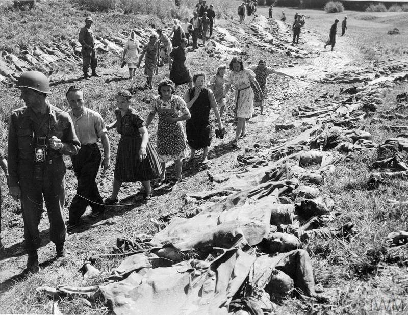

### Wstęp

Poprzedni dzień zakończył się na tym, że 1 Front Białoruski wdarł się do Berlina od wschodu aż do Dahlwitz i okrążał go od północy docierając do mostu w Henningsdorf. Natomiast 1 Front Ukraiński zablokował Poczdam od południa i wschodu i dotarł do Kanału Teltow i bardziej na wschód przekroczył linię autostrady. Miał przy tym wręcz niemożliwie rozciągnięty obszar działania, począwszy od nieszczesnej 6 Armii, która od ponad dwóch miesięcy nie mogła zdobyć Wrocławia, przez 2 Armię WP, która była właśnie masakrowana przez wojska marszałka Schörnera pod Budziszynem, przez całe Łużyce aż po przedmieścia Berlina.

Główne siły niemieckie to była 9 Armia generała Busego odparta właśnie od Odry, pobita na wzgórzach Seelow i okrążona na południowy-wschód od Berlina oraz cała reszta, którą na ostatnią chwilę udało się zebrać czyli 12 Armia Wencka rozciągnięta na obszarze od Poczdamu po Lipsk.

Wciąż istniała grupa bojowa Steinera w rejonie Oranienburga i resztki Grupy Armii Środek prowadzone przez Schörnera od południa w stronę Berlina. Bardziej na północ od Berlina walczyły resztki Grupy Armii Wisła generała Heinriciego.

Sztab OKW przeniesiono z Krampnitz do Neuroofen 60 km na północ od Berlina. Byął tam jedna z baz Himmlera na wciąż bezpiecznym zapleczu 3 Armii Pancernej.

Do Berlina został wysłany batalion Kriegsmarine "Großadmiral Dönitz" - byli to marynarze świeżo po kursie obsługi radarów i niemający żadnego pojęcia jak wygląda wojna lądowa.

Sytuacja zmieniała się zbyt dynamicznie by ktokolwiek mógł to kontrolować. Hitler, Jodl i Keilet wciąż roili o przegrupowaniach, kontratakach i rozbiciu sił sowieckich. Ale dowodzący jednostkami frontowymi generałowie Heinrici, Wenck i Buse widzieli już tylko jedyny możliwy kierunek działania: połączenie 9 i 12 Armii a potem skierowanie ich na Łabę do niewoli amerykańskiej. Nikt nie chciał walczyć o Berlin. To już nie miało sensu.

Obrońcy Berlina również byli tego świadomi. Dezercja osiągnęła rozmiary masowe, grupy żołnierzy ukrywały się, gorączkowo poszukiwano cywilnych ubrań. Reakcja była bezwględna, każdego nawet tylko podejrzanego o dezercję wieszano bez sądu. Zabijano również ich domniemanych pomocników. Na drogach postawiono posterunki składające się z żandarmerii, SS, policji i partii. Sprawdzały wszystkich. Nie wolno było uciec z Berlina. Ludność cywilna mogła się przemieszczać tylko w obrębie miata. Doszło do tego, że cywile nie udzielali pomocy rannym żołnierzom Wehrmachtu nie chcąc ściągnąć na siebie podejrzenia, że pomagają w dezercji.

Komunikacja miejska przestała działać. Ponieważ podejrzewano, że sowieci wykorzystają tunele metra żeby przedrzeć się do centrum, barykadowano je i wysadzano. Pod ziemią schronili się cywile.

W nocy LVI Korpus Pancerny przedostał się przez Szprewę i zatrzymał się w Rudow. Dowódca obrony Berlina generał Weindling ustanowił sztab w budynkach sztabu korpusu na Hohenzollerndamm. Z powodu postępów sowieckich już 25 kwietnia musiał przenieść sztab do jego ostatecznej siedziby w Bendlerblock (między Kanałem Landwehry a Tiergartenstrasse).

"*Hitler jest z wami! Berlińczycy, trzymacie się!*" - woła Radio Hamburg.

### 1 Front Białoruski

- 47 Armia, 9 Gwardyjski Korpus Pancerny 2 Gwardyjskiej Armii Pancernej i 7 Gwardyjski Korpus Kawaleryjski kontynuowały natarcie okrążające Berlin od północy i po przekroczeniu Haweli w Henningsdorf do zmroku dotarły do Nauen, które jest już na zachód od Berlina.
- 1 Korpus Zmechanizowany (2 Gwardyjska Armia Pancerna) atakował od północy na linii Hermsdorf, Waidmannlust, Wittenau.
- bezpośrednio na wschód od niego 12 Gwardyjski Korpus Pancerny - Blankenfelde, Lübars, Rosenthal
- 79 Korpus Strzelecki 3 Armii Uderzeniowej - Niederschönhausen
- 7 Korpus Strzelecki - Hochenschönhausen
- 5 Armia Uderzeniowa - Biesdorf i Kaulsdorf
- 9 Korpus Strzelecki - Karlhorst i elektrownia Rummelsburg
- 4 Gwardyjski Korpus Strzelecki (8 Armia Gwardyjska) zajął tereny przemysłowe w Oberschöneweide i przygotowywał się do przekroczenia Szprewy w Johannisthal.
- 29 Gwardyjski Korpus Strzelecki zdobył most na Szprewie w Alderhof oraz Köpenick z mostami przez Szprewę i Dahme
- 125 Korpus Strzelecki nacierał na Spandau i Gatow gdzie znajowało się lotnisko. Wobec zagrożenia jakie stanowił ten atak dla poligonu Döberitz (niem. Truppenübungsplatz Döberitz aka Heeresschule Döberitz) wysadzono znajdujące się tam ogromne składy amunicji, nie było już możliwości przewiezienia ich do miasta.
- 8 Gwardyjska Armia legendarnego obrońcy Stalingradu generała Wasilija Czujkowa oraz 1 Gwardyjska Armia Pancerna atakowały od południowego wschodu, po przekroczeniu Szprewy i Dahme na południe od Kopenick, wzdłuż linii komunikacyjnych zdobyły Johannisthal i nacierały w kierunku centrum miasta na Britz i Neukolln.
- Od wschodu atakowała Berlin 5 Armia Uderzeniowa na Lichtenberg i Treptow.
- 3 Armia Uderzeniowa od północnego wschodu na Pankow i Wedding.
- 5 Gwardyjska Armia i 13 Armia zbliżały się do Łaby, pierwsza z nich w rejonie Torgau, a druga Wittenbergi.

### 1 Front Ukraiński

3 Gwardyjska Armia Pancerna generała Rybałki przekazała Zossen oddziałom tyłowym i nacierała już na terenie miasta na Kanał Teltow, który był dla nich poważną przeszkodą. Szeroki, z wysokimi betonowymi brzegami. Od północnej strony umocnione magazyny. Co gorsza Volkssturm został tu wzmocniony elementami 18 i 20 Dywizji Grenadierów Pancernych.

Wsparcie się spóźniało, długo oczekiwali na wsparcie 28 Armii, dotarli do Mariendorf, 4 km na południe od Tempelhof.

Do wieczora dotarła piechota i artyleria w sile 3 tys luf. Takiej koncentracji ognia na tak niewielkim, w sumie liczącym 5 km odcinku nie było nawet przy przekraczaniu Nysy Łużyckiej.

4 Gwardyjska Armia Pancerna nacierała na Poczdam.

3 Gwardyjska Armia oraz 4 Gwardyjski Korpus Pancerny zostały przesunięte do rezerwy jeśli trzeba będzie powstrzymać niemiecki kontratak na Spremberg, który rozdzielił 52 Armię i 2 Armię WP. Sytuacja w Górnych Łużycach stawała się coraz bardziej problematyczna w skali całego frontu. 

### Linia frontu w Berlinie

Siły niemieckie bez chwili przerwy znajdujące się pod atakiem, wobec miażdżącej przewagi Armii Czerwonej były pozbawione inicjatywy taktycznej i trwale zepchnięte do defensywy.

23 kwietnia berlińska linia frontu biegła Kanałem Teltow i dalej Szprewą, a potem na północ biegiem drogi B 96 aż do zetknięcia się z Schifffahrtskanal (BSK) do Jeziora Tegel i Hawelą na południe.

Tego dnia osobisty rozkaz Stalina (nr 11074) wyznaczył linię rozgraniczającą ten zdumiewający wyścig do flagi jaki prowadzili konkurujący ze sobą sowieccy marszałkowie: Lubben, Teuplitz, Mittewalde i tu wchodziła do Berlina na Mariendorf i tu lekko skręcała na północ do Dworca Anhalckiego (Berlin Anhalter Bahnhof). Marszałek Koniew patrzył na to rozgraniczenie z desperacją. Flagą do której się ścigali był oczywiście budynek Reichstagu leżący dokładnie półtora kilometra na północ od Dworca Anhalckiego, więc chociaż rozgraniczenie nie rozstrzygało definitywnie kto jest bliżej, ale sama konfiguracja sił mówiła mu, że decydujące zwycięstwo tej wojny właśnie wymknęło mu się z rąk. Żukow nacierał zewsząd, z północy, od wschodu i południowego wschodu, właśnie na tym ostatnim kierunku szło główne uderzenie. Nietrudno było zauważyć, że Czujkow najlepszy człowiek Żukowa specjalnie został umieszczony przy linii rozdzielającej, żeby wojska Koniewa "przypadkiem" nie wdarły się na jego teren znajdując szybszą drogę do Reichstagu.

### Hitler

Ani marszałek Koniew, ani marszałek Żukow nie wiedzieli, że prawdziwy cel znajduje się w połowie drogi z Dworca Anhalckiego do Reichstagu, w sąsiedztwie Kancelarii Rzeszy, gdzie w dziurze w ziemi chroniony przez żelbet i resztkę wiernych sobie ludzi umierał feldfebel Adolf Hitler.

Teraz już tylko umierał, bo podczas wczorajszej odprawy wpadł w furię, kompletnie stracił panowanie nad sobą, a na końcu załamał się i po raz pierwszy przyznał, że wojna jest przegrana. Generał Weidling, który przyszedł złożyć raport opisuje go tak:
>Zobaczyłem nalaną twarz z rozgorączkowanymi oczami. Kiedy usiłował wstać, zauważyłem ku swemu przerażeniu, że trzęsą mu się ręce i nogi. Wreszcie z wielkim trudem udało mu się podnieść. [...] jego lewa noga chodziła jak wahadło zegara tylko szybciej

Wkrótce Weidling kilka godzin wcześniej zaocznie skazany na śmierć został kolejnym komendantem obrony Berlina. Wyrok został wydany bo jego 56 Korpus utracił łączność i panowało przekonanie, że zdezerterował, podobno korpus był widziany na zachód od Berlina. Generał Reymann został wcześniej odwołany ku swojemu zaskoczeniu osobiście przez Hitlera, na jego miejsce powołano człowieka który cały dzień dzwonił do znajomych opowiadając o tym jaki zaszczyt go spotkał, ale i jego Hitler odwołał sam stając na czele garnizonu stolicy. Później i z tego zrezygnował.

Zmiany te obrazują styl dowodzenia Führera, który wprawiał doświadczonych oficerów w zdumienie i wściekłość. Wbrew wszelkim sugestiom kazał bronić każdej pozycji za wszelką cenę, tracąc w systemie twierdz poważną ilość związków bojowych. Jedną z tych twierdz był Wrocław.

Kiedy sztabowcy wskazywali na zagrożenie ze wschodu krzyczał, że to papierowa armia, komunistyczna propaganda, a za klęski na wschodzie odpowiadają zdrajcy, że ofensywa Armii Czerwonej musi się załamać. Nie załamała się aż do dziś, co mógł przewidzieć każdy kto wiedział, że 80% strat armii niemieckiej to front wschodni. Na każdych pięciu poległych żołnierzy niemieckich, czterech ginęło na wschodzie. Tymczasem większość armii umieścił na zachodzie, i to każąc bronić się przed linią Renu, zamiast za nią.

Zamiast umocnić front na Odrze wysłał wojsko na Węgry z zadaniem odbicia pól naftowych. Himmlera postawił na czele Grupy Armii Wisła.

Kiedy generał Heinrici usiłował stworzyć jakąś obronę przed gigantyczną armią marszałka Żukowa w ostatniej chwili odebrał mu siedem dywizji pancernych kierując je na południe, bo według niego tam miała rozstrzygnąć się wojna.

Teraz choć Heinrici stanowczo tego żądał i to grożąc oddaniem dowództwa, odmawiał zgody na wycofanie 9 Armii, która mogła uszczelnić obronę na przedpolu stolicy. To Hitler podał Berlin na tacy Stalinowi. Miasta nie bronił żaden regularny związek bojowy. Była pośpiesznie sformowana 12 Armia generała Wencka, która ledwo miała dość sił by się bronić, oraz zebrany z resztek Związek Armijny Steinera (Armeeabteilung Steiner) generała SS Felixa Steinera czyli 6 batalionów piechoty, 5 dywizja pancerna i dywizja spieszonej marynarki. Były też resztki Grupy Armii Wisła. Wszystko to bez wzajemnej łączności i żadnego planu. Oprócz tego luźna sieć punktów oporu tworzonych ad hoc z tego co było.

Wszędzie tam gdzie jeszcze sowieci nie dotarli meldowano generalne rozprzężenie. Żołnierze grupami i pojedynczo kierowali się na tyły, wszyscy twierdząc, że właśnie zostali polecenie dostarczenia czegoś albo udają się do nowego rejonu koncentracji.

### Weidling

Dowódca obrony Berlina po raz kolejny został wezwany do bunkra Hitlera o godz. 18.00, byli tam Krebs i Burgdorf.

Zameldował, że przejął dowodzenie, zapoznał się z terenem i ma pełną kontrolę nad południowym i południowo-wschodnim sektorem obrony - "A" do "E" na łuku Lichtenberg – Karlshorst – Niederschöneweide – Tempelhof – Zehlendorf.

- "A" Lichtenberg 9 Dywizja Spadochronowa
- "B" Karlshorst Dywizja Pancerna Müncheberg
- "D" Tempelhof Dywizja Grenadierów Pancernych SS Nordland
- "E" Zehlendorf 20 Dywizja Grenadieróœ Pancernych
- 18 Dywizja Grenadierów Pancernych na północ od Lotniska Tempelhof
- artyleria Korpusu w rejonie Tiergarten

### Göring

Po wczorajszym fiasku grupy Steinera nadzieją stały się armie znajdujące się na południe od Berlina. Krebs oznajmił iż 12 Armia Wencka jest już w drodze. Hitler zapytał czy już doszło do połączenia z 9 Armią. To obrazuje rozszczepienie z rzeczywistością, w której Wenck wprost mówił, że do 25 kwietnia 12 Armia nie będzie zdolna do żadnych manewrów.

Tego dnia spadł na Hitlera kolejny cios: otrzymał depeszę od Hermanna Göringa, w której marszałek Rzeszy proponował podjęcie negocjacji w imieniu Führera, depesza kończyła się słowami
>jeżeli nie otrzymam odpowiedzi do godziny 10 wieczorem dzisiejszego dnia, uznam, że nie ma Pan swobody działania i zacznę działać w najlepiej pojętym interesie naszej ojczyzny i narodu

Do wysłania tej wiadomości Göringa namówił generał Kollner, który poprzedniego dnia przybył do Berchtesgaden z Berlina i zrelacjonował mu ostatnie wydarzenia a w szczególności napad wściekłości podczas wczorajszej narady. W samej depeszy nie było nic co wychodziłoby poza dotychczasowe ustalenia i nie była to próba przejęcia władzy czy marginalizacji Berlina.

Treść tej depeszy została mu podana przez Bormanna z oczywistym komentarzem, ale i bez tego reakcja była by ta sama. Hitler podarł depeszę i wrzasnął że jeżeli Göring natychmiast nie złoży dymisji to zostanie rozstrzelany. W radio - które jeszcze działało - ogłoszono iż marszałek Göring ze względu na chorobę serca poprosił o zwolnienie go z licznych obowiązków a Führer przychylił się do tej prośby.

Reakcję Hitlera i dalszy przebieg wydarzeń znamy z relacji Speera, który tego dnia dotarł do Berlina by wyznać, że sabotował tzw Neronbefehl z 19 marca 1945 - czego już nie mógł dłużej ukrywać. Spodziewał się poważnej kary, ale Hitler tylko machnął ręką.

### Sytuacja w mieście

Radio jeszcze działało, ale 22 kwietnia przestał działać funkcjonujący nieprzerwanie od ponad stu lat telegraf, ostatnia depesza pochodziła z Tokio i brzmiała "*życzymy wam wszystkim szczęścia*". W ostatniej chwili z lotniska Tempelhof odleciał ostatni samolot z 9 pasażerami kierując się do Sztokholmu.

Goebbels wysłał straż pożarną na zachód, bo nie chciał by wozy wpadły w ręce sowietów. Kilka dni później komendant straży generał Walter Golbach, nie wiedząc kto wydał ten rozkaz, odwołał go i część wozów wróciła do Berlina. Kiedy się dowiedział przerażony świadomością, że odwołał rozkaz Goebbelsa usiłował popełnić samobójstwo. Jednak SS zdążyło go dopaść i dokonać przepisowej egzekucji.

Policja już dawno w całości była zmilitaryzowana i przestała pełnić funkcje porządkowe. W mieście zapanował chaos. Przerażeni perspektywą oblężenia i śmierci głodowej ludzie zaczęli w biały dzień rabować składy kolejowe i sklepy. Pracy natomiast nie przerwała stacja meteorologiczna w Poczdamie i 11 z siedemnastu browarów.

20 kwietnia zamknięto dopływ wody do berlińskiego ZOO.

Berlińczycy przeklinali bombardujące ich samoloty, ale ich nienawiść była skierowana na bezosobową maszynę wojny, w gruncie rzeczy od początku sowieckiej ofensywy w styczniu 1945 mieli nadzieję, na to że Armia Czerwona zostanie zatrzymana, że utknie, a nagle znad Renu ruszą alianci i że nic ich na tej drodze nie zatrzyma. Wojna była przegrana, to wiedział każdy cywil, nie trzeba było być strategiem, żeby to dostrzec.

Ale była ogromna różnica między przegraną wobec aliantów zachodnich a koszmarem nadciągającym ze wschodu. Kiedy na początku kwietnia Amerykanie przełamali front i ruszyli na wschód robiąc kilkadziesiąt kilometrów dziennie, na kótko wydawało się to być w zasięgu ręki. Wszyscy słuchali niemieckich komunikatów radia BBC i śledzili posuwanie się jednostek US Army, niemalże jak wyzwolicieli. Bo w wizji berlińczyków tylko Amerykanie mogli ich wyzwolić, ale nie od reżimu Hitlera, nie od wojny, mieli ich uratować przed Armią Czerwoną, przed bestiami z goebbelsowskiej propagandy która z Nemmersdorf zrobiła symbol żywy w wyobraźni każdego Niemca. I nagle, z zupełnie niezrozumiałych przyczyn Amerykanie stanęli, zatrzymali się na Łabie.

Chwilę później ruszyła bolszewicka nawała i wszystkie nadzieje umarły. Amerykanie nie nadeszli i nie było ani jak ani dokąd uciekać. Znany nam z przemówienia we Wrocławiu doktor Werner Naumann przyznał:
>nasza propaganda na temat jacy są Rosjanie, czego ludność Berlina może się po nich spodziewać, była tak skuteczna, że wprawiliśmy berlińczyków w przerażenie. [...] posunęliśmy się za daleko, nasza propaganda rykoszetem trafiła w nas.

Jednym z sukcesów tej propagandy stała się popularność rozmów i rozmyślań na temat samobójstwa. Funkcjonariusze partyjni, urzędnicy szczebla ministerialnego, oficerowie z łatwością mogli się zaopatrzyć w truciznę, najbardziej popularną tej wiosny był cyjanek w kapsułkach znany jako KCB. Produkowano go masowo i już wkrótce wystarczyło pójść do lekarza pod byle pozorem i zapytać się o jakiś środek ostateczny. Ci którzy nie mieli dostępu do cyjanku gromadzili barbiturany, trutkę na szczury, albo lekarstwa, które łatwo było przedawkować. Popularne, szczególnie wśród kobiet stały się żyletki ukrywane dyskretnie w przyborach toaletowych. Rozmowy na temat samobójstw stały się powszechną rzeczą, chociaż oczywiście starano się nie mówić o tym przy dzieciach.

### Zagra-lin

Warto wspomnieć o czymś co wydarzyło się nie w 1945 ale dwa lata wcześniej, otóż 23 kwietnia 1943 pododdział "Zagra-lin" Organizacji Specjalnych Akcji Bojowych Armii Krajowej dokonał zamachu bombowego na Dworcu Głównym we Wrocławiu. Celem był stojący na peronie pociąg z żołnierzami Wehrmachtu, zginęły 4 osoby, a kilkanaście zostało rannych. Była to jedna z nielicznych operacji wojskowych Armii Krajowej przeprowadzonych za granicą. Zamachów AK na dworcu wrocławskim było więcej, ale nie ma zbyt wielu informacji na ten temat. Następny przeprowadzono 12 maja 1943.

### KL Flossenbürg

Dzisiaj Amerykanie dotarli do obozu koncentracyjnego we Flossenbürgu, w Bawarii. Napotkali tam półtora tysiąca ledwo żywych więźniów. Liczba ofiar obozu oceniana jest podobnie jak w Sachsenhausen na 30 tysięcy. 20 kwietnia SS rozpoczęła ewakuację więźniów do Dachau, uformowali Marsz Śmierci składający się z 22 tysięcy ludzi, 7 tysięcy z nich nie dotarło do Dachau.

*Powszechną praktyką stosowaną przez Amerykanów było przyprowadzanie okolicznej ludności do obozów koncentracyjnych, pokazywanie im ofiar i obozu, a potem zmuszanie do grzebania ofiar. Tak też było w KL Flossenbürg 
By unknown US Army Signal Corps photographer - Imperial War Museum - Collection No.: 4700-06, Domena publiczna, [Link](https://commons.wikimedia.org/w/index.php?curid=5306496)*

### 2 Armia WP

Na południe zaś od Berlina pomiędzy Dreznem a Zgorzelcem właśnie trwała masakra polskiej 2 Armii. Polacy pod dowództwem generała Świerczewskiego ginęli tysiącami.

Powaga sytuacji z pewnością dotarła już do sztabu Koniewa, który dotąd ograniczał się do wydania ścisłych dyrektyw i przydzielenia oficerów, którzy mieli kontrolować poczynania znanego z niekompetencji generała "Waltera". Koniew wiedząc, że jest to człowiek politycznie ważny dla przyszłych polskich władz nie chciał psuć mu wizerunku. Ale Świerczewski nie zrozumiał w ogóle, że jego głównym zadaniem jest osłona Koniewa i ruszył na Drezno w zupełnym chaosie. Kiedy uderzyły na 2 Armię siły Schörnera zlekceważył zagrożenie i dopiero kompletne rozbicie jednostek w pobliżu Budziszyna uświadomiło mu co się dzieje. A może i to nie. W tym momencie nie miało to już żadnego znaczenia, 2 Armia nie istniała już jako działająca jednolicie formacja.

Jeszcze wczoraj rano 1 Korpus Pancerny nacierał na Drezno i dostał rozkaz cofnięcia się do Budziszyna, dotarł tam wieczorem i był to pierwszy znak poprawy sytuacji, ale zmieniło to dramatycznego położenia. Z 1300 żołnierzy polskiej 16 Brygady Pancernej przeżyło tylko 100, z 65 czołgów ocalały 3.

Pod Dreznem wciąż pozostawała nie wiadomo w jakim celu polska 9 Dywizja Piechoty, a tymczasem artyleria 2 Armii była pozbawiona osłony piechoty.

### Samobójstwa hitlerowców

Hitlerowiec się zabija: Generał Georg Scholze zastrzelił się po tym jak jego dywizja została okrążona w Berlin-Wannsee, trzy dni po awansie na generała.

### Wrocław

Ksiądz Walter Laßmann opisuje bojowy nastrój twierdzy, bojowy w deklaracjach propagandy, wśród mieszkańców twierdzy coraz bardziej dojmujące staje się pytanie co po kapitulacji? Co się stanie? Co nas czeka?
>Niebo jest dzisiaj zachmurzone z czego cieszymy się gdyż w takich warunkach zawsze bardzo słabnie aktywność nieprzyjacielskiego lotnictwa. Wieczorem odwiedza nas porucznik Ehrenberg, który uświadamia nam powagę naszego położenia. Jeżeli twierdza zostanie w najbliższych dniach poddana, musimy po potwornościach bombardowań i pożarów być przygotowani na nowe niebezpieczeństwa - na wkroczenie zwycięskich czerwonoarmistów. Jak mogą nas potraktować? Jaki los czeka nasze kobiety i córki. Myśl o tym co może się zdarzyć budzi nasze obawy i troski. Bitwa o Berlin jest w pełnym toku. "Gazeta Frontowa" ukazująca się codziennie w twierdzy wciąż jeszcze brzmi w propagandowe tuby o wytrwaniu, przetrwaniu i o naszym zaciętym zdecydowaniu w walce z bolszewicką nawałą. I tak np. we wczorajszym wydaniu niedzielnym z 22 kwietnia czytamy: "Dopiero teraz nie wolno się poddawać, a przeciwnie należy dusić wroga tak długo aż ostatecznie pojmie beznadziejność swoich szalonych kroków przeciwko narodowi niemieckiemu".

Hugo Hartung zachwyca się Karłowicami a na świat wolny od wojny patrzy jak na jakąś odległą planetę:
>Kwietny przepych Karłowic zapiera dech w piersiach. Na froncie nadal spokój. mogę pokusić się nawet o wizytę na najwyższym piętrze seminarium, gdzie zastaję wielką bibliotekę teologiczną z pięknymi starymi foliałami i księgami w skórzanych oprawach. Rozciąga się stąd również niezrównany widok na pokryte soczystą zielenią pola aż po łagodne pagórki Wzgórz Trzebnickich. Trudno uwierzyć, że leżą one na "wrogich" terenach. A jeszcze trudniej, że wojna się tam skończyła.
