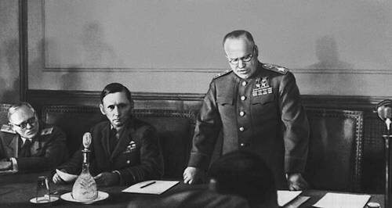

### Wismar

Wismar: spotykają się Monty i Rokosowski. Kanadyjczycy opuścili Wismar dopiero 17 maja.

### Churchill

Churchill o 15:00 obwieścił w radio:
>Hostilities will end officially at one minute after midnight tonight, but in the interests of saving lives the 'Cease fire' began yesterday to be sounded all along the front, and our dear Channel Islands are also to be freed today.

Później w Whitehall prewier Wielkiej Brytanii Winston Churchill wygłosił swoją słynną [mowę zwycięstwa](https://winstonchurchill.org/resources/speeches/1941-1945-war-leader/to-v-e-crowds/).

### Harry Truman

Prezydent USA Harry Truman w przemówieniu radiowym poinformował Amerykanów o zakończeniu wojny w Europie.

### Kapitulacja

Marszałek polny Wilhelm Keitel (z powodu swojej służalczości wobec Hitlera nazywany Lokeitel) i inny wysokiej rangi dowódcy OKW polecieli do Berlina i krótko przed północą podpisali ostatni już akt kapitulacji tym razem w obecności przedstawicieli SHAEF i marszałka Gieorgija Żukowa. Odbyło się to w dawnej szkole saperskiej - Karlshorst Festungspionierschule, obecnie jest tam Muzeum Niemiecko-Rosyjskie (niem. [Deutsch-Russische Museum Berlin-Karlshorst](https://www.museum-karlshorst.de/)).

Armia niemiecka przestała walczyć na rozkaz OKW.

Nie wszystkie oddziały posłuchały rozkazu. Większa część Grupy Armii Środek była pod dowództwem marszałka polnego Ferdinanda Schörnera, który dostał tę nominację 30 kwietnia w testamencie Hitlera. 8 maja Schörner uciekł do Austrii. Wojna w zasadzie się skończyła, ale Armia Czerwona musiała przypuścić poważną ofensywę przeciwko oddziałom Grupy Armii Środek w ramach operacji praskiej. Walki te trwały do 12 maja. A i tak nie były to ostatnie oddziały, które skapitulowały.

O 1000 wojska niemieckie na wyspach na Kanale otrzymały od dowództwa informację o kapitulacji. To właśnie na tych wyspach brytyjska policja usłużnie aresztowała miejscowych Żydów i przekazała ich gestapo. W Auschwitz mordowano również obywateli brytyjskich. Po wojnie żaden z brytyjskich urzędników nie był za to pociągnięty do odpowiedzialności.

*Marszałek Gieorgij Żukow odczytuje akt kapitulacji, Berlin. 
By [http://www.booksite.ru/fulltext/1/001/009/001/235553933.jpg](http://www.booksite.ru/fulltext/1/001/009/001/235553933.jpg) from: [http://www.booksite.ru/fulltext/1/001/008/007/174.htm](http://www.booksite.ru/fulltext/1/001/008/007/174.htm), Domena publiczna, [Link](https://commons.wikimedia.org/w/index.php?curid=10272685)*

### Kocioł kurlandzki

Ostatnia operacja Luftwaffe, ewakuacja kotła kurlandzkiego. Na pomoc w samobójczej akcji wystartowało 35 Ju 52 i 4 He 111. Nie miały żadnej osłony myśliwskiej. Celem było lotnisko Flugzeugführerschule A/B Libau/Grobin (obecnie Liepāja-Grobiņa). Do ewakuacji wyselekcjonowano tylko żonatych, wszyscy byli ochotnikami i wiedzieli jak nikłe szanse na przeżycie daje ucieczka.

Przeładowane i pozbawione eskorty zostały zaatakowane przez setkę myśliwców sowieckich, gł Jak-3. Z wszystkich transportowców ocalały tylko dwa Ju 52, których piloci zdecydowali się lecieć 20 m nad morzem.

Tego dnia miały miejsce również inne ucieczki. Np kilkanaście FW 190 uciekło do Szwecji. Inne samoloty to latająca łódź Dornier Do 24 i Ju 88.

- [Mark Felton Productions "Last Flight of the Luftwaffe - Courland Evacuation VE-Day 1945" [12:38]](https://www.youtube.com/watch?v=iZCsTUP6-A8)

### Die Stunde Null

Północ 8 maja wskazywana jest jako die Stunde Null (godzina zero), czyli moment całkowitego końca (Niemiec hitlerowskich) i początku, całkiem od zera, nowej historii Niemiec powojennych.

### Saksonia

Gauleiter Saksonii Mutschmann wezwał, by nie przerywać walki dopóki
>znienawidzony i bezlitosny wróg nie zostanie zniszczony lub wypędzony

Armia Czerwona zajęła Drezno bez walki 8 maja. Tego dnia gauleiter Mutschmann uciekł z miasta ze swoim pomocnikiem Wernerem Schmiedelem. Rankiem następnego dnia napotkali jednostki Armii Czerwonej w Glashütte. Uciekli wtedy do lasu i tam ukrywali się przez trzy dni w domku myśliwskim, potem przenieśli się do Oberwiesenthal.

Wczesnym rankiem 16 maja powołany kilka dni wcześniej burmistrz Oberwiesenthal Hermann Klopfer otrzymał anonimowy telefon o miejscu pobytu gauleitera i wieczorem Mutschmann został aresztowany. Uwięziono go w Chemnitz, potem wywieziono do Łubianki w Moskwie.

1946 22 czerwca proces.

1947 30 stycznia wyrok śmierci, wykonany 14 lutego. Nieprzypadkowo w drugą rocznicę bombardowania miasta.

### Algieria

Kiedy świętowano koniec wojny w miastach Kabylii, regionie Algierii francuskiej, doszło do demonstracji niepodległościowych, które przerodziły się w starcia z policją. W miastach Satif, Kherrata i Kalima policja strzelała do demonstrantów, zabijając kilkadziesiąt osób.

W odpowiedzi Algierczycy napadli na mieszkających w Kabylii francuskich osadników, mordując 88 osób. wybuchło powstanie, w którym wzięło udział 50 tys ludzi.

Rząd francuski skierował przeciwko buntownikom Legię Cudzoziemską i lotnictwo. Zginęło 1200 Algierczyków. Powstanie stłumiono.

### Rudel

Jeden z najsłynniejszych pilotów Luftwaffe i na pewno najsłynniejszy pilot Junkersa Ju 87 Stuka, Hans-Ulrich Rudel, któremu przypisuje się ponad 500 zniszczonych czołgów sowieckich, na wieść o kapitulacji Luftwaffe zebrał wszystkie dostępne samoloty (trzy Ju 87 i 4 FW 10) i poleciał do alianckiej strefy okupacyjnej. W tych siedmiu samolotach było 21 ludzi. Personel naziemny wyjechał ciężarówkami.

W kwietniu 1946 został wypuszczony na wolność. Używając fałszywego paszportu Czerwonego Krzyża uciekł do Argentyny jedną z osławionych ratilnes. W Argentynie działał na rzecz ukrywających się tam hitlerowców. Pomógł w przeniesieniu się Mengele do Brazyli i przyjaźnił się z Peronem i dyktatorem Paragwaju Alfredo Stroessnerem. Był również doradcą wojskowym Pinoczeta i pośrednikiem wielu firm niemieckich takich jak Siemens, Messerschmitt, Dornier. Był konsultantem przy projektowaniu A-10. Miał kontakty z CIA, które było zainteresowane SS-manami.

W 1953 wrocił do RFN i był jednym z ważniejszych neonazistów. Wiele razy podóżował do Ameryki Południowej. Do końca pozostał aktywnym politycznie hitlerowcem. W 1977 został rzecznikiem prasowym neonazistowskiej Deutsche Volksunion. Zmarł w 1988 i jego pogrzeb zakończył się skandalem kiedy nad grobem przeleciały dwa niemieckie F-4. Dowództwo wydało oświadczenie, że był to tylko zwykły lot szkoleniowy a nie oddanie hołdu.

- [Mark Felton Productions "Hans-Ulrich Rudel - The Surrender of Germany's Most Decorated Ace 1945" [YT 10:12]](https://www.youtube.com/watch?v=zZHCvPim0eA)

Inne:

- [Mark Felton Productions "Last Luftwaffe Dogfights 8 May 1945" [5:46]](https://www.youtube.com/watch?v=lp0rL5h4ikM)

### Samobójstwa hitlerowców

Niezwykły i hojny dzień, aż sześciu hitlerowców się zabiło

- Georg Bachmayer, SS-man z SS-TV, sadysta, jego pasją było rozszarpywanie ludzi specjalnie wytresowanymi psami, zastrzelił siebie a przedtem dwoje swoich dzieci i żonę.
- Paul Giesler w Partii od 1922 gauleiter Południowej Westfalii a później także Górnej Bawarii, przeciwstawiał sie edukacji kobiet, schwytał Białą Różę, na koniec wojny chciał wymordować wszystkich więźniów Dachau, powstrzymał go dopiero rozkaz Himmlera. W testamencie Hitler 29 kwietnia wyznaczył go na następcę Himmlera na stanowisku MSW. 1 maja usiłowali się zabić razem z żoną i teściową, ale zostali odratowani, następnego dnia Giesler zastrzelił żonę w lesie, ale nie udało mu się zabić od razu. Znaleziono go z raną w głowie i zawieziono do szpitala gdzie zmarł 8 maja.
- Bernhard Rust, w NSDAP od 1922, od 1925 gauleiter Hanoweru. Od 1934 minister Rzeszy ds. Nauki, Wychowania i Oświaty. Chciał podporządkować całe niemieckie szkolnictwo ideologii nazistowskiej. Często krytykowany i wyśmiewany, Juz przedtem usiłował zabić się tabletkami nasennymi, ale został odratowany i umieszczony w szpitalu psychiatrycznym, uciekł ze szpitala i zastrzelił się w noc po kapitulacji.
- Wilhelm Rediess dowódca SS i Policji Norwegii i dowódca wszystkich wojsk SS stacjonujących w Norwegii, zaangażowany w Lebensborn. zastrzelił się w Skaugum.
- Josef Terboven Reichskommissar Norwegii od czasów inwazji, aktywnie zwalczał wszelkie przejawy oporu co było krytykowane przez Goebbelsa za antagonizowanie Norwegów. Pod koniec wojny chciał stworzyć Fortecę Norwegia. Dönitz 7 maja pozbawił go stanowiska na rzecz generała Böhme. Wysadził się w bunkrze 50 kg TNT, grzebiąc również Reddiessa.
- Na zakończenie dobrego dnia w nocy z 8 na 9 maja zastrzelił się Hugo Jury lekarz i gauleiter Dolnej Austrii

### Hrotovice

Podczas zabawy zorganizowanej z okazji kapitulacji Niemiec sowieckie lotnictwo omyłkowo zrzuciło 3 bomby na rynek miasta Hrotovice w południowych Czechach, w wyniku czego zginęło 114 mieszkańców i 36 żołnierzy Armii Czerwonej.

### Powstanie praskie

Zakończyło się powstanie praskie.

### Wrocław

Laßmann:
>W nocy z poniedziałku na wtorek z 7 na 8 maja, kilku rosyjskich żołnierzy wdarło się do piwnicy przy ul. Katedralnej 7 i wyciągnęło z niej młodą dziewczynę imieniem Hilde. Niedzballa i ja nie byliśmy w stanie uchronić jej przed wielokrotnym gwałtem. Następnego dnia posłałem biedne dziewczę od razu do dr Franza. Mieszkańców naszego biednego schronu wydarzenie to mocno wystraszyło, przede wszystkim Josi Kaizer, moje obydwie siostry, Elisabeth i Elriede, i Irmgard Frauen. Aby zapobiec wszelkim ewentualnościom załatwiam dla nich nowy kwaterunek w szpitalu pomocniczym przy pl Katedralnym 14, w którym pełnię przecież posługę duszpasterską, tak że podczas kolejnych nocy są bezpieczne.